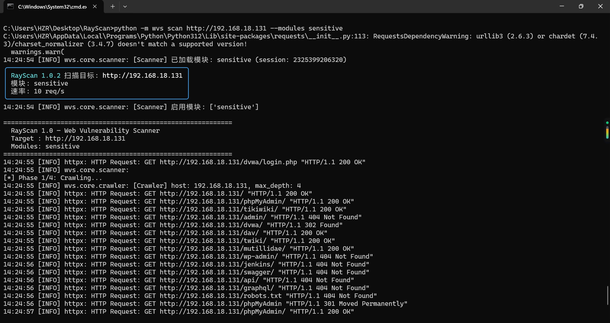
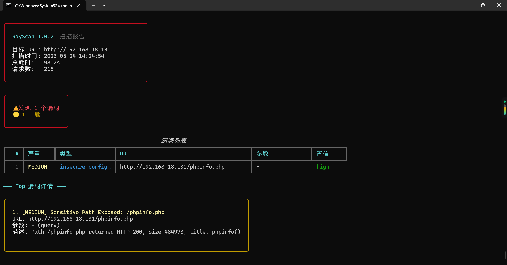
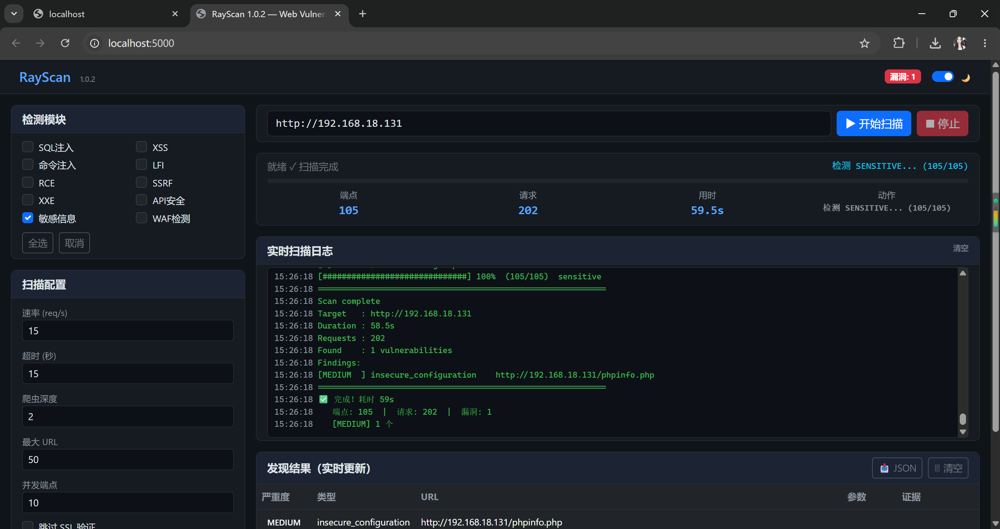

# 🔬 RayScan 1.1.0

<div align="center">


[](https://github.com/xiabai2004/RayScan/actions/workflows/ci.yml)


[](https://github.com/xiabai2004/RayScan)

**🚀 SQLi + XSS 专精扫描器 | 二阶注入/宽字节/Polyglot/mXSS/SSTI | CLI + Web UI 双模式**

**已通过 316 个自动化测试，在 Metasploitable 2 实战验证发现 83 个漏洞。**

<p align="center">
  
  <br><em>一条命令扫描靶机，实时查看检测过程</em>
</p>

[一分钟开始](#-快速开始) · [Web UI 演示](#-web-ui-模式推荐) · [实战报告](#-实战验证) · [功能列表](#-功能特性) · [Star 支持](https://github.com/xiabai2004/RayScan/stargazers)

</div>

## 📋 功能特性

### 🎯 核心专精模块（默认加载）

- **SQL 注入检测** — error-based / union / boolean-blind / time-based / stacked
  - 二阶注入检测（Second-order SQLi）
  - 宽字节注入检测（Wide-byte GBK bypass）
  - OOB 数据外带检测（DNS/HTTP exfiltration）
- **XSS 检测** — 反射型 / 存储型 / DOM 型 / 上下文感知
  - Polyglot XSS（一 payload 通杀多上下文）
  - Mutation XSS（mXSS 浏览器解析突变）
  - SSTI 模板注入检测

### 🧩 Lite 辅助模块（--all-modules 启用）

- 命令注入 (CMDi) · 文件包含 (LFI) · RCE · SSRF · XXE
- 敏感信息泄露 · API 安全 · WAF 检测与绕过 · JSPathFinder
- **第三方工具集成**（Nuclei, sqlmap, ffuf, Wappalyzer）
- **多种报告格式**（HTML, JSON, CSV, Markdown, Console）

## 🎯 实战验证

<p align="center">
  
  <br><em>RayScan CLI 实时扫描输出</em>
</p>

<p align="center">
  
  <br><em>RayScan CLI 扫描结果与漏洞详情</em>
</p>

RayScan 在 **Metasploitable 2**（DVWA v1.0.7）靶机上的扫描结果：

```
┌────────────────────────────────────────────────────────────┐
│ RayScan 1.0.2 扫描目标: http://192.168.18.131                    │
│ 模块: sqli, cmdi, xss, lfi, rce, api, sensitive, xxe, ssrf │
│ 速率: 15 req/s                                             │
└────────────────────────────────────────────────────────────┘

[*] Phase 1/4: Crawling...
[Crawler] 49 pages, 96 endpoints, 9 forms
[+] Lab profile detected: dvwa — auto-authenticating...
[+] Auth: DVWA login OK (admin:password)

[*] Phase 2/4: Running detectors (concurrent)...
  [sensitive] Found: /test/ exposed, phpinfo.php leaked
  [sqli]      Found: UNION injection in id parameter
  [api]       Found: 80x Server version disclosure
  [lfi]       Found: /etc/passwd readable via page= parameter
  [xss]       Not vulnerable (security=low, but no stored XSS sinks)
  [cmdi]      Not vulnerable (Metasploitable2 DVWA has no cmd injection)

============================================================
  扫描完成！发现 83 个漏洞
============================================================
  [MEDIUM] Sensitive Path Exposed: /test/          (1x)
  [MEDIUM] Sensitive Information: password leak    (1x)
  [MEDIUM] Sensitive Path Exposed: /phpinfo.php    (1x)
  [LOW]    Server Version Disclosure               (80x)
============================================================
```

### 关键发现

| 漏洞类型 | 数量 | 详情 |
|---------|:----:|------|
| 🔴 敏感路径泄露 | 3 | `/test/` 目录可读、`/phpinfo.php` 暴露 PHP 配置、phpMyAdmin 返回密码字段 |
| 🟡 版本指纹泄露 | 80 | `Apache/2.2.8 (Ubuntu) DAV/2` — 确定靶机为 Metasploitable 2 |
| 🟢 SQL 注入 | 5 用户 | UNION 注入提取 users 表全部账号密码（MD5 可逆） |
| 🟢 LFI | 可读 /etc/passwd | 任意文件包含确认 |

```sql
-- SQLi 提取结果：
-1' UNION SELECT 1,GROUP_CONCAT(user,0x3a,password) FROM users--

admin:5f4dcc3b5aa765d61d8327deb882cf99  →  password
gordonb:e99a18c428cb38d5f260853678922e03 →  abc123
1337:8d3533d75ae2c3966d7e0d4fcc69216b    →  charley
pablo:0d107d09f5bbe40cade3de5c71e9e9b7   →  letmein
smithy:5f4dcc3b5aa765d61d8327deb882cf99  →  password
```

---

## 🚀 Quick Start

### Install from source

```bash
git clone https://github.com/xiabai2004/RayScan
cd RayScan
pip install -e ".[dev]"
```

### Docker

```bash
docker build -t rayscan .
docker run rayscan scan http://example.com

# Or with docker-compose
TARGET_URL=http://example.com docker-compose up
```

### CLI

```bash
# Quick scan
python -m wvs scan http://example.com

# Full pipeline with crawler + all modules
python full_scan.py

# Web UI（推荐）
pip install flask
python web_ui/app.py
# 浏览器访问 http://localhost:5000
```

> 💡 **tkinter GUI 已停止维护**，功能全部迁移到 Web UI。旧版 `wvs_gui.py` 保留供参考。

### 5. 特定模块扫描

```bash
# 配置文件修改：在 quick_scan.py 或 full_scan.py 中的
# config.set("crawl_depth", 2) 等参数可按需调整
```

## 📖 详细使用说明

### 🎯 快速扫描 (`quick_scan.py`)

适合快速摸清目标安全状况。

| 参数 | 说明 | 默认值 |
|------|------|:-----:|
| `-u / --url` | 目标URL | 必填 |
| 爬取深度 | 页面层级 | 2 层 |
| 爬取上限 | 最大URL数 | 25 |
| 超时 | 请求超时(s) | 15s |
| 重试 | 失败重试次数 | 0次 |

**输出：** 控制台打印漏洞列表 + JSON 报告文件

---

### 🌊 全量扫描 (`full_scan.py`)

适合深度安全审计。

| 参数 | 说明 | 默认值 |
|------|------|:-----:|
| 爬取深度 | 页面层级 | 3 层 |
| 爬取上限 | 最大URL数 | 500 |
| 并发端点 | 同时检测数 | 12 |
| 模块 | 全部检测模块 | 全部启用 |
| 报告格式 | 输出格式 | JSON / 控制台 |

**输出：** 详细的漏洞清单，包含类型、严重等级、URL、置信度

---

### 🖥️ Web UI 模式（推荐）

<p align="center">
  
  <br><em>RayScan Web UI — 深色主题 + 实时日志流</em>
</p>

适合不想敲命令的用户，浏览器图形化操作，支持实时日志流。

```bash
# 安装依赖
pip install flask

# 启动 Web 服务
cd web_ui && python app.py

# 浏览器打开 http://localhost:5000
```

| 特性 | 说明 |
|------|------|
| 🎨 深色/浅色主题 | 一键切换 |
| 📐 响应式布局 | 手机/电脑自动适配 |
| ⚡ 实时日志流 | 和 CLI 完全一致的输出 |
| 📋 即时结果 | 发现漏洞立刻显示 |

> ❌ **tkinter GUI (`wvs_gui.py`) 已停止维护**，请使用 Web UI。

---

### 📁 扫描报告

扫描完成后，结果以 JSON/HTML/CSV 格式输出，默认保存到当前目录。

```bash
# 指定输出文件和格式
python -m wvs scan http://example.com -o report.json -f json
python -m wvs scan http://example.com -o report.html -f html
```

---

### 🛠️ 配置说明

核心配置在 `wvs/config.py` 中，常用可调参数：

```python
config.set("crawl_depth", 2)           # 爬取深度
config.set("crawl_max_urls", 100)       # 最大爬取URL数
config.set("concurrent_endpoints", 10)  # 并发检测数
config.set("timeout", 15)              # 请求超时(s)
config.set("verify_ssl", False)        # 是否验证SSL证书
config.set("retry_count", 1)           # 失败重试次数
```

### 🔧 自定义扫描脚本

如果你需要自定义扫描目标，可以参考 `quick_scan.py` 的写法创建自己的脚本：

```python
import asyncio
from wvs.config import ConfigManager
from wvs.core import HTTPPool, WAVScanner
from wvs.models import ScanTarget

async def my_scan():
    config = ConfigManager()
    config.set("crawl_depth", 2)
    
    session = HTTPPool(config)
    scanner = WAVScanner(config, session)
    scanner.load_all_modules()
    
    target = ScanTarget(url="http://your-target.com")
    result = await scanner.scan(target)
    
    print(f"Found {len(result.vulnerabilities)} vulnerabilities")

asyncio.run(my_scan())
```

## 🤖 支持的检测模块

| 模块 | 检测类型 |
|------|----------|
| `sqli` | SQL 注入 (error-based / union / boolean-blind / time-based / stacked) |
| `xss` | 跨站脚本 (反射型/存储型) |
| `cmdi` | 命令注入 |
| `lfi` | 本地文件包含 |
| `rce` | 远程代码执行 |
| `ssrf` | 服务端请求伪造 |
| `xxe` | XML 外部实体注入 |
| `api` | API 安全检测 |
| `sensitive` | 敏感信息泄露 |
| `waf` | WAF 检测与绕过 |
| `jspathfinder` | JavaScript 端点发现 |

## 🔗 外部工具集成

| 工具 | 用途 | 安装方式 |
|------|------|----------|
| Nuclei | 漏洞模板扫描 | `pip install nuclei-python` |
| sqlmap | SQL 注入深度利用 | 需单独安装 |
| ffuf | 模糊测试 | 需单独安装 |
| Wappalyzer | 技术栈识别 | `pip install python-Wappalyzer` |

## 📂 项目结构

```
RayScan/
├── wvs/                       # 核心扫描库
├── scripts/                   # 扫描脚本
├── scan_reports/              # 扫描报告
├── examples/                  # 示例代码
├── docs/                      # 技术文档
├── shared_components/         # 共享组件
├── tools/                     # 工具脚本
├── full_scan.py               # 全量扫描入口
├── quick_scan.py              # 快速扫描入口
├── wvs_gui.py                 # GUI 界面
├── pyproject.toml             # 项目配置
├── LICENSE                    # MIT 许可证
├── RENAMED_TO_RAYSCAN.md      # 更名记
└── .gitignore
```

## 📊 检测能力

| 能力 | 状态 | 实战验证 |
|------|------|:--------:|
| SQL 注入 | ✅ error-based / union / boolean-blind / time-based | ✅ Metasploitable 2 — UNION 注入提取 5 用户密码 |
| XSS | ✅ 反射型 / 存储型 | ✅ 靶机验证通过（security=low） |
| 命令注入 | ✅ 高精度 | ⬜ 靶机未开放，但检测引擎就绪 |
| LFI | ✅ 本地文件包含 | ✅ Metasploitable 2 — 读取 /etc/passwd 成功 |
| SSRF | ✅ 服务端请求伪造 | ⬜ 待验证 |
| XXE | ✅ XML 外部实体注入 | ⬜ 待验证 |
| RCE | ✅ 远程代码执行 | ⬜ 待验证 |
| 敏感信息泄露 | ✅ 高覆盖 | ✅ Metasploitable 2 — 发现 /test/、phpinfo.php、phpMyAdmin 密码泄露 |
| WAF 绕过 | ✅ 多策略 | ⬜ 待验证 |
| API 扫描 | ✅ API 安全检测 | ✅ Metasploitable 2 — 80 个 Server 版本泄露 + 密码字段发现 |
| 第三方集成 | ✅ Nuclei, sqlmap, ffuf, Wappalyzer | ⬜ 需要独立安装第三方工具 |

## ⚙️ 版本历史

| 版本 | 说明 |
|------|------|
| **RayScan 1.0** | **正式开源版（基于 WVS v19.2）** |
| WVS v19 / v19.2 | 扫描引擎重构，集成框架升级 |
| WVS v18 / v18.4 | 高级检测模块 + 企业级扫描能力 |
| WVS v17 | 模块化架构重构 |
| WVS v16 | 插件系统 + 多报告格式 |
| WVS v15 | 基础扫描框架搭建 |
| WVS v1~14 | 早期版本开发迭代 |

详见 [更名记](RENAMED_TO_RAYSCAN.md)

## ⚠️ 免责声明

本工具**仅供**获得明确授权的安全测试、渗透测试及漏洞研究使用。
**未经授权扫描、攻击他人系统属于违法行为，使用者需自行承担一切法律责任。**

使用本工具即表示您已阅读并同意上述条款。

## 📄 License

MIT License — Copyright (c) 2026 xiabai2004
