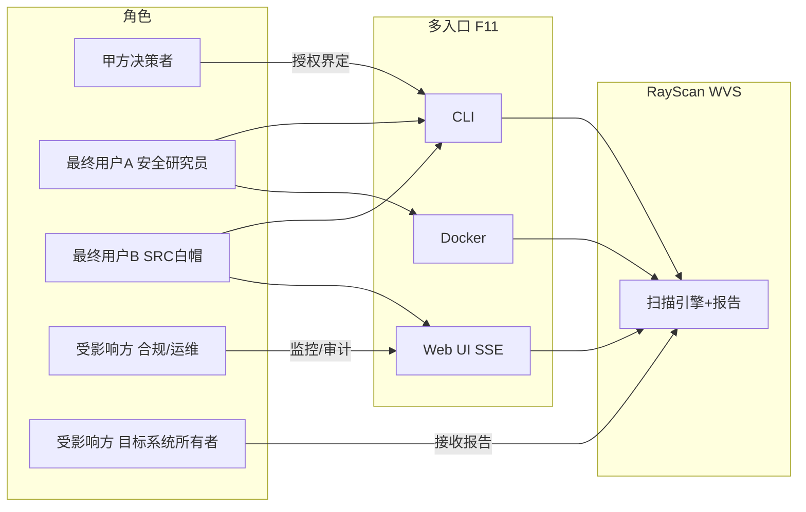
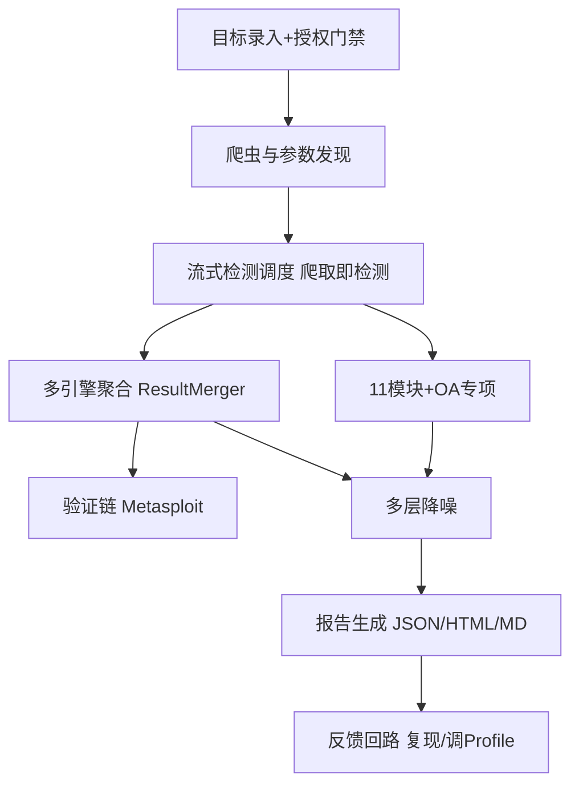
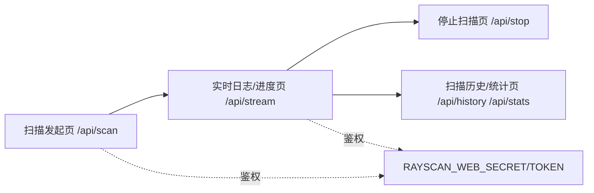

# AICoding 架构设计 · UserStory

> 本文档为 RayScan（WVS）架构方案的**用户故事（UserStory）**，由 `product-story-designer`（顾全景）产出。
> 上游输入：《高层架构设计》（G3 已冻结）中的角色、场景、产品模块、MVP 范围、边界定义；`material_digest.md`（G1）；`research_report.md`（G2）。
> 下游输出：驱动《系统设计》《部署设计》《安全设计》的具体功能实现。
> **冻结声明**：本文件严格对齐 G3 已冻结项（系统定位=私有化·自托管·多租户否；核心角色 5 类；MVP=F1~F13；7 个 P0 全在 MVP；In-Scope 13 / Out-of-Scope 8）。未新增任何超出 F1~F13 范围的功能，未改变已冻结的角色范围、功能优先级与边界。

---

## 1. 业务背景与价值

### 1.1 业务背景

- **行业**：Web 应用安全测试（DAST / WVS）赛道，对标 Invicti、Burp Suite DAST、OWASP ZAP、Nuclei 等标杆（详见 `research_report.md` §2）。RayScan 定位为「个人渗透伴侣 / SRC 挖掘 / 靶机踩点」的 Python 异步 Web 漏洞扫描器（WVS），MIT 开源、自托管、数据不出网。
- **产品**：RayScan 2.0.0（以 `pyproject.toml` 的 `version=2.0.0` 为权威源，U-01 待主理人最终确认口径）是一个已有开源项目的架构方案化冻结，非从零新建。
- **用户规模**：面向安全研究员、SRC 白帽 / 漏洞赏金猎人、渗透测试员，以及受影响的合规 / 运维、目标系统所有者。以个人 / 小团队自托管为主，非 SaaS 多租户。
- **触发本次需求的事件**：用户诉求「基于项目背景和资料生成完整架构方案（五份架构文档）」，需把现有开源项目的能力边界、MVP 范围、角色场景与功能清单冻结为可消费的故事化表达，支撑后续系统 / 部署 / 安全设计。

### 1.2 行业方案

> 同类功能、痛点的行业标杆系统及解决方案（事实来源 `research_report.md` §2–§4）：

| 标杆 | 定位 | 对 RayScan 的借鉴点 | 不借鉴点 |
| --- | --- | --- | --- |
| OWASP ZAP | 开源 DAST，插件市场 200+，SARIF/CI-CD | 插件化扩展 + 统一数据模型 + 自托管可控 | 检测深度弱于商业引擎 |
| Nuclei | 模板式漏洞检测，12,000+ 社区模板 | YAML 模板 DSL + 去重（已被 RayScan 直接集成） | 非爬虫式，不发现未知逻辑漏洞 |
| Burp Suite DAST | 团队级 DAST，OAST 带外 | OAST / 扩展 / SARIF / CI-CD 设计模式 | 专有引擎不可复用 |
| Invicti | 企业级 DAST + IAST | Proof-Based 验证理念（已被 Metasploit 验证链部分实现） | 专有 SaaS 引擎，成本/合规不匹配 |

**结论**（research_report 建议，已被 G3 采纳为边界取向）：优先借鉴 ZAP / Nuclei 的 OSS 范式，部分借鉴 Burp 的 OAST / SARIF，不借鉴 Invicti 专有引擎。

### 1.3 方案收益与价值

| 项 | 说明 |
| --- | --- |
| 功能模块 | 11 检测模块 + OA 专项 12 系统 + 流式检测 + 多引擎聚合 + 验证链 + 多层降噪 + MVP 报告 + Profile + 多入口 + 模块注册扩展 + 靶机自动分流认证 |
| 预期价值收益 | 30 秒启动、爬取即检测的实时可见能力；多引擎一键聚合 + 验证链提升检出可信度；自托管零许可成本 + 数据不出网合规可控；模块可插拔便于二次开发 |
| 量化标准 | 启动到首请求 P95 ≤ 30s；授权扫描全程留痕 100%；数据出网率 0%；单位扫描许可成本 0（MIT OSS）；日志端到端时延 ≤ 1s |

### 1.4 术语清单

| 术语 | 英文 / 缩写 | 含义 |
| --- | --- | --- |
| Web 漏洞扫描器 | WVS (Web Vulnerability Scanner) | 自动化发现 Web 应用漏洞的工具，RayScan 即此类 |
| 流式检测 | Streaming Detection | 爬虫「爬取即检测」的异步流水线，发现参数即刻入队检测，而非先爬完再扫 |
| 多引擎聚合 | Multi-Engine Aggregation | 用 7 个适配器（AWVS/Nessus/Nuclei/sqlmap/ffuf/Wappalyzer/MSF）一键调度外部引擎，ResultMerger 去重合并 |
| 结果合并器 | ResultMerger | 将多源漏洞结果按 `rule_id + URL hash` 去重合并为统一漏洞集 |
| 带外检测 | OOB / OAST | Out-of-Band / Out-of-Band Application Security Testing，通过 interactsh / DNSLog 回调验证盲注类漏洞 |
| 检测模块 | DetectionModule | RayScan 检测模块基类，配合 `@register_module` 装饰器自动注册 |
| 配置档 | Profile | 扫描参数预设集合（模块开关 + 性能参数），内置 default/src-quick/pentest-full/sqli-only 四套 |
| 验证链 | Verification Chain | 通过 Metasploit RPC 自动匹配 exploit 验证疑似漏洞，提升结果置信度 |
| 多层降噪 | Multi-Layer Denoise | 内容特征 + 尺寸聚类 + 校准匹配三层过滤误报 |
| 概念验证 | PoC | Proof of Concept，已知漏洞利用模板（Nuclei 模板库） |

---

## 2. 范围与边界

### 2.1 系统内模块及功能

> 一级功能清单（与 §3 功能清单的一级模块一致，互查对齐 G3 §6.3）。

| 一级模块 | 覆盖功能（功能编号） | MVP 是否包含 |
| --- | --- | --- |
| 检测引擎 | 11 检测模块（F1）、OA 专项 12 系统（F2）、流式检测（F3） | 是 |
| 聚合层 | 多引擎聚合（F4）、验证链（F5） | 是 |
| 复用底座 | Nuclei PoC 集成（F6）、OOB 带外检测（F7） | 是 |
| 模块机制 | 注册扩展（F8） | 是 |
| 报告 | MVP 报告（F9） | 是 |
| 配置 | Profile 系统（F10） | 是 |
| 入口 | 多入口（F11） | 是 |
| 引擎 | 多层降噪（F12）、靶机自动分流认证（F13） | 是 |

### 2.2 系统外模块及功能

> 当前系统**不覆盖**的功能及其原因（对齐 G3 §6.1 Out-of-Scope O1~O8）。这些功能在 MVP 不做，部分列入完整版（F14~F18），部分仅作后续概念（O5~O8）。

| 编号 | 功能 / 边界 | 不做原因 | 归属 |
| --- | --- | --- | --- |
| O1 | SARIF / CSV 报告写出（落地文件） | MVP 以 JSON/HTML/Markdown 为出口，SARIF 写文件需补 sarif_reporter / csv_reporter | 完整版 F14 |
| O2 | Web UI 多格式导出（html/markdown/sarif） | MVP Web UI /api/export 仅 JSON，多格式扩展延后 | 完整版 F15 |
| O3 | 独立 Auth 子系统（auth 子命令 + auths/ 管理） | 当前仅 `--auth` 文件传入，独立 Auth 命名管理未在 MVP 实现（X11） | 完整版 F16 |
| O4 | 配置一致性统一（键名 / 优先级统一） | 多套默认参数与键名冲突（X7/X14）属架构治理项，MVP 不解决 | 完整版 F17 |
| O5 | IAST / Proof-Based 增强 | 概念借鉴 Invicti，验证链已部分覆盖，增强列入后续 | 后续（非 MVP/非完整版必做） |
| O6 | 分布式 / 多租户 SaaS 部署形态 | 与 OSS 自托管定位（多租户=否）冲突，U-05 待裁决 | 后续（商业化才评估） |
| O7 | 第三方插件市场（外部分发 / 市场） | D-01 本期保留本地自定义模块注册，中心化市场不纳入 | 后续 |
| O8 | 分布式扫描编排（多节点任务分发） | 单进程自托管定位，分布式编排超出本期 | 后续 |

### 2.3 外部依赖

| 依赖系统 | 提供方 | 依赖能力 | 接入方式 | 接口人 |
| --- | --- | --- | --- | --- |
| 目标 Web 应用 | 被授权方 | 待检测页面 / 参数 | HTTP(S) 同步请求 | 目标系统所有者（受影响方） |
| Metasploit（MSF RPC） | 外部服务（默认 127.0.0.1:55552） | 漏洞验证链 | RPC 同步 | 本地自托管运维 |
| Nuclei / sqlmap / ffuf / Wappalyzer | 外部二进制（本机预装） | PoC 执行 / 模糊测试 / 技术指纹 | 子进程 / CLI 异步 | 本地自托管运维 |
| AWVS / Nessus | 外部平台 | 扫描结果导入 | REST API 异步 | 甲方决策者（凭据方） |
| Nuclei PoC 模板库 | ProjectDiscovery | 已知漏洞模板 | 文件 / 模板加载（钉固版本） | 社区维护者 |
| interactsh / DNSLog | 公网 OOB 服务器 | 带外回调 | 网络回调异步 | 公网服务 |
| 归一化平台（DefectDojo 等） | 第三方 | 结果归集（仅完整版） | SARIF / JSON 导入 | 合规 / 运维 |
| Issue 追踪（GitHub） | 团队 | 漏洞流转（仅完整版） | REST API 异步 | SRC 白帽 / 团队 |

---

## 3. 功能清单

> **定位**：全景骨架表，进入「角色 / 场景 / US」之前先看到完整功能版图。本表与 G3 §6.3 逐行互查一致（编号、一级模块、二级功能、优先级、MVP/完整版范围均一致）。

### 3.1 功能清单结构

| 一级模块 | 二级模块 | 功能项 | 优先级（P0/P1/P2） | MVP 范围 | 完整版范围 | 备注 |
| --- | --- | --- | --- | --- | --- | --- |
| 检测引擎 | 11 检测模块 | sqli/xss/cmdi/lfi/rce/ssrf/xxe/api/sensitive/waf/jspathfinder | P0 | ✅ | ✅ | 对齐 V5；waf 默认启用状态见 U-03 |
| 检测引擎 | OA 专项 12 系统 | 泛微/通达/金蝶/蓝凌/致远/用友/禅道/万户/Nacos/Spring/Jenkins/Confluence | P0 | ✅ | ✅ | 对齐 V5 |
| 检测引擎 | 流式检测 | 爬取即检测，异步流水线 | P0 | ✅ | ✅ | 对齐 V5 |
| 聚合层 | 多引擎聚合 | 7 适配器（AWVS/Nessus/Nuclei/sqlmap/ffuf/Wappalyzer/MSF）+ ResultMerger 去重合并 | P0 | ✅ | ✅ | — |
| 聚合层 | 验证链 | Metasploit RPC（--verify） | P0 | ✅ | ✅ | — |
| 复用底座 | Nuclei PoC 集成 | 已知漏洞 / PoC 库复用 | P1 | ✅ | ✅ | — |
| 复用底座 | OOB 带外检测 | interactsh / DNSLog | P1 | ✅ | ✅ | — |
| 模块机制 | 注册扩展 | DetectionModule + @register_module | P1 | ✅ | ✅ | — |
| 报告 | MVP 报告 | JSON / HTML / Markdown + 控制台 | P0 | ✅ | ✅ | 对齐 V1 |
| 配置 | Profile 系统 | 4 套内置 + ConfigManager 多源配置 | P1 | ✅ | ✅ | 对齐 V4 |
| 入口 | 多入口 | CLI / Web UI（Flask+SSE）/ Docker（client-only） | P0 | ✅ | ✅ | — |
| 引擎 | 多层降噪 | 内容特征 + 尺寸聚类 + 校准匹配 | P1 | ✅ | ✅ | 对齐 V5 |
| 引擎 | 靶机自动分流认证 | DVWA / Mutillidae 识别 + 表单登录注入 security cookie | P2 | ✅ | ✅ | — |
| 报告 | SARIF / CSV 写出 | 补齐 sarif_reporter / csv_reporter | P1 | ❌ | ✅ | 对应 O1 |
| 入口 | Web UI 多格式导出 | /api/export 扩展 html/markdown/sarif | P2 | ❌ | ✅ | 对应 O2 |
| 配置 | 独立 Auth 子系统 | auth 子命令 + auths/ 管理 | P2 | ❌ | ✅ | 对应 O3 |
| 配置 | 配置一致性统一 | 键名 / 优先级统一（env > profile > CLI > default） | P2 | ❌ | ✅ | 对应 O4，对齐 V3 |
| 报告 | 统一漏洞模型标准化 | Vulnerability 扩为聚合归一主键（rule_id + URL hash） | P1 | ❌ | ✅ | 对应 D-02 |

> **互查结论**：本表与 G3 §6.3 的 18 个功能项（F1~F18）逐行一致；7 个 P0（F1/F2/F3/F4/F5/F9/F11）MVP 范围均为 ✅；In-Scope 13 项（F1~F13）MVP=✅，Out-of-Scope 对应的 F14~F18 MVP=❌ 但完整版=✅。无任何超出 G3 §6.3 范围的功能新增。

---

## 4. 角色与场景

### 4.1 角色清单

> 沿用 G3 §2.1 已冻结的 5 类核心角色（不得删减、不细分子角色）；每条含业务身份、主要操作、核心关注点。

| 角色 | 业务身份 | 主要操作 | 核心关注点 |
| --- | --- | --- | --- |
| 甲方决策者 | 安全团队负责人 / 安全主管（采购与授权方） | 授权范围界定、ROI 评估、合规把关、版本可信度核对 | 投入产出与合规可控（数据不出网、授权可审计、版本可信、零许可成本） |
| 最终用户 A | 安全研究员（个人渗透伴侣） | CLI 发起扫描、模块 / 参数快速切换、本地自定义模块注册、靶机自动认证 | 30 秒启动、高灵敏宁可多报、工具协同、流式实时可见 |
| 最终用户 B | SRC 白帽 / 漏洞赏金猎人 | 快瞄扫描、批量多目标、检出率与误报控制、报告导出提交 | 检出率与误报控制、与 SRC / Issue 平台对接便捷、报告可读可复现 |
| 受影响方：合规 / 运维 | 合规审计 / SRE | 审计日志调阅、可用性监控、实时日志观测、停止干预 | 授权留痕、扫描过程可观测、不破坏目标系统、运行稳定 |
| 受影响方：目标系统所有者 | 被授权测试方（蓝队 / 甲方） | 接收报告、复现验证、确认无越权行为 | 报告可读、验证可复现、无越权行为、扫描限速不压垮目标 |

### 4.2 关键场景清单

| 编号 | 角色 | 触发条件 | 期望结果 | 频率（日均 / QPS） |
| --- | --- | --- | --- | --- |
| S1 | 甲方决策者 | 计划对内部 / 授权目标做安全评估 | 明确授权范围，RayScan 仅在 `--i-have-permission` 门禁通过后启动 | 低频（项目级） |
| S2 | 最终用户 A | 拿到一个待测目标 URL，需快速踩点 | CLI 30 秒内启动首请求，流式爬取即检测 | 中（数个目标/日） |
| S3 | 最终用户 B | 批量目标清单需快瞄 | `batch -f targets.txt` 一键多目标扫描，结果可导出 | 中（数十~数百目标/日） |
| S4 | 最终用户 A | 发现 OA / 中间件资产 | OADetector 自动识别 12 类系统并加载专项规则检测 | 随目标而定 |
| S5 | 最终用户 A/B | 疑似漏洞需提升可信度 | `--verify` 触发 Metasploit RPC 验证链，标记已验证漏洞 | 低频（命中后） |
| S6 | 最终用户 B | 需归一化多引擎结果 | 7 适配器并行 + ResultMerger 去重合并，单层视图 | 随扫描而定 |
| S7 | 受影响方：合规 / 运维 | 扫描运行中需观测与干预 | Web UI SSE 实时日志（≤1s 时延）、进度、停止接口 | 持续（运行期） |
| S8 | 受影响方：合规 / 运维 | 扫描结束需审计 | 报告落盘 scan_reports/，含授权标记与漏洞明细 | 每次扫描后 |
| S9 | 最终用户 A | 靶机环境（DVWA/Mutillidae）测试 | 自动识别靶机并表单登录注入 security cookie，走靶机流程 | 低频（靶机场景） |
| S10 | 受影响方：目标系统所有者 | 接收扫描报告 | 可读 HTML/Markdown 报告，漏洞可复现 | 每次扫描后 |

---

## 5. 用户旅程（UserStory）

> 共 12 条用户故事，覆盖 MVP（F1~F13）全部 13 项功能（F11 拆为「发起」US-1 与「监控」US-2 两条连贯旅程）。每条按七段式（5.1.1~5.1.7）展开。Out-of-Scope（O1~O8 / F14~F18）不纳入 MVP 用户故事。

### 5.1 US-1：多入口授权扫描发起（CLI / Web UI / Docker）

#### 5.1.1 业务场景
- **视角**：最终用户 A / B（以及通过 Web UI 的合规 / 运维）
- **描述逻辑**：用户通过 CLI、Web UI 或 Docker 三种入口之一录入一个已获书面授权的目标 URL，系统在执行任何网络请求前强制校验 `--i-have-permission` 授权门禁；校验通过后才创建扫描任务并进入流式检测调度。

#### 5.1.2 业务流程
- **视角**：用户
- **Given/When/Then**：
  - **正常路径**：Given 用户已获得目标系统的书面授权，When 用户执行 `rayscan scan -u https://target.example.com --i-have-permission`（或 Web UI 填写 URL 并提交 / Docker `docker run rayscan scan https://target.example.com --i-have-permission`），Then 系统校验门禁通过、加载默认 Profile 与模块、创建 `ScanTarget` 并启动流式检测。
  - **异常路径 1（缺门禁）**：Given 用户未携带 `--i-have-permission`，When 用户执行扫描命令，Then 系统拒绝启动并提示「需显式声明已获授权（--i-have-permission）」，不发出任何请求。
  - **异常路径 2（未授权目标）**：Given 目标 URL 属于用户无权测试的资产，When 用户尝试录入，Then 系统仅做本地校验（格式/可达性），但授权真实性由用户承诺，报告留存授权标记供审计。

#### 5.1.3 UE 原型
- **CLI**：`rayscan scan -u https://target.example.com --i-have-permission`（可选 `--modules` / `--use src-quick` / `--auth cred.json`），启动即打印 banner 与首请求日志。
- **Web UI**：扫描发起页（`POST /api/scan`）含 URL 输入框、模块多选、Profile 下拉，必填授权确认勾选。
- **Docker**：`docker run --rm -v ./scan_reports:/app/scan_reports rayscan scan https://target.example.com --i-have-permission`，client-only 不暴露端口。

#### 5.1.4 业务逻辑
- **视角**：系统
- 入口层解析子命令/请求 → 授权门禁校验（`--i-have-permission` 或 Web UI 授权确认）→ `ConfigManager` 多源合并（env > profile > CLI > default）→ 选择模块集（`_resolve_enabled_modules`）→ 构造 `ScanTarget` → 交给 `WAVScanner` 调度。Docker 入口等价于 CLI 入口（`rayscan = wvs.cli:main`）。

#### 5.1.5 数据描述
- 输入：`target_url`、`auth_info`（cookie/bearer/basic/apikey，来自 `--auth` 文件）、`profile_name`、`modules` 选择、`max_time` 等。
- 内部：`ScanTarget`（含授权标记）、`ScannerConfig`、`ModuleConfig`。
- 流转：入口 → 授权标记 → 调度器 → 爬虫/检测模块。

#### 5.1.6 验收标准 AC
- **AC-1（正常）**：Given 携带 `--i-have-permission` 且目标可达，When 执行 `rayscan scan -u https://target.example.com`，Then 在 P95 ≤ 30s 内发出首请求并进入检测。
- **AC-2（异常-门禁）**：Given 未携带 `--i-have-permission`，When 执行扫描，Then 进程以非 0 退出并提示授权缺失，且零网络请求发出。
- **AC-3（异常-格式）**：Given 录入非 http/https 或非法 URL，When 提交，Then 提示 URL 格式错误并拒绝，不进入调度。
- **AC-4（Docker）**：Given 以 Docker client-only 启动，When 指定目标，Then 报告写入挂载卷 `scan_reports/`，且容器不暴露额外端口。

#### 5.1.7 外部集成接口
- 目标 Web 应用（HTTP[S] 同步请求，受 `max_requests_per_second` 限速）。
- 若带 `--verify`，依赖 Metasploit RPC（见 US-7）；若带 `--auth`，读取本地 `--auth` JSON 文件（见 §2.3）。

---

### 5.2 US-2：Web UI 实时监控与干预（SSE）

#### 5.1.1 业务场景
- **视角**：受影响方：合规 / 运维（及最终用户的实时观测）
- **描述逻辑**：扫描在 Web UI 后台线程驱动后，用户通过浏览器打开实时日志流页面，以 ≤1s 端到端时延看到日志、进度与即时结果；可在异常时一键停止，并查阅内存历史（≤200 条）。

#### 5.1.2 业务流程
- **视角**：用户
- **Given/When/Then**：
  - **正常路径**：Given 扫描正在运行且用户已通过鉴权，When 用户访问 `/api/stream`，Then 系统经 SSE 持续推送日志/进度/即时结果，端到端时延 ≤ 1s。
  - **异常路径 1（未鉴权）**：Given 监听地址为 `0.0.0.0` 且未设置 `RAYSCAN_WEB_SECRET`/`RAYSCAN_WEB_TOKEN`，When 用户访问，Then 系统拒绝服务并告警「监听 0.0.0.0 需启用鉴权」。
  - **异常路径 2（停止）**：Given 扫描异常或超预期，When 用户调用 `/api/stop`，Then 系统终止后台扫描任务并推送停止事件。

#### 5.1.3 UE 原型
- 实时日志 / 进度页（`/api/stream` SSE，深色/浅色主题，日志流 + 进度条 + 即时结果卡片）。
- 扫描历史 / 统计页（`/api/history` ≤200 条、`/api/stats` 引擎可用）。
- 停止扫描页（`/api/stop` 按钮）。

#### 5.1.4 业务逻辑
- **视角**：系统
- `ScanSession` 后台线程驱动 `scanner.scan` → 劫持 logger 与 stdout 写入 SSE 队列 → `events()` 生成器以 SSE 推送；`/api/stop` 置停止标志；历史存内存 `SCAN_HISTORY`（上限 200）。

#### 5.1.5 数据描述
- 推送：`log_event`（级别/时间/消息）、`progress`（百分比/阶段）、`result`（即时漏洞）、`stop`（终止事件）。
- 存储：内存 `SCAN_HISTORY`（≤200）、`engines_available`（nuclei/sqlmap）。

#### 5.1.6 验收标准 AC
- **AC-1（正常）**：Given 扫描运行中，When 打开 `/api/stream`，Then 首条日志在 ≤1s 内到达，且进度与结果实时刷新。
- **AC-2（鉴权-0.0.0.0）**：Given `RAYSCAN_WEB_HOST=0.0.0.0` 且未设 token，When 启动 Web UI，Then 启动即告警并拒绝未鉴权访问。
- **AC-3（停止）**：Given 运行中扫描，When 调用 `/api/stop`，Then 后台任务在合理时间内终止并推送停止事件，资源释放。
- **AC-4（历史上限）**：Given 累计扫描 >200 次，When 查询 `/api/history`，Then 仅保留最近 200 条，先进先出。

#### 5.1.7 外部集成接口
- 无外部系统依赖（本地 SSE + 内存历史）；鉴权依赖 `RAYSCAN_WEB_SECRET`/`RAYSCAN_WEB_TOKEN` 环境变量。

---

### 5.3 US-3：流式检测与爬虫参数发现

#### 5.1.1 业务场景
- **视角**：系统（最终用户无感，属差异化核心）
- **描述逻辑**：系统对授权目标启动爬虫，逐页发现 URL 与参数（含 Sitemap/robots.txt/OpenAPI 解析），并对每一个新发现的参数「爬取即检测」地立即入队到检测流水线，而非先爬完再扫。

#### 5.1.2 业务流程
- **视角**：系统
- **Given/When/Then**：
  - **正常路径**：Given 目标可达且未被 robots.txt 禁止，When 爬虫发现新 URL/参数，Then 立即将其入队 `WAVScanner` 检测流水线，并发起对应请求。
  - **异常路径 1（robots 禁止）**：Given 目标 robots.txt 声明 Disallow，When 爬虫命中该路径，Then 跳过该路径并不发起检测（除非显式强制）。
  - **异常路径 2（目标不可达）**：Given 目标连接超时/拒绝，When 爬虫持续失败，Then 标记该目标异常并进入错误路径，不阻塞其他目标。

#### 5.1.3 UE 原型
- （内部流水线，无独立用户页面；可在 Web UI 实时日志中观察「crawl → detect」事件流）

#### 5.1.4 业务逻辑
- **视角**：系统
- `WebCrawler` 抓取页面 → `crawler_parsers`（Sitemap/robots/OpenAPI）→ 参数发现 → 跨模块 GET 请求去重缓存 → 流式入队 `WAVScanner`；受 `crawl_depth`/`crawl_max_urls` 约束。

#### 5.1.5 数据描述
- 队列：URL 队列、参数表（name/value/位置）、去重缓存键。
- 约束：`crawl_depth`（默认 4 / profile 2~4）、`crawl_max_urls`（默认 300 / profile 50~500）。

#### 5.1.6 验收标准 AC
- **AC-1（正常）**：Given 目标含 30 个可爬页面，When 启动流式检测，Then 页面被发现后参数即时进入检测，无需等待全量爬取完成。
- **AC-2（robots）**：Given robots.txt Disallow 某路径，When 爬虫访问，Then 该路径被跳过且不计入检测。
- **AC-3（限速）**：Given 高频爬取，When 发起请求，Then 遵守 `max_requests_per_second`（默认 20）限速，不压垮目标。

#### 5.1.7 外部集成接口
- 目标 Web 应用（HTTP[S]）。
- SSRF/XXE 盲注类检测依赖 OOB（interactsh/DNSLog，见 US-6）。

---

### 5.4 US-4：11 核心检测模块检测

#### 5.1.1 业务场景
- **视角**：最终用户 A / B
- **描述逻辑**：对爬虫发现的每个参数，系统调用 11 类检测模块（sqli/xss/cmdi/lfi/rce/ssrf/xxe/api/sensitive/waf/jspathfinder）执行检测，产出带严重级与置信度的 `Vulnerability`。

#### 5.1.2 业务流程
- **视角**：系统
- **Given/When/Then**：
  - **正常路径**：Given 某参数入队，When 对应模块执行，Then 产出 `Vulnerability`（含 `severity`、`confidence`、`evidence`）。
  - **异常路径 1（模块异常）**：Given 某模块执行抛错，When 异常发生，Then 该模块被隔离并记录错误，扫描整体继续，不影响其他模块/参数。
  - **异常路径 2（WAF 绕过）**：Given 目标存在 WAF，When waf 模块识别指纹，Then 尝试编码/大小写/注释/参数污染等绕过并报告。

#### 5.1.3 UE 原型
- `rayscan list-modules` 查看 11 模块；扫描日志中按模块打印命中。

#### 5.1.4 业务逻辑
- **视角**：系统
- `DetectionModule.scan(target)` 包装抽象 `_scan_impl(target)` → 生成 `Vulnerability` → 汇总至 `ScanResult`；`ModuleFactory` + `@register_module` 自动注册；并发受 `concurrent_modules` 信号量约束。

#### 5.1.5 数据描述
- `Vulnerability`（severity: INFO/LOW/MEDIUM/HIGH/CRITICAL；confidence: LOW/MEDIUM/HIGH/CERTAIN；type 映射到 `VulnerabilityType`）。
- 请求/响应样本作为 evidence。

#### 5.1.6 验收标准 AC
- **AC-1（正常）**：Given 参数存在 SQLi，When sqli 模块执行，Then 产出至少一条 `sql_injection` 漏洞，confidence 与证据齐全。
- **AC-2（隔离）**：Given 某模块运行时异常，When 异常抛出，Then 异常被捕获、记录，其余模块结果不丢失，扫描正常结束。
- **AC-3（waf 模块）**：Given 目标响应含 WAF 指纹，When waf 模块运行，Then 输出绕过尝试结果（U-03：waf 默认启用状态待核实，但功能范围含 waf）。

#### 5.1.7 外部集成接口
- `HTTPPool`（httpx.AsyncClient）发请求。
- ssrf/xxe 盲注依赖 OOB（见 US-6）。

---

### 5.5 US-5：OA 专项 12 系统检测

#### 5.1.1 业务场景
- **视角**：最终用户 A（发现 OA / 中间件资产时）
- **描述逻辑**：系统对目标做指纹识别，命中 OA / 中间件（泛微/通达/金蝶/蓝凌/致远/用友/禅道/万户/Nacos/Spring/Jenkins/Confluence）时自动加载 `OADetector` 专项规则，检测 SQLi/RCE/文件上传/认证绕过/配置泄露/未授权访问等。

#### 5.1.2 业务流程
- **视角**：系统
- **Given/When/Then**：
  - **正常路径**：Given 目标命中某 OA 系统指纹，When `OADetector` 运行，Then 加载该系统的专项规则集并执行检测，产出对应漏洞。
  - **异常路径（未知 OA）**：Given 目标未命中任何已知 OA 指纹，When 检测调度，Then 跳过 OA 专项，仅跑通用 11 模块，不报错。

#### 5.1.3 UE 原型
- 扫描日志标注「OA 专项：泛微 规则已加载」。

#### 5.1.4 业务逻辑
- **视角**：系统
- 指纹识别 → 匹配 12 系统规则表 → `OADetector` 执行（默认导入类已含 `OADetector`）→ 结果汇入 `ScanResult`。

#### 5.1.5 数据描述
- OA 指纹标识、专项漏洞项（SQLi/RCE/上传/未授权等）。

#### 5.1.6 验收标准 AC
- **AC-1（正常）**：Given 目标为泛微 OA，When 指纹命中，Then 加载泛微专项规则并检测，产出该系统的专项漏洞。
- **AC-2（未知跳过）**：Given 目标非已知 OA，When 调度，Then 不加载 OA 专项且不报错，通用检测正常。

#### 5.1.7 外部集成接口
- `HTTPPool`（httpx.AsyncClient）。

---

### 5.6 US-6：多引擎聚合与 Nuclei PoC / OOB 带外

#### 5.1.1 业务场景
- **视角**：最终用户 B（需归一化多源结果）
- **描述逻辑**：系统在自身检测之外，并行调度 7 个外部引擎适配器（AWVS/Nessus/Nuclei/sqlmap/ffuf/Wappalyzer/MSF），用 `ResultMerger` 按 `rule_id + URL hash` 去重合并；同时复用 Nuclei PoC 库与 interactsh/DNSLog 带外能力。

#### 5.1.2 业务流程
- **视角**：系统
- **Given/When/Then**：
  - **正常路径**：Given 启用多引擎且外部工具可用，When 适配器并行执行，Then `ResultMerger` 去重合并为统一漏洞集。
  - **异常路径 1（引擎缺失）**：Given 本机未预装 Nuclei/sqlmap/ffuf，When 调度，Then 该适配器降级并提示「依赖缺失，已跳过」，其余引擎结果仍合并，不阻断扫描。
  - **异常路径 2（OOB 不可达）**：Given 公网 OOB 服务器不可达，When ssrf/xxe 盲注检测，Then 退化为非 OOB 检测路径，盲注类结果标记置信度降低。

#### 5.1.3 UE 原型
- 聚合结果在报告中以统一漏洞视图呈现；Web UI 统计页 `engines_available` 显示可用引擎。

#### 5.1.4 业务逻辑
- **视角**：系统
- `scanner_integrations` / `integrations/*_integration.py`（7 个）并行 → `ResultMerger`（rule_id + URL hash 去重）→ 统一 `Vulnerability`；Nuclei 经子进程 + `poc_sources.yaml` 模板；OOB 经 `OOBManager`（interactsh/DNSLog）。

#### 5.1.5 数据描述
- 外部引擎原始结果、统一 `Vulnerability`、去重主键（rule_id + URL hash）。

#### 5.1.6 验收标准 AC
- **AC-1（正常）**：Given 多引擎返回同一漏洞的重复项，When `ResultMerger` 合并，Then 输出去重后的单条统一漏洞。
- **AC-2（降级）**：Given Nuclei 未安装，When 多引擎扫描，Then 系统给出降级提示并继续，最终报告标注「Nuclei 缺失」。
- **AC-3（OOB）**：Given 启用 OOB 且服务器可达，When 触发盲注，Then 通过带外回调确认漏洞并提升置信度。

#### 5.1.7 外部集成接口
- AWVS/Nessus：REST API（需凭据与可达端点）。
- Nuclei/sqlmap/ffuf/Wappalyzer：子进程 / CLI（本机预装）。
- interactsh / DNSLog：网络回调（公网 OOB 服务器）。

---

### 5.7 US-7：漏洞验证链（Metasploit RPC）

#### 5.1.1 业务场景
- **视角**：最终用户 A / B（需提升检出可信度）
- **描述逻辑**：对疑似漏洞，系统在 `--verify` 且环境变量 `RAYSCAN_ENABLE_EXPLOIT=1` 时，通过 Metasploit RPC（默认 127.0.0.1:55552）自动匹配 exploit 验证，将结果标记为「已验证」，提升置信度。

#### 5.1.2 业务流程
- **视角**：系统
- **Given/When/Then**：
  - **正常路径**：Given 用户带 `--verify` 且 `RAYSCAN_ENABLE_EXPLOIT=1` 且 MSF RPC 可达，When 命中疑似漏洞，Then 自动匹配 exploit 并验证，标记 `verified`。
  - **异常路径 1（RPC 不可达）**：Given MSF RPC 未启动，When 触发验证，Then 跳过验证，漏洞标记 `unverified` 并提示「MSF RPC 不可达」。
  - **异常路径 2（未启用 exploit）**：Given 未设 `RAYSCAN_ENABLE_EXPLOIT=1`，When 扫描启动，Then 不加载 `wvs.exploit`，验证链整体不触发。

#### 5.1.3 UE 原型
- 验证结果在报告中以「已验证 / 未验证」标识区分。

#### 5.1.4 业务逻辑
- **视角**：系统
- `--verify` → `msf_integration` 适配器 → MSF RPC（127.0.0.1:55552）→ 匹配 exploit → 执行验证 → 回写 `Vulnerability.confidence/verified`。

#### 5.1.5 数据描述
- exploit 名称、验证输出、置信度提升标记。

#### 5.1.6 验收标准 AC
- **AC-1（正常）**：Given `--verify` + RPC 可达，When 验证成功，Then 漏洞标记为 `verified` 并附 exploit 证据。
- **AC-2（RPC 缺失）**：Given RPC 不可达，When 验证触发，Then 漏洞保持 `unverified`，扫描不中断。
- **AC-3（安全门禁）**：Given 未设 `RAYSCAN_ENABLE_EXPLOIT=1`，When 启动，Then exploit 模块不加载，验证链不执行。

#### 5.1.7 外部集成接口
- Metasploit RPC（默认 127.0.0.1:55552，需本机可达 + 凭据）。

---

### 5.8 US-8：多层降噪

#### 5.1.1 业务场景
- **视角**：最终用户 B（关注误报控制）
- **描述逻辑**：系统对原始漏洞集执行三层降噪（内容特征 + 尺寸聚类 + 校准匹配），过滤误报，使报告更贴近实战基线（不低于现状：实战 30 页 / 靶机 150 页 命中基线，见 G3 V5）。

#### 5.1.2 业务流程
- **视角**：系统
- **Given/When/Then**：
  - **正常路径**：Given 原始漏洞集与降噪基线齐备，When 三层降噪执行，Then 输出过滤后的高可信漏洞集。
  - **异常路径（基线缺失）**：Given 校准基线未建立，When 降噪执行，Then 退化为单层内容特征过滤并标注「基线缺失，降噪降级」，不阻断报告生成。

#### 5.1.3 UE 原型
- 报告中体现降噪前后计数（原始 vs 降噪后）。

#### 5.1.4 业务逻辑
- **视角**：系统
- 内容特征过滤 → 尺寸聚类 → 校准匹配（对齐已知基线）→ 输出最终 `ScanResult.vulnerability_count` / `severity_count`。

#### 5.1.5 数据描述
- 降噪前计数、降噪后计数、各严重级分布。

#### 5.1.6 验收标准 AC
- **AC-1（正常）**：Given 含已知误报模式，When 三层降噪，Then 误报被过滤，保留项置信度符合基线。
- **AC-2（降级）**：Given 校准基线缺失，When 降噪，Then 单层过滤并标注降级，扫描仍产出报告。

#### 5.1.7 外部集成接口
- 无外部依赖。

---

### 5.9 US-9：报告生成与导出

#### 5.1.1 业务场景
- **视角**：最终用户 B / 受影响方：目标系统所有者
- **描述逻辑**：扫描完成后，系统生成 JSON / HTML / Markdown 报告并输出到控制台，默认写入 `scan_reports/`（未指定 `-o` 时自动存盘并打印路径）。

#### 5.1.2 业务流程
- **视角**：系统
- **Given/When/Then**：
  - **正常路径**：Given 扫描完成，When 写报告，Then 按 `--format`（默认 json）生成文件存 `scan_reports/`，并控制台摘要输出。
  - **异常路径 1（格式不支持）**：Given 用户请求 sarif/csv（MVP 未落地写出），When 写报告，Then 回退为 json 并提示「该格式 MVP 仅 json/html/markdown，sarif/csv 见完整版」。
  - **异常路径 2（写权限失败）**：Given `scan_reports/` 不可写，When 写报告，Then 报错并提示路径权限问题，控制台仍输出摘要。

#### 5.1.3 UE 原型
- 报告视图：HTML（可读）/ Markdown（可贴 Issue）/ JSON（可机读）；控制台打印严重级统计。

#### 5.1.4 业务逻辑
- **视角**：系统
- `reporting/*`：`json_reporter` / `html_report` / `markdown_report` / `console` → 由 `display_result` 写出；`ScanResult` → 报告文件。

#### 5.1.5 数据描述
- 报告文件（json/html/markdown）、漏洞统计（severity_count）、授权标记。

#### 5.1.6 验收标准 AC
- **AC-1（正常）**：Given 扫描完成且未指定 `-o`，When 写报告，Then 文件存 `scan_reports/` 并打印路径，含全部漏洞与严重级统计。
- **AC-2（格式回退）**：Given 指定 `--format sarif`，When 写报告，Then 回退 json 并提示 sarif 属完整版范围。
- **AC-3（权限）**：Given 目标目录不可写，When 写报告，Then 报权限错误且控制台仍给摘要。

#### 5.1.7 外部集成接口
- MVP 无外部导出依赖（SARIF/CSV 写出与 DefectDojo 对接属完整版 O1/F14）。

---

### 5.10 US-10：模块注册扩展

#### 5.1.1 业务场景
- **视角**：最终用户 A（二次开发 / 本地自定义）
- **描述逻辑**：开发者基于 `DetectionModule` 基类与 `@register_module` 装饰器注册自定义检测模块，使扫描器在加载时可识别并调用新模块，便于本地扩展。

#### 5.1.2 业务流程
- **视角**：系统
- **Given/When/Then**：
  - **正常路径**：Given 开发者新建模块类继承 `DetectionModule` 并实现 `_scan_impl`，When 用 `@register_module` 注册并在 `wvs/modules/__init__.py` 导入，Then 扫描器可通过 `list-modules` 看到并加载该模块。
  - **异常路径（基类错误）**：Given 模块未正确实现抽象方法，When 注册/加载，Then 系统报错并提示基类契约缺失，不污染其他模块。

#### 5.1.3 UE 原型
- `rayscan list-modules` 列出已注册模块（含自定义）。

#### 5.1.4 业务逻辑
- **视角**：系统
- `ModuleFactory` + `@register_module` 装饰器自动注册 → `register_all_modules()` → 扫描调度按注册表加载。

#### 5.1.5 数据描述
- 模块元数据（`ModuleInfo`：name/description/type）。

#### 5.1.6 验收标准 AC
- **AC-1（正常）**：Given 合规的自定义模块，When 注册并启动扫描，Then 该模块被调度执行并产出漏洞。
- **AC-2（契约错误）**：Given 模块缺失 `_scan_impl`，When 加载，Then 报错提示抽象方法未实现，其他模块不受影响。

#### 5.1.7 外部集成接口
- 无外部依赖（本地模块注册；第三方插件市场 O7 不做）。

---

### 5.11 US-11：Profile 系统

#### 5.1.1 业务场景
- **视角**：最终用户 A / B
- **描述逻辑**：用户通过内置或自定义 Profile（扫描参数预设）快速切换模块开关与性能参数，降低手动调参成本；Profile 经 `ConfigManager` 多源合并生效（env > profile > CLI > default）。

#### 5.1.2 业务流程
- **视角**：系统
- **Given/When/Then**：
  - **正常路径**：Given 用户执行 `rayscan use src-quick -u https://target.example.com`，When Profile 加载，Then 覆盖模块/性能参数（如 src-quick：rate=20、crawl_depth=2、verify_ssl=false）并启动。
  - **异常路径 1（未知 Profile）**：Given 用户指定不存在的 Profile，When 加载，Then 报错提示未知配置档并列出可用档。
  - **异常路径 2（优先级冲突）**：Given 同时设 env 与 CLI 参数，When 合并，Then env 优先级最高，CLI 次之，profile 再次，default 兜底。

#### 5.1.3 UE 原型
- `rayscan profile list/create/delete/export/import`；`rayscan use src-quick -u https://target.example.com`。
- 内置四档：default（均衡全模块）/ src-quick（SRC 快瞄）/ pentest-full（深度全模块）/ sqli-only。

#### 5.1.4 业务逻辑
- **视角**：系统
- `ProfileManager`（list/load/save/delete/apply_to_config）→ `ConfigManager`（env>profile>CLI>default 递归合并，点号键路径 get/set）→ `ScannerConfig`。

#### 5.1.5 数据描述
- `profiles/*.yaml`（name/description/modules{enabled,disabled}/params{rate,threads,timeout,crawl_depth,crawl_max_urls,verify_ssl}）。

#### 5.1.6 验收标准 AC
- **AC-1（正常）**：Given `use src-quick`，When 启动，Then 实际生效参数为 src-quick 预设值。
- **AC-2（未知）**：Given `use not-exist`，When 加载，Then 报错并列出 default/src-quick/pentest-full/sqli-only。
- **AC-3（优先级）**：Given `RAYSCAN_RATE=5` 且 CLI `--rate 20` 且 profile rate=10，When 合并，Then 生效 rate=5（env 最高）。

#### 5.1.7 外部集成接口
- 无外部依赖。

---

### 5.12 US-12：靶机自动分流与自动认证

#### 5.1.1 业务场景
- **视角**：最终用户 A（靶机练习场景）
- **描述逻辑**：系统识别目标为已知靶机（DVWA / Mutillidae）时，自动分流到靶机流程，并对其表单登录并注入 `security` cookie（如 DVWA 安全等级），使后续检测在已认证态下进行。

#### 5.1.2 业务流程
- **视角**：系统
- **Given/When/Then**：
  - **正常路径**：Given 目标被识别为 DVWA，When 进入靶机流程，Then 自动表单登录并注入 `security` cookie，后续检测在认证态执行。
  - **异常路径 1（非靶机）**：Given 目标非已知靶机，When 识别，Then 走实战流程，不触发自动认证。
  - **异常路径 2（登录失败）**：Given 靶机登录凭证/表单不符，When 自动认证，Then 降级为未认证态并提示，扫描继续。

#### 5.1.3 UE 原型
- （内部分流，扫描日志标注「靶机识别：DVWA，已注入 security cookie」）

#### 5.1.4 业务逻辑
- **视角**：系统
- `WAVScanner._do_lab_auth` → 识别 DVWA/Mutillidae → 表单登录 → 注入 security cookie → 标记靶机流程。

#### 5.1.5 数据描述
- 靶机标识、认证态、注入的 cookie。

#### 5.1.6 验收标准 AC
- **AC-1（正常）**：Given DVWA 目标，When 识别，Then 自动登录并注入 cookie，检测在认证态进行。
- **AC-2（非靶机）**：Given 普通实战目标，When 识别，Then 走实战流程，无自动认证。
- **AC-3（降级）**：Given 靶机登录失败，When 认证，Then 降级未认证态并提示，扫描继续。

#### 5.1.7 外部集成接口
- 无外部依赖（靶机本地识别与认证）。

---

## 6. 非功能性需求

### 6.1 易用性需求

- **操作便利性**：CLI 单命令即可发起（`rayscan scan -u https://target.example.com --i-have-permission`）；`list-modules` / `profile list` 自解释；Web UI 深色/浅色主题、响应式。
- **UI 一致性**：Web UI 统一页面骨架（发起 / 实时 / 历史 / 停止 / 导出），按钮与状态语义一致。
- **引导提示**：授权门禁缺失时明确提示需 `--i-have-permission`；外部引擎缺失时给出降级提示与安装指引；未知 Profile 时列出可用档。
- **错误反馈**：非法 URL、写权限失败、RPC 不可达等均给出可读错误，不静默失败。
- **无障碍支持**：Web UI 文本对比度满足基础可读；CLI 输出经 `rich` 着色区分级别（MVP 不强制 WCAG 全量合规）。

### 6.2 性能响应需求

> 以下数值均取自 G3 已冻结基线或 `material_digest` 已核实代码事实，非 US 自设 SLA。

| 指标 | 目标值 | 来源 / 依据 |
| --- | --- | --- |
| 启动到首请求时延 | P95 ≤ 30s | G3 §1.3 价值主张（对齐 D7 spec「30 秒启动」） |
| 日志端到端时延（SSE） | ≤ 1s | G3 §1.3 / §6.5 |
| 扫描限速 | max_requests_per_second 默认 20 | D11 config.py（已核实事实） |
| 并发端点 | concurrent_endpoints 默认 10 | D11 config.py |
| 爬取深度 / 上限 | crawl_depth 2~4、crawl_max_urls 50~500（按 Profile） | D13 profiles |
| 单目标扫描超时 | max_time 默认 3600（config）/ 7200（CLI） | D11 |
| 历史记录上限 | 内存 ≤ 200 条 | D12 §api/history |
| Web UI 并发使用 | 默认单操作员自托管；SSE 观察者无硬上限但建议同机会话数内 | 推导自「私有化·自托管·多租户=否」定位（非新增对外承诺） |
| 报告生成 | 扫描完成即同步写出，随结果规模线性增长，无独立 SLA 数字承诺 | 推导自 reporting 同步写出事实 |

> **说明**：上表「Web UI 并发使用」「报告生成」两项为推导自冻结定位的内部描述，不构成对外 SLA 承诺；若后续需对外承诺容量，将作为新决策按中间确认协议提请用户拍板（见 §7 待确认项）。其余指标均为已冻结基线，US 直接引用，未自设新值。

### 6.3 操作与环境需求

- **浏览器兼容性**：Web UI 支持现代 Chromium 内核浏览器（Chrome/Edge 近两个大版本）；SSE 依赖浏览器 EventSource。
- **客户端 / 网络环境**：CLI/Docker 需 Python ≥ 3.8（pyproject requires-python）；目标站点需网络可达且授权；OOB 检测需公网可达 interactsh/DNSLog。
- **设备规格**：单机自托管，无专用硬件要求；Docker 镜像基于 `python:3.11-slim`，client-only 不暴露端口。
- **运行环境约束**：外部引擎（Nuclei/sqlmap/ffuf/Wappalyzer）需本机预装；Metasploit RPC 需本机可达（默认 127.0.0.1:55552）且 `RAYSCAN_ENABLE_EXPLOIT=1` 加载 exploit。

### 6.4 安全性需求

#### 6.4.1 安全密码设置
- RayScan MVP 无账号/密码系统；Web UI 以 API Token（`RAYSCAN_WEB_SECRET`/`RAYSCAN_WEB_TOKEN`）鉴权。Token 建议 ≥ 16 位高熵随机串（等同密钥强度）。
- 若完整版引入独立 Auth 子系统（O3/F16），其账号密码须满足 **8 位以上大小写字母 + 数字 + 特殊字符**。

#### 6.4.2 安全软件架构
- 模块间通信为进程内 asyncio 调用；Web UI 经本地 HTTP + SSE 与扫描后台交互，监听 `0.0.0.0` 时强制启用鉴权。
- 外部接口安全：MSF RPC 仅限本地（127.0.0.1）且需凭据；AWVS/Nessus REST 凭据经 `--auth` 文件 / 环境变量传入，不落明文日志；外部引擎子进程调用以最小权限运行。

#### 6.4.3 安全设计
- 提供认证授权：Web UI 鉴权（session + `X-Api-Token`）；CLI 授权门禁 `--i-have-permission` 强制通过方可发起任何请求，确保授权可审计。

#### 6.4.4 安全开发
- 对函数入口参数（target URL、模块参数、Profile 字段）做合法性与格式校验（仅允许 http/https 等安全 scheme）。
- 输入边界检查：限制 URL 长度与参数规模，防止超长输入导致的资源耗尽。
- 输出过滤：报告与日志对内部路径/凭据做脱敏，防范信息泄露。
- 禁止使用未经授权和验证的代码；不遗留可绕行安全机制的后门。

#### 6.4.5 安全测试和部署
- 应进行安全扫描测试（bandit/semgrep 等静态检查纳入 CI）。
- 应进行安全配置基线检查（默认 `verify_ssl`、授权门禁、Web UI 鉴权开关）。
- 系统在上线前应不存在高危风险（依赖声明修复 X3、版本口径治理 X1 等）。

#### 6.4.6 数据安全
- **存储加密**：`--auth` 文件中的认证信息（cookie/bearer/basic/apikey/headers）建议以受限权限（0600）存储，敏感字段避免明文落日志。
- **传输加密**：目标站点优先 HTTPS；`verify_ssl` 可配置（默认 True）以校验服务端证书；MSF RPC 限本地回路，降低中间人风险。
- 数据不出网：扫描结果与报告仅存本地 `scan_reports/`，不主动向外部回传（归一化平台对接属完整版，需显式配置）。

---

## 7. 阶段内中间确认自检报告（协议 §2.4）

> 本附录为 Phase 4 四处关键决策点（§3 功能清单 / §4 角色与场景 / §5 用户旅程 / §6 非功能需求）的中间确认协议 §2.4 自检记录。结论：四处自检均**未命中**中间确认触发标准（§2.1 未命中 + §2.3 三问均指向可控 / 感知不到 / 一致或被上游冻结），全程未发起 `[中间确认]`。理由：G3 已冻结边界，本阶段为故事化翻译，无方案分歧、无不可逆/跨界感知的新决策。

### 7.1 自检 1（§3 功能清单后）

**§2.1 判定**：未命中。本表功能项、编号、优先级（P0×7、P1：F6/F7/F8/F9/F10/F12、P2：F13）、MVP/完整版范围，全部逐行对齐 G3 §6.3 已冻结内容；不存在 ≥2 种合理方案且上游未裁决的分叉。MVP 边界（F1~F13 入 MVP，F14~F18 出 MVP）由主理人任务书 §7 冻结。

**§2.3 反向验证 3 问（含证据）**：
- Q1（返工成本）：若推翻，仅影响 §3 表自身（与 G3 §6.3 互查），返工范围 = 1 表（18 行），切换成本 ≈ 半人日，远低于阶段产物 30% 且非月级。→ **可控**。
- Q2（用户/客户/监管可感知）：§3 功能清单是内部骨架表，不直接暴露为产品功能/交互/合同/合规属性。→ **感知不到**。
- Q3（与用户诉求一致）：用户诉求未显式指定功能清单；本表对齐 G3 §6.3（已冻结）。→ **用户诉求未显式提及此点，已对齐冻结边界**。

**结论**：未命中，不发起中间确认。

### 7.2 自检 2（§4 角色与场景后）

**§2.1 判定**：未命中。§4.1 角色清单沿用 G3 §2.1 已冻结的 5 类角色（甲方决策者 / 最终用户 A / 最终用户 B / 受影响方合规运维 / 受影响方目标系统所有者），**不做子角色细分**（避免改变 §3 功能归属与下游模块边界）；§4.2 场景清单由 5 角色与业务主链路直接派生。无方案分歧。

**§2.3 反向验证 3 问（含证据）**：
- Q1（返工成本）：若推翻，影响 §4.1 表 + §4.2 表，返工范围 = 2 表，切换成本 ≈ 半人日，低于 30%。→ **可控**。
- Q2（用户/客户/监管可感知）：角色清单为内部视图，不直接改变用户可见能力（MVP 功能未变）。→ **感知不到**。
- Q3（与用户诉求一致）：角色沿用 G3 冻结项，与 §2.1 完全一致；未细分未删减。→ **完全一致**。

**结论**：未命中，不发起中间确认。

### 7.3 自检 3（§5 用户旅程后）

**§2.1 判定**：未命中。12 条 US 覆盖 MVP 全部 13 功能（F11 拆为发起/监控两条连贯旅程）；**US 拆分粒度不影响 §3 功能清单总数**（§3 已冻结为 F1~F18，US 计数独立于功能计数），因此不触发「拆分改变 §3 总数与下游模块拆分」的跨界影响。每条 US 七段式完整，AC 用 Given/When/Then 且含正常+异常路径。

**§2.3 反向验证 3 问（含证据）**：
- Q1（返工成本）：若调整 US 粒度（如合并/拆分），仅重写 §5 的 US 段落，不影响 §3 功能清单与下游（system-architect 以 §3 功能为模块拆分依据）。返工范围 = §5 章节，切换成本 ≈ 1 人日，低于 30%。→ **可控**。
- Q2（用户/客户/监管可感知）：US 粒度是文档组织方式，不改变已冻结的 MVP 用户可见功能集合。→ **感知不到**。
- Q3（与用户诉求一致）：US 内容对齐 G3 业务主链路（目标录入+授权 → 爬虫 → 流式检测 → 11模块+OA+聚合 → 验证链 → 降噪 → 报告），未扩展范围。→ **完全一致**。

**结论**：未命中，不发起中间确认。

### 7.4 自检 4（§6 非功能需求后）

**§2.1 判定**：未命中。§6.2 性能目标值均取自 G3 已冻结基线（P95≤30s、日志≤1s、max_requests_per_second=20、concurrent_endpoints=10、crawl 参数、max_time、历史≤200）或 `material_digest` 已核实代码事实；仅「Web UI 并发使用」「报告生成」两项为推导自冻结定位（自托管·单操作员）的内部描述，明确标注「非对外 SLA 承诺」，未自设新的硬 SLA 数值。不存在方案分歧或不可逆/跨界感知的新决策。

**§2.3 反向验证 3 问（含证据）**：
- Q1（返工成本）：若调整非功能目标值，仅改 §6.2 数值，返工范围 = 1 节，切换成本 ≈ 小时级（改数字），远低于 30% 且完全可逆。→ **可控**。
- Q2（用户/客户/监管可感知）：已冻结基线（30s/1s/限速）为用户已知承诺；推导项已显式标注非 SLA，不向用户暴露新合同/合规属性。→ **感知不到（推导项已标注非承诺）**。
- Q3（与用户诉求一致）：数值对齐 G3 §1.3 价值主张与 §6.4/§6.5 约束；推导项源自「自托管·多租户否」冻结定位。→ **完全一致**。

**结论**：未命中，不发起中间确认。

> **整体结论**：Phase 4 四处关键决策点均未命中中间确认触发标准（§2.1 未命中 + §2.3 三问均指向可控 / 感知不到 / 一致或被上游冻结），全程未发起 `[中间确认]`，功能边界与角色场景已冻结，下游可进入部署与安全设计。

---

## 8. 待确认项（移交主理人 / 下游）

> 以下为 G3 已登记、需在下游或发布前由主理人 / 维护者核实的开放项；本 UserStory 未改变其结论，仅在此汇总以便追溯。

| 编号 | 待确认项 | 对本 UserStory 的影响 | 来源 |
| --- | --- | --- | --- |
| U-01 | 当前真实版本基线（pyproject 2.0.0 vs cli 1.1.0 vs web_ui 1.0.2） | 文档以 2.0.0 表述；若口径变更需同步 §1.1 | G3 §4.5 / material_digest X1 |
| U-02 | Nuclei PoC 实际数量与口径（「12.5w」是否含聚合多源） | 不影响 MVP 功能范围，仅能力宣称口径 | G3 §4.5 / material_digest X2 |
| U-03 | waf 模块默认启用状态（config.py 默认表未含 waf） | F1 功能范围含 waf，但其默认加载路径需代码核实 | G3 §4.5 / material_digest X16 |
| U-04 | 真实测试数量（README 79 vs CHANGELOG 281） | 不影响 US，属质量基线 | material_digest X8 |
| U-05 | 产品定位：纯 OSS 自托管 vs 商业化/多租户 SaaS | 当前按 OSS 自托管冻结（多租户=否）；若转 SaaS 将触发新一轮中间确认 | G3 §4.5 / D-04 |
| N-01 | §6.2「Web UI 并发使用 / 报告生成」为推导描述，非对外 SLA | 若需对外承诺容量，将作为新决策提请用户拍板 | 本文件 §6.2 |

---

## 9. 模板覆盖与图示说明

### 9.1 模板覆盖情况
- ✅ §1 业务背景与价值（1.1~1.4）
- ✅ §2 范围与边界（2.1 系统内 / 2.2 系统外 / 2.3 外部依赖）
- ✅ §3 功能清单（3.1 与 G3 §6.3 互查一致）
- ✅ §4 角色与场景（4.1 角色清单 5 条 ≥3 / 4.2 关键场景 10 条）
- ✅ §5 用户旅程（US-1~US-12，每条七段式 5.1.1~5.1.7，AC 用 Given/When/Then 含正常+异常）
- ✅ §6 非功能需求（6.1 易用性 / 6.2 性能 / 6.3 操作与环境 / 6.4 安全性含 6.4.1~6.4.6）
- ✅ §7 中间确认自检报告（§3/§4/§5/§6 四次，均含 §2.1 判定 + §2.3 三问证据）
- ✅ §8 待确认项
- ✅ 全文无占位符残留（无尖括号占位、无日期占位、无示例前缀等残留标记）

### 9.2 图示说明（Mermaid，并入本文档）
> 按任务书 §9，本 UserStory 内嵌图示。鉴于上游《高层架构设计》《research_report》均使用 Mermaid 作为文档内图示语言（可版本化、可在 Markdown/HTML 预览直接渲染），本文件沿用 Mermaid 内嵌方式，覆盖「角色交互图 / 业务闭环泳道图 / Web UI 页面流转图」三类。如 team 需 raster（PNG/SVG）交付，可经 diagrams-generator 单独生成（不阻塞 G4）。

**图 1：角色交互图**

**图 2：业务闭环泳道图（主链路）**

**图 3：Web UI 页面流转图**

