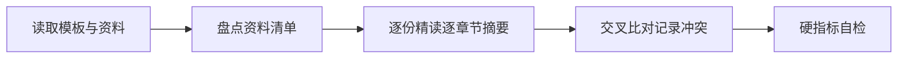

# AICoding 架构设计 · 资料摘要

> 本文档做一件事：**精读主理人转交的全部原始资料，逐份、逐章节做出摘要**——后面任何人拿到这份摘要，都能通过章节号快速定位回原始文件的对应位置。

> 上游输入：主理人转交的 RayScan（Python Web 漏洞扫描器 WVS）项目原始资料（D1–D16，含 README、架构/模块/入门文档、agents/superpowers 文档、CHANGELOG、CONTRIBUTING、pyproject、wvs/ 源码、Web UI、扫描配置档、部署文件、更名记/社区发文）；
> 产出者：`knowledge-ingest-engineer`（知识摄入工程师 - 闻资料），经 G1 校验与人工审核通过后交付。

---

## 0. 元信息

```yaml
标题: RayScan (WVS) 架构方案 - 资料摘要 v0.1
版本: v0.1
状态: Draft
创建日期: 2026-07-12
整理人: knowledge-ingest-engineer (闻资料)

原始资料清单:
  - D1 README.md: 项目总览、功能特性、实战验证、使用方式（项目根）
  - D2 AGENTS.md: Agent 协作约定（Issue/标签/Domain/变更日志）
  - D3 docs/architecture.md: 架构概览、分层、数据流、关键设计决策
  - D4 docs/modules.md: 11 个检测模块说明与基类接口
  - D5 docs/getting-started.md: 安装、基本使用、配置、报告
  - D6 docs/agents/*: domain.md / issue-tracker.md / triage-labels.md
  - D7 docs/superpowers/*: profile-system 设计规格 + 实现计划
  - D8 CHANGELOG.md: 版本变更记录（至 1.0.2）
  - D9 CONTRIBUTING.md: 开发环境、代码质量、新增模块、PR 流程
  - D10 pyproject.toml: 项目元数据、依赖、脚本入口、工具配置
  - D11 wvs/ 代码: cli/config/models/core/modules/integrations/exploit/plugins/reporting
  - D12 web_ui/app.py: Flask Web UI（SSE 实时日志）
  - D13 profiles/*.yaml: default / src-quick / pentest-full / sqli-only 扫描配置档
  - D14 config/poc_sources.yaml: PoC 来源与集成工具配置模板
  - D15 Dockerfile + docker-compose.yml: 容器化部署形态
  - D16 RENAMED_TO_RAYSCAN.md + COMMUNITY_POST.md: 更名记与开源社区发文
```

| 版本 | 日期 | 作者 | 变更内容 |
| --- | --- | --- | --- |
| v0.1 | 2026-07-12 | knowledge-ingest-engineer | 初稿（Phase 1 资料摄入，G1 待审） |

---

## 1. 资料清单

> 列出全部原始资料，每份标注解析状态。解析失败或跳过的必须注明原因。

| 编号 | 文件名 | 类型 | 来源 | 解析状态 | 说明 |
| --- | --- | --- | --- | --- | --- |
| D1 | `README.md` | md | 项目仓库（xiabai2004/RayScan） | 已解析 | 逐节精读 |
| D2 | `AGENTS.md` | md | 项目仓库 | 已解析 | 逐节精读 |
| D3 | `docs/architecture.md` | md | 项目仓库 | 已解析 | 逐节精读 |
| D4 | `docs/modules.md` | md | 项目仓库 | 已解析 | 逐节精读 |
| D5 | `docs/getting-started.md` | md | 项目仓库 | 已解析 | 逐节精读 |
| D6 | `docs/agents/domain.md` `issue-tracker.md` `triage-labels.md` | md | 项目仓库 | 已解析 | 3 个文件逐份精读 |
| D7 | `docs/superpowers/specs/2026-06-27-profile-system-design.md` `plans/2026-06-27-profile-system-implementation.md` | md | 项目仓库 | 已解析 | 设计规格 + 实现计划逐份精读 |
| D8 | `CHANGELOG.md` | md | 项目仓库 | 已解析 | 逐节精读 |
| D9 | `CONTRIBUTING.md` | md | 项目仓库 | 已解析 | 逐节精读 |
| D10 | `pyproject.toml` | toml | 项目仓库 | 已解析 | 逐节精读 |
| D11 | `wvs/`（cli.py / config.py / models.py / core/* / modules/* / integrations/* / exploit/* / plugins/* / reporting/*） | py | 项目仓库 | 已解析 | 重点抽样精读：cli.py、config.py、models.py、core/scanner.py、core/crawler.py（结构）、core/session.py、modules/base.py、modules/__init__.py、wvs/core/oob/*（结构）；其余按目录结构概览 |
| D12 | `web_ui/app.py` | py | 项目仓库 | 已解析 | 逐文件精读 |
| D13 | `profiles/default.yaml` `src-quick.yaml` `pentest-full.yaml` `sqli-only.yaml` | yaml | 项目仓库 | 已解析 | 4 个文件逐份精读 |
| D14 | `config/poc_sources.yaml` | yaml | 项目仓库 | 已解析 | 逐文件精读 |
| D15 | `Dockerfile` `docker-compose.yml` | docker | 项目仓库 | 已解析 | 逐文件精读 |
| D16 | `RENAMED_TO_RAYSCAN.md` `COMMUNITY_POST.md` | md | 项目仓库 | 已解析 | 2 个文件逐份精读 |

**类型枚举补充**：本批上游资料以源代码与工程文档为主，类型含 `md` / `py` / `yaml` / `toml` / `docker`，不完全属于模板默认枚举（docx/pdf/pptx/xlsx）。

---

## 2. 资料内容摘要

> 逐份文档按自身章节结构做摘要。每条摘要标注章节号（`D编号，§章节`），后面任何人想核实某个点，直接定位回原文对应位置即可。引用方式标注于每条末尾括号内：直接引用 / 数据提取 / 综合归纳 / 推断（推断类附风险说明）。

### D1：README.md

> 项目门面文档，面向使用者，含功能特性、实战验证、快速开始、配置、检测能力、版本历史。来源：项目作者 xiabai2004。

| 章节 | 内容摘要 |
| --- | --- |
| D1，§1 标题/徽章 | 标题 "RayScan 2.0.0"；徽章标注 Python 3.8+、MIT、Status Beta、79 测试通过、Flask Web UI。（引用：直接引用） |
| D1，§2 功能特性，核心专精模块 | 默认加载核心：SQLi（8 种：error/union/boolean-blind/time-based/stacked/二阶/宽字节/OOB）、XSS（6 种：reflected/stored/DOM/Polyglot/mXSS/SSTI）；Lite：OA 专项（12 种系统）、WebShell、弱口令、子域名、CMDi/LFI/RCE/SSRF/XXE、sensitive/api/waf/jspathfinder。（引用：数据提取） |
| D1，§3 功能特性，Lite 辅助模块 | 第三方集成 Nuclei·sqlmap·ffuf·Wappalyzer；报告格式 HTML·JSON·CSV·Markdown·Console。（引用：数据提取） |
| D1，§4 架构亮点 | 多引擎聚合（RayScan+AWVS+Nessus+Nuclei+sqlmap 一键调度、结果去重合并）；Nuclei 12.5w PoC（智能模板+SQLite 缓存+按技术栈分类）；OA 自动识别加载专项规则；漏洞验证链（Metasploit RPC 自动匹配 exploit 验证）；流式检测（爬取即检测，30 页实战/150 页靶机）；双路径自动分流（靶机 IP/路径→靶机流程，否则实战流程）；三层降噪（内容特征+尺寸聚类+校准匹配）。（引用：数据提取） |
| D1，§5 新功能速览，OA 专项 | 自动识别并检测 12 种 OA/中间件：泛微/通达/金蝶/蓝凌/致远/用友/禅道/万户/Nacos/Spring/Jenkins/Confluence；检测类型含 SQLi/RCE/文件上传/认证绕过/配置泄露/未授权访问。（引用：数据提取） |
| D1，§6 新功能速览，多引擎聚合 | 提供 `AWVSIntegration`/`NessusIntegration` + `ResultMerger` 代码示例，`await scanner.run_multi_engine_scan(...)`。（引用：数据提取） |
| D1，§7 新功能速览，漏洞验证链 | 配置 MSF RPC（默认 127.0.0.1:55552），`--verify` 触发 Metasploit 验证。（引用：数据提取） |
| D1，§8 实战验证 | Metasploitable 2（DVWA v1.0.7）靶机：发现 83 个漏洞（3 medium + 80 low）；SQLi 提取 5 用户密码（MD5 可逆）；LFI 读 /etc/passwd。（引用：数据提取） |
| D1，§9 Quick Start | 源码安装 `pip install -e ".[dev]"`；Docker `docker build -t rayscan .` + `docker run rayscan scan http://example.com` 或 `TARGET_URL=... docker-compose up`；Web UI `python web_ui/app.py` 访问 http://localhost:5000。（引用：直接引用） |
| D1，§10 详细使用说明，快速/全量扫描 | 快速扫描 quick_scan.py：爬取深度 2、上限 25 URL、超时 15s、重试 0；全量扫描 full_scan.py：爬取深度 3、上限 500 URL、并发端点 12、报告 JSON/控制台。（引用：数据提取） |
| D1，§11 详细使用说明，Web UI | 深色/浅色主题、响应式、实时日志流、即时结果；tkinter GUI（wvs_gui.py）已停止维护。（引用：数据提取） |
| D1，§12 配置说明 | 常用参数：crawl_depth=2、crawl_max_urls=100、concurrent_endpoints=10、timeout=15、verify_ssl=False、retry_count=1。（引用：数据提取） |
| D1，§13 支持的检测模块 | 表格列 11 个模块：sqli/xss/cmdi/lfi/rce/ssrf/xxe/api/sensitive/waf/jspathfinder。（引用：数据提取） |
| D1，§14 外部工具集成 | Nuclei（pip install nuclei-python）、sqlmap、ffuf、Wappalyzer。（引用：数据提取） |
| D1，§15 项目结构 | 目录树含 wvs/、scripts/、scan_reports/、examples/、docs/、shared_components/、tools/、full_scan.py、quick_scan.py、wvs_gui.py、pyproject.toml、LICENSE、RENAMED_TO_RAYSCAN.md。（引用：数据提取） |
| D1，§16 检测能力 | 能力状态表：SQLi/XSS/LFI/敏感信息泄露实战验证通过；CMDi/SSRF/XXE/RCE/WAF绕过/API 标注"待验证"或"靶机未开放"。（引用：数据提取） |
| D1，§17 版本历史 | RayScan 2.0（OA/多引擎/Nuclei PoC/验证链/WebShell/弱口令/子域名）；RayScan 1.0（基于 WVS v19.2）；WVS v15~v19.2 历代。（引用：数据提取） |
| D1，§18 免责声明/License | 仅限授权安全测试；MIT License，Copyright (c) 2026 xiabai2004。（引用：直接引用） |

### D2：AGENTS.md

> Agent 协作与工程流程约定。来源：项目仓库。

| 章节 | 内容摘要 |
| --- | --- |
| D2，§1 Agent skills，Issue tracker | GitHub Issues via `gh` CLI，repo `xiabai2004/RayScan`。（引用：直接引用） |
| D2，§2 Agent skills，Triage labels | 五角色词表：needs-triage / needs-info / ready-for-agent / ready-for-human / wontfix。（引用：数据提取） |
| D2，§3 Agent skills，Domain docs | 单上下文仓库：根 `CONTEXT.md` + `docs/adr/`；若不存在则静默继续。（引用：直接引用） |
| D2，§4 Agent skills，Code change log | 所有代码变更须记入本文件（日期/摘要/影响文件）。2026-06-27 新增 Profile 系统、CLI 子命令 `rayscan profile list\|create\|delete\|export\|import`、`rayscan use PROFILE -u URL`、内置档 default/src-quick/pentest-full/sqli-only、tests/test_profiles/ 下 17 个测试。（引用：数据提取） |

### D3：docs/architecture.md

> 架构概览文档（注意：多处与 D11 实际代码不符，详见 §3 冲突记录 X3/X5/X6/X13）。来源：项目仓库。

| 章节 | 内容摘要 |
| --- | --- |
| D3，§1 项目结构 | 称核心扫描库 22,013 行 Python；列出 wvs/ 各文件行数（scanner.py 934、crawler.py 987、session.py 637、oob.py ~950 等）；modules 含 sqli(1586)/xss(719)/cmdi(682)/lfi(596)/rce(1138)/ssrf(777)/xxe(634)/api(415)/sensitive(789)/waf(801)/jspathfinder(543)；integrations 列 nuclei_runner.py/sqlmap_runner.py/ffuf_runner.py/wappalyzer_runner.py（命名 *_runner）；含 gui/ 目录。（引用：数据提取） |
| D3，§2 分层架构 | CLI/GUI → Authentication Layer → 核心引擎（Scanner/Crawler/Scheduler）→ Module Registry → 11 检测模块 → Integrations → Reporting。（引用：综合归纳） |
| D3，§3 核心数据流 | 用户输入 URL → Crawler 爬页面 → Scanner 调度 → Modules 执行检测 → Reporter 输出（Console/HTML/JSON）。（引用：综合归纳） |
| D3，§4 关键设计决策 | 1) 异步驱动基于 asyncio + aiohttp；2) 模块化检测（统一基类、可插拔）；3) 配置分层（默认值→配置文件→CLI 参数）；4) 统一数据模型 Vulnerability/ScanTarget/ScanResult；5) 插件化认证 AuthManager（5 种方式）；6) 自动速率限制。（引用：数据提取） |

### D4：docs/modules.md

> 检测模块说明（注意：§模块基类 与 D11 代码不符，见冲突 X4）。来源：项目仓库。

| 章节 | 内容摘要 |
| --- | --- |
| D4，§1 模块列表 | 11 个检测模块及 OWASP 映射：sqli(A03)/xss(A03)/cmdi(A03)/lfi(A01)/rce(A03)/ssrf(A10)/xxe(A05)/api(API Top10)/sensitive(A04)/waf(—)/jspathfinder(—)。（引用：数据提取） |
| D4，§2 模块架构 | 每模块统一结构：base.py(BaseDetector) + 各模块 detector.py/payloads.py/analyzer.py 等。（引用：数据提取） |
| D4，§3 模块基类 | 称所有模块继承 `BaseDetector`，接口 `async def detect(url,param,value)` / `batch_detect()` / `set_oob_manager()`。（引用：直接引用，注：与 D11 实际 `DetectionModule` 冲突，见 X4） |
| D4，§4 各模块详情 | sqli（error/union/boolean-blind/time-based/stacked，支持 MySQL/PostgreSQL/MSSQL/Oracle/SQLite）；xss（反射/存储，参数采样≤4）；cmdi（多分隔符、time-based 并发）；lfi（目录遍历/PHP 伪协议/编码绕过，Linux/Windows）；ssrf（内网/云元数据/端口扫描 + OOB）；xxe（内联/外部/blind OOB，file/http/ftp/php://）；api（REST/GraphQL，权限绕过/方法篡改/批量赋值）；sensitive（API Key/Token/密码/密钥/云凭证，扫响应体/注释/JS/robots.txt）；waf（指纹识别+绕过：编码/大小写/注释/参数污染）。（引用：数据提取） |

### D5：docs/getting-started.md

> 快速入门文档。来源：项目仓库。

| 章节 | 内容摘要 |
| --- | --- |
| D5，§1 安装 | 源码 `pip install -e ".[dev]"`；Docker；`pip install git+https://...`。（引用：数据提取） |
| D5，§2 基本使用 | 单目标 `python -m wvs scan`；指定 `-o`/`-f`；`--modules`/`--no-modules`；批量 `python -m wvs batch`；`list-modules`；带认证 `--auth-type form/bearer/cookie`。（引用：数据提取） |
| D5，§3 配置 | 默认值表：crawl_depth=2、crawl_max_urls=100、concurrent_endpoints=10、timeout=15、verify_ssl=False、retry_count=1。（引用：数据提取） |
| D5，§4 扫描报告 | 默认存 `scan_reports/`；格式 json（默认）/html/markdown/csv。（引用：数据提取） |

### D6：docs/agents/*

> Agent 流程细则（3 个文件）。来源：项目仓库。

| 章节 | 内容摘要 |
| --- | --- |
| D6，domain.md §Before exploring | 探索代码前先读根 `CONTEXT.md` 或 `CONTEXT-MAP.md`，以及 `docs/adr/`；文件不存在则静默继续。（引用：直接引用，注：实际仓库无此二处，见 X12） |
| D6，domain.md §Use glossary | 输出命名须使用 `CONTEXT.md` 词汇；概念缺失是信号。（引用：综合归纳） |
| D6，domain.md §Flag ADR conflicts | 输出若与既有 ADR 矛盾须显式提出而非静默覆盖。（引用：直接引用） |
| D6，issue-tracker.md | 全部 Issue/PRD 走 GitHub Issues，`gh` CLI；给出 create/view/list/comment/label/close 约定。（引用：综合归纳） |
| D6，triage-labels.md | 五角色标签映射表（mattpocock/skills ↔ 本仓库标签），右列可改。（引用：数据提取） |

### D7：docs/superpowers/*

> Profile 系统设计规格 + 实现计划（注意：spec 的 Auth 子系统与实现计划/代码状态不一致，见 X11）。来源：项目仓库。

| 章节 | 内容摘要 |
| --- | --- |
| D7，spec §背景 | RayScan 定位个人渗透伴侣，用于 SRC 挖掘与渗透测试前期踩点；用户诉求：30 秒启动、快速切换模块/参数、工具协同、高灵敏度宁可多报。（引用：数据提取） |
| D7，spec §核心概念 | Profile = 扫描参数预设集合（模块开关+性能参数）；Auth = 目标认证信息，独立管理。（引用：直接引用） |
| D7，spec §设计方案，Profile(YAML) | 存储于 `profiles/`；字段 name/description/modules{enabled,disabled}/params{rate,threads,timeout,crawl_depth,crawl_max_urls,verify_ssl}。（引用：数据提取） |
| D7，spec §Auth File(JSON) | 认证信息独立存储，运行时 `--auth` 指定；支持 cookie/bearer/basic/headers。（引用：数据提取，注：词汇与 D11 cli 实际 apikey/headers 差异见 X9） |
| D7，spec §CLI 接口 | `rayscan use src-quick --auth my-target.json -u URL`；`rayscan profile list/create/export/import/delete`；`rayscan auth new/list/delete`。（引用：数据提取） |
| D7，spec §内置 Profile | default（均衡全模块）/src-quick（SRC 快瞄）/pentest-full（深度全模块）/sqli-only。（引用：数据提取） |
| D7，spec §文件布局 | `profiles/` + `auths/`（可选）；`rayscan = wvs.cli:main`。（引用：数据提取） |
| D7，spec §实现计划 | Phase 1 Profile 系统；Phase 2 Auth 系统（`auths/` 目录 + `auth` 子命令 + `--auth` 组合）。（引用：数据提取） |
| D7，plan §Goal/Architecture | Profile=YAML in `profiles/`；CLI 加 `profile` 子命令与 `use PROFILE`；Profile 设置运行时覆盖 ConfigManager 默认。（引用：数据提取） |
| D7，plan §内置档定义 | BUILTIN_PROFILES：default(src-quick 等 4 档) 参数与 spec 一致；default rate=10/threads=5/timeout=30/crawl_depth=3/crawl_max_urls=100/verify_ssl=true。（引用：数据提取） |
| D7，plan §Task 1–5 | 实现 ProfileManager（list/load/save/delete/apply_to_config/get_profile_modules）、profile CLI 子命令、use 命令（含 `--auth` JSON 文件支持）、CLI 测试、内置 YAML 文件；cmd_use banner 打印 "RayScan 1.1.0"（引用：数据提取，注意版本号见 X1）。 |

### D8：CHANGELOG.md

> 版本变更记录（最新条目 [1.0.2]，未覆盖 2.0.0，见 X2）。来源：项目仓库。

| 章节 | 内容摘要 |
| --- | --- |
| D8，§1 [1.0.2] 2026-05-24 | Added：Metasploitable 2 验证发现 83 漏洞（3 medium+80 low）、DVWA 安全等级设置、实验室自动识别；Fixed：多处 `_lab_profile`/`_max_time`/`_MODULE_PRIORITY`/`_integrations_enabled`/`hashlib` 等初始化缺失与命名不一致崩溃；Changed：清理测试临时文件。（引用：数据提取） |
| D8，§2 [1.0.1] 2026-05-24 | 未指定 `--output` 时自动存 `scan_reports/` 并打印路径；修复找不到结果文件问题（close #1）。（引用：数据提取） |
| D8，§3 [1.0.0] 2026-05-15 | 正式更名 RayScan（基于 WVS v19.2 开源）；flake8 零警告（修复 413）；Docker 支持；CI；CONTRIBUTING；文件拆分（sqli/detector 1423→369+analyzer+techniques_mixins；crawler 1172→967+crawler_parsers；scanner 1076→793+scanner_integrations）；爬虫限制（每路径 25 页、POST 采样 12）；扫描加速（XSS 参数≤4）；Testing：测试用例 236→281 个。（引用：数据提取，注：行数与 D3 不符见 X13；测试数见 X8） |
| D8，§4 WVS v19.2 | 超时抢救+`--resume`；OOB 检测 `--oob-server`；认证重构 form/bearer/basic/apikey/cookie 五种；GUI wvs_gui.py；报告 HTML/JSON/CSV/Markdown/Console；模块化重构。（引用：数据提取） |
| D8，§5 WVS v19.0/19.1 | 11 个检测模块；第三方集成 Nuclei/sqlmap/ffuf/Wappalyzer；异步引擎 aiohttp；缓存/限速/认证插件/CLI/批量；并发提升 6.21 倍、缓存命中 68%。（引用：数据提取） |
| D8，§6 WVS v18.x / v15~17 / v1~14 | 高级检测模块、AdvancedDetectionManager、Nuclei 集成；模块化/插件/多报告重构；早期迭代。（引用：综合归纳） |

### D9：CONTRIBUTING.md

> 贡献指南（注意：§Project Structure 的 httpx/oob 描述与 D11 代码一致，但 §Adding a New Detection Module 的基类名与 D4 冲突，见 X4）。来源：项目仓库。

| 章节 | 内容摘要 |
| --- | --- |
| D9，§1 Development Setup | `pip install -e ".[dev]"` 或 `.[dev,speedup,nuclei,integrations]`。（引用：直接引用） |
| D9，§2 Running Tests | `pytest tests/ -q`；`pytest --cov=wvs`。（引用：直接引用） |
| D9，§3 Pre-commit Hooks | `pre-commit install/run`。（引用：直接引用） |
| D9，§4 Code Quality | 以 **ruff** 为唯一 lint+format 工具（不再混用 black/isort/flake8），统一行宽 **120**；mypy 渐进严格、非阻断告警。（引用：数据提取） |
| D9，§5 Project Structure | wvs/ 结构：core/scanner.py(WAVScanner)、scanner_integrations.py(Nuclei/sqlmap/ffuf/Wappalyzer mixin)、crawler.py(WebCrawler)、crawler_parsers.py、session.py(**HTTPPool httpx-based**)、cache/rate_limiter/scheduler、**oob/(interactsh/DNSLog)**；modules/base.py(DetectionModule + ModuleFactory)；integrations/；reporting/(HTML/JSON/CSV/Markdown/Console)；plugins/(Auth)。（引用：数据提取） |
| D9，§6 Adding a New Detection Module | 步骤：建 `wvs/modules/模块名/`（__init__/detector/payloads）；子类 `DetectionModule`；装饰 `@register_module`；实现 `_scan_impl(target)->List[Vulnerability]`；在 `wvs/modules/__init__.py` 导入；加 `tests/test_模块名_detector.py`。（引用：数据提取，注：与 D4 的 BaseDetector/detect 冲突见 X4） |
| D9，§7 PR Workflow | master 受保护，改动须 PR；分支前缀 feat/fix/docs/chore；本地 `pytest` + `ruff check` + `ruff format --check`；CI 质量门禁（pytest+ruff+coverage，接入中）；≥1 Approving Review；评审标准 `docs/REVIEW_CHECKLIST.md`、技术债 `docs/TECH_DEBT.md`（注：TECH_DEBT.md 实际不存在，见 X12）；Squash merge。（引用：数据提取） |

### D10：pyproject.toml

> 项目元数据与依赖（注意：httpx 实际被代码广泛引用但未列入依赖，见 X3）。来源：项目仓库。

| 章节 | 内容摘要 |
| --- | --- |
| D10，§1 [project] | name="rayscan"；version="2.0.0"；description 含 SQLi/XSS/命令注入/LFI/SSRF/XXE/RCE/API安全/多引擎聚合(Nuclei/sqlmap/ffuf)+MSF验证链+Profile；License MIT；authors xiabai2004；keywords 含 metasploitable/dvwa 等。（引用：数据提取） |
| D10，§2 requires-python / classifiers | requires-python=">=3.8"；classifiers 含 Development Status 4-Beta、Programming Language 3.8~3.12。（引用：数据提取） |
| D10，§3 dependencies | 核心依赖：requests/beautifulsoup4/lxml/pyyaml/colorama/**aiohttp**/rich。（引用：数据提取，注：**httpx 未列入**，但 D11 代码广泛 import httpx，见 X3） |
| D10，§4 optional-dependencies | dev(ruff/mypy/pytest/pytest-cov/pytest-asyncio/pre-commit/types-*)、speedup(orjson/uvloop)、nuclei(nuclei-python)、integrations(python-Wappalyzer/aiohttp)、gui(ttkbootstrap)、web(flask)。（引用：数据提取） |
| D10，§5 [project.scripts] | `wvs = "wvs.cli:main"` 与 `rayscan = "wvs.cli:main"`（二者等价入口，解释 D1/D2/D7 的调用差异，见 X6 说明）。（引用：数据提取） |
| D10，§6 [tool.ruff] | line-length=120；lint.select 含 E/F/W/I/B/C4/UP/SIM/BLE/TRY/S110/ARG/PTH/RUF；ignore E501；per-file-ignores 含 exceptions.py、modules/base.py；lint.exclude 历史载荷文件 sqli/payloads.py、sqli/techniques_mixins.py、rce/payloads.py。（引用：数据提取） |
| D10，§7 [tool.mypy] | python_version=3.8；warn_return_any 等严格项开启；overrides 对 tests、sql 载荷、crawler_parsers、scanner_integrations 设 ignore_errors。（引用：数据提取） |
| D10，§8 [tool.pytest.ini_options] | asyncio_default_fixture_loop_scope=function；testpaths=["tests"]；addopts="-q"。（引用：数据提取） |

### D11：wvs/ 代码

> 核心扫描库源码（重点抽样精读；与 D3/D4/D9 文档多处冲突见 §3）。来源：项目仓库。

| 章节 | 内容摘要 |
| --- | --- |
| D11，cli.py §子命令 | `build_parser()` 注册子命令：scan / batch / list-modules / version / **profile**(list/create/delete/export/import) / **use**；`prog="rayscan"`；多处 banner 打印 "RayScan 1.1.0"（引用：数据提取，版本号见 X1）。 |
| D11，cli.py §scan 参数 | `--format` choices=["json","html","markdown","sarif","csv"]（默认 json）；`--all-modules`；`--modules`/`--no-modules`；`--max-time` 默认 7200；`--resume`；`--rate`(默认10)/`--rate-mode`(burst/uniform)/`--delay`；`--insecure`；`--i-have-permission`（需环境变量 RAYSCAN_ENABLE_EXPLOIT=1 才加载 wvs.exploit）；`--oob-server`/`--oob-timeout`；认证 `--auth-type` choices=["form","bearer","basic","apikey","cookie"]。（引用：数据提取） |
| D11，cli.py §profile/use 实现 | `cmd_profile`/`cmd_use` 实现与 D7 plan 一致；`cmd_use` 支持 `--auth 文件` JSON（cookie/bearer/basic/headers）；无 `auth` 子命令（与 D7 spec Phase 2 差异见 X11）。（引用：数据提取） |
| D11，cli.py §display_result | 未指定 `-o` 自动存 `scan_reports/`；仅实现 html/json/markdown 文件写出（**csv/sarif 被接受但未落地**，见 X10）。（引用：数据提取） |
| D11，config.py §DEFAULT_CONFIG | timeout=DEFAULT_TIMEOUT(30)、threads=5、verify_ssl=DEFAULT_VERIFY_SSL(True)、delay=0.1、max_requests_per_second=20、retry_count=1、crawl_depth=4、crawl_max_urls=300、concurrent_endpoints=10、concurrent_modules=2、max_time=3600；modules 表含 14 项（sqli/xss/cmdi/lfi/api/sensitive/xxe/ssrf/rce/subdomain/weakpass/webshell/oa/jspathfinder，**不含 waf**，见 X16）；poc_sources（nuclei/xray/beebeeto/bugscan）；integrations（nuclei/sqlmap/ffuf/wappalyzer/awvs/nessus）。（引用：数据提取） |
| D11，config.py §ConfigManager | 多源配置（文件/环境变量/CLI 参数），点号键路径 get/set，递归合并，env 映射 WVS_*，get_scanner_config 自动映射 ScannerConfig。（引用：综合归纳） |
| D11，models.py §枚举 | Severity(INFO/LOW/MEDIUM/HIGH/CRITICAL)；VulnerabilityType(17 种：sql_injection/xss/command_injection/lfi/rfi/xxe/ssrf/idor/broken_auth/broken_access/insecure_config/info_disclosure/api_security/logic_vulnerability/rce/zero_day/other)；Confidence(LOW/MEDIUM/HIGH/CERTAIN)。（引用：数据提取） |
| D11，models.py §数据类 | Vulnerability（丰富字段+to_dict/from_dict+_TYPE_ALIASES 将 code_injection/ssti/rce 等别名映射到 canonical）；ScanTarget；ScanResult（含 vulnerability_count/severity_count）；ModuleConfig；ScannerConfig（timeout=30/threads=3/max_requests_per_second=10/retry_count=3/concurrent_endpoints=6/concurrent_modules=2/crawl_depth=4/crawl_max_urls=300/max_time=3600）。（引用：数据提取） |
| D11，core/scanner.py §WAVScanner | 主协调器；`_resolve_enabled_modules()` 默认仅加载核心模块（sqli+xss，依 _MODULE_PRIORITY 且 enabled），`_load_all_modules=True` 或 `modules.all=true` 时加载全部（核心+lite）；`_run_module` 带并发信号量；`run_multi_engine_scan`/`scanner_integrations` 多引擎；超时抢救 `_partial_vulns`。（引用：数据提取） |
| D11，core/scanner.py §lab 自动认证 | `_do_lab_auth` 对识别到的靶机（DVWA/Mutillidae）自动表单登录并注入 security cookie。（引用：数据提取） |
| D11，core/session.py §HTTPPool | **使用 httpx.AsyncClient** 作为核心会话池（连接池/重试指数退避/智能限速/加密 Cookie 存储/UA 轮换/WAF 规避）；读取 max_requests_per_second/verify_ssl/timeout/retry_count；代理池；GET 请求跨模块去重缓存。（引用：数据提取，确认核心引擎为 httpx，见 X3） |
| D11，core/crawler.py（结构） | 爬虫引擎（约 987 行）；crawler_parsers.py 处理 Sitemap/robots.txt/OpenAPI。（引用：综合归纳，未逐行精读） |
| D11，modules/base.py §DetectionModule | **实际基类为 `DetectionModule`**（非 D4 的 BaseDetector）；对外 `async def scan(target)` 包装抽象 `async def _scan_impl(target)`；`@abstractmethod get_info()` 返回 ModuleInfo；`set_oob_manager()`/`set_waf_detected()`/`set_global_baseline_cache()`；时间盲注用 sqlmap 统计模型（7σ）；`ModuleFactory` + `@register_module` 装饰器自动注册。（引用：数据提取，见 X4） |
| D11，modules/__init__.py | 注释称默认仅 sqli+xss；"Lite 模块位于 wvs.modules.lite 子包"——**实际为扁平目录，无 lite 子包**（见 X15）；import 的默认类含 OADetector/SQLiDetector/SubdomainDetector/WeakPasswordDetector/WebShellDetector/XSSDetector；`register_all_modules()` 为空操作。（引用：数据提取） |
| D11，core/oob/* | 实际为包 `wvs/core/oob/`（interactsh.py、dnslog.py 等）；cli.py/modules/base.py 均 `from ..core.oob import OOBManager`。（引用：数据提取，见 X5） |
| D11，integrations/* | 实际 7 个文件，命名 `*_integration.py`：awvs/ffuf/msf/nessus/nuclei/sqlmap/wappalyzer（含 AWVS/Nessus/MSF，与 D3 的 4 个 *_runner 不符，见 X6）。（引用：数据提取） |
| D11，exploit/* 与 plugins/auth.py | exploit 含 engine.py(import aiohttp) 及 xss/xxe/ssrf 利用；plugins/auth.py(AuthManager，import httpx) 支持 form/bearer/basic/apikey/cookie 五类。（引用：数据提取） |
| D11，reporting/* | 报告器：console/html_report/json_reporter/csv_reporter/markdown_report（**无 sarif_reporter**，见 X10）。（引用：数据提取） |

### D12：web_ui/app.py

> Flask Web UI（注意：头部版本号 1.0.2，见 X1；使用 `max_scan_time` 键与 CLI `max_time` 不符，见 X14）。来源：项目仓库。

| 章节 | 内容摘要 |
| --- | --- |
| D12，§1 模块头 | "RayScan 1.0.2 — Web UI (Flask + SSE 实时日志)"。（引用：直接引用，版本号见 X1） |
| D12，§2 鉴权 | 基于 session + API token（`RAYSCAN_WEB_SECRET`/`RAYSCAN_WEB_TOKEN`）；`_is_authorized`（session 或 X-Api-Token）；`_require_csrf`（API token 用户免 CSRF）。（引用：数据提取） |
| D12，§3 ScanSession | 后台线程驱动扫描，劫持 logger 与 stdout 经 SSE 队列实时推送日志/进度/结果；事件生成器 `events()`。（引用：综合归纳） |
| D12，§4 路由，/api/scan | POST；校验 URL 与 modules（至少 1 个）；cfg 默认 rate=15/timeout=15/crawl_depth=2/crawl_max_urls=50/concurrent_endpoints=10，`--insecure`→verify_ssl=False。（引用：数据提取，默认值见 X7） |
| D12，§5 路由，/api/stream，/api/stop | SSE 日志流；停止扫描。（引用：综合归纳） |
| D12，§6 路由，/api/export/格式 | **仅实现 json**，其他格式返回"不支持格式"（与 CLI 多格式差异见 X10）。（引用：数据提取） |
| D12，§7 路由，/api/history，/api/stats | 内存 SCAN_HISTORY（最多 200 条）；engines_available 仅 nuclei/sqlmap。（引用：数据提取） |
| D12，§8 入口 | 默认绑定 127.0.0.1:5000（`RAYSCAN_WEB_HOST`/`RAYSCAN_WEB_PORT` 可改）；监听 0.0.0.0 时告警需启用鉴权。（引用：数据提取） |
| D12，§9 _run_scan | `asyncio.wait_for(scanner.scan(target), timeout=config.get("max_scan_time", 7200))`——**键名 max_scan_time 与 CLI 的 max_time 不一致**（见 X14）。（引用：数据提取） |

### D13：profiles/*.yaml

> 4 个内置扫描配置档（与 D7 spec/plan 定义一致）。来源：项目仓库。

| 章节 | 内容摘要 |
| --- | --- |
| D13，default.yaml | name=default，均衡全模块；modules.enabled=[]（空=全开）；params: rate=10/threads=5/timeout=30/crawl_depth=3/crawl_max_urls=100/verify_ssl=true。（引用：数据提取，默认值见 X7） |
| D13，src-quick.yaml | SRC 快瞄高灵敏；enabled=[sqli,xss,cmdi,lfi]；params: rate=20/threads=10/timeout=15/crawl_depth=2/crawl_max_urls=50/verify_ssl=false。（引用：数据提取） |
| D13，pentest-full.yaml | 渗透深度全模块；enabled=[]；params: rate=5/threads=3/timeout=45/crawl_depth=4/crawl_max_urls=500/verify_ssl=false。（引用：数据提取） |
| D13，sqli-only.yaml | 只扫 SQLi；enabled=[sqli]；params: rate=20/threads=10/timeout=30/crawl_depth=2/crawl_max_urls=100/verify_ssl=false。（引用：数据提取） |

### D14：config/poc_sources.yaml

> PoC 来源与集成工具配置模板。来源：项目仓库。

| 章节 | 内容摘要 |
| --- | --- |
| D14，§1 poc_sources | nuclei(enabled,~/.rayscan/nuclei-templates,auto_update,max_templates=500)；xray(enabled,~/.rayscan/xray-pocs)；beebeeto(disabled)；bugscan(disabled)。注释称 Nuclei 12.5w+ PoC。（引用：数据提取） |
| D14，§2 integrations | nuclei(enabled,use_template_manager,max_templates=500)；sqlmap(enabled)；ffuf(enabled)；wappalyzer(enabled)。（引用：数据提取） |

### D15：Dockerfile + docker-compose.yml

> 容器化部署形态。来源：项目仓库。

| 章节 | 内容摘要 |
| --- | --- |
| D15，Dockerfile | `FROM python:3.11-slim`；安装系统依赖 curl/ca-certificates；`pip install -r requirements-dev.txt`；`pip install -e .`；`ENTRYPOINT ["python","-m","wvs"]`，`CMD ["--help"]`。（引用：数据提取） |
| D15，docker-compose.yml | version 3.9；service rayscan `build: .`、`command: scan ${TARGET_URL:-http://example.com}`、环境变量 PYTHONUNBUFFERED=1、挂载 `./scan_reports:/app/scan_reports`、**默认不暴露端口**（client-only）。（引用：数据提取，与 D1 Docker 用法一致） |

### D16：RENAMED_TO_RAYSCAN.md + COMMUNITY_POST.md

> 更名记与开源社区发文（版本口径见 X1）。来源：项目仓库。

| 章节 | 内容摘要 |
| --- | --- |
| D16，RENAMED §为什么改名 | WVS 走过 19 个大版本，开源之际更名 RayScan（Ray 射线寓意精准穿透 + Scan）；RayScan 1.0 新起点。（引用：数据提取） |
| D16，RENAMED §WVS 历史 | 版本表 v1~v14 构建期、v15 框架、v16 插件、v17 重构、v18/v18.4 高级、v19/v19.2 11 大检测模块、RayScan 1.0 开源。（引用：数据提取） |
| D16，COMMUNITY_POST §能扫什么 | 11 个检测模块（同 D4 列表）；DVWA 实战检出 7 种漏洞类型（SQLi 68/XSS 54/CMDi 16/LFI 36/SSRF 14 次）。（引用：数据提取） |
| D16，COMMUNITY_POST §3 秒上手 | `pip install -r requirements-dev.txt`；`python quick_scan.py -u`/`python full_scan.py -u`/`python wvs_gui.py`；旧版本存 `archive/` 目录（注：实际仓库无 archive/，见 X12）。（引用：数据提取） |
| D16，COMMUNITY_POST §技术架构/署名 | 架构 "Crawler→参数发现→并发检测→去重→报告"，全程 async；Beta 阶段；GitHub xiabai2004/RayScan；MIT；署名 xiabai2004, 2026。（引用：数据提取） |

---

## 3. 冲突记录

> 不同资料对同一事实描述矛盾时，**并列保留多个版本**，不做裁决。以下以"版本 A / 出处 A / 版本 B / 出处 B / 差异说明"记录；多版本冲突在差异说明中补充。

| 编号 | 冲突主题 | 版本 A | 出处 A | 版本 B | 出处 B | 差异说明 |
| --- | --- | --- | --- | --- | --- | --- |
| X1 | 项目版本号口径 | 2.0.0（README 标题、pyproject version） | D1 标题；D10 §[project].version | 1.1.0（cli.py 多处 banner）/ 1.0.2（web_ui/app.py 头、CHANGELOG 最新）/ 1.0（更名记、社区发文） | D11 cli.py；D12 头；D8 §[1.0.2]；D16 | 版本号在代码/文档中跨 1.0 / 1.0.2 / 1.1.0 / 2.0.0 四种表述，缺单一权威来源，下游需与主理人确认当前真实版本基线。 |
| X2 | CHANGELOG 未覆盖 2.0.0 | CHANGELOG 最新条目 [1.0.2]（2026-05-24） | D8 §[1.0.2] | 代码/README 已为 2.0.0（含 OA/多引擎/Nuclei PoC/验证链/WebShell/弱口令/子域名等 v2.0 特性） | D1 §新功能速览/§版本历史；D10 | CHANGELOG 停滞在 1.0.2，2.0.0 的变更无记录，版本连续性断裂。 |
| X3 | 核心 HTTP 引擎技术栈（aiohttp vs httpx）且 httpx 缺失依赖 | architecture 称"基于 asyncio + aiohttp" | D3 §关键设计决策 | 实际核心 `HTTPPool` 用 `httpx.AsyncClient`（session.py import httpx）；CONTRIBUTING 称"HTTPPool (httpx-based)"；aiohttp 仅用于部分集成/利用模块；**pyproject 核心依赖列 aiohttp 却未列 httpx** | D9 §Project Structure；D11 session.py；D10 §dependencies | 主引擎实为 httpx，architecture 的 aiohttp 口径不精确；且 httpx 在代码中广泛引用却未声明为核心依赖（疑似打包缺陷，运行环境若未预装 httpx 将导入失败）。 |
| X4 | 检测模块基类命名/接口 | docs/modules.md 称 `BaseDetector`，接口 `detect()`/`batch_detect()`/`set_oob_manager()` | D4 §模块基类 | 代码实际为 `DetectionModule`，对外 `scan()` + 抽象 `_scan_impl()` + `@abstractmethod get_info()`，注册用 `@register_module`/`ModuleFactory`；CONTRIBUTING 描述一致 | D11 modules/base.py；D9 §Adding a New Detection Module | docs/modules.md 与代码/CONTRIBUTING 不一致，modules.md 明显过时，应以代码为准。 |
| X5 | OOB 模块形态 | architecture 称 `core/oob.py`（~950 行单文件） | D3 §项目结构 | CONTRIBUTING 称 `core/oob/`（目录）；实际代码为包 `wvs/core/oob/`（interactsh.py/dnslog.py 等） | D9 §Project Structure；D11 cli.py/modules/base.py import + wvs/core/oob/* | architecture 的 oob.py 单文件描述过时；CONTRIBUTING 的 oob/ 目录描述与代码一致。 |
| X6 | 第三方集成模块命名/数量 | architecture 列 4 个 `*_runner.py`（nuclei/sqlmap/ffuf/wappalyzer），未列 AWVS/Nessus/Metasploit | D3 §项目结构 | 实际 7 个 `*_integration.py`（awvs/ffuf/msf/nessus/nuclei/sqlmap/wappalyzer）；README 亦述多引擎聚合 AWVS/Nessus/Nuclei/Metasploit | D11 wvs/integrations/*；D1 §多引擎聚合 | 命名（_runner vs _integration）、数量（4 vs 7）、覆盖工具（缺 AWVS/Nessus/MSF）均不一致；注：D10 §[project.scripts] 同时定义 `wvs` 与 `rayscan` 入口，解释了 D1/D5 用 `python -m wvs` 与 D2/D7 用 `rayscan` 的调用差异（两者等价，非冲突）。 |
| X7 | 全局默认参数多套口径 | README/getting-started：crawl_depth=2、crawl_max_urls=100、concurrent_endpoints=10、timeout=15、verify_ssl=False、retry_count=1 | D1 §配置说明；D5 §配置 | config.py/constants.py：timeout=30、verify_ssl=True、crawl_depth=4、crawl_max_urls=300、concurrent_endpoints=10、max_time=3600；profiles/default.yaml：rate=10/threads=5/timeout=30/crawl_depth=3/crawl_max_urls=100/verify_ssl=true；web_ui：rate=15/timeout=15/crawl_depth=2/crawl_max_urls=50 | D11 config.py/constants.py；D13；D12 §api_scan | timeout（15/30）、verify_ssl（False/True）、crawl_depth（2/3/4）、crawl_max_urls（50/100/300/500）、max_time（3600/7200）等多处不一致；参数键名并存 `rate/threads`（profiles/Web UI/CLI --rate）与 `max_requests_per_second/concurrent_endpoints`（config.py/ScannerConfig），需确认生效优先级。 |
| X8 | 测试数量口径 | README"已通过 79 个自动化测试"，"当前 79 个测试集中在核心检测器" | D1 徽章/§测试覆盖路线图 | CHANGELOG §1.0.0 Testing"测试用例 236 → 281 个" | D8 §1.0.0 Testing | 79 vs 281，可能为不同时间点统计口径；真实当前测试数需运行 `pytest --co` 核实（环境依赖 httpx 等未验证可导入）。 |
| X9 | 认证类型词汇 | README/CHANGELOG：`--auth-type form/bearer/basic/apikey/cookie`（5 种，含 apikey） | D1 §带认证扫描；D8 §WVS v19.2 | D7 spec Auth File：cookie/bearer/basic/headers（无 apikey，含 headers）；实际 cli `--auth-type` 无 headers 选项但 `--auth` JSON 文件支持 headers 字段 | D7 spec §Auth File；D11 cli.py §build_parser | spec 的 auth 词汇（headers，无 apikey）与实际 CLI（apikey 作为 --auth-type、headers 仅作 --auth 文件字段）及 README/CHANGELOG（apikey）不完全一致。 |
| X10 | 报告格式集合 + Web UI 仅 JSON | README/getting-started/architecture：json/html/csv/markdown/console（5 种） | D1；D3；D5 | 代码 constants.REPORT_OUTPUT_FORMATS 与 CLI `--format`：json/html/markdown/sarif/csv（含 sarif、无 console 文件格式）；cli.display_result 仅实现 html/json/markdown（csv/sarif 接受未落地）；web_ui /api/export 仅 json | D11 constants.py/§display_result；D12 §api_export | sarif 在代码中但 README 未列；console 在 README 但非文件格式；Web UI 仅 JSON 导出；CLI 接受 csv/sarif 却未写出文件（潜在未实现分支）。 |
| X11 | Auth 子系统实现状态 | D7 spec 规划 Phase 2 Auth 系统：`rayscan auth new/list/delete` 子命令 + `auths/` 目录 | D7 spec §实现计划 | D7 plan 仅实现 Profile 系统 + `use` 的 `--auth 文件`；代码 cli.py 仅有 profile/use 子命令、无 auth 子命令；仓库根无 `auths/` | D7 plan Task3；D11 cli.py | 独立 Auth 命名管理子系统未实现，当前仅支持 `--auth` 文件传入；spec 的 Phase 2 尚未落地。 |
| X12 | 缺失的引用文档/目录 | AGENTS domain.md 引用根 `CONTEXT.md` 与 `docs/adr/`；CONTRIBUTING 引用 `docs/TECH_DEBT.md`；COMMUNITY_POST 引用 `archive/` | D2 §Domain docs；D9 §PR Workflow；D16 COMMUNITY_POST | 实际仓库根无 CONTEXT.md/docs/adr/，docs/ 下无 TECH_DEBT.md，根无 archive/ | 目录核查（D1/D2/D9/D16 引用 vs 实际仓库） | 多处文档引用仓库中不存在的文件/目录，下游架构设计需注意引用缺口。 |
| X13 | 代码行数统计 | architecture："核心扫描库 22,013 行"，scanner.py 934 / crawler.py 987 / oob.py ~950 | D3 §项目结构 | README"22,000+ 行"；CHANGELOG 拆分后 scanner.py 793 / crawler.py 967（与 architecture 的 934/987 不符） | D1；D8 §1.0.0 Changed | 精确行数与拆分后模块行数在文档间不一致（22,013 vs 22,000+；scanner 934 vs 793；crawler 987 vs 967）。 |
| X14 | 全局扫描超时键名 | CLI 设置/读取 `max_time`（默认 7200），config.py 默认 `max_time=3600` | D11 cli.py/§cmd_scan/§cmd_use；D11 config.py | Web UI `_run_scan` 读取 `config.get("max_scan_time", 7200)` | D12 §_run_scan | 键名 max_time（CLI 路径）与 max_scan_time（Web UI 路径）不一致，Web UI 设置的超时不会映射到同一配置键，存在行为分歧。 |
| X15 | modules 组织描述 | wvs/modules/__init__.py 注释称 "Lite 模块位于 wvs.modules.lite 子包" | D11 modules/__init__.py 注释 | 实际 wvs/modules/ 为扁平目录（sqli/xss/cmdi/lfi/rce/ssrf/xxe/api/sensitive/waf/jspathfinder/oa/subdomain/weakpass/webshell/），无 lite 子包 | D11 wvs/modules/* 目录核查 | 模块组织注释与实际目录结构不符（注释过时）。 |
| X16 | waf 模块未入默认模块表 | README/modules.md 列 waf 为 11 检测模块之一；modules/base.py vuln_type_map 含 "waf" | D4 §模块列表；D11 modules/base.py | config.py DEFAULT_CONFIG["modules"] 列举 14 项（不含 waf） | D11 config.py §DEFAULT_CONFIG | waf 有代码与文档但未在默认模块配置表显式声明，可能依赖其他加载路径，需与代码核实其默认启用状态。 |

---

## 4. 硬指标清单

| 章节 | 硬指标 | 状态 |
| --- | --- | --- |
| §1 | 每份资料有解析状态，失败/跳过注明原因 | ✅（D1–D16 全部已解析，无失败/跳过；类型含 md/py/yaml/toml/docker） |
| §2 | 每份文档按章节逐条摘要，每条标注了 `D编号，§章节` | ✅（D1–D16 均按自身章节结构逐条摘要，章节列标注 D编号,§章节，并附引用方式） |
| §3 | 冲突信息并列保留，不做裁决 | ✅（X1–X16 均并列保留版本 A/B 与出处，未做裁决） |
| §0–§4 + 附录A/B | 核心章节与附录齐全、无占位符残留 | ✅（§0 元信息 / §1 清单 / §2 摘要 / §3 冲突 / §4 硬指标 + 附录A 生成流程 / 附录B 解析Skill 均在；全文无尖括号占位符、日期占位符、示例前缀或待补充字样残留） |
| §2 | 事实与出处一一映射，可追溯至原文位置 | ✅（每条摘要含 D编号,§章节，粒度到文件+章节/子模块） |
| §2 | 引用方式标注（直接引用/数据提取/综合归纳/推断） | ✅（每条摘要末尾括号标注；本文以直接引用/数据提取为主，综合归纳已显式标注，无纯推断结论） |
| §3 | 冲突条目含差异说明与双重出处 | ✅（X1–X16 均含出处 A/B 与差异说明） |
| 全局 | 不越权做业务边界/技术选型/架构裁决 | ✅（仅做输入整理；冲突并列保留，未下架构结论） |
| 全局 | 待外部验证点已显式标注 | ✅（X1 版本基线、X3 httpx 依赖、X7 默认参数优先级、X8 真实测试数、X16 waf 启用状态 均标注需主理人/下游核实） |

---

## 附录 A：生成流程

### 流程总览

| 步骤 | 动作 | 落入章节 |
| --- | --- | --- |
| Step0 | 读取模板 + 全部原始资料（D1–D16） | — |
| Step1 | 盘点资料清单，标注解析状态 | §1 |
| Step2 | 逐份打开资料，按自身章节结构逐条摘要（重点抽样精读 wvs/ 代码以核实文档口径） | §2 |
| Step3 | 交叉比对不同资料（尤其文档 vs 代码），发现并记录矛盾 | §3 |
| Step4 | 逐项核验硬指标 | §4 |



### 整理原则

1. **逐份精读，不跨文档归并**：摘要按文档自身章节结构组织，不做跨文档的主题重组（那是下游的事）。
2. **出处即章节号**：每条摘要标注 `D编号，§章节`，直接映射回原文位置。
3. **代码核实优先**：文档与代码冲突时，以对 wvs/ 源码的抽样精读结果作为"实际状态"记录，但仍并列保留文档原始表述（不做裁决）。
4. **冲突保留**：矛盾信息并列保留两个及以上版本，不擅自裁决。
5. **事实驱动**：以原始资料中的事实为准，不添加主观推断；综合归纳类标注引用方式。

---

## 附录 B：解析 Skill

- `md`：Markdown 类项目文档/说明（README、架构、模块、入门、agents、superpowers、CHANGELOG、CONTRIBUTING、更名记/社区发文）——直接 Read 精读。
- `py`：Python 源码（wvs/ 核心库、web_ui/app.py）——Read 逐文件精读 + Grep 交叉核对命名/导入。
- `yaml`：YAML 配置（profiles/*.yaml、config/poc_sources.yaml）——Read 精读。
- `toml`：项目元数据（pyproject.toml）——Read 精读。
- `docker`：容器化文件（Dockerfile、docker-compose.yml）——Read 精读。
