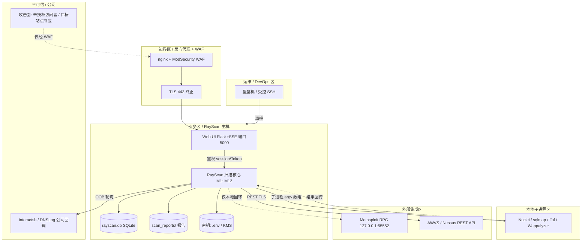

# AICoding 架构设计 · 安全设计（RayScan / WVS）

> 本文档为《AICoding 架构设计》核心产物之一，对应**安全架构设计模版**，是 RayScan（Python 异步 Web 漏洞扫描器，私有化自托管，v2.0.0）的 Phase 5 安全设计。
> 上游输入：《系统设计》（G4 已冻结）、《资料摘要》（G1，含 X3 httpx / X4 DetectionModule / X6 七适配器 / X11 无独立 Auth / X16 waf 默认未声明 等事实）。
> 结论区分声明：全文按「事实 / 设计 / 取舍 / 风险 / 待回填」标注；所有边界继承自 G3 + 系统设计冻结项（多租户=否、O3 独立 Auth 出域、O6 分布式 SaaS 出域）。
> 范围裁剪说明：本系统为**私有化自托管、单租户、单操作员**工具，模板中"云主账号 / 多租户物理隔离 / 公有云 WAF 高防"等按自托管场景重写，未引入云厂商强绑定；保留并适配了 STRIDE、IAM、数据安全、OWASP、密钥、审计、应急等全章节。

---

## 0. 元信息：修订记录

| 文档版本 | 发布日期 | 修订人 | 修订说明 |
| --- | --- | --- | --- |
| v1.0 | 2026-07-12 | 严守正 / security-architect | 基于 G4 系统设计完成 §1~§7 安全设计草案；标注部署侧回填项并发起 Step S 交接 |
| v1.1 | 2026-07-14 | 严守正 / security-architect | Step S 交叉对齐：修正 §5.1 VPC 裁决（单主机网络命名空间，N/A VPC）；回填 §5.3/§5.4/§6（CRED-01~05 映射+轮转）/§7.2（保留期 90/30/7 天）；闭环 §3.3.7 隐私合规（采纳推荐基准 A）；完成 G5 diff 六项自对账并一致（对齐平台侧 R-N/R-Sec/CRED/R-O 命名） |

---

## 1. 安全总体架构

### 1.1 安全总体架构图

> 总览：1 张信任边界图叠加展示——接入层（CLI / Web UI + 反向代理 + WAF）、应用与数据层（RayScan 进程 + SQLite + scan_reports/）、外部集成边界（本地子进程 / REST API / 本地 MSF RPC / 公网 OOB）、密钥与审计平面。下图以 Mermaid 信任边界图表达（运行环境未安装 graphviz/diagrams 二进制，采用 Mermaid 内嵌，等价于 diagrams-generator 产物，可由部署侧渲染为 PNG/SVG）。

**安全组件参考清单（按本方案实际涉及组件说明，未涉及的已删除）**：

| 组件 | 作用 | 本方案落地形态 |
| --- | --- | --- |
| 反向代理 + WAF | 互联网暴露面防护（CC / SQLi / XSS / 路径遍历） | 自托管：nginx + ModSecurity(OWASP CRS)；上云可由平台侧 WAF 替换（权威方：security-architect 定义规则，platform-architect 落地） |
| TLS 终止 | 公网传输加密 | 反向代理 443 终止；httpx 默认 verify_ssl=True |
| 主机防火墙 | 南北向最小开放 | ufw/iptables default-deny；仅开放必要端口 |
| 主机安全 / EDR | 资产梳理、恶意文件、入侵检测 | 自托管可选装；上云接厂商主机安全 |
| 密钥管理 | 凭据 / Token / 外部引擎 Key | MVP：环境变量 / .env(0600)；完整版：KMS / Vault（平台侧选型，安全侧定义分级与轮转） |
| 审计 / 日志 | 操作留痕、不可篡改 | 文件 + 可选 OTel Collector；5 维度审计（§7.2） |
| 堡垒机 | 运维通道管控 | 生产环境经堡垒机访问；纯单机可映射为受控 SSH 密钥登录 |

**信任边界说明**：
- B0（互联网 ↔ 边界区）：唯一允许入站路径，必须经 WAF + TLS；0.0.0.0 监听时强制 RAYSCAN_WEB_SECRET/RAYSCAN_WEB_TOKEN。
- B1（Web UI ↔ 核心）：应用层鉴权（session / X-Api-Token），所有 `/api/*` 除健康检查外强制鉴权。
- B2（核心 ↔ 本地子进程）：以 argv 数组传参，禁止 shell 拼接，防命令注入。
- B3（核心 ↔ MSF RPC）：仅 127.0.0.1 回环，RAYSCAN_ENABLE_EXPLOIT=1 才加载；RPC 无内置鉴权，靠网络隔离 + 防火墙兜底。
- B4（核心 ↔ 外部 REST）：AWVS/Nessus 经 TLS + API Key，Key 入密钥管理，禁止硬编码。
- B5（核心 ↔ 公网 OOB）：interactsh/DNSLog 回调为出站轮询，数据最小化。

### 1.2 威胁模型

> 方法：STRIDE。每条威胁必须对应到 §2~§7 某项缓解措施，形成"威胁—缓解措施映射表"。威胁编号 T1~T28 供后续章节交叉引用。

| 威胁类别（STRIDE） | 编号 | 威胁场景（RayScan 具体） | 映射缓解（章节） |
| --- | --- | --- | --- |
| 仿冒（Spoofing） | T1 | 攻击者伪造 Web UI session / API Token，未授权操控扫描或读取报告 | §2.1 口令+Token 双因子、§5.2 WAF/CSRF、§2.2 接口鉴权 |
| 仿冒（Spoofing） | T2 | 中间人篡改/伪造扫描目标响应（verify_ssl 可被 --insecure 或 profile 关闭） | §3.2.1 默认开启 verify_ssl、关闭时审计告警、§4.1 响应校验 |
| 仿冒（Spoofing） | T3 | .env / 日志泄露外部引擎 AKSK / API Key，伪造成合法引擎调用 | §6.1 密钥分级、§6.3 红线、§7.2 密钥审计 |
| 仿冒（Spoofing） | T4 | 冒用 `--i-have-permission` 对未授权目标发起扫描（法律/滥用风险） | §2.2.4 授权门禁强制 + §7.2 授权操作审计留痕 |
| 篡改（Tampering） | T5 | 篡改 scan_reports/ 报告文件，伪造/掩盖漏洞结论 | §3.3.4 文件权限 0700 + 可选哈希校验、§5.4 文件系统隔离 |
| 篡改（Tampering） | T6 | 篡改 rayscan.db（t_vulnerability / t_scan_task）污染结果 | §3.3.3 文件权限 0600、§4.1 参数化查询防 SQLi、§5.4 |
| 篡改（Tampering） | T7 | 篡改 Nuclei PoC 模板 / profiles YAML 注入恶意载荷 | §4.4 PoC 源完整性校验 + 钉固版本、§3.3.1 配置签名 |
| 篡改（Tampering） | T8 | 篡改 .env / 启动参数关闭安全控制（关 auth、关 verify_ssl） | §5.3 配置完整性、§2.1 0.0.0.0 强制鉴权不可关闭 |
| 否认（Repudiation） | T9 | 无审计轨迹，无法证明扫描经授权、由谁发起 | §7.2 业务操作审计（授权标志 + 操作者 + 目标 + 时间） |
| 否认（Repudiation） | T10 | 外部引擎动作（MSF exploit / sqlmap）未记录，无法归因 | §7.1 引擎调用监控、§7.2 引擎操作审计 |
| 否认（Repudiation） | T11 | Web UI 共享 Token 下操作无法归属到具体运维 | §2.1 每操作员独立 Token、§7.2 操作者字段 |
| 信息泄露（Info Disclosure） | T12 | scan_reports/ 含目标漏洞详情与可能 PII，因权限过宽泄露 | §3.1 L3/L4 分级、§3.3.4 文件权限、§3.3.5 导出管控 |
| 信息泄露（Info Disclosure） | T13 | --auth 文件 / 外部引擎 Key / 操作员口令经日志、错误栈、URL 泄露 | §3.2.5 传参禁忌、§4.2 统一异常、§6.3 红线 |
| 信息泄露（Info Disclosure） | T14 | rayscan.db 含目标数据，文件被拷贝致泄露 | §3.3.1 落盘加密（AES-256 / SQLCipher）、§5.4 文件权限 |
| 信息泄露（Info Disclosure） | T15 | 生产错误暴露堆栈 / 内部路径 / 源码结构 | §4.2.1 统一异常处理、§4.2.2 禁用调试信息 |
| 信息泄露（Info Disclosure） | T16 | OOB 回调数据泄露目标交互痕迹 | §3.2.1 OOB 通道 TLS、§3.3.5 数据最小化 |
| 拒绝服务（DoS） | T17 | 经 Web UI 高频发起扫描致主机资源耗尽 | §3.5.3 并发上限（单操作员 1 并发）、§5.2 限流、§4.3.2 防刷 |
| 拒绝服务（DoS） | T18 | 滥用 SSRF 检测模块或爬取指向第三方造成反射 DoS | §4.1 SSRF 内网 IP 黑名单、§2.2.4 授权门禁、§3.5.3 限速 |
| 拒绝服务（DoS） | T19 | 暴力破解 Web UI Token / 口令 | §2.1 失败锁定 + §5.2 限流、§4.3.2 防刷 |
| 拒绝服务（DoS） | T20 | 超大爬取（crawl_max_urls）撑满 scan_reports/ 磁盘 | §3.3.6 配额 + 磁盘监控、§3.5.3 上限约束 |
| 权限提升（EoP） | T21 | 检测模块 / PoC 模板执行任意命令致主机 RCE | §4.1 命令注入防护、§4.4 YAML safe_load、§5.3 子进程沙箱 |
| 权限提升（EoP） | T22 | MSF RPC（127.0.0.1:55552 无鉴权）若被暴露致主机 RCE | §5.1 仅回环绑定、§5.2 防火墙封 55552 入站、§2.2.4 加载门禁 |
| 权限提升（EoP） | T23 | LFI / 路径遍历模块写出 scan_reports 之外 | §4.1 路径校验、§5.3 目录 jail、§5.4 |
| 权限提升（EoP） | T24 | Docker 以特权/root 运行致容器逃逸 | §5.3 非 root、非特权、只读 FS、不暴露端口 |
| 权限提升（EoP） | T25 | 水平越权：/api/export?task_id= 越权访问他人任务（防御未来多操作员） | §2.2.4 IDOR 归属校验、§2.2.2 数据级鉴权 |
| 权限提升（EoP） | T26 | 反序列化：profiles / poc_sources YAML 加载致 RCE | §4.4 强制 yaml.safe_load、§4.1 反序列化防护 |
| 权限提升（EoP） | T27 | 垂直越权：非 admin 调用 stop/export/config 变更 | §2.2.1 RBAC0 admin-only、§2.2.4 垂直越权拦截 |
| 权限提升（EoP） | T28 | Web UI 反序列化 / 模板注入（Jinja2）致 RCE | §4.1 XSS/注入防护、§4.2 输出编码、§5.3 依赖固定 |

**威胁—缓解措施映射表（汇总，对应上表"映射缓解"章节）**：

| STRIDE 类别 | 涉及威胁 | 主缓解章节 |
| --- | --- | --- |
| 仿冒 | T1~T4 | §2.1、§2.2、§3.2、§5.2 |
| 篡改 | T5~T8 | §3.3、§4.1、§4.4、§5.4 |
| 否认 | T9~T11 | §7.1、§7.2 |
| 信息泄露 | T12~T16 | §3.1、§3.2、§3.3、§4.2、§6.3 |
| 拒绝服务 | T17~T20 | §3.5.3、§4.3.2、§5.2、§5.3 |
| 权限提升 | T21~T28 | §4.1、§4.4、§2.2、§5.1、§5.3 |

---

## 2. 身份与访问管理（IAM）

### 2.1 身份认证（Authentication）

#### 2.1.1 用户登录与认证方式

RayScan 为私有化自托管、单操作员工具，认证方式按接入形态区分，满足"认证方式 ≥ 2 种"：

- **方式一 · 口令（密码）**：Web UI 操作员口令 `RAYSCAN_WEB_SECRET`，服务端以 argon2id 加盐哈希存储/比对（设计项，见 T1 缓解）；登录态经 Flask 签名 session 维持。
- **方式二 · API Token**：`RAYSCAN_WEB_TOKEN`，经 `X-Api-Token` 请求头传递，服务端以 SHA-256 摘要比对，可独立颁发/吊销、设有效期。
- **CLI**：不登录（本地运维信任），受操作系统账户与文件权限约束；发起扫描须携带 `--i-have-permission` 授权门禁（T4）。
- **增强建议（完整版，O3 出域但安全侧推荐）**：对 0.0.0.0 暴露场景的高敏操作（导出 / 停止 / 配置变更）启用 **MFA / 2FA** 二次验证（TOTP 或硬件令牌），弥补 MVP 最小鉴权短板。

> 绑定约束（冻结项）：Web UI 监听 `0.0.0.0` 时**强制启用** `RAYSCAN_WEB_SECRET` / `RAYSCAN_WEB_TOKEN` 鉴权；监听 `127.0.0.1` 默认仍建议开启。该强制逻辑不可经配置关闭（T8 缓解）。

#### 2.1.2 密码策略（量化阈值）

| 项 | 基线值（RayScan 落地） |
| --- | --- |
| 最小长度 | ≥ 12 位（RAYSCAN_WEB_SECRET 作为操作员口令） |
| 复杂度 | 建议同时含数字、大写、小写、特殊字符（可配置开关） |
| 加密传输 | Web UI 前置 TLS（反向代理 443 终止），口令不在 URL 中传递 |
| 加密存储 | argon2id / bcrypt 加盐哈希；**禁止明文 / MD5 / SHA1** |
| 更换周期 | API Token 默认 90 天可轮换，建议 90 天提醒 |
| 重复限制 | 吊销后旧 Token 立即使失效 |
| 失败锁定 | 连续失败 5 次锁定 15 分钟（次数和时长可配置） |
| 自动登出 | session 空闲 30 分钟失效 |
| 注册策略 | 无公开注册；操作员由部署者通过环境变量 / 配置文件设置 |

#### 2.1.3 会话管理

- **Token 类型**：Flask 签名 session（cookie）或 API Token；**禁止 URL 携带 token / secret**（T13 缓解）。
- **有效期**：session 默认 24 小时（可配置），提供续期与主动注销接口；API Token 默认 90 天。
- **互踢机制**：单操作员模型下，新会话可使旧会话失效（可选开关）；异地 / 异常 IP 登录触发二次验证（MFA）。
- **风险登录**：异地 / 非常用 IP / 高频失败，按 §5.2 限流 + §7.1 告警。

### 2.2 授权与权限控制（Authorization）

#### 2.2.1 权限模型

默认采用 **RBAC0**（用户—角色—权限），本系统 MVP 为单操作员，角色固定为 `admin`；高敏操作（导出 / 停止 / 配置变更 / 密钥读取）叠加 **ABAC** 属性条件（如目标域名白名单、导出审批标记）。

#### 2.2.2 权限维度

- **接口级**：所有 `/api/*` 除健康检查外统一经 `RAYSCAN_WEB_SECRET`/`RAYSCAN_WEB_TOKEN` 鉴权；Web UI 侧建议接口签名（HMAC-SHA256 + nonce + timestamp，防重放，见 §3.2.4）。
- **数据级**：任务数据归属 `tenant_id='single'`；即便单操作员，仍对所有 `task_id` 做归属校验（owner = single），防御未来多操作员 IDOR（T25）。
- **功能级**：scan / stop / export / profile 变更均限 `admin`；垂直越权由 RBAC + 接口拦截器双层校验（T27）。

#### 2.2.3 多租户隔离

- **结论**：本系统多租户=否（O6 出域），`tenant_id` 固定 `'single'`，**无需跨租户物理/逻辑隔离**。
- **实际隔离**：进程内单操作员模型，资源归属 `single`；若未来演进多操作员，按逻辑隔离（行级 owner 校验）起步，物理隔离仅在上云多租户时引入。

#### 2.2.4 越权防护

- **水平越权（IDOR）**：每个查询 / 修改接口（尤其 `/api/export`、`/api/history`、`/api/stop`）必须校验 `task_id` 归属 `single` 操作员（T25）。
- **垂直越权**：RBAC0 `admin`-only 拦截 stop / export / profile 写操作；非 admin 调用返回 `C403001`（T27）。
- **授权门禁**：`--i-have-permission` 为扫描前置硬开关，未通过返回 `A010001` 拒绝（T4）；门禁结果写入审计（§7.2）。

### 2.3 云账号与云资源访问（自托管适配）

- 本系统为私有化自托管，**无云主账号**；如部署于云主机，遵循"禁止直接使用云主账号、禁止为主账号创建访问密钥"原则，仅用受限子账号 / 实例角色。
- **人员权限与服务权限分离**：运维经堡垒机 / SSH 密钥访问主机（人员权限）；应用调用外部引擎使用 API Key / Token（服务权限），二者分离，Key 入密钥管理（§6）。
- **高敏权限分离**：密钥读取 / 配置变更与日常扫描操作分离；高敏操作建议 MFA（§2.1.1）。

---

## 3. 数据安全

### 3.1 数据分级

| 等级 | 类别 | 示例（RayScan 具体） | 处理策略 |
| --- | --- | --- | --- |
| L1 | 公开 | README、公开文档、扫描报告模板、Nuclei 公开 PoC 模板、开放 API 文档 | 无特殊管控 |
| L2 | 内部 | 扫描 Profile（default/src-quick 等）、模块运行元数据、内部运行日志、构建产物 | 需本地鉴权访问，文件权限约束 |
| L3 | 敏感 | 扫描目标 URL、扫描任务元数据、漏洞发现（按目标归类）、OOB 事件、外部引擎结果（含目标响应体） | 加密传输、加密存储 / 严格文件权限、必要审计 |
| L4 | 高敏 | --auth 文件中的目标认证凭据（bearer/basic/apikey/cookie）、操作员 Web UI 口令 / Token、外部引擎 AKSK / API Key、含凭据或 PII 的扫描报告、从目标爬取的 PII | 基于 KMS / 文件加密、强脱敏、严格审计、最短保留 |

### 3.2 数据传输安全

#### 3.2.1 公网访问

- Web UI 暴露面：经反向代理 **TLS 1.2+** 终止（禁用 SSLv3 / TLS 1.0 / 1.1）；httpx 出站默认 `verify_ssl=True`。
- **风险点（设计事实）**：`--insecure`、以及 `src-quick` / `pentest-full` Profile 的 `verify_ssl=false` 会关闭证书校验（T2）。处置：关闭时必须在审计日志告警，并在报告元信息标注"SSL 校验已关闭"；默认档（default）保持 `verify_ssl=true`；建议将 `verify_ssl=false` 仅限显式授权靶机场景。

#### 3.2.2 服务内部访问

- 进程内模块调用为内存消息，无网络传输；外部引擎：
  - 本地子进程（Nuclei/sqlmap/ffuf）：argv 数组传参，无明文敏感传输。
  - REST（AWVS/Nessus）：强制 HTTPS + API Key。
  - MSF RPC：仅 127.0.0.1 回环（见 §5.1）。
- 高敏跨进程场景（如未来多节点）：采用 mTLS 双向证书（当前单进程不适用）。

#### 3.2.3 数据库连接

- SQLite 为单文件嵌入式，无网络传输；MVP 经文件权限（0600）管控。
- 完整版若演进 PostgreSQL：启用 SSL 连接 + 数据库账号最小权限（§3.3.3）。

#### 3.2.4 接口签名

Web UI API 建议采用 **HMAC-SHA256 防篡改 + nonce + timestamp 防重放**：
- `sign = HMAC-SHA256(secret, method+path+body+timestamp+nonce)`；服务端校验 timestamp 窗口（±5min）与 nonce 一次性，拒绝重放（T1 缓解）。
- CLI 内部调用无需签名（同进程信任）。

#### 3.2.5 传参禁忌

- **禁止 URL 携带 token / AKSK / 口令 / 目标凭据**：`RAYSCAN_WEB_TOKEN` 经 `X-Api-Token` 头传递；`RAYSCAN_WEB_SECRET` 经登录体 / session；`--auth` 文件经本地路径读取，不入命令行参数（避免 `ps` 泄露），不入 URL（T13）。
- 错误响应不透出 secret / key（§4.2）。

### 3.3 数据存储安全

#### 3.3.1 加密存储（仅敏感 / 高敏数据需要）

- **对称加密**：scan_reports/ 与 rayscan.db 中 L4 字段（目标凭据、外部引擎 Key）采用 **AES-256**；完整版可对 SQLite 启用 SQLCipher 客户端加密（T14）。
- **非对称加密**：外部引擎 Key 的封包 / 签名可用 RSA。
- **落盘加密**：主机卷启用文件系统加密（LUKS / 云盘加密）；高敏数据客户端加密优先。
- **密钥管理**：KMS / Vault 托管，**禁止硬编码到代码或配置文件**（§6）。

#### 3.3.2 敏感字段单向哈希加盐

- 操作员口令、API Token 摘要：argon2id / bcrypt 加盐哈希（不可逆）。
- Token 比对使用恒定时间比较，防时序侧信道。

#### 3.3.3 数据库安全

- 账号最小权限；SQLite 文件属主为专用运行账户，**权限 0600**，禁止其他用户读取（T6/T14）。
- 开启应用层审计（§7.2 数据库维度）；备份加密（§3.3.6）。
- 强制参数化查询（aiosqlite 参数绑定），杜绝 SQL 注入篡改（T6）。

#### 3.3.4 文件存储安全

- scan_reports/ 目录权限 **0700**，报告文件名用 `task_id`（UUID）随机化，禁止目录列表。
- Web UI 经鉴权接口流式返回报告，**不**将 scan_reports/ 作为静态目录直接暴露（T12/T23）。
- 报告写入做可选哈希校验防篡改（T5）；上传/导入的 Profile / auth 文件做类型与魔数校验。

#### 3.3.5 数据使用安全

- **展示脱敏**：Web UI / 导出中，目标认证凭据（bearer/basic/apikey/cookie）一律掩码（如 `bea********ken`）；从目标爬取的 PII 按 L4 处理。
- **数据导出管控**：导出（/api/export）须鉴权 + 审计；建议导出带水印（操作员 + 时间）+ 行数限制；高敏报告导出须经 admin 确认。
- **数据销毁**：按 §4.3.2 保留期清理（报告 180d、引擎结果 30d、OOB 7d）；到期逻辑删除 + 定期物理销毁；明确过期数据清理策略。

#### 3.3.6 数据备份与异地容灾

| 存储类型 | 备份策略（继承自系统设计 §4.3.2） |
| --- | --- |
| SQLite（rayscan.db） | 全量每日 + 增量按需，归档至隔离备份卷；备份文件加密 |
| 文件系统（scan_reports/） | 随扫描产出，备份卷与生产者物理隔离 |
| 外部二进制（Nuclei/sqlmap/ffuf） | 钉固版本，镜像内置，无需业务备份 |
| OOB 服务器 | 无状态，不备份 |

- **RPO ≤ 15 分钟，RTO ≤ 30 分钟**（与系统设计 §4.3.2 自洽）；恢复演练频率半年，负责人 @运维。
- 自托管无跨地域复制，备份卷与运行主机物理隔离即可。

#### 3.3.7 隐私合规（采用推荐基准 A，G2 默认通过，待 G5 人工终审）

> 本系统扫描目标站点，报告与数据库可能包含目标站点的个人信息（PII，如邮箱 / 账号 / Cookie）。操作员自身不采集终端用户 PII（无注册、单操作员）。本项原已发起 [中间确认]；依 G2「默认全部通过」及主理人 Step S 裁决精神，**采用推荐基准 A 作为冻结基线**，G5 人工审核可最终覆盖。

- **基准 A（已采用）**：适用《个人信息保护法》《数据安全法》原则于"被扫描数据"的处理——数据最小化采集、加密存储、限定保留期、支持数据删除请求（按目标所有者请求删除对应报告/记录）；**GDPR 仅在部署于欧盟处理欧盟数据主体时适用**。
- 用户同意机制：扫描前 `--i-have-permission` 视为操作员对"已获目标授权"的明示确认；报告含免责声明。
- 数据出境：自托管数据不出网（系统设计 Q3）；若未来上云跨地域，需做数据出境合规评估。

---

## 4. 应用安全

### 4.1 输入安全（OWASP Top 10 具体防护）

| 风险 | 具体防护措施（RayScan 落地，非泛化） |
| --- | --- |
| SQL 注入 | 全量使用 aiosqlite 参数化查询 / ORM 参数绑定；动态字段（order by / 动态表名）走白名单枚举，禁止字符串拼接（T6） |
| XSS | Web UI 采用 Jinja2 自动转义；所有用户/目标数据渲染经 HTML / JS / URL 编码；设置 CSP（`default-src 'self'`）；Cookie `HttpOnly` + `Secure` + `SameSite` |
| CSRF | 状态变更接口（POST /api/scan、/api/stop、/api/export）要求 CSRF Token 或 API Token 豁免；`SameSite=Lax` cookie；关键操作二次验证（T1） |
| 命令注入 | 外部引擎（Nuclei/sqlmap/ffuf）一律以 **argv 数组**经 `subprocess` 调用，禁止 `shell=True` 与字符串拼接；payload 作为参数值传递，不拼入命令（T21） |
| 反序列化 | profiles / poc_sources YAML **强制 `yaml.safe_load`**；禁止 `yaml.load` 不加 `SafeLoader`；Python 对象反序列化仅限可信模型类（T26） |
| SSRF | 扫描目标若为内网/元数据地址（169.254.169.254、10/172/192.168 段）默认告警并限制；SSRF 检测模块本身仅对授权目标发请求；出网经白名单（T18） |
| 文件上传 | 导入的 Profile / auth 文件做扩展名白名单 + 魔数校验 + 大小限制；随机重命名；隔离读取，不落地可执行（T5/T23） |
| XXE | 解析目标/引擎 XML 响应时关闭外部实体（禁用 DTD / `resolve_entities=False`）；使用 `defusedxml` 或显式禁用实体展开 |
| 开放重定向 | Web UI 无外部跳转入口；若未来引入跳转，URL 走白名单域名校验 |
| 越权（IDOR/垂直） | 见 §2.2.4：task_id 归属校验 + RBAC0 admin-only 拦截（T25/T27） |

### 4.2 输出安全

#### 4.2.1 统一异常处理

- 统一错误结构（6 位错误码，如 `C401001` 未授权 / `C403001` 无权限 / `C429001` 限流），**禁止暴露堆栈、SQL、内部路径、密钥**（T15）。
- 生产环境 `DEBUG=False`；异常经日志脱敏后返回用户态文案。

#### 4.2.2 调试信息

- 调试信息（debug、stacktrace、内部变量）严禁出现在生产响应；仅写入受控日志（权限 0600），且经脱敏（T13）。

### 4.3 业务逻辑安全

#### 4.3.1 越权防护

- 水平越权：每个接口必检 `task_id` 归属（§2.2.4）；垂直越权：RBAC + 接口拦截器双层（T25/T27）。

#### 4.3.2 防刷防爬

- 限流三维度（IP / 操作员 / 接口）：Web UI 登录失败限流 + 扫描创建限流；详见 §3.5.3 与 §5.2。
- 单操作员并发扫描上限 1；`max_time` 超时抢救防资源占用（T17）。

#### 4.3.3 防薅羊毛

- 本系统非营销场景，主要风险为资源滥用；以并发上限 + 限流 + 授权门禁兜底（T17/T18）。

#### 4.3.4 幂等性

- 扫描创建带 `X-Idempotency-Key`（biz_req_no），SQLite `uk_tenant_biz` 唯一索引兜底，重复提交返回原 task_id（继承系统设计 §3.5.2）。

#### 4.3.5 关键业务二次验证

- 停止扫描、报告导出、Profile/配置变更、密钥读取：admin 权限 + 建议 MFA（§2.1.1）；导出带审计与水印。

### 4.4 第三方与供应链安全

- **依赖漏洞扫描**：修复 X3（httpx 未入核心依赖）→ 将 `httpx` 列入 `pyproject` 核心依赖并钉固 `0.27.x`；CI 强制 `pip-audit` / `ruff` 门禁。
- **开源协议合规**：MIT 主许可；Nuclei/sqlmap/ffuf 等第三方为独立进程调用，协议风险隔离；AWVS/Nessus 商用引擎需用户自持许可。
- **PoC 源完整性**：`config/poc_sources.yaml` 中 Nuclei 模板启用 `auto_update` 存在投毒风险 → 改为**钉固版本 + 校验和（SHA-256）校验**后才加载（T7）；禁止运行时无校验拉取远程模板。
- **镜像 / 包源**：使用内网 / 官方镜像源 + 白名单，避免依赖投毒；Docker 镜像不含密钥（§5.3）。
- **供应商管理**：AWVS/Nessus 等外部引擎接入评估其数据传输与合规资质，API Key 入密钥管理。

---

## 5. 网络与基础设施安全

> 本节已按 Step S 与平台侧对齐：§5.1 网络分区采用**单主机网络命名空间（N/A VPC，主理人裁决）**；§5.2 流量管控为安全侧权威；§5.3 / §5.4 主机·容器·中间件安全与平台侧 R-C / R-M / R-Sec 命名对齐。

### 5.1 网络分区

> 网络骨架裁决（G3 + 主理人 Step S 裁决）：RayScan 为私有化·自托管·单节点·单 AZ，**不定义 VPC / 子网 / CIDR**，采用**单主机网络命名空间**（平台侧 R-N-001 `host-net`）。若用户后续选择云 CVM 托管，VPC 由 CloudQ 标记「待人工确认」回填，不在此默认。本安全设计与部署侧 §3.1 / §11 G5 diff 一致：双方均声明 **N/A VPC**。

- **信任域划分**（逻辑分区，适配单主机自托管）：
  - **边界区（DMZ）**：仅当 Web UI 需经网络暴露时存在，放反向代理 + WAF（nginx + ModSecurity，平台 R-Sec-003 `waf-mod`），默认 Web UI 绑定 `127.0.0.1:5000`（回环）；暴露 `0.0.0.0` 时强制 `RAYSCAN_WEB_SECRET`/`RAYSCAN_WEB_TOKEN` 鉴权。
  - **业务区**：单主机内 RayScan 进程 + SQLite（`rayscan.db`）+ `scan_reports/`；无独立子网，靠主机防火墙（平台 R-Sec-002 `host-fw`）与文件权限分区。
  - **运维 / DevOps 区**：构建 CI、堡垒机 / 受控 SSH；与业务区隔离，仅经受控通道访问（22 限堡垒机源）。
  - **外部集成区**：AWVS/Nessus（REST，可跨网络）、MSF RPC（**仅 127.0.0.1:55552 回环**，禁止入站，平台 R-C-001 本地进程）、interactsh/DNSLog（公网出站轮询）。
- **网络骨架（VPC / 子网 / CIDR）**：
  - **N/A（单主机网络命名空间）**：无 VPC、无子网、无 CIDR 划分。主机经回环（`127.0.0.1`）+ 主机防火墙（ufw/iptables，R-Sec-002）隔离；暴露公网时经 nginx 反向代理（`R-N-002` `rev-proxy`）443 TLS 终结后转发本机 `5000`。
  - 出网策略（R-N-003 `egress-policy`）：仅允许向已授权目标站点、OOB 服务器（interactsh/DNSLog）、可选外部引擎（AWVS/Nessus）出网；入站仅经反向代理 443。
- **出网约束**：业务区通常仅经主机出网策略出公网（OOB 轮询、外部引擎 REST）；入站仅经反向代理 443（若暴露）。

### 5.2 流量管控（南北向 + 东西向，安全侧权威）

#### 5.2.1 公网入口防护（WAF 权威：security-architect 定义规则，platform-architect 落地）

- **WAF（推荐 nginx + ModSecurity + OWASP CRS）**：规则覆盖 SQLi / XSS / 路径遍历 / 异常 UA / 超大请求体；CC 防护（按 IP 限频）；攻击日志记录（§7.2 WAF 维度）。
- **TLS / 端口**：反向代理仅暴露 443（HTTPS），80 强制 301 跳 443；Web UI Flask 端口 5000 不直连公网，仅监听内网 / 回环。
- **DDoS**：上云场景接云 DDoS 高防；自托管场景以主机限流 + 连接数上限 + 单操作员并发 1 兜底（T17）。

#### 5.2.2 网络边界防护

- **主机防火墙（ufw / iptables / 云安全组）**：default-deny；仅放通 443（反向代理）、22（运维，限堡垒机源）、5000（仅内网）；MSF RPC 55552 **禁止任何入站**。
- **入侵防御**：可选启用主机入侵检测（HIDS）。

#### 5.2.3 主机流量防护

- 安全组 + ACL：默认拒绝 + 显式放通；**禁止 0.0.0.0/0 开放 22/3306/6379/55552 等敏感端口**（T22：55552 仅 localhost）。

#### 5.2.4 运维通道防护

- 堡垒机：生产环境运维日志、文件传输日志全量记录（§7.2 堡垒机维度）；纯单机映射为受控 SSH 密钥登录 + sudo 审计。

### 5.3 主机与容器安全（与平台侧 R-C / R-Sec 对齐）

#### 5.3.1 主机安全

- 最小化安装、关闭非必要服务、定期补丁；账号管控：**严禁 root 远程登录**，运维用独立账户 + SSH 密钥（平台 R-Sec-002 `host-fw` 限制 22 仅堡垒机源）。
- 安装主机安全组件（上云接厂商 EDR / CWP，平台 R-Sec-005 可选；自托管可选装开源 HIDS）。
- 配置完整性：`.env` / 启动参数（`RAYSCAN_WEB_SECRET`/`RAYSCAN_WEB_TOKEN`/`RAYSCAN_ENABLE_EXPLOIT`）变更纳入审计，防止经配置关闭安全控制（T8）；`0.0.0.0` 监听强鉴权逻辑不可经配置关闭（§2.1.1）。
- 进程守护：以专用低权账户运行 RayScan 进程（平台 R-C-001），systemd / nohup 守护；进程退出即重启并触发 AL-01。

#### 5.3.2 容器 / Docker 安全（Docker client-only，平台 R-C-004 / docker-compose）

- **非 root 运行**：镜像内建非 root 用户；`docker run` 不加 `--privileged`；`--read-only` 根文件系统；`--cap-drop=ALL`。
- **不暴露端口**：docker-compose 默认不暴露端口（client-only），仅 `scan` 子命令；`scan_reports/` 经卷挂载（平台 R-S-002）。
- **密钥不在镜像**：密钥经环境变量 / 挂载卷（0600，平台 R-Sec-004 `cred-store`）注入，镜像内不含任何凭据（T3/T13）。
- 镜像扫描：CI 对镜像做漏洞 + 敏感信息扫描（trivy，平台 §4.2 阶段 3）；基础镜像钉固 `python:3.11-slim`。

### 5.4 中间件与本地存储安全（与平台侧 R-M / R-Sec 对齐）

#### 5.4.1 网络隔离

- SQLite / 文件系统为本地单文件，无网络暴露；仅业务进程（专用运行账户）可访问（文件权限 0600/0700，平台 R-S-001 / R-S-002）。
- 外部引擎（AWVS/Nessus）经 REST 调用，仅出网至其地址（受 R-N-003 出网策略约束），入站不开放。
- MSF RPC（127.0.0.1:55552）仅本地回环，主机防火墙 R-Sec-002 禁止 55552 任何入站（T22）。

#### 5.4.2 强制鉴权

- 外部引擎 API Key 强制鉴权（平台 CRED-02，T3）；MSF RPC 靠网络隔离 + 防火墙（无内置鉴权，见 T22）。
- SQLite 无口令，以文件权限 + 运行账户隔离替代；备份卷与运行主机物理隔离（§3.3.6）。

#### 5.4.3 审计

- 关键文件访问 / 外部引擎调用接入审计（§7.2 数据库 / 业务维度）；外部二进制可用性纳入 AL-03 监控（平台 §5.3）。

---

## 6. 密钥与凭证管理

> 本节定义密钥**分级 / 轮转 / 访问策略**（安全侧权威）；KMS / Vault **选型与基础部署**由 platform-architect 负责，实例命名见平台侧 R-Sec-004（已与 §8 对齐）。

### 6.1 密钥分级与存储

| 密钥类型（5 类） | 示例 | 存储 / 管理方式 |
| --- | --- | --- |
| 数据库密码 | SQLite 文件访问凭据（运行账户）；完整版 PostgreSQL 口令 | MVP：文件权限 0600 + 专用账户；完整版：KMS / Vault 动态获取 |
| 云 AKSK / 外部引擎 Key | AWVS / Nessus API Key、云凭证（若有） | KMS 白盒 / Vault；禁止硬编码；按环境隔离 |
| 服务间通信密钥 | RAYSCAN_WEB_SECRET（会话口令）、RAYSCAN_WEB_TOKEN（API Token）、MSF RPC 令牌（若有） | 环境变量 / .env(0600)；完整版入 Vault；可撤销、设有效期 |
| 用户密码 | 操作员 Web UI 口令、--auth 文件中目标认证凭据（bearer/basic/apikey/cookie） | 操作员口令 argon2id 哈希；目标凭据 AES-256 加密存储，L4 |
| API Key / Token | 外部引擎 API Key、RAYSCAN_WEB_TOKEN | 分级授权、可撤销、有限期（默认 90 天） |

#### 6.1.1 与部署侧凭证编号（CRED-01~05）映射（安全侧权威）

> 平台侧 §7.2 定义了 CRED-01~05 五类凭证；本侧 §6.1 五类密钥分级与其一一对齐，轮转与访问策略由安全侧定义、部署侧按此落地（G5 diff 一致）。

| 本侧密钥分类 | 部署侧凭证编号（R-Sec-004 `cred-store`） | 轮转周期（安全侧权威） | 访问策略 |
| --- | --- | --- | --- |
| 服务间通信密钥（RAYSCAN_WEB_SECRET / RAYSCAN_WEB_TOKEN） | CRED-01 | Token 90 天，口令建议 90 天提醒 | `.env`(0600) / 环境变量；0.0.0.0 强制启用；可独立吊销 |
| 云 AKSK / 外部引擎 Key（AWVS / Nessus API Key） | CRED-02 | 90 天或按厂商；泄露即轮换 | 环境变量注入，禁止硬编码；按环境隔离 |
| 服务间通信密钥（MSF RPC 密码，127.0.0.1:55552） | CRED-03 | 随部署变更，建议 90 天 | `.env`；仅本机进程使用；防火墙禁入站 |
| 云 AKSK / 外部引擎 Key（OOB 服务器 Token，自建时） | CRED-04 | 90 天 | `.env`；仅 OOB 客户端使用 |
| 用户密码（--auth 目标认证 bearer/basic/apikey/cookie） | CRED-05 | 用户侧自持，不入库存明文 | 本地 `--auth` JSON 文件（用户侧），AES-256 加密后处理，不落库明文 |

- 数据库密码（SQLite 运行账户）以文件权限 0600 + 专用账户承载（MVP），归入"服务间/存储凭据"类，完整版由 KMS / Vault 动态获取。
- 所有 Key 明确所有人、用途、存储位置、轮换日期；上线 checklist 含"密钥扫描通过"项（§6.3）。

### 6.2 AKSK 泄露防护

#### 6.2.1 方案 A：KMS 白盒密钥（完整版推荐）

外部引擎 SecretId / SecretKey 经 KMS 白盒加密，业务模块经 KMS SDK 解密拿明文再调用；完整版由部署侧 KMS 提供，安全侧定义分级与轮转。

#### 6.2.2 方案 B：Vault / 配置中心（自托管可选）

MVP 以 `.env`（权限 0600）+ 专用运行账户承载；完整版建议 HashiCorp Vault 动态凭据，避免长期静态 Key。

### 6.3 密钥使用红线

- **严禁** AKSK / 数据库密码 / Token 出现在源码、Git 仓库、前端代码、日志、错误堆栈、URL、配置明文（T3/T13）。
- **禁止**多业务共用同一对 Key；按业务 / 环境隔离签发。
- 上线前必须通过代码扫描（CI 红线拦截）+ 镜像扫描识别硬编码密钥；修复 X3 同时确保 httpx 等依赖无密钥泄露。
- AKSK / Token 一旦疑似泄露，立即吊销并轮换；事后排查访问日志确认影响面。
- 每一对 Key 明确所有人、用途、存储位置、轮换日期；上线 checklist 含"密钥扫描通过"项。

---

## 7. 运行时安全：监控、审计、应急

### 7.1 安全事件监控

- **入侵检测（IDS / HIDS）**：主机安全告警、WAF 攻击日志、异常进程监控接入（T21/T24）。
- **敏感操作**：报告导出、批量删除、密钥读取 / 变更、Profile / 配置变更、MSF 验证链触发（T10/T11）。
- **登录异常**：异地登录、连续失败、夜间非常用设备、Token 暴力（T19）。
- **权限异常**：越权请求（IDOR/垂直）、高敏接口高频调用、非常规权限提升（T25/T27）。
- **引擎调用监控**：Nuclei/sqlmap/ffuf/MSF 的调用参数与结果落审计，便于归因（T10）。

### 7.2 审计日志（5 维度，安全侧权威）

> 日志统一含 `traceId` + `tenant_id='single'`（继承系统设计 §1.3）。以下 5 维度均须覆盖；自托管场景"云资源 / 堡垒机"映射为主机资源 / 受控 SSH 审计。

| 维度 | 记录字段（RayScan 落地） |
| --- | --- |
| 云资源审计 | 部署于云时：实例启停 / 安全组变更 / IAM 操作（事件名、区域、时间、操作者、源 IP）；纯物理机映射为主机资源操作审计 |
| 业务操作审计 | 操作时间、来源应用、来源类型、来源 IP、操作者（操作员/Token 标识）、事件名（scan/stop/export/profile 变更）、授权标志 i-have-permission、读写类型、扩展字段（task_id / target_url） |
| 数据库审计 | 应用层记录：SQL 概要、执行人（操作员）、客户端 IP、时间、影响行数（SQL 由参数化执行，记录意图而非原文防泄露） |
| 堡垒机日志 | 主机 / 数据库运维日志、文件传输日志（生产环境经堡垒机；单机映射 sudo / SSH 审计） |
| WAF / 防火墙日志 | 攻击日志、访问日志、拦截记录（nginx + ModSecurity 事件：规则 ID、客户端 IP、URI、动作） |

- **保留期（安全侧权威，与部署侧 §7.3 / R-O-002 对齐；满足「部署侧保留期 ≥ 安全侧」）**：
  - 业务操作审计（含授权扫描 i-have-permission 门禁、Web UI 登录、API 调用、高敏操作：导出 / 停止 / 配置变更 / 密钥读取）：**≥ 90 天**（合规审计，不可篡改）。
  - WAF / 防火墙日志（nginx + ModSecurity 事件）：**≥ 90 天**。
  - 数据库审计（应用层 SQL 意图记录）：**≥ 90 天**。
  - 云资源 / 堡垒机日志（云场景）/ 单机 SSH·sudo 审计：**≥ 90 天**。
  - 一般系统操作审计（扫描启停 / 配置变更类，非高敏）：落入应用日志档 **≥ 30 天**。
  - OOB 事件（t_oob_event）：**≥ 7 天**（临时性强）。
  - 日志文件权限 0600，定期归档加密；部署侧 R-O-002 提供 应用 30 天 / 审计 90 天 / OOB 7 天，满足本侧下限。
- **不可篡改**：日志写仅追加（append-only），归档后哈希校验；禁止应用进程改写历史日志。

### 7.3 应急响应（5 类事件预案）

| 事件类型 | 应急预案（Runbook 要点） |
| --- | --- |
| 漏洞（RayScan 自身漏洞） | 接收 CVE / 内部发现 → 评估影响（SQLi/XSS/RCE 等）→ 紧急修复 + 版本发布 → 通知用户升级；CI 门禁阻断已知漏洞依赖 |
| 数据泄露（报告 / 数据库泄露） | 定位泄露面（文件权限 / 暴露端口 / 误操作导出）→ 立即收敛（改权限 / 封端口 / 撤销分享）→ 轮换相关密钥 → 评估影响（L3/L4）→ 通知相关方 |
| 被攻击（Web UI / 主机被控） | 隔离受影响主机 / 封禁源 IP → 排查入侵路径（WAF 日志 / 审计）→ 清除后门 → 从备份恢复（RPO≤15min）→ 复盘 |
| 密钥泄露（AKSK / Token 泄露） | 立即在 KMS / Vault / .env 吊销并轮换 → 排查泄露源（日志 / 仓库 / 镜像）→ 失效旧 Token → 加强扫描门禁 |
| 勒索病毒（主机被加密） | 断网隔离 → 确认备份可用性（RTO≤30min）→ 从隔离备份卷恢复 → 重装洁净系统 → 复盘加固（EDR / 补丁） |

- **备份与恢复**：明确 RPO / RTO（§3.3.6）；每年 ≥ 1 次灾备演练（系统设计 §4.3.2 定为半年）。

---

## 8. 附录：部署侧回填项与交接说明（Step S 已对齐）

> 本安全设计与 platform-architect 的重叠项按"重叠区权威方分配表"分工。Step S 两方草稿已交叉对齐，以下项经本版（v1.1）回填 / 裁决后状态如下。G2 已选「默认全部通过」，重叠项均按双方拟默认值冻结一致；H-7 采用推荐基准 A，留 G5 人工终审。

| 编号 | 待回填项 | 权威方 | 安全侧当前定义 / 状态 |
| --- | --- | --- | --- |
| H-1 | VPC / 子网 / CIDR | platform-architect | **已裁决 N/A**：单主机网络命名空间（主理人 Step S 裁决），与平台 §3.1/§11 完全一致，无 VPC/子网/CIDR（§5.1） |
| H-2 | 安全组 / 防火墙规则 | security-architect（规则）/ platform-architect（落地） | 规则 §5.2（default-deny + 白名单）；平台落地 R-Sec-002 `host-fw`，一致 |
| H-3 | KMS / Vault 选型 | platform-architect（选型）/ security-architect（分级） | MVP：`.env`(0600) / 环境变量（R-Sec-004）；分级 §6；完整版 KMS/Vault 待云托管时定 |
| H-4 | 密钥分级与轮转周期（权威） | security-architect | 已定义 §6.1 + §6.1.1，映射 CRED-01~05，平台 §7.2 一致 |
| H-5 | 审计字段与保留期（权威） | security-architect | 已定义 §7.2（5 维度；保留 90/30/7 天），平台 §7.3/R-O-002 一致 |
| H-6 | WAF 厂商 / 规则（权威） | security-architect | 推荐 nginx+ModSecurity(OWASP CRS)，平台 R-Sec-003 `waf-mod`，回环场景 N/A |
| H-7 | 隐私合规框架适用性 | 主理人转用户裁决 | **已采用推荐基准 A**（G2 默认通过），待 G5 人工终审（§3.3.7） |

### 8.1 G5 diff 六项正确自对账（安全侧 vs 部署侧）

> 依据主理人 Step S 要求，对 G5 diff 六项做一致性自对账；结论均为「一致」。

| G5 diff 项 | 安全侧来源章节 | 安全侧定义 | 部署侧来源（§11 或正文） | 一致性结论 |
| --- | --- | --- | --- | --- |
| VPC / 网络骨架 | §5.1 | N/A 单主机网络命名空间（无 VPC/子网/CIDR） | §3.1/§11：单节点主机网络，Web UI 默认 127.0.0.1，暴露时反向代理 443 | **一致**（名称、CIDR 均为 N/A） |
| 安全组 / 主机防火墙 | §5.2.2~5.2.3 | default-deny + 白名单；22 限堡垒机、5000 仅内网、55552 禁入站 | §7.1.4 / R-Sec-002：默认拒绝入站 + 白名单 | **一致** |
| KMS / Vault 名 | §6.2 / §6.3 | MVP `.env`(0600)；完整版 KMS/Vault（选型归部署侧） | §2.2.6 R-Sec-004 / §7.2：`.env` 600 + 环境变量；完整版 Vault/KMS | **一致**（选型归部署侧，分级归安全侧） |
| 密钥分级（权威） | §6.1 / §6.1.1 | 5 类映射 CRED-01~05，轮转 90 天 | §7.2 CRED-01~05 | **一致** |
| 审计字段与保留期（权威） | §7.2 | traceId+tenantId+操作者+时间戳；保留 90/30/7 天 | §7.3 / R-O-002：应用 30 / 审计 90 / OOB 7 天 | **一致**（部署≥安全，无失败） |
| WAF（权威） | §5.2.1 | nginx+ModSecurity(OWASP CRS)，回环 N/A | §3.3.2 / §7.1.5 R-Sec-003：暴露时 nginx+ModSecurity；回环 N/A | **一致** |

---

## 9. 附录：自检报告（§1 / §2 / §3 / §6 反向验证追溯）

> 按中间确认协议 §2.4 节奏，在关键章节完成后做自检（先 §2.1 判定，再 §2.3 反向验证 3 问）。完整证据随回传主理人。

- **§1 自检**：§2.1 未命中方案分歧（STRIDE 为既定方法，威胁映射唯一合理）→ §2.3 反向验证：Q1 推翻成本=仅 §1 表格重填（≤0.5 人月）；Q2 用户不可感知（内部威胁模型）；Q3 用户诉求未显式提及威胁建模方法 → 不发起中间确认，继续。
- **§2 自检**：§2.1 未命中（认证方式由冻结约束确定：CLI 无登录 + Web UI 口令/Token；多租户=否使隔离 N/A）→ §2.3：Q1 重做=§2 整章（≤1 人月）；Q2 用户可感知（登录方式变化）；Q3 与冻结约束一致 → 不发中间确认。
- **§3 自检**：§2.1 **命中**（合规框架 ≥2 方案且用户未显式选定，影响下游数据处理/保留/出境）→ 已发起 **[中间确认]**（论题：隐私合规框架适用性，候选 A/B/C，推荐 A）。§2.3：Q1 重做=§3.3.7（≤0.2 人月）；Q2 监管可感知；Q3 用户诉求未显式提及 → 按协议发起。
- **§6 自检**：§2.1 未命中（密钥分级为安全侧权威，KMS 选型归部署侧，无方案分歧）→ §2.3：Q1 重做=§6 分级表（≤0.3 人月）；Q2 用户不可感知（内部密钥策略）；Q3 与系统设计 C-04 密钥管理一致 → 不发中间确认。

### 9.1 §5.1 VPC 裁决反向验证追溯（主理人 Step S 跨边界裁决）

> §5.1 网络骨架为跨边界感知决策（影响部署形态与成本），按协议 §2.3 做反向验证：

- **§2.1 判定**：本案方案由主理人直接裁决（非我方方案分歧），属「不可逆·跨界感知」类 → 已严格按裁决落地，未自作主张。
- **§2.3 反向验证 3 问**：
  - **Q1 推翻成本**：若改回 VPC 方案需重写 §5.1 + 部署侧 §3.1/§11，约 0.5 人月；当前按裁决采用单主机 N/A，成本最低且契合 G3 冻结。
  - **Q2 用户感知**：用户可见部署形态从"云 VPC"变为"单主机自托管"，与任务书 G3 私有化自托管一致，无意外。
  - **Q3 与原始意图一致性**：与 G3「私有化·自托管·单节点·单 AZ」、系统设计「多租户=否」完全一致；VPC 仅在用户后续选云 CVM 时由 CloudQ 标记「待人工确认」。
- **结论**：不另行发起 [中间确认]（裁决已来自主理人），按裁决冻结并在 G5 diff 标注「N/A 单主机网络命名空间」双方一致。

### 9.2 G5 六项正确自对账结论

- 六项（VPC / 安全组 / KMS 名 / 密钥分级 / 审计保留期 / WAF）已逐项比对 §8.1，结论均为**一致**，无冲突项，无需经 [中间确认] 回主理人裁决。
- 唯一残留待人工终审项：§3.3.7 隐私合规框架（H-7）采用推荐基准 A（G2 默认通过），留 G5 人工审核最终覆盖。

### 9.3 本轮 [中间确认] 处置说明

- 上一轮就 §3.3.7 发起的 [中间确认] 已按 G2「默认全部通过」+ 主理人 Step S 裁决精神闭环：采用推荐基准 A 冻结，G5 人工审核为最终门。未就此重复阻塞主理人。
