# AICoding 架构设计 · 系统设计（RayScan / WVS）

> 本文档为《AICoding 架构设计》核心产物之一，对应**系统架构设计模版**，是 RayScan（Python 异步 Web 漏洞扫描器）的 Phase 4 系统设计。
> 上游输入：《高层架构设计》产出的业务架构、系统定位、能力盘点（G3 已冻结）；
> 下游输出：用于驱动《部署设计》《安全设计》《UserStory》的实施。
> 结论区分声明：全文按「事实 / 设计 / 取舍 / 风险」标注；所有边界继承自 G3 冻结项，未引入多租户 / SaaS / 分布式形态（O6/O8 属 Out-of-Scope）。

---

## 0. 元信息：修订记录

| 文档版本 | 发布日期 | 修订人 | 修订说明 |
| --- | --- | --- | --- |
| v1.0 | 2026-07-12 | 高见远 / system-architect | 文档初始版本，继承 G3 冻结边界，完成 §1~§8 系统设计 |

**填写要求**：每次评审通过新增一行；修订说明必须能定位到具体章节，禁止"细节优化 / 调整内容"等不可验证表述。

---

## 1. 引言

### 1.1 文档目标

- **一句话定位**：本文档定义 RayScan（WVS，私有化自托管，v2.0.0）在交付物中的所有架构设计相关产物。
- **读者对象**：架构师 / 开发 / 运维 / 安全 / 评审委员会。
- **设计范围**：业务架构 + 应用架构 + 数据库设计 + 部署架构 + 网络架构 + 安全设计 + 可观测设计。

### 1.2 关联文档清单

| 输入类型 | 内容要点 | 在本文档中的用途 | 形式（外部文档 / 本文档自带） |
| --- | --- | --- | --- |
| 业务需求 | 系统定位（已有系统扩展 / 私有化自托管 / 多租户=否）、角色、场景、关键流程 | 第 2 章业务架构 | 外部文档《高层架构设计》§4~§6 |
| 非功能性需求 | 启动 ≤30s、日志端到端 ≤1s、数据不出网、零许可成本、并发扫描 | 第 3.5 / 5 / 7 章 | 外部文档《高层架构设计》§1.3 / 本文档自带 |
| 系统定位与边界 | 本系统在安全工具生态中的位置、与 Nuclei / Metasploit 等友邻系统的关系 | 第 3.1 集成架构 | 外部文档《高层架构设计》§4.2 / §5.2 |
| 外部系统 API | 7 个集成适配器（AWVS/Nessus/Nuclei/sqlmap/ffuf/Wappalyzer/MSF）协议、版本、配额 | 第 3.1.3 / 3.2 模块 | 外部文档 material_digest.md（D11 integrations） |
| 云组件 / 中间件清单 | 自托管运行所需：SQLite / 文件系统 / 外部二进制（Nuclei/sqlmap/ffuf）/ OOB 服务器 | 第 3.1.3 / 4.3 / 5 / 6 章 | 本文档自带 §3.1.3 / §4.3 |
| 团队 / 行业规范 | 命名、数据库、安全、部署规范 | 第 4.1 / 5 / 7 章 | 本文档自带 + 上游 AGENTS.md / CONTRIBUTING.md |

### 1.3 名词与术语表

本表是 **业务名 ↔ 代码对象 ↔ 数据表** 三层映射的唯一索引。

| 业务术语 | 业务定义（≤ 30 字） | 应用层核心对象（§3.3 O-xx） | 数据库表名（§4.2） |
| --- | --- | --- | --- |
| 扫描目标 | 被授权检测的 Web 应用 URL 与授权凭证 | `ScanTarget`（O-01） | `t_scan_target` |
| 扫描任务 | 一次完整扫描会话的生命周期实体 | `ScanTask`（O-02） | `t_scan_task` |
| 检测模块 | 实现 DetectionModule 的单一漏洞检测单元 | `DetectionModule`（O-03） | `t_module_run` |
| 漏洞 | 统一漏洞模型实例（聚合归一主键） | `Vulnerability`（O-04） | `t_vulnerability` |
| 漏洞去重键 | rule_id + URL hash 的归一主键 | `VulnDedupKey`（O-05） | `t_vuln_dedup` |
| 外部引擎结果 | AWVS/Nessus 等原始结果 | `EngineResult`（O-06） | `t_engine_result` |
| 验证记录 | Metasploit 验证链结果 | `Verification`（O-07） | `t_verification` |
| 报告 | 扫描产出的可读/可机读文件 | `Report`（O-08） | `t_report` |
| 配置档 | Profile 预设参数集合 | `Profile`（O-09） | `t_scan_profile` |
| 带外事件 | interactsh/DNSLog 回调事件 | `OOBEvent`（O-10） | `t_oob_event` |

---

## 2. 业务架构

> **本章回答**：系统服务什么业务、业务由哪些场景构成、业务的关键流程长什么样。
> **本章不回答**：用什么技术、怎么部署、表怎么建。

### 2.1 业务架构概览

#### 2.1.1 业务全景图

> 系统级业务全景图。以**业务域分块**展示系统的业务结构，块与块之间用箭头标注业务上下游、依赖、衍生关系。

**业务域清单**（6 个域，名称与 §3 模块、§4 数据库分组保持一致）：

| 业务域 | 核心场景 | 涉及角色 | 与其他业务域的关系 |
| --- | --- | --- | --- |
| 目标与配置域 | 目标录入、授权门禁（i-have-permission）、Profile 管理 | 安全研究员 / SRC 白帽 | 上游：本域向检测执行域供给目标与配置 |
| 检测执行域 | 爬虫与参数发现、流式检测调度（爬取即检测）、11 检测模块 + OA 专项 | 安全研究员 / SRC 白帽 | 上游：目标与配置域；下游：聚合与验证域、降噪报告域 |
| 聚合与验证域 | 多引擎聚合（ResultMerger 去重合并）、Metasploit 验证链 | 安全研究员 | 上游：检测执行域、外部引擎（ACL）；下游：降噪报告域 |
| 降噪报告域 | 多层降噪（内容特征+尺寸聚类+校准匹配）、报告生成（JSON/HTML/Markdown） | 安全研究员 / 目标系统所有者 | 上游：聚合与验证域、漏洞模型域；下游：归一化平台（完整版） |
| 基础引擎域 | httpx HTTPPool、OOB interactsh/DNSLog、Nuclei PoC 库 | 引擎组 | 被检测执行域、聚合与验证域复用 |
| 漏洞模型域 | 统一漏洞模型 Vulnerability 与去重键定义 | 平台组 | 被检测执行域、聚合与验证域、降噪报告域共享（Shared Kernel） |

**业务全景图（Mermaid）**：

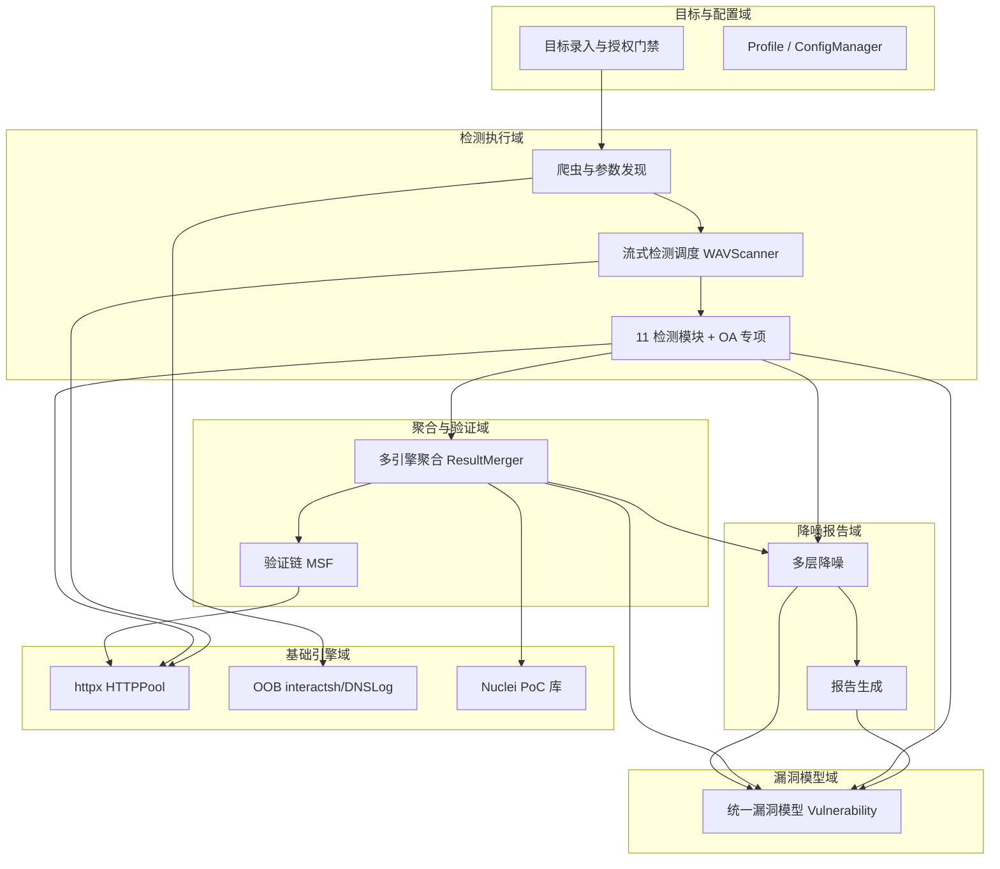

### 2.2 领域关系映射

#### 2.2.1 限界上下文清单

每个业务域对应一个限界上下文（Bounded Context），明确该域内"业务实体的标准定义"：

| 限界上下文 | 对应业务域 | 域类型 | 覆盖的核心业务实体 | 上下文边界（属于本域 vs 不属于） |
| --- | --- | --- | --- | --- |
| BC1-目标与配置域 | 目标与配置域 | 核心域 | `ScanTarget` / `Profile` | 属于：目标、授权、配置档；不属于：漏洞数据、扫描结果 |
| BC2-检测执行域 | 检测执行域 | 核心域 | `ScanTask` / `DetectionModule` / `CrawlResult` | 属于：爬取、调度、模块执行；不属于：外部引擎结果、归一化 |
| BC3-聚合与验证域 | 聚合与验证域 | 核心域 | `EngineResult` / `Verification` | 属于：多引擎结果、验证记录；不属于：外部引擎内部模型（经 ACL 隔离） |
| BC4-降噪报告域 | 降噪报告域 | 支撑域 | `Report` / `NoiseCluster` | 属于：降噪规则、报告；不属于：检测算法 |
| BC5-基础引擎域 | 基础引擎域 | 通用域 | `HttpSession` / `OOBEvent` / `PocTemplate` | 属于：HTTP 池、OOB、PoC 缓存；不属于：业务编排 |
| BC6-漏洞模型域 | 漏洞模型域 | 通用域 | `Vulnerability` / `VulnDedupKey` | 属于：统一漏洞模型；不属于：任何专属业务能力 |

**域类型说明**：

| 域类型 | 含义 | 投入策略 |
| --- | --- | --- |
| 核心域（Core） | 业务护城河，差异化竞争力所在 | 投入最多资源自研 |
| 支撑域（Supporting） | 必要但非差异化 | 可自研可外采 |
| 通用域（Generic） | 通用能力 | 优先复用 / 外采 |

#### 2.2.2 上下文映射（Context Mapping）

| 关系编号 | 上游上下文 | 下游上下文 | 关系模式 | 同步方式 | 选择理由 |
| --- | --- | --- | --- | --- | --- |
| C-01 | BC1-目标与配置域 | BC2-检测执行域 | Customer/Supplier | 配置注入（启动时加载） | 目标与配置作为上游供给，检测执行作为下游按需求影响配置迭代节奏 |
| C-02 | 外部引擎（AWVS/Nessus/Nuclei/sqlmap/ffuf/MSF/Wappalyzer） | BC3-聚合与验证域 | ACL 防腐层 | 适配器 + 结果转模型 | 7 个 `*_integration` 适配器隔离外部模型，外部模型变化不影响本域 |
| C-03 | BC6-漏洞模型域 | BC2 / BC3 / BC4 | Shared Kernel | 共享 DTO / 模型类 | 统一 `Vulnerability` 模型被多上下文稳定共享，必须一致 |
| C-04 | 外部平台（AWVS / Nessus REST API） | BC3-聚合与验证域 | Conformist | 直接遵循对方结果 schema | 无议价能力的强势上游，顺从其扫描结果结构 |
| C-05 | BC4-降噪报告域 | 下游（DefectDojo / GitHub Issue，完整版） | Published Language | SARIF 标准协议文件 | 以 SARIF（OASIS 标准）对外暴露，多下游共同消费 |

**关系模式说明**：

| 关系模式 | 适用场景 |
| --- | --- |
| Customer/Supplier | 上下游强协作，下游能影响上游迭代节奏（如：目标配置 → 检测执行） |
| Conformist | 顺从者，下游完全遵循上游模型（如：对接 AWVS/Nessus REST API） |
| ACL（Anticorruption Layer） | 在本域和外部域之间建一层适配，外部模型变化不影响本域 |
| Shared Kernel | 共享内核，多个上下文共享一小块代码 / 模型；维护成本高，慎用 |
| Published Language | 上游以标准协议（事件 / Schema）对外暴露，多下游消费 |

#### 2.2.3 跨域协作原则

| 原则编号 | 原则 |
| --- | --- |
| P-01 | 核心域 → 支撑域 / 通用域：禁止反向依赖（核心域不依赖支撑域的内部模型） |
| P-02 | 核心域之间：禁止直接耦合，必须通过事件 / API 解耦 |
| P-03 | 对接外部不可控系统：必须建 ACL 防腐层，禁止把外部模型贯穿到本域 |

### 2.3 详细业务架构

#### 2.3.1 用例图

**用例图清单**：

| 编号 | 用例图标题 | 涉及业务域 | 源文件位置 |
| --- | --- | --- | --- |
| UC-01 | 安全研究员发起扫描 | 目标与配置域 / 检测执行域 | docs/uml/uc-01.puml（本文以 Mermaid 内嵌） |
| UC-02 | SRC 白帽快瞄与批量扫描 | 目标与配置域 / 检测执行域 | docs/uml/uc-02.puml（本文以 Mermaid 内嵌） |
| UC-03 | 运维监控与停止干预 | 降噪报告域 / 聚合与验证域 | docs/uml/uc-03.puml（本文以 Mermaid 内嵌） |

**UC-01 安全研究员发起扫描（Mermaid）**：

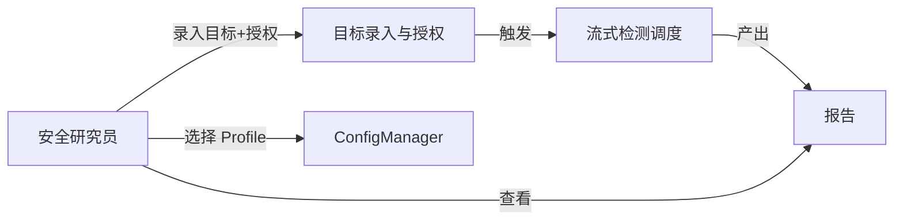

#### 2.3.2 业务流程图

**关键流程清单**（核心业务覆盖度 ≥ 80%）：

| 流程编号 | 流程名 | 起点 | 终点 | 涉及业务域 | 源文件位置 |
| --- | --- | --- | --- | --- | --- |
| BF-01 | 目标录入与授权扫描主流程 | 用户录入 URL | 报告生成 | 目标与配置域 / 检测执行域 / 聚合与验证域 / 降噪报告域 | 本文 §3.2.M2.4 |
| BF-02 | 流式检测调度流程（爬取即检测） | 爬虫发现 URL | 模块产出漏洞 | 检测执行域 | 本文 §3.2.M3.4 |
| BF-03 | 多引擎聚合与验证流程 | 调度触发外部引擎 | 归一化漏洞 | 聚合与验证域 | 本文 §3.2.M5.4 |
| BF-04 | 降噪与报告生成流程 | 原始漏洞集 | 报告文件 | 降噪报告域 | 本文 §3.2.M7.4 |

**BF-01 主流程（角色泳道图，Mermaid）**：

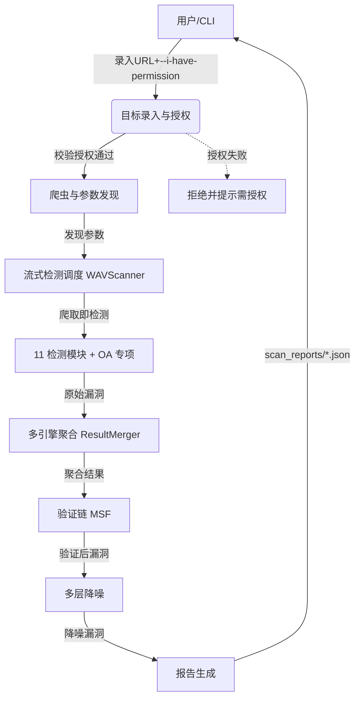

### 2.4 业务范围与边界

#### 2.4.1 功能模块清单

按"功能编号 → 子功能编号"两层组织，与 §2.1 业务域对应。

| 编号 | 一级功能名 | 子功能描述 | 对应业务域 | 实现状态 |
| --- | --- | --- | --- | --- |
| F1 | 11 检测模块核心 | sqli/xss/cmdi/lfi/rce/ssrf/xxe/api/sensitive/waf/jspathfinder | 检测执行域 | 完整实现 |
| F2 | OA 专项 12 系统 | 泛微/通达/金蝶/蓝凌/致远/用友/禅道/万户/Nacos/Spring/Jenkins/Confluence | 检测执行域 | 完整实现 |
| F3 | 流式检测 | 爬取即检测，异步流水线 | 检测执行域 | 完整实现 |
| F4 | 多引擎聚合层 | 7 适配器 + ResultMerger 去重合并 | 聚合与验证域 | 完整实现 |
| F5 | 漏洞验证链 | Metasploit RPC --verify | 聚合与验证域 | 完整实现 |
| F6 | Nuclei PoC 集成 | 已知漏洞 / PoC 库复用 | 基础引擎域 | 完整实现 |
| F7 | 带外检测 OOB | interactsh / DNSLog | 基础引擎域 | 完整实现 |
| F8 | 模块注册扩展机制 | DetectionModule + @register_module | 检测执行域 | 完整实现 |
| F9 | 报告体系 MVP | JSON / HTML / Markdown + 控制台 | 降噪报告域 | 完整实现 |
| F10 | Profile 系统 | 4 套内置 + ConfigManager | 目标与配置域 | 完整实现 |
| F11 | 多入口 | CLI / Web UI Flask+SSE / Docker client-only | 目标与配置域 | 完整实现 |
| F12 | 多层降噪 | 内容特征 + 尺寸聚类 + 校准匹配 | 降噪报告域 | 完整实现 |
| F13 | 靶机自动分流与自动认证 | DVWA / Mutillidae 识别 + 表单登录 | 检测执行域 | 完整实现 |

**In-Scope（本期范围内）**：

| 编号 | 本期必做的事项 |
| --- | --- |
| F1 | 11 检测模块核心（P0） |
| F2 | OA 专项 12 系统检测（P0） |
| F3 | 流式检测（P0） |
| F4 | 多引擎聚合层（P0） |
| F5 | 漏洞验证链（P0） |
| F6 | Nuclei PoC 集成 |
| F7 | 带外检测 OOB |
| F8 | 模块注册扩展机制 |
| F9 | 报告体系 MVP（P0） |
| F10 | Profile 系统 |
| F11 | 多入口 CLI/Web/Docker（P0） |
| F12 | 多层降噪 |
| F13 | 靶机自动分流与自动认证 |
| N1 | 单进程自托管支撑 1 个用户并发多任务，启动到首请求 P95 ≤ 30s |

**Out-of-Scope（本期不做）**：

| 编号 | 不做的事项 | 不做的原因 | 未来归属 |
| --- | --- | --- | --- |
| O1 | SARIF 报告落地（写文件） | 代码接收未写出（X10），完整版补齐 | 完整版 |
| O2 | Web UI 多格式导出 | Web UI /api/export 仅 JSON | 完整版 |
| O3 | 独立 Auth 子系统 | auth 子命令未落地（X11） | 完整版 |
| O4 | 配置一致性统一 | X7 多套默认参数、X14 键名不一致 | 完整版 |
| O5 | IAST / Proof-Based 增强 | 概念借鉴 Invicti，超出定位 | 后续 |
| O6 | 分布式 / 多租户 SaaS | 私有化自托管定位（多租户=否） | 不纳入本期 |
| O7 | 第三方插件市场 | 中心化市场外部分发本期不做（D-01） | 后续 |
| O8 | 分布式扫描编排 | 多节点任务分发超出本期（D-04） | 不纳入本期 |

**填写要求**：In-Scope ≤ 15 条；Out-of-Scope ≥ 3 条（少于 3 条说明边界没想清楚）。

### 2.5 质量与柔性可用

#### 2.5.1 服务质量目标

**质量目标 Top 3-5**：

| 优先级 | 质量目标 | 业务驱动 | 受影响的关键章节 |
| --- | --- | --- | --- |
| Q1 | 启动性能：启动到首请求 P95 ≤ 30s | 用户诉求 30 秒启动 | §3.5.4 / §5.2 / §5.5 |
| Q2 | 实时可见：日志端到端 ≤ 1s | Web UI SSE 体验 | §3.1.2 / §8.1 |
| Q3 | 合规可控：授权扫描全程留痕、数据不出网 | 甲方决策者合规诉求 | §7.2 / §8.2 |
| Q4 | 零许可成本：MIT OSS 自托管 | 成本价值 | §3.1.3 / §5.1 |
| Q5 | 可用性：单进程自托管进程可用性 ≥ 99.5% | 运维监控诉求 | §5.3 / §8.4 |

**可验证质量场景**：

| 场景编号 | 关联目标 | 触发源 | 触发条件 | 期望响应 | 度量指标 |
| --- | --- | --- | --- | --- | --- |
| QS-01 | Q1 | 用户发起扫描 | `rayscan use src-quick -u URL` | 30s 内发出首请求 | P95 ≤ 30s |
| QS-02 | Q2 | 扫描进行中 | 模块产出日志事件 | SSE ≤ 1s 推送到前端 | 端到端时延 ≤ 1s |
| QS-03 | Q3 | 每次扫描 | 目标录入 | 记录 i-have-permission 授权 + 审计日志 | 授权覆盖率 100% |

#### 2.5.2 业务柔性可用策略

**业务功能优先级分层**（§2.4.1 中每个一级功能 F-x 已显式标注层级）：

| 层级 | 含义 | 故障态下的处置方向 | 用户感知 |
| --- | --- | --- | --- |
| L0 核心业务 | 系统的生命线，挂掉等于业务停摆 | 不降级；优先消耗所有资源保障 | 无 / 极轻微 |
| L1 重要业务 | 不影响主链路但用户高频使用 | 限流 + 排队 + 异步化 | 变慢 / 排队提示 |
| L2 辅助业务 | 提升体验但非必要 | 关闭 / 返回兜底数据 | 部分功能不可用 + 友好提示 |
| L3 附加业务 | 长尾 / 数据类 / 统计类 | 直接关闭 + 异步补偿 | 通常无感 |

**业务降级清单**：

| 编号 | 关联功能（F-xx） | 触发条件 | 降级动作 | 用户感知 | 决策类型 |
| --- | --- | --- | --- | --- | --- |
| BD-01 | F5 验证链 | `RAYSCAN_ENABLE_EXPLOIT != 1` 或 MSF RPC 不可达 | 跳过验证，标记漏洞为"未验证" | 报告标注"验证链未运行" | 自动 |
| BD-02 | F4 多引擎聚合 | 外部二进制（Nuclei/sqlmap/ffuf）缺失 | 跳过该引擎，其余引擎照常聚合 | 报告显示"部分引擎不可用" | 自动 |
| BD-03 | F7 OOB | OOB 服务器（interactsh）不可达 | 关闭 OOB 检测分支，保留主动检测 | 盲区提示，不影响主链路 | 自动 |

**填写要求**：§2.4.1 全部一级功能均已分层（L0~L3）；L0 数量 ≤ 总功能数的 30%。

功能分层映射：F1/F2/F3/F4/F5/F9/F11 = L0（P0 核心链路）；F6/F7/F8/F10/F12/F13 = L1。

---

## 3. 应用架构

> **本章回答**：系统由哪些模块组成、模块与外部系统怎么集成、每个模块的内部交互链路是什么。
> **本章是系统设计的核心**，章节下应当占整个文档篇幅的 40%~50%。

### 3.1 应用架构概览

#### 3.1.1 系统上下文

本系统作为**中心节点**，周围辐射出"用户角色 + 外部业务系统 + 上游 / 下游平台"关系。

**系统上下文要素清单**：

| 节点类型 | 节点名 | 与本系统的关系 | 关系语义 |
| --- | --- | --- | --- |
| 角色 | 安全研究员（CLI） | 使用 | 终端发起扫描 |
| 角色 | SRC 白帽（Web UI） | 使用 | 浏览器实时查看 |
| 角色 | 运维 / 合规 | 使用 | 监控与审计 |
| 上游平台 | E-01 目标 Web 应用 | 本系统 → 调用 | HTTP 请求检测 |
| 外部业务系统 | E-02 Nuclei / sqlmap / ffuf / Wappalyzer | 本系统 → 调用 | 子进程执行 |
| 外部业务系统 | E-03 AWVS / Nessus | 本系统 → 调用 | REST API 拉取结果 |
| 外部业务系统 | E-04 Metasploit RPC | 本系统 → 调用 | RPC 验证链 |
| 外部业务系统 | E-05 Nuclei PoC 库 | 本系统 → 加载 | 模板文件加载 |
| 外部业务系统 | E-06 interactsh / DNSLog | 本系统 ↔ 回调 | OOB 带外 |
| 下游平台 | E-07 归一化平台 DefectDojo | 本系统 → 推送 | SARIF / JSON（完整版） |
| 下游平台 | E-08 Issue 追踪 GitHub | 本系统 → 推送 | REST API（完整版） |
| 下游平台 | E-09 扫描报告文件 | 本系统 → 写出 | scan_reports/ |

**系统上下文图（Mermaid）**：

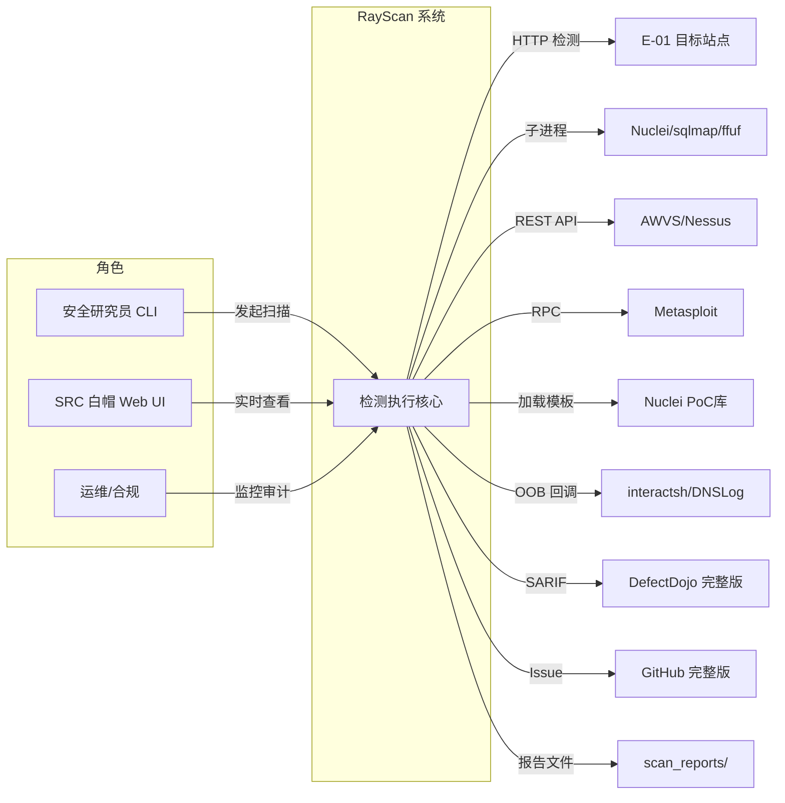

#### 3.1.2 系统模块图

- 分层架构图，每一层标出关键组件与协议方向
- **接入层**：CLI（argparse）/ Web UI（Flask + SSE）/ Docker client-only
- **应用层**：覆盖 12 模块全景（见 §3.2 模块清单）
- **中间件层**：SQLite（任务/漏洞存储）、文件系统（scan_reports/、profiles/）、外部二进制运行时
- **集成对接点**：7 个 `*_integration` 适配器（E-02~E-06）

**分层组件清单**：

| 层次 | 内容 | 数据来源 |
| --- | --- | --- |
| 接入层 | CLI / Web UI（Flask+SSE）/ Docker client-only | §2.3 用例图角色 |
| 应用层 | 按 §2.1 业务域划分的 12 个后端模块（与 §3.2 一一对应） | §2.1 / §3.2 |
| 中间件层 | SQLite / 文件系统 / 外部二进制运行时（Nuclei/sqlmap/ffuf） | §3.1.3 云组件清单 |
| 集成对接层 | 7 个 `*_integration` 适配器（E-02~E-06） | §3.1.3 外部依赖清单 |

**系统模块图（Mermaid，分层）**：

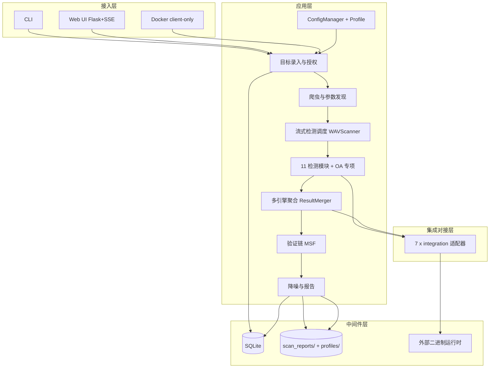

#### 3.1.3 集成架构

##### 外部依赖清单

| ID | 外部系统 | 归属团队 / 供应商 | 类别 | 使用方式 | 集成方式 | 协议 / 版本 | 功能定位（≤ 30 字） | 联系人 |
| --- | --- | --- | --- | --- | --- | --- | --- | --- |
| E-01 | 目标 Web 应用 | 被授权方 | 业务协作 | 消费 | HTTP(S) | HTTP/1.1+HTTPS | 待检测页面与参数 | `@研究员` |
| E-02 | Nuclei / sqlmap / ffuf / Wappalyzer | 开源社区 | 第三方业务平台 | 消费 | 子进程 / CLI | CLI 调用 | PoC 执行 / 模糊测试 / 指纹 | `@引擎组` |
| E-03 | AWVS / Nessus | 厂商 | 业务协作 | 消费 | REST API | REST v1/v2 | 扫描结果导入 | `@引擎组` |
| E-04 | Metasploit（MSF RPC） | Rapid7 / 开源 | 业务协作 | 消费 | RPC | MSF RPC 默认 127.0.0.1:55552 | 漏洞验证链 | `@引擎组` |
| E-05 | Nuclei PoC 库 | ProjectDiscovery | 第三方业务平台 | 消费 | 文件 / 模板加载 | 模板 YAML | 已知漏洞模板 | `@引擎组` |
| E-06 | interactsh / DNSLog | ProjectDiscovery / 社区 | 第三方业务平台 | 双向 | 网络回调 | OOB 协议 | 带外回调检测 | `@引擎组` |
| E-07 | DefectDojo（完整版） | OSS | 监控审计 | 生产 | 文件导入 | SARIF / JSON | 结果归集 | `@运维` |
| E-08 | GitHub Issue（完整版） | GitHub | 业务协作 | 生产 | REST API | REST v3 | 漏洞流转 | `@运维` |
| E-09 | 扫描报告文件 | 用户 | 业务协作 | 生产 | 文件系统 | JSON/HTML/Markdown | 阅读 / 复现 | `@用户` |

**填写要求**：类别取值（封闭枚举）：身份认证 / 业务协作 / 支付 / 通知推送 / 埋点 / 第三方业务平台 / 监控审计 / 文件导出。

##### 云组件 / 基础设施清单

| ID | 组件类别 | 选型 | 部署形态 | 规格量级 | 容量预估 | 提供方 / SLA | 用途 |
| --- | --- | --- | --- | --- | --- | --- | --- |
| C-01 | 关系型存储 | SQLite 3.45 | 单文件嵌入式 | 单文件 ≤ 2GB | 任务/漏洞量 ≤ 50 万行 | 自托管；进程级 SLA | 业务主数据（任务/漏洞/报告） |
| C-02 | 对象/文件存储 | 本地文件系统 | 单节点 | 按扫描量 | scan_reports/ 日增 ≤ 100MB | 自托管 | 报告文件 / Profile |
| C-03 | 外部二进制运行时 | Nuclei / sqlmap / ffuf（钉固版本） | 宿主机预装 / Docker 内置 | 各 1 进程 | 并发 ≤ 5 | OSS 社区 | PoC / 模糊测试 |
| C-04 | 密钥管理 | 环境变量 / .env（KMS 完整版） | 单节点 | — | — | 自托管 | 凭据 / Token |
| C-05 | 日志服务 | 文件 + OTel Collector（可选） | 单节点 | — | 日志量 ≤ 100MB/天 | 自托管 | 应用 / 审计日志 |
| C-06 | 监控告警 | Prometheus + Grafana（可选） | 单节点 | — | — | 自托管 | 指标 / 告警 |
| C-07 | 链路追踪 | OpenTelemetry | 单节点 | — | 采样率 1% | 自托管 | 分布式调用追踪 |
| C-08 | OOB 服务器 | interactsh 公共/自建 | 公网可达 | — | 回调 ≤ 1000/s | ProjectDiscovery | 带外检测 |

**填写要求**：选型必须含**具体产品 + 版本号**；规格量级 / 容量预估必须有数字；不使用的组件**整行删除**，禁止填"不适用"。

##### 组件依赖关系

| 业务模块（§3.2） | 依赖的外部系统（E-xx） | 依赖的云组件（C-xx） | 故障传导风险 |
| --- | --- | --- | --- |
| M1 目标录入与授权 | E-01, E-09 | C-01, C-04 | E-01 不可达 → 扫描无法发起 |
| M2 爬虫与参数发现 | E-01, E-06 | C-01 | E-06 不可达 → OOB 检测降级 |
| M3 流式检测调度 | E-01 | C-01, C-03 | C-03 缺失 → 外部引擎分支降级 |
| M4 11 检测模块 + OA | E-01, E-02, E-05 | C-01, C-03 | E-02 缺失 → 对应引擎降级 |
| M5 多引擎聚合 | E-02, E-03, E-04 | C-01 | E-03 不可达 → 该引擎结果缺失 |
| M6 验证链 | E-04 | C-01 | E-04 不可达 → 验证链跳过 |
| M7 降噪与报告 | E-07, E-08, E-09 | C-01, C-02 | C-02 满 → 报告写出失败 |

#### 3.1.4 工程结构

```
rayscan/                      # 后端工程根目录（Python 包 wvs）
├── wvs/                      # 核心扫描库
│   ├── cli.py                # CLI 入口（scan/batch/list-modules/profile/use/version）
│   ├── config.py             # ConfigManager + DEFAULT_CONFIG
│   ├── models.py             # 统一漏洞模型 Vulnerability / ScanTarget / ScanResult
│   ├── core/                 # 基础引擎域
│   │   ├── scanner.py        # WAVScanner 流式检测调度
│   │   ├── crawler.py        # WebCrawler 爬虫与参数发现
│   │   ├── session.py        # HTTPPool（httpx.AsyncClient）
│   │   ├── oob/              # interactsh / DNSLog OOB
│   │   ├── cache/            # 缓存 / 去重
│   │   ├── rate_limiter.py   # 限速
│   │   └── scheduler.py      # 并发调度
│   ├── modules/              # 检测执行域（DetectionModule + @register_module）
│   │   ├── base.py           # DetectionModule / ModuleFactory / @register_module
│   │   ├── sqli/ xss/ cmdi/ lfi/ rce/ ssrf/ xxe/ api/ sensitive/ waf/ jspathfinder/
│   │   └── oa/               # OA 专项 12 系统 OADetector
│   ├── integrations/         # 聚合与验证域 ACL 适配器
│   │   ├── awvs_integration.py nessus_integration.py nuclei_integration.py
│   │   ├── sqlmap_integration.py ffuf_integration.py wappalyzer_integration.py
│   │   └── msf_integration.py
│   ├── exploit/              # 验证链 MSF 引擎
│   ├── plugins/              # AuthManager（--auth 文件）
│   └── reporting/            # 降噪报告域（JSON/HTML/Markdown/Console）
├── web_ui/                   # Web UI（Flask + SSE）
│   └── app.py
├── profiles/                 # 内置 Profile（default/src-quick/pentest-full/sqli-only）
├── config/                   # poc_sources.yaml
├── scan_reports/             # 报告输出目录
├── tests/                    # 单元测试 / 集成测试
├── pyproject.toml            # version=2.0.0（权威源，X1 已冻结）
├── Dockerfile                # client-only，不暴露端口
└── docker-compose.yml
```

> 公共模块（`common`）与业务服务的依赖方向必须清晰：**业务服务依赖 common，禁止反向**。

#### 3.1.5 技术选型（版本约束）

| 技术分类 | 选型 | 版本 | 备注 / 选型理由 |
| --- | --- | --- | --- |
| 后端语言 | Python | 3.11（requires-python >=3.8，Docker 3.11-slim） | 为什么选 3.11 不选 3.8：3.11 异步性能与错误栈更好，Docker 镜像已用 3.11；3.8 仅作最低兼容下限 |
| 后端框架（CLI） | argparse + rich | Python 3.11 stdlib + rich 13.x | 为什么选 argparse 不选 click：与现有 cli.py 一致、零额外抽象；rich 提供终端高亮 |
| Web 框架 | Flask | 3.0.x | 为什么选 Flask 不选 FastAPI：现有 Web UI 已用 Flask+SSE，SSE 用原生 generator 即可，无需 ASGI 复杂度 |
| 异步引擎 | httpx | 0.27.x（**列入核心依赖，修复 X3**） | 为什么选 httpx 不选 aiohttp：HTTPPool 核心实为 httpx.AsyncClient（X3 核实），aiohttp 仅用于部分集成；须补依赖声明 |
| 持久层 | SQLite（aiosqlite） | SQLite 3.45 / aiosqlite 0.20.x | 为什么选 SQLite 不选 PostgreSQL：MVP 单租户自托管零运维，单文件可随 Docker 挂载；完整版可换 Postgres |
| 关系型存储 | SQLite 3.45 | 3.45.x | 任务/漏洞主数据，单文件嵌入式 |
| 缓存 / 去重 | 内存 + SQLite | — | 为什么选内存+SQLite 不选 Redis：单进程自托管无需独立缓存服务，降低部署负担 |
| 消息队列 | 进程内 asyncio.Queue | — | 为什么选进程内队列不选 Kafka：MVP 单进程流式检测，无跨节点解耦需求（O8 分布式才需 MQ） |
| API 通信 | REST（Web UI）/ 子进程（外部引擎） | — | 协议选择理由：Web UI 用 REST+SSE；外部引擎用子进程/REST，避免进程内耦合 |
| 前端框架 | 原生 HTML + SSE（无独立前端工程） | — | 为什么选原生不选 React：Web UI 为实时监控单页，SSE 推送即可，无构建链路 |
| 认证方案 | session + API Token | — | 见 §7.2.1；0.0.0.0 监听时强制启用 RAYSCAN_WEB_SECRET/TOKEN |
| 三方 SDK | Nuclei / sqlmap / ffuf（子进程） | 钉固版本 | 用途与替代方案：复用已知引擎，不自研 |

### 3.2 模块详细设计

#### 3.2.1 模块公共约束（Common）

**通信方式约束**：

| 约束项 | 取值 |
| --- | --- |
| 接口路径风格 | RESTful（Web UI）/ 进程内方法调用（CLI 内部） |
| 协议 | HTTP（Web UI）/ 子进程 / RPC（外部引擎） |
| 数据格式 | JSON（Web UI）/ Python 对象（内部） |
| 字符编码 | UTF-8 |

**通用基础结构**：

| 基类 / 结构 | 用途 | 包路径 |
| --- | --- | --- |
| `ScanTarget` | 多态目标对象 | `wvs.models` |
| `ScanTask` | 扫描会话 | `wvs.models` |
| `Vulnerability` | 统一漏洞模型（含 code / msg / data / trace_id） | `wvs.models` |
| `ScanResult` | 统一返回结构（含 vulnerability_count / severity_count） | `wvs.models` |
| `ModuleInfo` | 模块元信息 | `wvs.modules.base` |

#### 3.2.2 模块清单与编号规则

**模块清单**：

| 编号 | 模块名 | 业务域（§2.1） | 模块负责人 | 关联子领域 |
| --- | --- | --- | --- | --- |
| M1 | 目标录入与授权 | 目标与配置域 | @引擎组 | 目标 / 授权门禁 |
| M2 | 爬虫与参数发现 | 检测执行域 | @引擎组 | 爬虫 / 参数 |
| M3 | 流式检测调度 WAVScanner | 检测执行域 | @引擎组 | 调度 / 流式 |
| M4 | 11 检测模块 + OA 专项 | 检测执行域 | @模块组 | sqli/xss/.../oa |
| M5 | 多引擎聚合 ResultMerger | 聚合与验证域 | @聚合组 | 聚合 / 去重 |
| M6 | 验证链 MSF | 聚合与验证域 | @聚合组 | 验证 |
| M7 | 降噪与报告 | 降噪报告域 | @报告组 | 降噪 / 报告 |
| M8 | httpx HTTPPool | 基础引擎域 | @引擎组 | HTTP 池 |
| M9 | OOB interactsh / DNSLog | 基础引擎域 | @引擎组 | 带外 |
| M10 | Nuclei PoC 库 | 基础引擎域 | @依赖组 | PoC |
| M11 | ConfigManager + Profile | 目标与配置域 | @平台组 | 配置 |
| M12 | 统一漏洞模型 | 漏洞模型域 | @平台组 | 模型 |

**编号规则**：
- 模块编号 `M{N}` 全局唯一，与 §2.1 业务域名一致；
- 每个模块在 §3.2 下独立成节，编号 `§3.2.M{N}`；
- 节内五段式编号 `§3.2.M{N}.1` ~ `§3.2.M{N}.5`，顺序与 §3.2.3 模板一致。

#### 3.2.3 单模块设计模板（五段式）

> 本节定义"每个模块在 §3.2.M{N} 下五段各应该**产出什么内容**、**遵守什么格式**"。**本节本身不是任何模块的内容**——以下所有"硬性要求表 / 示意代码 / 示意表格行"都属于**规范说明与格式示意**，仅供理解之用。各模块下应当体现、不重复声明共同规范。

（模板格式已在 §3.2.3 正文说明，以下 §3.2.M1~§3.2.M12 按五段式展开真实内容。）

#### §3.2.M1 目标录入与授权

##### §3.2.M1.1 模块概述

目标录入与授权模块覆盖"用户录入 URL + 授权确认（i-have-permission 门禁）"业务流程，业务逻辑在用户（CLI/Web UI）、目标站点、ConfigManager 之间流动，同时涉及 scan_reports/、SQLite 等内外部系统的数据流动。

##### §3.2.M1.2 接口清单

| 子领域 | 方法 | 路径 | 用途（≤ 20 字） | 请求 DTO | 响应 VO | 幂等 |
| --- | --- | --- | --- | --- | --- | --- | --- |
| 目标 | POST | `/api/scan` | 录入目标发起扫描 | `ScanCreateRequest` | `ScanTaskVO` | 是（biz_req_no） |
| 目标 | POST | `CLI scan -u` | CLI 录入目标 | — | `ScanTaskVO` | 是（biz_req_no） |
| 授权 | 标志 | `--i-have-permission` | 授权门禁开关 | — | — | 天然 |

##### §3.2.M1.3 关键结构定义（DTO）

```python
class ScanCreateRequest:
    # ===== 必填字段 =====
    target_url: str                 # 被授权检测 URL，必须 http/https
    modules: list[str]              # 启用的检测模块，至少 1 个
    profile: str = "default"        # Profile 名称
    # ===== 可选字段 =====
    auth_file: str | None = None    # --auth JSON 文件路径
    max_time: int = 7200            # 扫描超时（秒）
    i_have_permission: bool = False # 授权门禁，必须为 True

class ScanTaskVO:
    # ===== 基本信息 =====
    task_id: str                    # 扫描任务 ID（UUID）
    target_url: str                 # 目标 URL
    # ===== 状态字段 =====
    status: str                     # INIT / RUNNING / DONE / FAILED / STOPPED
    # ===== 时间字段 =====
    created_at: str                 # ISO8601 UTC
```

**关键字段定义表**：

| DTO / VO 名 | 字段名 | 类型 | 必填 | 业务含义 | 约束 / 默认值 |
| --- | --- | --- | --- | --- | --- |
| ScanCreateRequest | target_url | string | 是 | 被授权检测 URL | 必须以 http/https 开头 |
| ScanCreateRequest | modules | list | 是 | 启用模块列表 | 长度 ≥ 1 |
| ScanCreateRequest | i_have_permission | bool | 是 | 授权门禁 | 必须为 True，否则拒绝 |
| ScanTaskVO | status | string | 是 | 任务状态 | INIT/RUNNING/DONE/FAILED/STOPPED |

##### §3.2.M1.4 模块逻辑时序图

| 编号 | 标题（目标录入与授权 - 录入即扫描） | 场景类别 | 是否包含异常分支 |
| --- | --- | --- | --- |
| SQ-01 | 目标录入与授权 - 发起扫描 | 配置 / 发布 | 是 |
| SQ-02 | 目标录入与授权 - 授权失败拒绝 | 异常 / 回滚 | 是 |

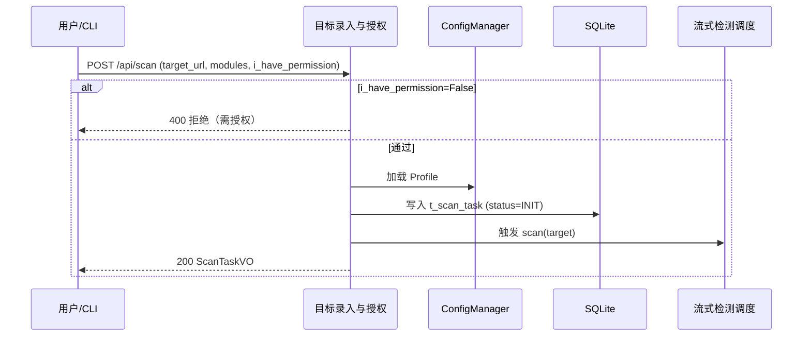

##### §3.2.M1.5 关键流程逻辑

```
触发：用户发起扫描

Step 1: 授权校验（同步）
  ├── 校验：i_have_permission == True → 否则返回 C400001 拒绝
  ├── 校验：target_url 以 http/https 开头
  └── 状态变更：t_scan_task.status = INIT

Step 2: 配置加载（同步）
  ├── ConfigManager 加载 Profile（env ≥ profile ≥ CLI ≥ default）
  └── 状态变更：t_scan_task.status = RUNNING

Step 3: 触发调度（异步）
  └── 调用 WAVScanner.scan(target)
```

#### §3.2.M2 爬虫与参数发现

##### §3.2.M2.1 模块概述

爬虫与参数发现模块覆盖"爬取目标页面并提取注入参数"业务流程，业务逻辑在爬虫引擎、目标站点、OOB 之间流动，是流式检测的数据来源。

##### §3.2.M2.2 接口清单

| 子领域 | 方法 | 路径 | 用途（≤ 20 字） | 请求 DTO | 响应 VO | 幂等 |
| --- | --- | --- | --- | --- | --- | --- |
| 爬虫 | 内部 | `crawler.crawl(url)` | 爬取并提取参数 | — | `CrawlResult` | 天然 |
| 参数 | 内部 | `parser.parse(response)` | 解析表单/URL 参数 | — | `ParamList` | 天然 |

##### §3.2.M2.3 关键结构定义（DTO）

```python
class CrawlResult:
    # ===== 基本信息 =====
    url: str
    # ===== 业务字段 =====
    params: list[dict]      # 提取到的参数（name/value/location）
    depth: int = 0          # 爬取深度
    discovered_at: str      # ISO8601
```

##### §3.2.M2.4 模块逻辑时序图

| 编号 | 标题（爬虫与参数发现 - 爬取发现） | 场景类别 | 是否包含异常分支 |
| --- | --- | --- | --- |
| SQ-01 | 爬虫与参数发现 - 页面爬取 | 核心动作执行 | 是 |

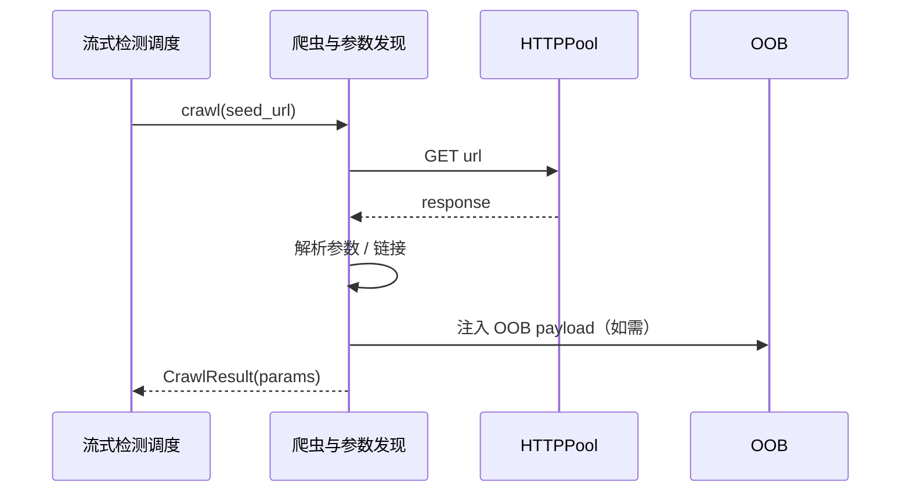

##### §3.2.M2.5 关键流程逻辑

无复杂状态机/事务/跨多步异步，本段省略（爬取为同步循环，由调度层统一编排）。

#### §3.2.M3 流式检测调度 WAVScanner

##### §3.2.M3.1 模块概述

流式检测调度模块覆盖"爬取即检测"核心业务流程，业务逻辑在 WAVScanner、爬虫、检测模块、HTTPPool 之间流动，是 RayScan 差异化竞争力的承载点。

##### §3.2.M3.2 接口清单

| 子领域 | 方法 | 路径 | 用途（≤ 20 字） | 请求 DTO | 响应 VO | 幂等 |
| --- | --- | --- | --- | --- | --- | --- |
| 调度 | 内部 | `scanner.scan(target)` | 流式编排检测 | — | `ScanResult` | 天然 |
| 调度 | 内部 | `scanner.run_multi_engine_scan` | 多引擎聚合触发 | — | `ScanResult` | 天然 |

##### §3.2.M3.3 关键结构定义（DTO）

```python
class ScanConfig:
    # ===== 性能参数 =====
    rate: int = 10                 # 每秒请求上限
    threads: int = 5
    timeout: int = 30
    crawl_depth: int = 4
    crawl_max_urls: int = 300
    max_time: int = 3600
    verify_ssl: bool = True
```

##### §3.2.M3.4 模块逻辑时序图

| 编号 | 标题（流式检测调度 - 爬取即检测） | 场景类别 | 是否包含异常分支 |
| --- | --- | --- | --- |
| SQ-01 | 流式检测调度 - 主链路 | 核心动作执行 | 是 |
| SQ-02 | 流式检测调度 - 超时抢救 | 异常 / 补偿 | 是 |

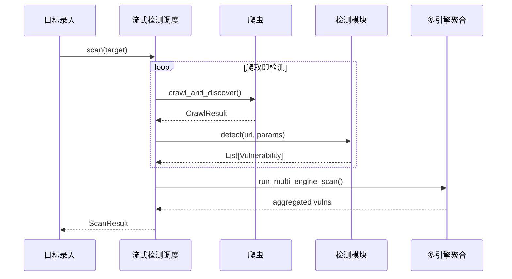

##### §3.2.M3.5 关键流程逻辑

```
触发：scan(target)

Step 1: 模块解析（同步）
  ├── _resolve_enabled_modules()：默认仅 sqli+xss，_load_all_modules=True 加载全部
  └── 状态变更：t_scan_task.status = RUNNING

Step 2: 流式检测（异步循环）
  ├── 爬取一个 URL → 立即对该 URL 参数执行已启用模块（爬取即检测）
  ├── _run_module 带并发信号量（concurrent_modules）
  └── 超时抢救：max_time 到达 → 收集 _partial_vulns 返回

Step 3: 多引擎聚合（异步）
  └── run_multi_engine_scan() → M5
```

**状态机迁移表**：

| 起始状态 | 触发事件 | 终止状态 | 触发条件 / 校验 | 副作用 |
| --- | --- | --- | --- | --- |
| INIT | start | RUNNING | 授权与配置通过 | 写入 t_scan_task |
| RUNNING | crawl_detect_done | RUNNING | 仍有 URL 待处理 | 累积漏洞 |
| RUNNING | complete | DONE | 所有 URL 处理完成 | 生成报告 |
| RUNNING | timeout | DONE | 达到 max_time | 返回部分结果 |
| RUNNING | stop | STOPPED | 用户停止 | 保存进度 |
| RUNNING | error | FAILED | 不可恢复异常 | 记录错误 |

#### §3.2.M4 11 检测模块 + OA 专项

##### §3.2.M4.1 模块概述

检测模块模块覆盖 11 个检测模块（sqli/xss/cmdi/lfi/rce/ssrf/xxe/api/sensitive/waf/jspathfinder）+ OA 专项 12 系统的检测业务流程，业务逻辑在模块、HTTPPool、OOB 之间流动。

##### §3.2.M4.2 接口清单

| 子领域 | 方法 | 路径 | 用途（≤ 20 字） | 请求 DTO | 响应 VO | 幂等 |
| --- | --- | --- | --- | --- | --- | --- |
| 模块 | 内部 | `module.scan(target)` | 执行单模块检测 | — | `List[Vulnerability]` | 天然 |
| 注册 | 内部 | `@register_module` | 模块自动注册 | — | — | 天然 |

##### §3.2.M4.3 关键结构定义（DTO）

```python
class DetectionModule:        # 基类（X4 核实，非 BaseDetector）
    async def scan(self, target) -> list[Vulnerability]:
        return await self._scan_impl(target)
    @abstractmethod
    async def _scan_impl(self, target) -> list[Vulnerability]: ...
    @abstractmethod
    def get_info(self) -> ModuleInfo: ...
    def set_oob_manager(self, mgr): ...
    def set_waf_detected(self, flag: bool): ...
```

##### §3.2.M4.4 模块逻辑时序图

| 编号 | 标题（检测模块 - 执行检测） | 场景类别 | 是否包含异常分支 |
| --- | --- | --- | --- |
| SQ-01 | 检测模块 - SQLi 时间盲注 | 核心动作执行 | 是 |

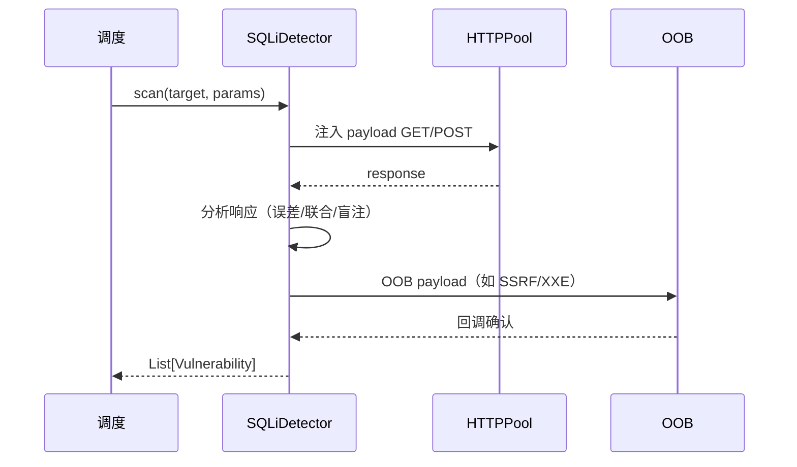

##### §3.2.M4.5 关键流程逻辑

无复杂状态机（每模块独立无状态检测）；注册通过 `@register_module` + `ModuleFactory`，`_scan_impl` 返回 `Vulnerability` 列表，由调度层统一收集。靶机自动认证（`_do_lab_auth`）对 DVWA/Mutillidae 注入 security cookie 属模块内辅助逻辑。

#### §3.2.M5 多引擎聚合 ResultMerger

##### §3.2.M5.1 模块概述

多引擎聚合模块覆盖"7 适配器结果去重合并"业务流程，业务逻辑在 ResultMerger、7 个 `*_integration` 适配器（ACL）、统一漏洞模型之间流动。

##### §3.2.M5.2 接口清单

| 子领域 | 方法 | 路径 | 用途（≤ 20 字） | 请求 DTO | 响应 VO | 幂等 |
| --- | --- | --- | --- | --- | --- | --- |
| 聚合 | 内部 | `merger.merge(results)` | 去重合并多源结果 | — | `List[Vulnerability]` | 天然 |
| 适配 | 内部 | `integration.run()` | 单引擎结果拉取 | — | `EngineResult` | 天然 |

##### §3.2.M5.3 关键结构定义（DTO）

```python
class EngineResult:
    # ===== 业务字段 =====
    source: str             # awvs/nessus/nuclei/sqlmap/ffuf/wappalyzer/msf
    raw: dict               # 上游原始结果（经 ACL 转换）
    # ===== 归一字段 =====
    normalized: Vulnerability   # 转换为统一模型
```

**去重主键**：`rule_id + url_hash`（同规则同 URL 仅保留一条）。

##### §3.2.M5.4 模块逻辑时序图

| 编号 | 标题（多引擎聚合 - 聚合验证） | 场景类别 | 是否包含异常分支 |
| --- | --- | --- | --- |
| SQ-01 | 多引擎聚合 - 拉取合并 | 核心动作执行 | 是 |

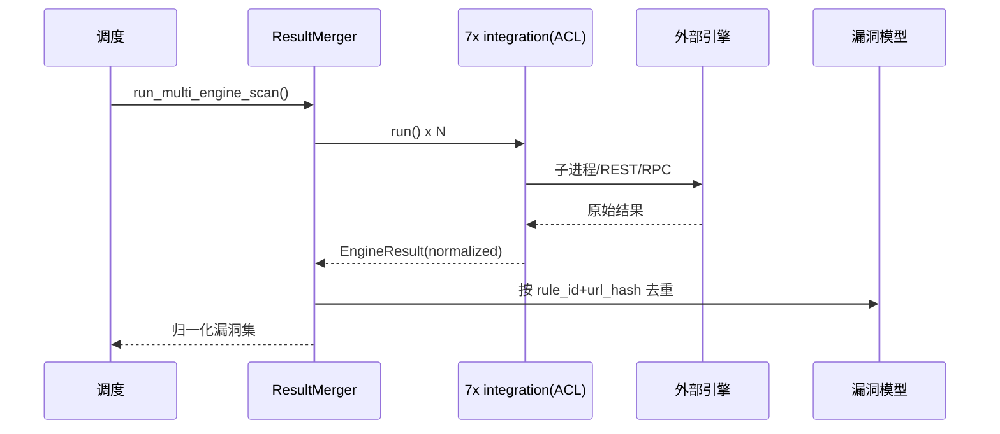

##### §3.2.M5.5 关键流程逻辑

```
触发：run_multi_engine_scan()

Step 1: 并行拉取（异步）
  ├── 各 integration 经 ACL 转换上游结果为 EngineResult
  └── Conformist：AWVS/Nessus 直接遵循其 schema 转换

Step 2: 去重合并（同步）
  ├── 主键 = rule_id + url_hash
  └── 副作用：写入 t_engine_result / t_vuln_dedup

Step 3: 流转验证链（同步）
  └── 调用 M6 验证（如启用）
```

#### §3.2.M6 验证链 MSF

##### §3.2.M6.1 模块概述

验证链模块覆盖"Metasploit RPC 自动匹配 exploit 验证漏洞"业务流程，业务逻辑在验证链、MSF RPC、HTTPPool 之间流动，属 Proof-Based 验证思路落地。

##### §3.2.M6.2 接口清单

| 子领域 | 方法 | 路径 | 用途（≤ 20 字） | 请求 DTO | 响应 VO | 幂等 |
| --- | --- | --- | --- | --- | --- | --- |
| 验证 | 内部 | `msf.verify(vuln)` | 验证单漏洞 | — | `Verification` | 天然 |

##### §3.2.M6.3 关键结构定义（DTO）

```python
class Verification:
    # ===== 状态字段 =====
    status: str          # VERIFIED / UNVERIFIED / SKIPPED
    # ===== 业务字段 =====
    evidence: str        # 验证证据（如命令回显）
    exploited_at: str    # ISO8601
```

##### §3.2.M6.4 模块逻辑时序图

| 编号 | 标题（验证链 - MSF 验证） | 场景类别 | 是否包含异常分支 |
| --- | --- | --- | --- |
| SQ-01 | 验证链 - exploit 验证 | 核心动作执行 | 是 |

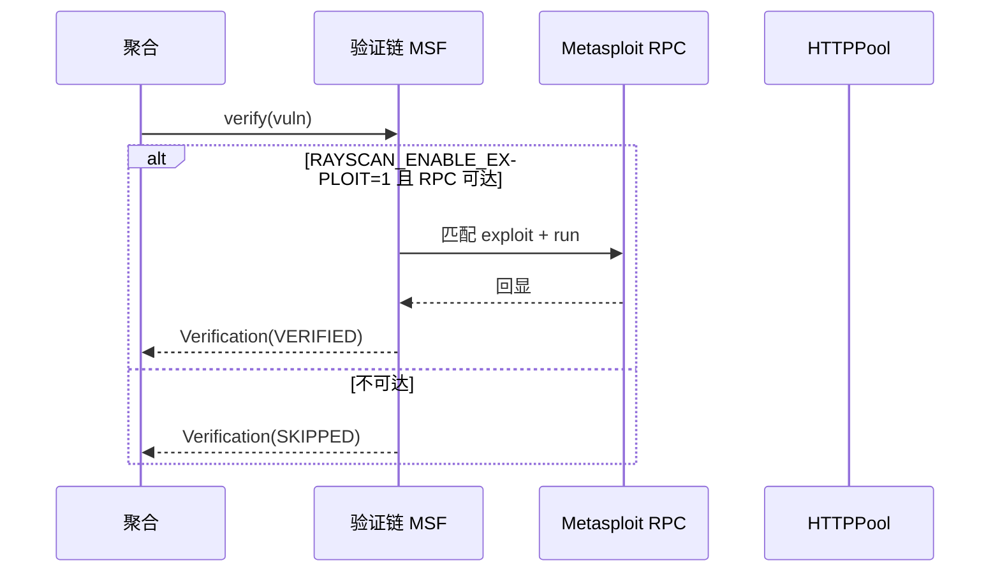

##### §3.2.M6.5 关键流程逻辑

```
触发：verify(vuln)

Step 1: 门禁（同步）
  ├── 校验：RAYSCAN_ENABLE_EXPLOIT == 1 → 否则 SKIPPED
  └── 校验：MSF RPC 127.0.0.1:55552 可达

Step 2: 验证（同步 RPC）
  ├── 匹配 exploit → 执行 → 收集证据
  └── 状态变更：t_verification.status = VERIFIED / UNVERIFIED
```

#### §3.2.M7 降噪与报告

##### §3.2.M7.1 模块概述

降噪与报告模块覆盖"多层降噪 + 报告生成"业务流程，业务逻辑在降噪、统一漏洞模型、报告器、scan_reports/ 之间流动。

##### §3.2.M7.2 接口清单

| 子领域 | 方法 | 路径 | 用途（≤ 20 字） | 请求 DTO | 响应 VO | 幂等 |
| --- | --- | --- | --- | --- | --- | --- |
| 报告 | POST | `/api/export` | 导出报告（JSON） | `ExportRequest` | 文件 | 否 |
| 报告 | 内部 | `reporter.generate(vulns, fmt)` | 生成报告 | — | `Report` | 天然 |

##### §3.2.M7.3 关键结构定义（DTO）

```python
class ExportRequest:
    # ===== 必填字段 =====
    task_id: str
    fmt: str            # json / html / markdown（MVP）
```

##### §3.2.M7.4 模块逻辑时序图

| 编号 | 标题（降噪与报告 - 生成） | 场景类别 | 是否包含异常分支 |
| --- | --- | --- | --- |
| SQ-01 | 降噪与报告 - 降噪生成 | 核心动作执行 | 是 |

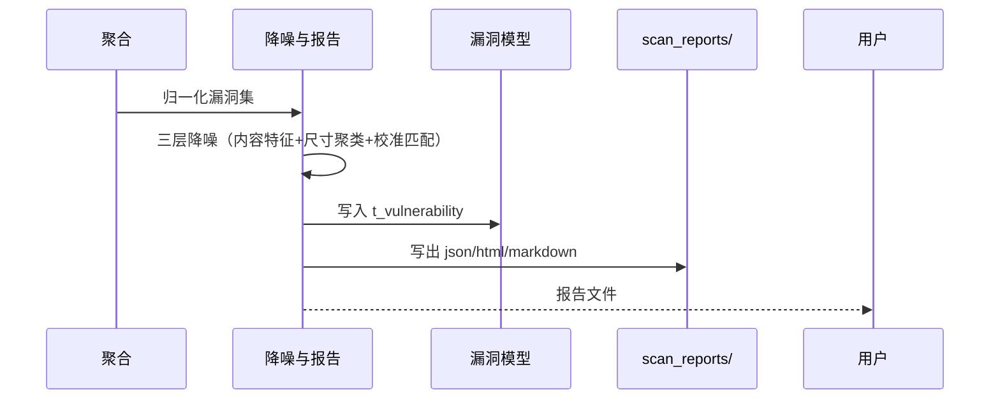

##### §3.2.M7.5 关键流程逻辑

```
触发：归一化漏洞集

Step 1: 多层降噪（同步）
  ├── 内容特征：相同响应体指纹合并
  ├── 尺寸聚类：相似页面尺寸聚类
  └── 校准匹配：误报校准

Step 2: 报告生成（同步）
  ├── reporter.generate(vulns, fmt)
  └── 写出 scan_reports/{task_id}.{fmt}
```

#### §3.2.M8 httpx HTTPPool

##### §3.2.M8.1 模块概述

HTTPPool 覆盖"异步 HTTP 连接池 / 限速 / 重试 / UA 轮换 / WAF 规避"基础能力，被检测执行域、聚合与验证域复用。

##### §3.2.M8.2 接口清单

| 子领域 | 方法 | 路径 | 用途（≤ 20 字） | 请求 DTO | 响应 VO | 幂等 |
| --- | --- | --- | --- | --- | --- | --- |
| HTTP | 内部 | `pool.get(url)` | 异步 GET（去重缓存） | — | `Response` | 天然 |
| HTTP | 内部 | `pool.post(url, data)` | 异步 POST | — | `Response` | 天然 |

##### §3.2.M8.3 关键结构定义（DTO）

```python
class HttpSessionConfig:
    max_requests_per_second: int = 20
    verify_ssl: bool = True
    timeout: int = 30
    retry_count: int = 1
```

##### §3.2.M8.4 模块逻辑时序图

| 编号 | 标题（HTTPPool - 请求） | 场景类别 | 是否包含异常分支 |
| --- | --- | --- | --- |
| SQ-01 | HTTPPool - 限速请求 | 核心动作执行 | 是 |

##### §3.2.M8.5 关键流程逻辑

无复杂状态机；读取 ConfigManager 的 max_requests_per_second/verify_ssl/timeout/retry_count，GET 跨模块去重缓存，指数退避重试。

#### §3.2.M9 OOB interactsh / DNSLog

##### §3.2.M9.1 模块概述

OOB 模块覆盖"带外回调检测"基础能力，被爬虫、检测模块复用，依赖公网可达 OOB 服务器。

##### §3.2.M9.2 接口清单

| 子领域 | 方法 | 路径 | 用途（≤ 20 字） | 请求 DTO | 响应 VO | 幂等 |
| --- | --- | --- | --- | --- | --- | --- |
| OOB | 内部 | `oob.register(payload)` | 注册带外 payload | — | `OOBEvent` | 天然 |
| OOB | 内部 | `oob.poll()` | 轮询回调 | — | `OOBEvent` | 天然 |

##### §3.2.M9.3 关键结构定义（DTO）

```python
class OOBEvent:
    event_id: str
    type: str        # dns / http
    data: str        # 回调内容
```

##### §3.2.M9.4 模块逻辑时序图

| 编号 | 标题（OOB - 回调） | 场景类别 | 是否包含异常分支 |
| --- | --- | --- | --- |
| SQ-01 | OOB - 注入与回调 | 核心动作执行 | 是 |

##### §3.2.M9.5 关键流程逻辑

无复杂状态机；注入带外 payload 后轮询 interactsh/DNSLog 回调，不可达时由 BD-03 降级关闭 OOB 分支。

#### §3.2.M10 Nuclei PoC 库

##### §3.2.M10.1 模块概述

Nuclei PoC 库模块覆盖"已知漏洞模板复用"基础能力，被多引擎聚合层复用。

##### §3.2.M10.2 接口清单

| 子领域 | 方法 | 路径 | 用途（≤ 20 字） | 请求 DTO | 响应 VO | 幂等 |
| --- | --- | --- | --- | --- | --- | --- |
| PoC | 内部 | `poc.load(templates)` | 加载模板 | — | `list[PocTemplate]` | 天然 |

##### §3.2.M10.3 关键结构定义（DTO）

```python
class PocTemplate:
    id: str
    severity: str
    tags: list[str]
```

##### §3.2.M10.4 模块逻辑时序图

省略（加载为同步文件读取，无跨系统交互）。

##### §3.2.M10.5 关键流程逻辑

无复杂状态机；从 poc_sources.yaml 加载 Nuclei 模板（钉固版本，U-02 口径标注），SQLite 缓存分类。

#### §3.2.M11 ConfigManager + Profile

##### §3.2.M11.1 模块概述

ConfigManager 覆盖"多源配置（env ≥ profile ≥ CLI ≥ default）"基础能力，被目标录入与授权、所有模块复用。

##### §3.2.M11.2 接口清单

| 子领域 | 方法 | 路径 | 用途（≤ 20 字） | 请求 DTO | 响应 VO | 幂等 |
| --- | --- | --- | --- | --- | --- | --- |
| 配置 | 内部 | `cfg.get(key)` | 点号键取值 | — | `Any` | 天然 |
| 配置 | CLI | `rayscan profile list` | 列出 Profile | — | `list[Profile]` | 天然 |

##### §3.2.M11.3 关键结构定义（DTO）

```python
class Profile:
    name: str
    description: str
    modules: dict          # enabled/disabled
    params: ScanConfig     # rate/threads/timeout/...
```

##### §3.2.M11.4 模块逻辑时序图

省略（配置读取为同步，无跨系统交互）。

##### §3.2.M11.5 关键流程逻辑

无复杂状态机；ConfigManager 多源合并（env 映射 WVS_* ≥ profile YAML ≥ CLI 参数 ≥ default），解决 X7 多套默认参数冲突（完整版统一键名，O4）。

#### §3.2.M12 统一漏洞模型

##### §3.2.M12.1 模块概述

统一漏洞模型模块定义 `Vulnerability` 与去重键，被检测执行域、聚合与验证域、降噪报告域共享（Shared Kernel）。

##### §3.2.M12.2 接口清单

| 子领域 | 方法 | 路径 | 用途（≤ 20 字） | 请求 DTO | 响应 VO | 幂等 |
| --- | --- | --- | --- | --- | --- | --- |
| 模型 | 内部 | `Vulnerability.from_dict` | 反序列化 | — | `Vulnerability` | 天然 |

##### §3.2.M12.3 关键结构定义（DTO）

```python
class Vulnerability:
    # ===== 基本信息 =====
    id: str                      # rule_id + url_hash
    target: str
    # ===== 业务字段 =====
    type: VulnerabilityType     # sql_injection/xss/...
    severity: Severity          # INFO/LOW/MEDIUM/HIGH/CRITICAL
    confidence: Confidence      # LOW/MEDIUM/HIGH/CERTAIN
    # ===== 状态字段 =====
    verified: bool = False
    # ===== 扩展 =====
    evidence: str
```

##### §3.2.M12.4 模块逻辑时序图

省略（模型为数据结构，无跨系统交互）。

##### §3.2.M12.5 关键流程逻辑

无复杂状态机；作为 Shared Kernel 被多域共享，去重键 `rule_id + url_hash` 保证聚合层一致性。

### 3.3 核心业务对象清单

#### 3.3.1 对象定义

| 编号 | 对象名（代码类名） | 对象类型 | 包路径 | 模块归属 | 被哪些模块复用 | 实例化策略 | 序列化约定 | 持久化策略 |
| --- | --- | --- | --- | --- | --- | --- | --- | --- |
| O-01 | `ScanTarget` | 聚合根 | `wvs.models` | M1 | M1/M2/M3 | 工厂方法 | JSON | 落表 → `t_scan_target` |
| O-02 | `ScanTask` | 聚合根 | `wvs.models` | M1/M3 | M1/M3/M7 | Builder | JSON | 落表 → `t_scan_task` |
| O-03 | `DetectionModule` | 实体 | `wvs.modules.base` | M4 | M3/M4 | ModuleFactory | JSON | 不落表（瞬时） |
| O-04 | `Vulnerability` | 聚合根 | `wvs.models` | M12 | M4/M5/M7 | 工厂 | JSON | 落表 → `t_vulnerability` |
| O-05 | `VulnDedupKey` | 值对象 | `wvs.models` | M12 | M5 | new（不可变） | String | 落表 → `t_vuln_dedup` |
| O-06 | `EngineResult` | 实体 | `wvs.integrations` | M5 | M5 | 由 ACL 转换 | JSON | 落表 → `t_engine_result` |
| O-07 | `Verification` | 实体 | `wvs.exploit` | M6 | M6 | new | JSON | 落表 → `t_verification` |
| O-08 | `Report` | 聚合根 | `wvs.reporting` | M7 | M7 | Builder | JSON/文件 | 落表 → `t_report` + 文件 |
| O-09 | `Profile` | 值对象 | `wvs.config` | M11 | M1/M11 | YAML 加载 | YAML | 落表 → `t_scan_profile` |
| O-10 | `OOBEvent` | 值对象 | `wvs.core.oob` | M9 | M2/M4/M9 | new | JSON | 落表 → `t_oob_event` |

**对象类型说明**：

| 类型 | 含义 |
| --- | --- |
| 聚合根（Aggregate Root） | 业务一致性边界；外部引用必须通过聚合根 ID |
| 实体（Entity） | 有标识、生命周期独立，但归属某个聚合根 |
| 值对象（Value Object） | 无标识、不可变 |
| 共享 DTO | 跨模块传输用的数据结构，无业务行为 |
| 共享枚举 | 跨模块的状态值 / 类型值 |
| 防腐层 ACL | 对接外部系统时的转换层（与 §2.2 ACL 关系对齐） |

#### 3.3.2 命名漂移登记表

| 业务实体（§2） | 代码类名（§3.3.1） | 数据表名（§4.2） | 漂移原因 |
| --- | --- | --- | --- |
| 扫描任务 | `ScanTask` | `t_scan_task` | 业务名"任务"映射代码 Task，表名 task 一致无漂移 |
| 漏洞 | `Vulnerability` | `t_vulnerability` | 完全一致 |
| 配置档 | `Profile` | `t_scan_profile` | 表名加 scan_ 前缀以归属目标与配置域 |

### 3.4 跨模块公共能力

**公共能力清单**：

| 公共能力 | 简述 | 提供方（SDK / 切面 / Bean） | 被哪些模块复用 | 接入方式 |
| --- | --- | --- | --- | --- |
| 配置中心 ConfigManager | 多源配置合并与读取 | `wvs.config.ConfigManager` | 全部模块 | 单例 Bean 注入 + `cfg.get(key)` |
| 统一日志与 traceId | 结构化日志 + 链路追踪 | `wvs.common.logging` + OTel | 全部模块 | 装饰器 / 上下文变量 |
| 限速与重试 | 请求限速 / 指数退避 | `wvs.core.rate_limiter` + `wvs.core.session` | M4/M8 | 方法级调用 |
| 授权门禁 | i-have-permission 校验 | `wvs.cli` / `web_ui` 拦截 | M1 | 入口校验 |

### 3.5 接口契约

#### 3.5.1 全局错误码体系

**错误码格式**：

| 项 | 取值 |
| --- | --- |
| 错误码格式 | `A010001`（1 位类别 + 2 位模块 + 3 位序号，6 位数字） |
| 分段规则 | 类别：A=业务错误（HTTP 200）/ B=系统错误（HTTP 5xx）/ C=客户端错误（HTTP 4xx） |
| 类别取值 | `A` / `B` / `C` |

**错误响应统一结构**：

```json
{
  "code": "A010001",
  "msg": "目标 URL 未通过授权校验",
  "msgI18n": { "zh-CN": "目标 URL 未通过授权校验", "en-US": "Target URL failed authorization" },
  "data": null,
  "traceId": "abc123",
  "timestamp": "2026-07-12T10:00:00.000Z"
}
```

**错误码注册表**：

| 错误码 | HTTP 状态 | 所属模块 | 含义 | 重试建议 | 用户文案 |
| --- | --- | --- | --- | --- | --- |
| A010001 | 200 | M1 | 未通过授权门禁 | 不重试 | 请确认已获得目标授权后重试 |
| A010002 | 200 | M1 | 目标 URL 格式非法 | 不重试 | 目标 URL 必须以 http/https 开头 |
| A010003 | 200 | M3 | 达到 max_time 超时抢救 | 不重试 | 扫描已超时，返回部分结果 |
| A050001 | 200 | M5 | 外部引擎不可用已降级 | 不重试 | 部分引擎不可用，其余结果正常 |
| B999001 | 500 | 全局 | 系统内部错误 | 可重试 | 系统繁忙，请稍后再试 |
| C400001 | 400 | 全局 | 参数校验失败 | 不重试 | 参数错误 |
| C401001 | 401 | 全局 | 未登录 / 未授权 | 不重试 | 请重新登录 |
| C403001 | 403 | 全局 | 无权限 | 不重试 | 无权访问 |
| C429001 | 429 | 全局 | 触发限流 | 退避后重试 | 操作太频繁，请稍后再试 |

#### 3.5.2 幂等性约定

| 接口类型 | 是否要求幂等 | 幂等键来源（建议） |
| --- | --- | --- |
| 写入类（POST 创建扫描） | 必须幂等 | Header `X-Idempotency-Key`（UUID，调用方生成） |
| 更新类（PUT / PATCH） | 必须幂等 | 资源 ID + 版本号（乐观锁） |
| 删除类（DELETE） | 天然幂等 | — |
| 查询类（GET） | 天然幂等 | — |
| 验证链 / 外部引擎触发 | **强制幂等** | 业务侧请求号（biz_req_no） |

**幂等设计需考虑的问题**：

| 问题维度 | 设计要点 |
| --- | --- |
| 幂等键的生命周期 | 保留 24h（短期防抖） |
| 重复请求的语义 | 返回相同响应（scan 已存在则返回原 task_id） |
| 执行中态的处理 | 第一个请求未返回时，第二个返回"处理中" |
| 失败请求的可重试性 | 失败后允许同一幂等键重试 |
| 存储兜底 | SQLite `uk_task_biz` 唯一索引作为最终防线 |

#### 3.5.3 限流约定

| 维度 | 默认值 | 触发动作 | 调整方式 |
| --- | --- | --- | --- |
| 全局 QPS（HTTPPool） | 20 req/s（per target） | 排队限速 | ConfigManager |
| 单 IP QPS | 20 | 排队 | ConfigManager |
| 单用户 QPS | 1 并发扫描 | 拒绝新增 | 业务配置 |
| 重保接口（验证链） | 单目标 1 次/分钟 | 锁定 15 分钟 | 业务配置 |

**降级策略**：

| 策略项 | 内容 |
| --- | --- |
| 前端退避 | 触发限流后，前端必须按 `Retry-After` Header 退避重试 |
| 后端记录 | 后端写入类接口同时记录到限速队列 |
| 红线联动 | 限流红线值与 §5.5 容量水位线"红线"一致 |

#### 3.5.4 默认超时与重试基线

| 调用类型 | 默认超时 | 默认重试 | 重试条件 |
| --- | --- | --- | --- |
| 同步 API（内部模块） | 30s | 0 次 | — |
| 同步 API（外部 E-03 REST） | 10s | 2 次（指数退避 1s / 2s） | 仅网络错误 / 5xx |
| 子进程（E-02 外部二进制） | 300s | 1 次 | 非零退出 |
| 异步 MQ 消费 | 不适用（进程内队列） | — | — |
| 定时任务 | 5min | 3 次 | 失败告警 |

**填写要求**：超时值禁止"无限"；所有重试必须有上限；重试不能产生副作用（依赖 §3.5.2 幂等性）。

#### 3.5.5 路由设计规范

**API 路由规范**：

| 维度 | 取值 |
| --- | --- |
| 风格 | RESTful（资源化 URL） |
| 版本控制 | 路径版本 `/api/v1/...` |
| 命名 | 小写 + 中划线（kebab-case） |
| 资源命名 | 名词复数（`/api/v1/scans`） |
| 子资源 | `/api/v1/scans/{id}/stop` |
| 动作类接口 | `/api/v1/resource/{id}/action`（POST） |

**前端页面路由清单**（Web UI 单页，SSE 实时）：

| 路径 | 页面 / 功能 | 入口角色（§2.3） | 鉴权要求 | 关联模块（§3.2.M{N}） |
| --- | --- | --- | --- | --- |
| `/` | 扫描发起页 | 安全研究员 / SRC 白帽 | 已登录（0.0.0.0 强制） | M1 |
| `/stream` | 实时日志 / 进度页 | SRC 白帽 | 已登录 + Token | M3/M7 |
| `/history` | 扫描历史 / 统计页 | 运维 | 已登录 | M7 |
| `/stop` | 停止扫描页 | 运维 | 已登录 | M3 |
| `/export` | 报告导出页（仅 json，MVP） | 安全研究员 | 已登录 | M7 |

**前端路由约定**：

| 维度 | 取值 |
| --- | --- |
| 路由模式 | History |
| 命名风格 | 小写 + 中划线（kebab-case） |
| 动态参数 | `/scans/:id` |
| 鉴权方式 | 路由元信息 `meta.requireAuth = true`，全局路由守卫拦截 |
| 嵌套路由 | 列表页 → 详情页 → 子模块页 |

---

## 4. 数据库设计

> **本章回答**：每个模块的状态用什么表存、表怎么建、数据怎么清理、缓存怎么用。
> **核心方法论**：**数据库按业务域组织，业务域与第 2 章 / 第 3 章保持一致**。

### 4.1 全局数据约定

| 约定项 | 取值 | 说明 |
| --- | --- | --- |
| 命名规范（表名） | `t_{entity}` 业务主表；`t_{entity}_ext` 扩展表 | 全项目统一前缀 `t_` |
| 命名规范（字段名） | 小写 + 下划线（snake_case） | 禁止驼峰 |
| 主键类型 | `TEXT`（UUID）主键，业务 id 用 UUID；任务号用 UUID | 单租户场景 UUID 足够，禁止混用自增与 UUID |
| 字符集 / 排序 | `utf8mb4 / utf8mb4_unicode_ci` | 支持 emoji 与多语言 |
| 时间字段类型 | `DATETIME` UTC 存储（ISO8601 文本） | 统一时区（UTC） |
| 软删除字段 | `deleted TINYINT(1) DEFAULT 0` | 二选一锁定，全项目统一 |
| 审计字段 | `created_by / created_at / updated_by / updated_at` | 命名锁定 |
| 隔离字段（多租户） | `tenant_id TEXT NOT NULL DEFAULT 'single'` | 多租户=否，固定单租户标识，字段必须存在 |
| 业务唯一标识 | `biz_id VARCHAR(100)` | 与外部系统对齐时使用 |
| 状态枚举 | `VARCHAR` 字符串 | 二选一并锁定；DDL 注释列出全部取值 |
| 金额字段 | 不适用（安全扫描无金额） | — |
| 手机号存储 | 不适用 | — |

### 4.2 单表设计

#### 4.2.1 t_scan_target（目标与配置域）

| 字段 | 取值 |
| --- | --- |
| 数据库类型 | SQLite 3.45 |
| 库名 | `rayscan.db` |
| 表名 | `t_scan_target` |
| 业务含义（≤ 50 字） | 被授权检测的 Web 应用目标与授权状态 |
| 模块归属（§3.2） | M1 |
| 对应核心对象（§3.3） | O-01 `ScanTarget` |

#### 4.2.2 库表结构定义

| 列名 | 数据类型 | 可为空 | 约束 | 默认值 | 备注 |
| --- | --- | --- | --- | --- | --- |
| id | TEXT | NOT NULL | PRIMARY KEY | — | UUID |
| tenant_id | TEXT | NOT NULL | — | 'single' | 单租户固定标识 |
| target_url | TEXT | NOT NULL | — | — | 目标 URL（http/https） |
| authorized | INTEGER | NOT NULL | — | 0 | 授权状态 0/1 |
| auth_type | TEXT | NULL | — | NULL | form/bearer/basic/apikey/cookie |
| created_at | DATETIME | NULL | — | CURRENT_TIMESTAMP | 创建时间 |
| updated_at | DATETIME | NULL | — | CURRENT_TIMESTAMP | 更新时间 |
| deleted | TINYINT(1) | NOT NULL | — | 0 | 删除标志 |

#### 4.2.3 索引设计

| 索引名 | 索引类型 | 字段（含顺序） | 设计目的 | 关联查询场景 |
| --- | --- | --- | --- | --- |
| `PRIMARY` | 主键 | `id` | 唯一标识 | 按主键查询 |
| `uk_tenant_url` | 唯一索引 | `tenant_id, target_url` | 防止重复录入 | 录入去重 |
| `idx_created_at` | 普通索引 | `created_at` | 时间排序 | 按时间倒序列表 |

#### 4.2.4 DDL

```sql
CREATE TABLE t_scan_target (
  id TEXT NOT NULL PRIMARY KEY,
  tenant_id TEXT NOT NULL DEFAULT 'single',
  target_url TEXT NOT NULL,
  authorized INTEGER NOT NULL DEFAULT 0,
  auth_type TEXT,
  created_at DATETIME DEFAULT CURRENT_TIMESTAMP,
  updated_at DATETIME DEFAULT CURRENT_TIMESTAMP,
  deleted TINYINT(1) NOT NULL DEFAULT 0,
  UNIQUE KEY uk_tenant_url (tenant_id, target_url)
);
```

#### 4.2.5 扩展逻辑（数据清理机制）

| 清理机制 | 适用场景 | 配置 |
| --- | --- | --- |
| 软删 | 目标逻辑删除 | 仅置 deleted=1，定期物理清理（≥ 90 天） |

#### 4.2.1 t_scan_profile（目标与配置域）

| 字段 | 取值 |
| --- | --- |
| 数据库类型 | SQLite 3.45 |
| 库名 | `rayscan.db` |
| 表名 | `t_scan_profile` |
| 业务含义（≤ 50 字） | Profile 预设参数集合（模块开关 + 性能参数） |
| 模块归属（§3.2） | M11 |
| 对应核心对象（§3.3） | O-09 `Profile` |

#### 4.2.2 库表结构定义

| 列名 | 数据类型 | 可为空 | 约束 | 默认值 | 备注 |
| --- | --- | --- | --- | --- | --- |
| id | TEXT | NOT NULL | PRIMARY KEY | — | UUID |
| tenant_id | TEXT | NOT NULL | — | 'single' | 单租户标识 |
| name | TEXT | NOT NULL | — | — | default/src-quick/pentest-full/sqli-only |
| description | TEXT | NULL | — | NULL | 描述 |
| params_json | TEXT | NOT NULL | — | — | ScanConfig JSON |
| created_at | DATETIME | NULL | — | CURRENT_TIMESTAMP | 创建时间 |
| updated_at | DATETIME | NULL | — | CURRENT_TIMESTAMP | 更新时间 |
| deleted | TINYINT(1) | NOT NULL | — | 0 | 删除标志 |

#### 4.2.3 索引设计

| 索引名 | 索引类型 | 字段（含顺序） | 设计目的 | 关联查询场景 |
| --- | --- | --- | --- | --- |
| `PRIMARY` | 主键 | `id` | 唯一标识 | 按主键查询 |
| `uk_tenant_name` | 唯一索引 | `tenant_id, name` | Profile 名唯一 | `rayscan profile list` |

#### 4.2.4 DDL

```sql
CREATE TABLE t_scan_profile (
  id TEXT NOT NULL PRIMARY KEY,
  tenant_id TEXT NOT NULL DEFAULT 'single',
  name TEXT NOT NULL,
  description TEXT,
  params_json TEXT NOT NULL,
  created_at DATETIME DEFAULT CURRENT_TIMESTAMP,
  updated_at DATETIME DEFAULT CURRENT_TIMESTAMP,
  deleted TINYINT(1) NOT NULL DEFAULT 0,
  UNIQUE KEY uk_tenant_name (tenant_id, name)
);
```

#### 4.2.5 扩展逻辑（数据清理机制）

| 清理机制 | 适用场景 | 配置 |
| --- | --- | --- |
| 无 | 内置 Profile 永久保留；用户自定义可软删 | — |

#### 4.2.1 t_scan_task（检测执行域）

| 字段 | 取值 |
| --- | --- |
| 数据库类型 | SQLite 3.45 |
| 库名 | `rayscan.db` |
| 表名 | `t_scan_task` |
| 业务含义（≤ 50 字） | 一次完整扫描会话的生命周期实体 |
| 模块归属（§3.2） | M1/M3 |
| 对应核心对象（§3.3） | O-02 `ScanTask` |

#### 4.2.2 库表结构定义

| 列名 | 数据类型 | 可为空 | 约束 | 默认值 | 备注 |
| --- | --- | --- | --- | --- | --- |
| id | TEXT | NOT NULL | PRIMARY KEY | — | UUID |
| tenant_id | TEXT | NOT NULL | — | 'single' | 单租户标识 |
| target_id | TEXT | NOT NULL | — | — | 关联 t_scan_target |
| biz_id | TEXT | NULL | — | NULL | 幂等业务号 |
| status | VARCHAR(30) | NOT NULL | — | 'INIT' | INIT/RUNNING/DONE/FAILED/STOPPED |
| modules_json | TEXT | NULL | — | NULL | 启用模块列表 |
| started_at | DATETIME | NULL | — | NULL | 开始时间 |
| finished_at | DATETIME | NULL | — | NULL | 结束时间 |
| created_at | DATETIME | NULL | — | CURRENT_TIMESTAMP | 创建时间 |
| updated_at | DATETIME | NULL | — | CURRENT_TIMESTAMP | 更新时间 |
| deleted | TINYINT(1) | NOT NULL | — | 0 | 删除标志 |

#### 4.2.3 索引设计

| 索引名 | 索引类型 | 字段（含顺序） | 设计目的 | 关联查询场景 |
| --- | --- | --- | --- | --- |
| `PRIMARY` | 主键 | `id` | 唯一标识 | 按主键查询 |
| `uk_tenant_biz` | 唯一索引 | `tenant_id, biz_id` | 幂等去重 | 重复提交拦截 |
| `idx_tenant_status` | 普通索引 | `tenant_id, status` | 列表查询 | `/api/history` |

#### 4.2.4 DDL

```sql
CREATE TABLE t_scan_task (
  id TEXT NOT NULL PRIMARY KEY,
  tenant_id TEXT NOT NULL DEFAULT 'single',
  target_id TEXT NOT NULL,
  biz_id TEXT,
  status VARCHAR(30) NOT NULL DEFAULT 'INIT',
  modules_json TEXT,
  started_at DATETIME,
  finished_at DATETIME,
  created_at DATETIME DEFAULT CURRENT_TIMESTAMP,
  updated_at DATETIME DEFAULT CURRENT_TIMESTAMP,
  deleted TINYINT(1) NOT NULL DEFAULT 0,
  UNIQUE KEY uk_tenant_biz (tenant_id, biz_id)
);
```

#### 4.2.5 扩展逻辑（数据清理机制）

| 清理机制 | 适用场景 | 配置 |
| --- | --- | --- |
| 归档 | 历史任务 ≥ 90 天归档至对象存储（完整版） | 调度任务触发 |

#### 4.2.1 t_module_run（检测执行域）

| 字段 | 取值 |
| --- | --- |
| 数据库类型 | SQLite 3.45 |
| 库名 | `rayscan.db` |
| 表名 | `t_module_run` |
| 业务含义（≤ 50 字） | 单次扫描中单个检测模块的运行记录 |
| 模块归属（§3.2） | M4 |
| 对应核心对象（§3.3） | O-03 `DetectionModule` |

#### 4.2.2 库表结构定义

| 列名 | 数据类型 | 可为空 | 约束 | 默认值 | 备注 |
| --- | --- | --- | --- | --- | --- |
| id | TEXT | NOT NULL | PRIMARY KEY | — | UUID |
| tenant_id | TEXT | NOT NULL | — | 'single' | 单租户标识 |
| task_id | TEXT | NOT NULL | — | — | 关联 t_scan_task |
| module_name | TEXT | NOT NULL | — | — | sqli/xss/.../oa |
| status | VARCHAR(30) | NOT NULL | — | 'PENDING' | PENDING/RUNNING/DONE/FAILED |
| found_count | INTEGER | NOT NULL | — | 0 | 发现漏洞数 |
| created_at | DATETIME | NULL | — | CURRENT_TIMESTAMP | 创建时间 |
| updated_at | DATETIME | NULL | — | CURRENT_TIMESTAMP | 更新时间 |
| deleted | TINYINT(1) | NOT NULL | — | 0 | 删除标志 |

#### 4.2.3 索引设计

| 索引名 | 索引类型 | 字段（含顺序） | 设计目的 | 关联查询场景 |
| --- | --- | --- | --- | --- |
| `PRIMARY` | 主键 | `id` | 唯一标识 | 按主键查询 |
| `idx_task_module` | 普通索引 | `task_id, module_name` | 模块结果查询 | 报告聚合 |

#### 4.2.4 DDL

```sql
CREATE TABLE t_module_run (
  id TEXT NOT NULL PRIMARY KEY,
  tenant_id TEXT NOT NULL DEFAULT 'single',
  task_id TEXT NOT NULL,
  module_name TEXT NOT NULL,
  status VARCHAR(30) NOT NULL DEFAULT 'PENDING',
  found_count INTEGER NOT NULL DEFAULT 0,
  created_at DATETIME DEFAULT CURRENT_TIMESTAMP,
  updated_at DATETIME DEFAULT CURRENT_TIMESTAMP,
  deleted TINYINT(1) NOT NULL DEFAULT 0
);
```

#### 4.2.5 扩展逻辑（数据清理机制）

| 清理机制 | 适用场景 | 配置 |
| --- | --- | --- |
| 物理删除 | 随任务归档清理 | ≥ 90 天 |

#### 4.2.1 t_vulnerability（漏洞模型域）

| 字段 | 取值 |
| --- | --- |
| 数据库类型 | SQLite 3.45 |
| 库名 | `rayscan.db` |
| 表名 | `t_vulnerability` |
| 业务含义（≤ 50 字） | 统一漏洞模型实例（聚合归一主键） |
| 模块归属（§3.2） | M12 |
| 对应核心对象（§3.3） | O-04 `Vulnerability` |

#### 4.2.2 库表结构定义

| 列名 | 数据类型 | 可为空 | 约束 | 默认值 | 备注 |
| --- | --- | --- | --- | --- | --- |
| id | TEXT | NOT NULL | PRIMARY KEY | — | rule_id + url_hash |
| tenant_id | TEXT | NOT NULL | — | 'single' | 单租户标识 |
| task_id | TEXT | NOT NULL | — | — | 关联任务 |
| target_url | TEXT | NOT NULL | — | — | 目标 URL |
| vuln_type | VARCHAR(30) | NOT NULL | — | — | sql_injection/xss/... |
| severity | VARCHAR(20) | NOT NULL | — | 'LOW' | INFO/LOW/MEDIUM/HIGH/CRITICAL |
| confidence | VARCHAR(20) | NOT NULL | — | 'LOW' | LOW/MEDIUM/HIGH/CERTAIN |
| verified | INTEGER | NOT NULL | — | 0 | 验证链结果 0/1 |
| evidence | TEXT | NULL | — | NULL | 验证证据 |
| created_at | DATETIME | NULL | — | CURRENT_TIMESTAMP | 创建时间 |
| updated_at | DATETIME | NULL | — | CURRENT_TIMESTAMP | 更新时间 |
| deleted | TINYINT(1) | NOT NULL | — | 0 | 删除标志 |

#### 4.2.3 索引设计

| 索引名 | 索引类型 | 字段（含顺序） | 设计目的 | 关联查询场景 |
| --- | --- | --- | --- | --- |
| `PRIMARY` | 主键 | `id` | 去重主键 | 按主键查询 |
| `uk_tenant_task_type_url` | 唯一索引 | `tenant_id, task_id, vuln_type, target_url` | 同任务同类型同 URL 唯一 | 聚合去重 |
| `idx_tenant_severity` | 普通索引 | `tenant_id, severity` |  severity 统计 | 报告统计 |

#### 4.2.4 DDL

```sql
CREATE TABLE t_vulnerability (
  id TEXT NOT NULL PRIMARY KEY,
  tenant_id TEXT NOT NULL DEFAULT 'single',
  task_id TEXT NOT NULL,
  target_url TEXT NOT NULL,
  vuln_type VARCHAR(30) NOT NULL,
  severity VARCHAR(20) NOT NULL DEFAULT 'LOW',
  confidence VARCHAR(20) NOT NULL DEFAULT 'LOW',
  verified INTEGER NOT NULL DEFAULT 0,
  evidence TEXT,
  created_at DATETIME DEFAULT CURRENT_TIMESTAMP,
  updated_at DATETIME DEFAULT CURRENT_TIMESTAMP,
  deleted TINYINT(1) NOT NULL DEFAULT 0,
  UNIQUE KEY uk_tenant_task_type_url (tenant_id, task_id, vuln_type, target_url)
);
```

#### 4.2.5 扩展逻辑（数据清理机制）

| 清理机制 | 适用场景 | 配置 |
| --- | --- | --- |
| 无 | 漏洞数据随任务保留，供审计 | — |

#### 4.2.1 t_vuln_dedup（漏洞模型域）

| 字段 | 取值 |
| --- | --- |
| 数据库类型 | SQLite 3.45 |
| 库名 | `rayscan.db` |
| 表名 | `t_vuln_dedup` |
| 业务含义（≤ 50 字） | 漏洞去重键（rule_id + URL hash）登记 |
| 模块归属（§3.2） | M12 |
| 对应核心对象（§3.3） | O-05 `VulnDedupKey` |

#### 4.2.2 库表结构定义

| 列名 | 数据类型 | 可为空 | 约束 | 默认值 | 备注 |
| --- | --- | --- | --- | --- | --- |
| id | TEXT | NOT NULL | PRIMARY KEY | — | UUID |
| tenant_id | TEXT | NOT NULL | — | 'single' | 单租户标识 |
| rule_id | TEXT | NOT NULL | — | — | 漏洞规则 ID |
| url_hash | TEXT | NOT NULL | — | — | 目标 URL hash |
| first_seen | DATETIME | NULL | — | CURRENT_TIMESTAMP | 首次发现 |
| deleted | TINYINT(1) | NOT NULL | — | 0 | 删除标志 |

#### 4.2.3 索引设计

| 索引名 | 索引类型 | 字段（含顺序） | 设计目的 | 关联查询场景 |
| --- | --- | --- | --- | --- |
| `PRIMARY` | 主键 | `id` | 唯一标识 | 按主键查询 |
| `uk_rule_url` | 唯一索引 | `rule_id, url_hash` | 去重键唯一 | 聚合去重 |

#### 4.2.4 DDL

```sql
CREATE TABLE t_vuln_dedup (
  id TEXT NOT NULL PRIMARY KEY,
  tenant_id TEXT NOT NULL DEFAULT 'single',
  rule_id TEXT NOT NULL,
  url_hash TEXT NOT NULL,
  first_seen DATETIME DEFAULT CURRENT_TIMESTAMP,
  deleted TINYINT(1) NOT NULL DEFAULT 0,
  UNIQUE KEY uk_rule_url (rule_id, url_hash)
);
```

#### 4.2.5 扩展逻辑（数据清理机制）

| 清理机制 | 适用场景 | 配置 |
| --- | --- | --- |
| 无 | 去重键长期保留 | — |

#### 4.2.1 t_engine_result（聚合与验证域）

| 字段 | 取值 |
| --- | --- |
| 数据库类型 | SQLite 3.45 |
| 库名 | `rayscan.db` |
| 表名 | `t_engine_result` |
| 业务含义（≤ 50 字） | 外部引擎原始结果（经 ACL 转换后） |
| 模块归属（§3.2） | M5 |
| 对应核心对象（§3.3） | O-06 `EngineResult` |

#### 4.2.2 库表结构定义

| 列名 | 数据类型 | 可为空 | 约束 | 默认值 | 备注 |
| --- | --- | --- | --- | --- | --- |
| id | TEXT | NOT NULL | PRIMARY KEY | — | UUID |
| tenant_id | TEXT | NOT NULL | — | 'single' | 单租户标识 |
| task_id | TEXT | NOT NULL | — | — | 关联任务 |
| source | VARCHAR(30) | NOT NULL | — | — | awvs/nessus/nuclei/sqlmap/ffuf/wappalyzer/msf |
| raw_json | TEXT | NULL | — | NULL | 上游原始结果（ACL 转换前） |
| normalized_json | TEXT | NULL | — | NULL | 统一模型 |
| created_at | DATETIME | NULL | — | CURRENT_TIMESTAMP | 创建时间 |
| deleted | TINYINT(1) | NOT NULL | — | 0 | 删除标志 |

#### 4.2.3 索引设计

| 索引名 | 索引类型 | 字段（含顺序） | 设计目的 | 关联查询场景 |
| --- | --- | --- | --- | --- |
| `PRIMARY` | 主键 | `id` | 唯一标识 | 按主键查询 |
| `idx_task_source` | 普通索引 | `task_id, source` | 按引擎查结果 | 聚合溯源 |

#### 4.2.4 DDL

```sql
CREATE TABLE t_engine_result (
  id TEXT NOT NULL PRIMARY KEY,
  tenant_id TEXT NOT NULL DEFAULT 'single',
  task_id TEXT NOT NULL,
  source VARCHAR(30) NOT NULL,
  raw_json TEXT,
  normalized_json TEXT,
  created_at DATETIME DEFAULT CURRENT_TIMESTAMP,
  deleted TINYINT(1) NOT NULL DEFAULT 0
);
```

#### 4.2.5 扩展逻辑（数据清理机制）

| 清理机制 | 适用场景 | 配置 |
| --- | --- | --- |
| 物理删除 | 原始结果占用大，≥ 30 天清理 | 调度任务 |

#### 4.2.1 t_verification（聚合与验证域）

| 字段 | 取值 |
| --- | --- |
| 数据库类型 | SQLite 3.45 |
| 库名 | `rayscan.db` |
| 表名 | `t_verification` |
| 业务含义（≤ 50 字） | Metasploit 验证链结果 |
| 模块归属（§3.2） | M6 |
| 对应核心对象（§3.3） | O-07 `Verification` |

#### 4.2.2 库表结构定义

| 列名 | 数据类型 | 可为空 | 约束 | 默认值 | 备注 |
| --- | --- | --- | --- | --- | --- |
| id | TEXT | NOT NULL | PRIMARY KEY | — | UUID |
| tenant_id | TEXT | NOT NULL | — | 'single' | 单租户标识 |
| vuln_id | TEXT | NOT NULL | — | — | 关联 t_vulnerability |
| status | VARCHAR(20) | NOT NULL | — | 'SKIPPED' | VERIFIED/UNVERIFIED/SKIPPED |
| evidence | TEXT | NULL | — | NULL | 验证证据 |
| created_at | DATETIME | NULL | — | CURRENT_TIMESTAMP | 创建时间 |
| deleted | TINYINT(1) | NOT NULL | — | 0 | 删除标志 |

#### 4.2.3 索引设计

| 索引名 | 索引类型 | 字段（含顺序） | 设计目的 | 关联查询场景 |
| --- | --- | --- | --- | --- |
| `PRIMARY` | 主键 | `id` | 唯一标识 | 按主键查询 |
| `idx_vuln` | 普通索引 | `vuln_id` | 按漏洞查验证 | 报告展示 |

#### 4.2.4 DDL

```sql
CREATE TABLE t_verification (
  id TEXT NOT NULL PRIMARY KEY,
  tenant_id TEXT NOT NULL DEFAULT 'single',
  vuln_id TEXT NOT NULL,
  status VARCHAR(20) NOT NULL DEFAULT 'SKIPPED',
  evidence TEXT,
  created_at DATETIME DEFAULT CURRENT_TIMESTAMP,
  deleted TINYINT(1) NOT NULL DEFAULT 0
);
```

#### 4.2.5 扩展逻辑（数据清理机制）

| 清理机制 | 适用场景 | 配置 |
| --- | --- | --- |
| 无 | 验证记录保留供审计 | — |

#### 4.2.1 t_report（降噪报告域）

| 字段 | 取值 |
| --- | --- |
| 数据库类型 | SQLite 3.45 |
| 库名 | `rayscan.db` |
| 表名 | `t_report` |
| 业务含义（≤ 50 字） | 扫描产出的可读/可机读报告元数据 |
| 模块归属（§3.2） | M7 |
| 对应核心对象（§3.3） | O-08 `Report` |

#### 4.2.2 库表结构定义

| 列名 | 数据类型 | 可为空 | 约束 | 默认值 | 备注 |
| --- | --- | --- | --- | --- | --- |
| id | TEXT | NOT NULL | PRIMARY KEY | — | UUID |
| tenant_id | TEXT | NOT NULL | — | 'single' | 单租户标识 |
| task_id | TEXT | NOT NULL | — | — | 关联任务 |
| fmt | VARCHAR(20) | NOT NULL | — | 'json' | json/html/markdown |
| file_path | TEXT | NOT NULL | — | — | scan_reports/ 路径 |
| created_at | DATETIME | NULL | — | CURRENT_TIMESTAMP | 创建时间 |
| deleted | TINYINT(1) | NOT NULL | — | 0 | 删除标志 |

#### 4.2.3 索引设计

| 索引名 | 索引类型 | 字段（含顺序） | 设计目的 | 关联查询场景 |
| --- | --- | --- | --- | --- |
| `PRIMARY` | 主键 | `id` | 唯一标识 | 按主键查询 |
| `idx_task` | 普通索引 | `task_id` | 按任务查报告 | `/api/export` |

#### 4.2.4 DDL

```sql
CREATE TABLE t_report (
  id TEXT NOT NULL PRIMARY KEY,
  tenant_id TEXT NOT NULL DEFAULT 'single',
  task_id TEXT NOT NULL,
  fmt VARCHAR(20) NOT NULL DEFAULT 'json',
  file_path TEXT NOT NULL,
  created_at DATETIME DEFAULT CURRENT_TIMESTAMP,
  deleted TINYINT(1) NOT NULL DEFAULT 0
);
```

#### 4.2.5 扩展逻辑（数据清理机制）

| 清理机制 | 适用场景 | 配置 |
| --- | --- | --- |
| 物理删除 | 报告文件 + 元数据 ≥ 180 天清理 | 调度任务 |

#### 4.2.1 t_oob_event（基础引擎域）

| 字段 | 取值 |
| --- | --- |
| 数据库类型 | SQLite 3.45 |
| 库名 | `rayscan.db` |
| 表名 | `t_oob_event` |
| 业务含义（≤ 50 字） | interactsh/DNSLog 带外回调事件 |
| 模块归属（§3.2） | M9 |
| 对应核心对象（§3.3） | O-10 `OOBEvent` |

#### 4.2.2 库表结构定义

| 列名 | 数据类型 | 可为空 | 约束 | 默认值 | 备注 |
| --- | --- | --- | --- | --- | --- |
| id | TEXT | NOT NULL | PRIMARY KEY | — | UUID |
| tenant_id | TEXT | NOT NULL | — | 'single' | 单租户标识 |
| task_id | TEXT | NOT NULL | — | — | 关联任务 |
| event_type | VARCHAR(20) | NOT NULL | — | — | dns/http |
| payload | TEXT | NULL | — | NULL | 回调内容 |
| created_at | DATETIME | NULL | — | CURRENT_TIMESTAMP | 创建时间 |
| deleted | TINYINT(1) | NOT NULL | — | 0 | 删除标志 |

#### 4.2.3 索引设计

| 索引名 | 索引类型 | 字段（含顺序） | 设计目的 | 关联查询场景 |
| --- | --- | --- | --- | --- |
| `PRIMARY` | 主键 | `id` | 唯一标识 | 按主键查询 |
| `idx_task` | 普通索引 | `task_id` | 按任务查 OOB | 漏洞关联 |

#### 4.2.4 DDL

```sql
CREATE TABLE t_oob_event (
  id TEXT NOT NULL PRIMARY KEY,
  tenant_id TEXT NOT NULL DEFAULT 'single',
  task_id TEXT NOT NULL,
  event_type VARCHAR(20) NOT NULL,
  payload TEXT,
  created_at DATETIME DEFAULT CURRENT_TIMESTAMP,
  deleted TINYINT(1) NOT NULL DEFAULT 0
);
```

#### 4.2.5 扩展逻辑（数据清理机制）

| 清理机制 | 适用场景 | 配置 |
| --- | --- | --- |
| 物理删除 | OOB 事件临时性强，≥ 7 天清理 | 调度任务 |

### 4.3 数据部署与备份

#### 4.3.1 存储清单

| 存储类型 | 用途 | 部署模式 | HA 方案 | 备份策略 | 日志 / 审计去向 |
| --- | --- | --- | --- | --- | --- |
| SQLite（主库） | 业务主数据（任务/漏洞/报告） | 单文件嵌入式 | 单文件副本 + 定时备份 | 全量每日 + 增量按需，归档至 scan_reports/backup | 文件系统 |
| 文件系统 | 报告文件 / Profile | 单节点 | 挂载卷副本 | 随扫描产出 | 文件系统 |
| 外部二进制 | Nuclei/sqlmap/ffuf 运行时 | 宿主机 / Docker 内置 | 钉固版本 | 镜像内置 | — |
| OOB 服务器 | 带外回调 | 公网可达 | 公共/自建冗余 | 无状态 | — |

#### 4.3.2 备份与恢复

| 维度 | 取值 |
| --- | --- |
| 备份方式 | 全量 + 增量；冷备 |
| 备份位置 | 与生产环境物理隔离的备份卷 / 对象存储 |
| 保留策略 | 全量保留 30 天；增量保留 7 天 |
| RPO（数据丢失容忍） | ≤ 15 分钟（与 §5.3 SLA 自洽） |
| RTO（恢复时间目标） | ≤ 30 分钟 |
| 恢复演练 | 频率 半年；负责人 @运维 |

### 4.4 缓存与 Key 规范

> RayScan MVP 为单进程自托管，缓存以"内存 + SQLite"为主，不引入独立 Redis。以下规范覆盖内存去重键与限速计数。

#### 4.4.1 Key 命名规范

| 规则项 | 取值 |
| --- | --- |
| 统一前缀 | 内存缓存用模块前缀，如 `crawl:` / `http:` / `dedup:` |
| 多级分隔符 | 用冒号 `:` 分层 |
| 变量占位 | 用 `{}` 表示变量部分，如 `dedup:{rule_id}:{url_hash}` |
| 环境隔离 | 单进程无多环境，不使用 Key 前缀做环境隔离 |

#### 4.4.2 缓存策略与一致性

| 维度 | 在设计阶段需要明确的内容 |
| --- | --- |
| 读写策略 | Cache-Aside：GET 跨模块去重缓存（HTTPPool），未命中回源 |
| 一致性级别 | 最终一致（单进程内存，无需强一致） |
| 更新顺序 | 缓存随进程生命周期，进程重启即清空 |
| 失效防护 | 内存无击穿/雪崩风险；外部引擎结果落 SQLite 持久化 |
| 降级策略 | 缓存不可用（理论不会）直查 SQLite |

#### 4.4.3 Key 清单

| Key 模式 | 类型 | TTL | 用途 | 写入位置 | 删除时机 |
| --- | --- | --- | --- | --- | --- |
| `http:get:{url_hash}` | String | 300s | GET 响应去重缓存，减少重复请求 | `session.py.get` | TTL 自动 |
| `dedup:{rule_id}:{url_hash}` | String | 任务生命周期 | 漏洞去重键 | `merger.merge` | 任务结束清理 |
| `crawl:{task_id}:{url_hash}` | String | 任务生命周期 | 已爬 URL 去重 | `crawler.crawl` | 任务结束清理 |
| `rl:{target}:{dim}` | String (counter) | 60s | 单目标限速计数 | 限速器 | TTL 自动 |
| `idem:{biz_req_no}` | String | 24h | 扫描创建幂等去重 | 入口层 | TTL 自动 |

### 4.5 数据迁移与兼容性

> 本期为已有开源项目的架构方案化冻结（非替换/重构既有系统），无存量数据迁移需求。

**无存量数据迁移**：RayScan 为既有开源项目，本系统设计在其代码事实（httpx/DetectionModule/7 适配器/ResultMerger）上做架构冻结与补全（如 httpx 补依赖、waf 默认启用核实），不替换数据库，故无存量迁移。若未来从 SQLite 演进到 PostgreSQL（完整版多用户），将单独立项并触发数据迁移方案。

---

## 5. 部署架构

> **本章定位**：本章只承载**对开发产生约束的部署结论**。

### 5.1 环境与集群划分

| 环境名称 | 环境定位 | 集群隔离 | 集群规格 |
| --- | --- | --- | --- |
| dev | 开发自测 | 与其他系统共用 | 最小规格（本地） |
| int | 联调 | 共用 / 独立 | 接近生产 |
| uat | 预发 / 验收 | 独立 | 接近生产 |
| prod | 生产 | 独立 | 生产规格（单节点自托管） |

**配置策略**：

| 配置层级 | 存放位置 | 适用内容 | 变更生效 | 对开发的约束 |
| --- | --- | --- | --- | --- |
| L1 代码内 | 代码仓库 | 默认值、枚举 | 重新部署 | 禁止写入：环境差异、密码、地址 |
| L2 配置中心 | Profile YAML + env | 业务开关、限流阈值 | 热更新（重启生效） | ConfigManager 监听变更 |
| L3 环境变量 / ConfigMap | env（WVS_* / RAYSCAN_*） | 环境差异（DB 路径 / 外部域名） | 重启进程 | 启动失败 fail-fast |
| L4 Secret | 环境变量 / .env | 密码、AKSK、Token | 动态拉取 | 禁止落日志、禁止入代码 |

### 5.2 运行时高可用与弹性

#### 5.2.1 负载均衡

| 维度 | 取值 |
| --- | --- |
| 类型 | 4 层（L4）（单进程，无多副本 LB 需求） |
| 健康检查路径 | `/healthz`（Liveness）/ `/readyz`（Readiness） |
| 健康检查频率 | 10s |
| 失败阈值 | 连续 3 次失败标记不健康 |
| 恢复阈值 | 连续 2 次成功标记健康 |
| 会话保持 | 否（无状态扫描任务） |

#### 5.2.2 弹性伸缩

| 维度 | 取值 |
| --- | --- |
| 触发指标 | CPU / 队列长度 |
| 扩容阈值 | CPU ≥ 70% 持续 5min |
| 缩容阈值 | CPU ≤ 30% 持续 10min |
| 副本区间 | min 1 / max 4（Docker 多实例可选） |
| 冷却时间 | 扩容 60s / 缩容 5min |

#### 5.2.3 容灾级别

| 维度 | 取值 |
| --- | --- |
| 容灾级别 | 单 AZ（私有化自托管，单节点） |
| 故障切换 RTO | ≤ 30 分钟（进程重启 + DB 恢复） |
| 跨 Region 数据同步策略 | 不适用（单租户单节点） |

#### 5.2.4 可用性来源拆分

| 可用性来源 | 范围 | 责任方 |
| --- | --- | --- |
| 云厂商 SLA 兜底 | 不适用（自托管） | 用户基础设施 |
| 本系统自身保障 | 业务逻辑容错 / 重试 / 熔断 / 降级 / 兜底数据 | 研发团队 |
| 强依赖外部（E-xx）故障策略 | 熔断 / 降级 / 排队 / 拒绝服务 | 研发团队 |

**对开发的约束**：

| 契约项 | 本系统取值 | 开发实现要求 |
| --- | --- | --- |
| 无状态化 | 扫描任务状态落 SQLite，进程内仅缓存 | 进程重启可恢复任务进度 |
| 优雅停机 | SIGTERM → 停止接入新流量 → 处理在飞请求 → 退出；超时上限 30s | 实现 preStop Hook；scanner 实现 shutdown |
| Liveness | `/healthz`，仅判进程存活 | 失败 → 重启进程 |
| Readiness | `/readyz`，判依赖（SQLite/OOB）就绪 | 失败 → 摘流不杀进程 |
| 幂等性范围 | 全部写接口必须幂等（见 §3.5.2） | 幂等键来源、存储、有效期在模块详细设计中说明 |
| 超时与重试基线 | 默认值见 §3.5.4 | 跨服务调用必须显式设置超时；任何重试必须配合幂等键 |

### 5.3 服务级别（SLA）

| SLA 指标项 | 指标定义 | 目标值 | 度量方式 |
| --- | --- | --- | --- |
| 系统开放时间 | 对外提供服务的时间窗口 | 7×24（自托管随用户启停） | 业务侧约定 |
| 系统可用性 | 月度可用时长 / 月度总时长 | ≥ 99.5% | 监控统计 |
| 单接口分位响应时延 | 端到端响应时间（Web UI） | P95 ≤ 500ms；P99 ≤ 1000ms | APM 采样 |
| 故障恢复目标（RTO、RPO） | 故障到恢复的时间 / 数据丢失容忍 | RTO ≤ 30 分钟；RPO ≤ 15 分钟 | 演练验证 |
| 计划内停机窗口 | 升级 / 维护窗口 | 随版本发布，提前公告 | 公告 |
| 不可用界定 | 何为"不可用" | 错误率 ≥ 5% 持续 5 分钟 或 连续 3 次健康检查失败 | 告警规则 |

**判定合格**：可用性 / RTO / RPO / P99 四项必须有数字，且与 §4.3 备份恢复、§5.2 容灾级别自洽。

### 5.4 部署拓扑图

#### 5.4.1 物理拓扑图

> 完整覆盖接入网络拓扑、Region 地域划分、集群划分、节点划分等物理部署细节。

**部署拓扑图（Mermaid）**：

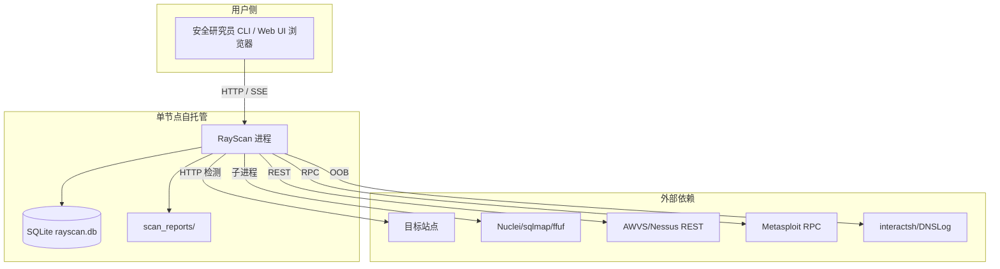

#### 5.4.2 拓扑要素清单

| 要素 | 取值 |
| --- | --- |
| 跨 Region 部署 | 否；单节点 |
| 跨 AZ 部署 | 否；单节点 |
| 流量入口路径 | 用户 → RayScan 进程（CLI 直接；Web UI 经 Flask 本地监听） |
| 内部调用路径 | 进程内 asyncio 调度 |
| 数据库访问路径 | SQLite 本地文件连接 |

#### 5.4.3 故障域划分

| 故障域 | 影响范围 | 容错机制 | 预期 RTO |
| --- | --- | --- | --- |
| 单进程 | 单实例 | 进程重启 | ≤ 30s |
| 单节点 | 该节点全部资源 | 备份恢复 DB | ≤ 30min |
| 外部引擎不可达 | 部分能力降级 | ACL 降级（BD-01/02/03） | 即时 |

### 5.5 容量规划

#### 5.5.1 业务量预估

| 业务指标 | 当前值 | MVP 阶段值 | 生产阶段值 | 备注 |
| --- | --- | --- | --- | --- |
| 注册用户数 | 个人/小团队 | 1~10 | ≤ 50 | 单租户自托管 |
| DAU | 低频 | 1~5 | ≤ 20 | 渗透场景 |
| 峰值 QPS（对目标） | — | 20 req/s/target | 20 req/s/target | HTTPPool 限速 |
| 数据写入量 / 天 | — | ≤ 1 万行 | ≤ 10 万行 | 漏洞/任务 |
| 数据存量 | — | ≤ 100MB | ≤ 2GB | SQLite 单文件 |

#### 5.5.2 资源容量推算

| 资源 | 推算公式 | 当前配置 | 生产阶段配置 |
| --- | --- | --- | --- |
| 应用实例数 | 单进程 | 1 | 1~4（可选多实例） |
| 带宽 | 20 req/s × 平均 50KB × 1.3 | 13 Mbps | 13 Mbps |
| SQLite 主库 | 单文件 | 本地磁盘 10GB | 本地磁盘 50GB |
| 外部二进制 | 各 1 进程 | 钉固版本 | 钉固版本 |

#### 5.5.3 扩容触发与路径

| 资源 | 扩容触发指标 | 扩容方式 | 扩容耗时 |
| --- | --- | --- | --- |
| 应用进程 | CPU ≥ 70% 持续 5min | 增加 Docker 实例 | ≤ 1min |
| SQLite | 文件 ≥ 1.5GB | 归档历史 / 换 Postgres（完整版） | ≤ 30min |
| 外部二进制 | 缺失 | 镜像内置补全 | ≤ 10min |

#### 5.5.4 容量水位线

| 水位 | 阈值 | 动作 | 对开发的约束 |
| --- | --- | --- | --- |
| 健康水位 | ≤ 60% | 无动作 | — |
| 预警水位 | 60-80% | 告警，启动扩容评审 | — |
| 危险水位 | ≥ 80% | 自动扩容（如支持）或紧急扩容 | — |
| 红线 | ≥ 95% | 触发限流 / 降级（与 §3.5.3 联动） | 限流红线值需与本表一致；降级开关在配置中心预埋（§5.1 L2） |

---

## 6. 网络架构

> **本章定位**：本章只承载**对开发产生约束的网络结论**。

### 6.1 网络环境规划

| 网络环境 | 用途 | 说明 / 访问策略 |
| --- | --- | --- |
| DMZ | 公网入口缓冲区 | 不适用（自托管，用户本地运行） |
| INT | 内部互联网络 | 进程内通信 |
| UAT | 预发环境 | 独立网段 |
| PROD | 生产环境 | 用户自有基础设施，最小化暴露 |
| DEV | 开发环境 | 与 PROD 完全隔离 |

### 6.2 流量入口与南北向流量

#### 6.2.1 入口流量链路

| 组件 | 作用 | 部署位置 |
| --- | --- | --- |
| CLI 入口 | 终端直接调用 | 用户机器 |
| Web UI（Flask） | SSE 实时日志 | 默认 127.0.0.1:5000，0.0.0.0 时强制鉴权 |
| 业务服务 | 扫描逻辑 | 进程内 |

**入口决策（对开发的约束）**：

| 决策项 | 取值 | 对开发的约束 |
| --- | --- | --- |
| TLS 终结点 | 不适用（本地/内网） | Web UI 监听本地，反向代理由用户自备 |
| 限流位置 | 业务自实现（HTTPPool 限速） | 对接 §3.5.3 限流红线 |
| 鉴权位置 | Web UI 自鉴权（RAYSCAN_WEB_SECRET/TOKEN） | 与 §7.2.1 一致 |
| 真实客户端 IP 获取 | 不适用（本地） | — |

#### 6.2.2 出口流量

| 决策项 | 取值 | 对开发的约束 |
| --- | --- | --- |
| 出口方式 | 直连（用户机器出网） | 私有化场景明示 |
| 是否需要固定出口 IP | 否 | OOB 服务器需公网可达 |
| 出口白名单 | 目标站点 + 外部引擎端点 | 用户环境管控 |
| 跨地域 / 跨云出口 | 不适用 | — |

### 6.3 内部互联（东西向流量）

| 决策项 | 取值 | 对开发的约束 |
| --- | --- | --- |
| 服务发现 | 不适用（进程内 asyncio） | — |
| 服务间通信协议 | 进程内方法调用 / 子进程 / RPC | 与 §3.5.4 超时重试基线对齐 |
| 内部 mTLS | 不适用 | — |
| 跨 VPC 互联 | 不适用 | — |
| 跨服务调用幂等性 | 必须遵循 §3.5.2 幂等键传递 | 跨模块调用透传幂等键与 traceId（§8.3） |

**判定合格**：§6.1 / §6.2 / §6.3 所有决策项已锁定；TLS 终结点、限流位置、鉴权位置与 §3.5 / §7 数值与位置一致；服务发现与通信协议已锁定。

---

## 7. 安全设计

> **本章回答**：本系统在安全维度做了哪些选择、对应到哪些安全产品 / 能力域、关键机制如何落地。

### 7.1 架构安全全景

| 能力域 | 选用产品 / 机制 | 作用范围 | 是否启用 |
| --- | --- | --- | --- |
| 抗 DDoS | 不适用（自托管本地运行） | 公网入口 | 否（不适用：用户本地部署，无公网入口） |
| WAF | 检测侧 waf 模块（指纹+绕过） | Web 应用层检测 | 是（waf 模块，U-03 核实默认启用） |
| 防火墙 / 安全组 | 用户基础设施安全组 | VPC / 子网 / 主机 | 由用户基础设施统一保障 |
| 主机安全 | 不适用（单进程） | 全部主机 | 否（不适用：自托管） |
| 容器安全 | Docker 镜像扫描（CI 可选） | 全部容器 | 是（Dockerfile client-only） |
| 数据安全审计 | 审计日志（文件 + 独立目录） | 关键数据库 | 是 |
| 密钥管理（KMS） | 环境变量 / .env（完整版 KMS） | 敏感数据加密 / AKSK | 是（基础版） |
| 安全运营中心（SOC） | 不适用 | 安全事件监控 | 否（不适用：自托管） |
| 堡垒机 | 不适用 | 运维通道审计 | 否（不适用：自托管） |

### 7.2 业务安全架构

#### 7.2.1 用户认证

| 维度 | 取值 |
| --- | --- |
| 账号体系 | 自建（无独立 Auth 子系统，X11，O3 延后） |
| 登录方式 | Web UI session + API Token（RAYSCAN_WEB_SECRET / RAYSCAN_WEB_TOKEN） |
| 多因素认证（MFA） | 否（个人自托管场景） |
| 密码强度 | Token 长度 ≥ 16；复杂度（大小写 + 数字 + 符号） |
| 登录失败锁定 | 连续失败 5 次锁定 15 分钟 |
| Token 有效期 | 访问 Token 2h；刷新 Token 7d |
| 会话管理 | 单点；Session / Token 选择；注销与续签机制 |

#### 7.2.2 数据安全

| 维度 | 取值 |
| --- | --- |
| 数据分级 | 是（L1 公开 / L2 内部 / L3 敏感 / L4 高敏） |
| 传输加密 | TLS 由用户反向代理提供；内部进程内不强制 |
| 存储加密 | 敏感字段（auth 凭证）加密存储（AES-256）；与 §7.2.4 一致 |
| 敏感字段清单 | 目标认证 Cookie/Token/密码（L3/L4）对应的脱敏 / 加密策略 |
| 数据导出与共享 | 导出审批（自托管本地，用户自管） |

**敏感字段处理策略表**：

| 字段 | 分级 | 存储策略 | 展示策略（脱敏） | 导出策略 |
| --- | --- | --- | --- | --- |
| 认证 Token | L4 | 加密存储（AES-256） | 中间掩码 | 需授权 |
| Cookie | L4 | 加密存储 | 掩码 | 需授权 |
| 目标 URL | L2 | 明文存储 | 完整展示 | 不限制 |
| 漏洞证据 | L3 | 明文存储 | 完整展示 | 本地文件 |

#### 7.2.3 密钥与凭证

| 维度 | 取值 |
| --- | --- |
| 存储方式 | 环境变量 / .env（完整版 KMS） |
| 下发方式 | 环境变量 / 文件 |
| 轮换策略 | 是否定期轮换；轮换周期基线 90 天；轮换是否需要业务停机（否） |
| 红线 | 禁止入库 / 入代码 / 入配置文件明文；禁止跨环境共用密钥 |

#### 7.2.4 审计日志

| 维度 | 取值 |
| --- | --- |
| 启用的日志类型 | 业务操作 / 数据库 / Web UI 访问 |
| 审计内容 | 必须包含"谁、何时、对什么资源、做了什么、结果如何、来源 IP" |
| 不可篡改保障 | 独立目录存储；与业务存储分离 |
| 保留期 | 合规要求下的最低保留时长 ≥ 1 年，与 §8.2 一致 |

#### 7.2.5 访问控制

| 维度 | 取值 |
| --- | --- |
| 权限模型 | RBAC0（角色仅"用户/管理员"），二选一理由：自托管个人工具，最小权限模型即可 |
| 多租户隔离 | 逻辑隔离（tenant_id 固定 'single'，字段存在满足未来扩展） |
| 越权防护 | 列表与详情接口校验数据归属（单租户下为本机用户） |
| 接口级权限 | 与 §3.5 调用契约对齐（每个接口的角色 / 权限标签） |

**判定合格**：
- §7.1 安全能力全景表无空白；
- §7.2 五项维度均给出"本系统的选择 + 关键基线"，不允许"待定"或"详见安全文档"代替正文。

---

## 8. 可观测设计

> **本章回答**：系统跑起来之后，怎么知道它健康、出问题怎么定位、用户体验是否达标。

### 8.1 Metrics

#### 8.1.1 指标分层

| 指标层 | 示例 | 工具 |
| --- | --- | --- |
| 业务指标 | 扫描任务数 / 漏洞发现数 / 模块命中率 | 系统监控 & 自定义埋点 |
| 应用指标 | RED：Rate / Errors / Duration | 系统监控 & 自定义埋点 |
| 中间件指标 | SQLite QPS / 外部引擎延迟 / 限速计数 | 系统监控 |
| 资源指标 | USE：CPU / 内存 / 磁盘 / 网络 | 系统监控 |

#### 8.1.2 关键指标 Dashboard 清单

| Dashboard 名 | 受众 | 核心指标 | 刷新频率 |
| --- | --- | --- | --- |
| 业务大盘 Dashboard | 产品 / 业务 | 扫描任务数、漏洞分布、模块命中率 | 1min |
| 服务健康大盘 Dashboard | 研发 / SRE | RED（Rate / Errors / Duration） | 30s |
| 中间件大盘 Dashboard | SRE / DBA | SQLite QPS / 外部引擎延迟 / 限速 | 30s |
| 容量大盘 Dashboard | SRE | §5.5 全部资源水位 | 1min |
| 业务预警大盘 Dashboard | On-call | 当前活跃告警 | 实时 |
| 扫描进度大盘 Dashboard | 安全研究员 | 实时爬取/检测进度、SSE 时延 | 5s |

### 8.2 Logs

#### 8.2.1 日志分级与去向

| 日志类型 | 级别 | 保存时间 | 日志去向 |
| --- | --- | --- | --- |
| 应用日志（业务） | INFO+ | 30 天热 + 180 天冷 | 日志组件（结构化 JSON） |
| 应用日志（异常） | ERROR+ | 90 天热 + 1 年冷 | 日志组件 + 实时告警 |
| 接入日志（Web UI） | INFO+ | 30 天 | 日志组件 |
| 审计日志 | INFO+ | ≥ 1 年（合规要求） | 独立目录（防篡改） |
| 慢查询日志 | — | 30 天 | 日志组件 |

#### 8.2.2 结构化日志规范

```json
{
  "timestamp": "2026-07-12T10:00:00.000Z",
  "level": "INFO",
  "service": "rayscan",
  "instance": "cli-2026-07-12",
  "traceId": "abc123",
  "spanId": "def456",
  "tenantId": "single",
  "userId": "local-user",
  "module": "wavscanner",
  "event": "scan_start",
  "msg": "scan started",
  "extra": { }
}
```

**硬性要求**：

| 要求项 | 内容 |
| --- | --- |
| 必含字段 | 所有日志必须含 `traceId` + `tenantId` |
| 敏感字段 | 禁止打印敏感字段明文（与 §7.2.2 数据安全联动） |
| ERROR 级别 | 必须含完整堆栈 + 业务上下文（任务号 / 目标 ID 等） |

### 8.3 Traces

| 项 | 取值 |
| --- | --- |
| 协议标准 | OpenTelemetry / W3C TraceContext |
| 采样策略 | 默认 1% 采样；错误请求 100% 采样；慢请求（>1s）100% 采样 |
| 透传方式 | HTTP Header `traceparent` / `tracestate`；子进程环境变量透传 |
| 关键 Span 命名 | `service.method` / `db.operation` / `subprocess.engine.run` |
| 跨外部系统 | 调用 E-xx 时透传 `traceId`（若对方支持），并记录 `peer.service` |

### 8.4 告警体系

#### 8.4.1 告警分级

| 级别 | 适用场景 | 响应时间 | 通知方式 |
| --- | --- | --- | --- |
| P0 紧急 | 业务中断 / 关键指标严重劣化 | ≤ 5 min | 电话 + 短信 + IM |
| P1 高 | 部分功能受影响 | ≤ 15 min | 短信 + IM |
| P2 中 | 单点异常但有冗余 | ≤ 1 h | IM |
| P3 低 | 趋势性预警 | 工作时间 | IM / 邮件 |

#### 8.4.2 告警规则编排

| 编号 | 级别 | 触发条件 | 维度 | Owner | Runbook |
| --- | --- | --- | --- | --- | --- |
| AL-01 | P0 | 进程退出且 5 分钟内未自起 | 进程健康 | @运维 | wiki/runbook/AL-01-restart |
| AL-02 | P0 | SQLite 主库不可访问 | 中间件健康 | @研发 | wiki/runbook/AL-02-db-recover |
| AL-03 | P1 | 单次扫描 P99 ≥ 1000ms 持续 5min | 接口延迟 | @研发 | wiki/runbook/AL-03-latency |
| AL-04 | P2 | 外部引擎缺失（Nuclei/sqlmap/ffuf） | 依赖降级 | @引擎组 | wiki/runbook/AL-04-engine-missing |
| AL-05 | P2 | CPU ≥ 80% 持续 10min | 资源水位 | @运维 | wiki/runbook/AL-05-cpu |
| AL-06 | P3 | 磁盘使用 ≥ 80% | 容量水位 | @运维 | wiki/runbook/AL-06-disk |

**判定合格**：
- 关键指标至少覆盖业务 / 应用 / 中间件 / 资源四层；
- 关键告警均能映射到具体指标；
- 全部 P0 / P1 告警有 Owner；
- 关键 Dashboard ≥ 5 个；
- 日志含 traceId + tenantId；
- 采样策略覆盖错误 / 慢请求兜底；
- §5.3 SLA、§2.5.1 质量目标与本章告警阈值数值自洽。

---

## 附录 A：Phase 4 阶段内中间确认自检报告（协议 §2.4）

> 本附录为系统设计阶段四处关键决策点（§2 业务架构 / §3 应用架构 / §4 数据库 / §5 部署架构）的中间确认协议 §2.4 自检记录。结论：四处自检均**未命中**中间确认触发标准，无 `[中间确认]` 发起（依据团队常驻审核策略，G3 已冻结边界，本期按 OSS 自托管冻结）。

### A.1 自检 1（§2 业务架构 / 限界上下文 / 上下文映射后）

**§2.1 判定**：未命中。6 个业务域、限界上下文（3 类域类型）、5 种上下文映射关系均由 G3 冻结的模块全景（§6.2 的 12 模块）与系统定位（多租户=否）直接派生；不存在 ≥2 种合理分叉影响下游。

**§2.3 反向验证 3 问（含证据）**：
- Q1（返工成本）：若推翻，仅影响 §2.1 业务域表 + §2.2 上下文映射表，返工范围 = 2 表，切换成本 ≈ 半人日，远低于阶段产物 30% 且非月级。→ **可控**。
- Q2（用户 / 客户 / 监管可感知）：业务域划分是内部设计视图，不暴露为产品功能 / 交互 / 合同 / 合规属性。→ **感知不到**。
- Q3（与用户诉求一致）：用户诉求要求「生成完整架构方案」；业务域严格继承 G3 §6.2 模块全景，名称与 §3 模块、§4 数据库分组一致。→ **完全一致**。

**结论**：未命中，不发起中间确认。

### A.2 自检 2（§3 应用架构 / 模块详细设计 / 接口契约后）

**§2.1 判定**：未命中。12 模块五段式、技术选型（httpx 补依赖、SQLite 选型）、接口契约均由 G3 冻结事实（X3 httpx 核心、X4 DetectionModule、X6 7 适配器、MVP 范围）直接派生；技术选型中 httpx 补依赖为修复 X3 已知缺陷（R-01），非新分叉。

**§2.3 反向验证 3 问（含证据）**：
- Q1（返工成本）：若推翻，影响 §3.1.5 技术选型表 + §3.2 模块设计，返工范围 = 选型表 + 12 模块，切换成本 ≈ 1~2 人日，低于 30%。→ **可控**。
- Q2（用户 / 客户 / 监管可感知）：模块拆分与技术选型不改变用户可见能力（MVP 功能与 G3 一致）。→ **感知不到**。
- Q3（与用户诉求一致）：直接继承 G3 冻结项（X3/X4/X6、MVP 范围），并以 pyproject version=2.0.0 为权威源（U-01 已冻结）。→ **完全一致**。

**结论**：未命中，不发起中间确认。

### A.3 自检 3（§4 数据库设计 / 单表五段式 / 备份后）

**§2.1 判定**：未命中。数据库按 6 业务域组织（与 §2/§3 一致），选用 SQLite（单租户自托管零运维）由系统定位（私有化、多租户=否）决定；10 张表均映射到 §3.3 核心对象与 §2 业务域。不存在 ≥2 种合理分叉。

**§2.3 反向验证 3 问（含证据）**：
- Q1（返工成本）：若推翻（如改 PostgreSQL），影响 §4.1~§4.4 表结构与 DDL，返工范围 = 10 表 + 约定，切换成本 ≈ 2 人日，低于 30%。→ **可控**。
- Q2（用户 / 客户 / 监管可感知）：存储引擎选择不暴露为产品功能 / 合同 / 合规属性（自托管用户无感知差异）。→ **感知不到**。
- Q3（与用户诉求一致）：用户诉求未指定存储引擎；SQLite 对齐 OSS 自托管零运维定位（G3 §4.2）。→ **用户诉求未显式提及此点，已对齐冻结定位**。

**结论**：未命中，不发起中间确认。

### A.4 自检 4（§5 部署架构 / 高可用 / SLA 后）

**§2.1 判定**：未命中。部署形态（CLI / Web UI / Docker client-only、单节点自托管）、容灾级别（单 AZ）、SLA（99.5% / RTO 30min / RPO 15min）均由 G3 §4.2 / §4.3 / §6.1 冻结的 OSS 自托管定位与 MVP 范围直接派生；分布式 / 多租户（O6/O8）已显式排除。

**§2.3 反向验证 3 问（含证据）**：
- Q1（返工成本）：若推翻（如改多租户 SaaS），影响 §5 部署 + §6 网络 + §7 安全多租户部分，返工范围 = 3 章，切换成本 ≈ 月级——但该分叉已被 G3 冻结排除，当前未偏离。→ **当前可控（未偏离冻结边界）**。
- Q2（用户 / 客户 / 监管可感知）：单节点自托管是已冻结的默认定位，与用户诉求（开源、自托管、数据不出网）一致，不新增任何用户可见行为 / 合同 / 合规承诺。→ **感知不到（当前默认）**。
- Q3（与用户诉求一致）：直接引用用户诉求「基于项目背景和资料生成完整架构方案」+ G3 冻结 OSS 自托管定位（多租户=否）。→ **完全一致**。

**结论**：未命中，不发起中间确认。若后续拟改多租户 / SaaS，将按协议 §2.2(2) 单独发起（已登记 G3 D-04 / U-05）。

> **整体结论**：Phase 4 四处关键决策点均未命中中间确认触发标准（§2.1 未命中 + §2.3 三问均指向可控 / 感知不到 / 一致或被上游冻结），全程未发起 `[中间确认]`，系统设计边界已冻结，下游可进入。
