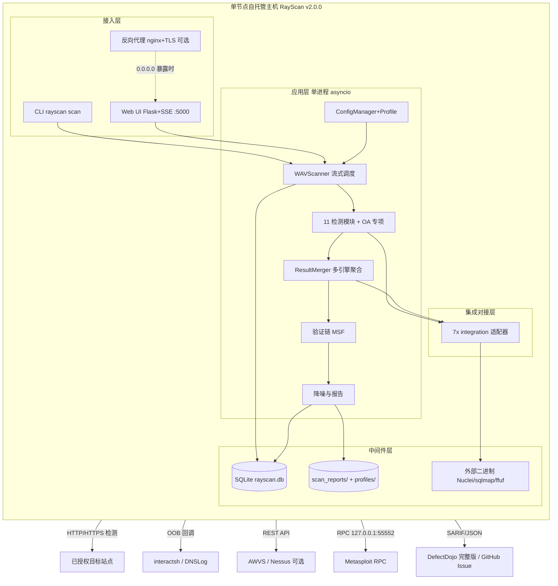

# AICoding 架构设计 · 部署设计（RayScan / WVS v2.0.0）

> 本文档为《AICoding 架构设计》核心产物之一，对应**部署设计模板**，是 RayScan（Python 异步 Web 漏洞扫描器，私有化自托管）的 Phase 5 部署设计。
> 上游输入：《系统设计》（G4 已冻结）中的 §3 模块拆分、运行形态、外部依赖、中间件需求、接口流向，以及任务书冻结硬约束（SLA/RTO/RPO/单节点单 AZ/6 Dashboard/AL-01~AL-06）；《资料摘要》（G1）。
> 下游输出：可落地的环境、资源、流水线、监控告警、应急回滚、容量成本运维交付物。
> 结论区分声明：全文继承 G3 + 系统设计冻结边界——**私有化·自托管、多租户=否、单节点 / 单 AZ、O6 分布式多租户 SaaS 与 O8 分布式扫描编排均出域，本文不引入**。

---

## 1. 引言

### 1.1 适用范围与部署形态

- **系统定位**：RayScan（WVS）v2.0.0，私有化·自托管 Web 漏洞扫描器；多租户=**否**（tenant 固定 `'single'`）。
- **部署形态（三种，等价入口 `rayscan` / `python -m wvs`）**：
  1. **CLI**：`rayscan scan -u 目标URL --i-have-permission`，进程内同步/异步扫描，结果写出 `scan_reports/`。
  2. **Web UI**：`python web_ui/app.py`（Flask 3.0.x + SSE），默认绑定 `127.0.0.1:5000`，可经 `RAYSCAN_WEB_HOST` / `RAYSCAN_WEB_PORT` 改绑；监听 `0.0.0.0` 时**强制启用** `RAYSCAN_WEB_SECRET` / `RAYSCAN_WEB_TOKEN`。
  3. **Docker client-only**：`docker run rayscan scan 目标URL`，`docker-compose.yml` 默认**不暴露端口**，仅挂载 `./scan_reports`。
- **运行形态**：单进程、单节点、单 AZ 自托管；进程内 asyncio 调度，无跨节点 MQ / 无独立缓存服务（内存 + SQLite）；数据不出网（仅向已授权目标站点、OOB 服务器、可选外部引擎出网）。
- **本部署设计覆盖范围**：单节点自托管在生产 / 预发 / 联调 / 开发四类环境的资源、流水线、监控、回滚、容量成本；**不包含** 多节点分布式编排（O8 出域）、多租户隔离（O6 出域）。

### 1.2 名词与缩写

| 缩写 | 全称 | 含义 |
| --- | --- | --- |
| WVS | Web Vulnerability Scanner | Web 漏洞扫描器 |
| SSE | Server-Sent Events | 服务端单向推送（Web UI 实时日志） |
| OOB | Out-of-Band | 带外检测（interactsh / DNSLog 回调） |
| PoC | Proof of Concept | 漏洞验证模板（Nuclei 模板库） |
| RTO / RPO | Recovery Time / Point Objective | 恢复时间 / 数据丢失容忍目标 |
| KMS | Key Management Service | 密钥管理服务（完整版） |
| VPC | Virtual Private Cloud | 私有网络（云托管时；自托管映射为主机网络命名空间） |
| CI/CD | Continuous Integration / Deployment | 持续集成 / 持续部署 |
| SLA | Service Level Agreement | 服务等级协议（可用性 ≥ 99.5%） |
| HA | High Availability | 高可用 |
| ACL | Anticorruption Layer | 防腐层（外部引擎适配器） |

---

## 2. 环境与资源清单

### 2.1 环境矩阵

RayScan 为单进程自托管工具，四类环境通过**独立主机 / 独立进程实例 + 独立 SQLite 库文件 + 独立配置 Profile** 实现隔离；不依赖 Kubernetes 命名空间。

| 环境 | 用途 | 集群隔离 | 数据 | 网络访问 | 外部引擎 / OOB |
| --- | --- | --- | --- | --- | --- |
| dev | 开发自测、模块调试 | 开发者本机独立进程（共享宿主 OS，进程级隔离） | 模拟数据（`scan_reports/` 本地） | 内网 / 本机回环 | 可选启用 Nuclei/sqlmap/ffuf；OOB 用公共 interactsh |
| int | 联调、多引擎聚合验证 | 独立 VM / 容器实例（与 dev 物理或实例隔离） | 模拟数据 | 内网 | 启用全部 7 适配器 + 可选 AWVS/Nessus |
| uat | 预发 / 验收、仿生产 | 独立主机（配置等同 prod，数据隔离） | 仿生产（授权测试靶机） | 内网 + 白名单 | 启用全部引擎 + 自建/公共 OOB |
| prod | 生产扫描 | 独立专用主机（不与其他负载混部） | 真实授权目标数据 | 内网；Web UI 暴露时经反向代理受限公网 | 全部引擎 + OOB；MSF RPC 仅 127.0.0.1 |

**隔离策略要点**：
- 数据隔离：各环境 `rayscan.db` 与 `scan_reports/` 物理分离（不同挂载卷 / 目录），禁止跨环境共用库文件。
- 网络隔离：prod Web UI 默认仅本机回环；若需远程访问，必须经反向代理（nginx）+ TLS + `RAYSCAN_WEB_SECRET/TOKEN` 鉴权，禁止裸 `0.0.0.0` 无鉴权暴露。
- 凭据隔离：各环境 `.env` 独立，prod 凭据不得写入 dev/int 镜像或代码仓库。

### 2.2 云资源清单

> **云基线说明（依据任务书 Phase 0 决策）**：RayScan 为私有化自托管（CLI / Web UI / Docker client-only，多租户=否），**无固有托管云资源**。本清单按"自托管形态，无既有云资源基线，资源缺口以新建估算，待人工确认"填写——即资源以**用户自有主机 / 可选云主机（参考规格）**估算，未虚构任何既有云资源 ID。若用户后续明确采用云主机托管，可由 CloudQ 复核可复用资源后回填 §2.3。

#### 2.2.1 计算资源

| 资源编号 | 类型 | 产品 | 资源 ID | 名称 | 规格 | 数量 | 环境 | 复用 / 新建 | HA 方案 | 用途 |
| --- | --- | --- | --- | --- | --- | --- | --- | --- | --- | --- |
| R-C-001 | 计算 | 自托管主机 / 云 CVM 参考（S5 4vCPU/8GB） | host-prod-01 | RayScan 主扫描节点 | 4 vCPU / 8 GB / 50 GB 系统盘 | 1 | prod | 新建（自托管） | 单节点；崩溃进程重启 ≤30s；主机故障切换 RTO≤30min（备份恢复） | 运行 CLI / Web UI / 调度核心 + 外部二进制 |
| R-C-002 | 计算 | 自托管主机 / 云 CVM 参考（S5 2vCPU/4GB） | host-uat-01 | RayScan 预发节点 | 2 vCPU / 4 GB | 1 | uat | 新建 | 单节点 | 仿生产验收 |
| R-C-003 | 计算 | 自托管主机 / 云 CVM 参考（S5 2vCPU/4GB） | host-int-01 | RayScan 联调节点 | 2 vCPU / 4 GB | 1 | int | 新建 | 单节点 | 多引擎联调 |
| R-C-004 | 计算 | 开发者本机 | host-dev-01 | 开发自测节点 | 开发者本地（≥2 vCPU / 4 GB 建议） | 1 | dev | 新建 | 单节点 | 开发调试 |

#### 2.2.2 存储资源

| 资源编号 | 类型 | 产品 | 资源 ID | 名称 | 规格 | 容量 | 环境 | 复用 / 新建 | HA 方案 | 备份策略 |
| --- | --- | --- | --- | --- | --- | --- | --- | --- | --- | --- |
| R-S-001 | 关系型存储 | SQLite 3.45 单文件 | rayscan.db | 业务主库（任务/漏洞/报告） | 单文件嵌入式 | ≤ 2 GB（任务/漏洞 ≤ 50 万行） | 全环境 | 新建 | 单文件副本 + 每日全量备份 | 全量每日 + 增量按需，归档至备份卷；RPO≤15min |
| R-S-002 | 文件存储 | 本地文件系统 | scan_reports/ | 报告与 Profile | 目录挂载卷 | 日增 ≤ 100 MB | 全环境 | 新建 | 挂载卷副本 | 随扫描产出；报告元数据 ≥180 天清理 |
| R-S-003 | 文件存储 | 本地文件系统 | ~/.rayscan/nuclei-templates | Nuclei PoC 模板缓存 | 钉固版本 | ≤ 5 GB（12.5w+ 模板） | 全环境 | 新建 | 版本钉固 | 可选 auto_update，建议钉固 |
| R-S-004 | 文件存储 | 本地文件系统 | /var/log/rayscan | 应用与审计日志 | 目录 | 日增 ≤ 100 MB | 全环境 | 新建 | 日志轮转（logrotate） | 应用日志保留 30 天；审计日志保留 90 天 |

#### 2.2.3 网络资源

| 资源编号 | 类型 | 产品 | 资源 ID | 名称 | 规格 | 环境 | 复用 / 新建 | 用途 |
| --- | --- | --- | --- | --- | --- | --- | --- | --- |
| R-N-001 | 主机网络 | 主机回环 + 主机防火墙（ufw/iptables） | host-net | 单节点网络命名空间 | 回环 127.0.0.1 + LAN/DMZ | 全环境 | 新建 | Web UI 默认回环绑定；主机防火墙限制入站 |
| R-N-002 | 反向代理 | nginx（可选，暴露 Web UI 时） | rev-proxy | Web UI 反向代理 + TLS | 1 实例，443 TLS 终止 | prod/uat | 新建 | 公网暴露时 TLS 终结 + 限流 + 转发至 127.0.0.1:5000 |
| R-N-003 | 公网出口 | 主机出网策略 | egress-policy | 出网白名单 | 目标站点 / OOB / 可选外部引擎 | 全环境 | 新建 | 仅允许向已授权目标、OOB 服务器、AWVS/Nessus 出网 |

#### 2.2.4 中间件与平台服务

| 资源编号 | 类型 | 产品 | 资源 ID | 名称 | 规格 | 环境 | 复用 / 新建 | HA 方案 | 用途 |
| --- | --- | --- | --- | --- | --- | --- | --- | --- | --- |
| R-M-001 | 关系型存储 | SQLite 3.45（aiosqlite） | rayscan.db | 嵌入式主存储 | 单文件 | 全环境 | 新建 | 单文件备份 | 业务主数据（见 R-S-001） |
| R-M-002 | 外部二进制运行时 | Nuclei / sqlmap / ffuf（钉固版本） | ext-bin | 第三方引擎运行时 | 各 1 进程，并发 ≤5 | 全环境 | 新建 | 钉固版本 + 镜像内置 | PoC 执行 / 模糊测试 / 指纹 |
| R-M-003 | 可观测（可选） | Prometheus + Grafana | observ-stack | 指标与大盘 | 单节点 | prod/uat | 新建 | 单节点 | 指标采集 / 6 Dashboard / 告警 |
| R-M-004 | OOB 服务 | interactsh / DNSLog（公共或自建） | oob-svc | 带外回调服务器 | 公网可达 | 全环境 | 新建 / 复用公共 | 公共冗余 / 自建双实例 | 带外检测回调（≤1000/s） |

#### 2.2.5 可观测资源

| 资源编号 | 类型 | 产品 | 资源 ID | 名称 | 规格 | 环境 | 复用 / 新建 | 承载可观测维度 |
| --- | --- | --- | --- | --- | --- | --- | --- | --- |
| R-O-001 | 日志 | 文件 + OTel Collector（可选） | app-log | 应用 / 审计日志 | 结构化日志（含 traceId+tenantId） | 全环境 | 新建 | 应用日志、审计日志采集 |
| R-O-002 | 日志集中 | 文件 / 可选 Loki（自托管） | log-store | 日志存储 | 保留 30/90 天 | prod/uat | 新建 | 日志检索与审计 |
| R-O-003 | 指标 | Prometheus | metrics | 指标采集 | 拉取 /node_exporter | prod/uat | 新建 | CPU/内存/磁盘/进程存活/扫描指标 |
| R-O-004 | 可视化 | Grafana | grafana | 6 Dashboard | 单节点 | prod/uat | 新建 | 业务/服务/中间件/容量/限流/审计大盘 |
| R-O-005 | 链路 | OpenTelemetry（可选） | apm | 分布式调用追踪 | 采样率 1% | prod/uat | 新建 | 调用链追踪（单进程为主） |
| R-O-006 | 告警引擎 | Alertmanager / Prometheus Alerting | alert-engine | 告警分发 | 规则 AL-01~AL-06 | prod/uat | 新建 | 告警触发与路由 |
| R-O-007 | 通知 | IM / 邮件 / Webhook | notify | 告警通道 | 电话+短信+IM（P0） | prod/uat | 新建 | 告警通知与升级 |

#### 2.2.6 安全资源

| 资源编号 | 类型 | 产品 | 资源 ID | 名称 | 规格 | 环境 | 复用 / 新建 | HA 方案 | 用途 |
| --- | --- | --- | --- | --- | --- | --- | --- | --- | --- |
| R-Sec-001 | 认证 | RAYSCAN_WEB_SECRET / RAYSCAN_WEB_TOKEN | web-auth | Web UI 鉴权 | session + API Token | 全环境 | 新建 | 单节点 | 0.0.0.0 监听时强制启用 |
| R-Sec-002 | 主机防火墙 | ufw / iptables | host-fw | 主机入站控制 | 默认拒绝 + 白名单 | 全环境 | 新建 | 单节点 | 限制 Web UI / 管理端口入站 |
| R-Sec-003 | WAF（暴露时） | nginx + ModSecurity（可选） | waf-mod | Web 应用防火墙 | 反向代理内置 | prod/uat | 新建 | 单节点 | 暴露公网时防护 Web UI |
| R-Sec-004 | 凭据存储 | .env / 环境变量（KMS 完整版） | cred-store | 密钥管理 | 文件权限 600 | 全环境 | 新建 | 单节点 | 引擎 API Key / Token / OOB token |

### 2.3 复用资源清单

| 复用资源 ID | 原业务方 | 余量评估 | 隔离方式 |
| --- | --- | --- | --- |
| 无（自托管新建） | — | — | 单主机进程级隔离；各环境独立主机 / 独立实例 + 独立 SQLite 库文件 + 独立 .env |

> 字段说明：自托管形态无既有云资源基线，全部为新建估算，待人工确认实际托管方式（自有硬件 / 云 CVM）。若采用云 CVM，可由 CloudQ 复核可复用资源后回填本表。

---

## 3. 部署拓扑与高可用设计

### 3.1 物理拓扑

#### 3.1.1 物理拓扑图

RayScan 为单节点自托管，物理拓扑以"单主机"为中心：CLI / Web UI 进程、SQLite 库文件、外部二进制运行时同驻一台主机；出网仅向已授权目标站点、OOB 服务器（interactsh/DNSLog）、可选 AWVS/Nessus REST、MSF RPC（127.0.0.1:55552）发起。

**Draw.io 正式架构图**：`D:\HZR_PROJECTS\RayScan\RayScan\.workbuddy\output\rayscan_deploy_topology.drawio`（由 tcloud-arch-diagram 生成，含腾讯云风格图标占位符）。

**Mermaid 拓扑（自包含预览）**：



#### 3.1.2 拓扑要素清单

- **跨 Region 部署**：无（单 Region = 用户本地 / 单云 AZ；单 AZ 为冻结约束）。
- **跨 AZ 部署**：无（单 AZ 自托管；冻结约束，不外溢 O8 分布式）。
- **流量入口路径**：CLI 本地进程；Web UI `127.0.0.1:5000`（默认回环）→ 可选反向代理 `443` TLS → 转发本机 `5000`。
- **内部调用路径**：进程内 asyncio 队列 / 方法调用；HTTPPool 经 httpx 向目标站点出网；SQLite 本地文件读写。
- **数据库访问路径**：应用进程 → 本地 `rayscan.db` 文件（aiosqlite 连接），无独立数据库服务。

### 3.2 流量与网络链路（连通视图）

#### 3.2.1 流量入口链路

| 组件 (R-xx) | 协议 - 端口 | TLS 终结 | 作用 |
| --- | --- | --- | --- |
| Web UI（R-C-001 进程） | HTTP - 127.0.0.1:5000 | 否（回环） | SSE 实时日志 / 扫描发起 / 报告导出 |
| 反向代理（R-N-002，可选） | HTTPS - 443 | 是（nginx 终结） | 公网暴露时 TLS + 限流 + 鉴权转发 |
| CLI（R-C-001 进程） | 本地进程调用 | 不适用 | 命令行直接触发扫描 |

#### 3.2.2 内部互联链路

| 项 | 说明 |
| --- | --- |
| 服务发现 | 单进程内 ModuleFactory 注册，无独立服务发现 |
| 服务间协议 | 进程内方法调用 / asyncio.Queue（无 gRPC/HTTP 内部调用） |
| mTLS | 不启用（单进程同主机，无跨进程网络调用；理由：进程内调用无需传输层安全） |
| 数据库连接 | 应用 → aiosqlite 直连本地 `rayscan.db` 文件（无 ProxySQL） |
| 缓存连接 | 内存 + SQLite，无独立 Redis；Cache-Aside 内存去重 |
| MQ 连接 | 进程内 asyncio.Queue，无独立 MQ |
| 外部引擎连接 | 子进程（Nuclei/sqlmap/ffuf）/ REST（AWVS/Nessus）/ RPC（MSF 127.0.0.1:55552） |

#### 3.2.3 跨网络互联

| 互联类型 | 通道 | 带宽 | 加密 | 用途 |
| --- | --- | --- | --- | --- |
| 出网 → 目标站点 | 主机出网策略（R-N-003） | 受 rate≤20 req/s 限速 | HTTPS 可选 verify_ssl | HTTP/HTTPS 漏洞检测 |
| 出网 → OOB 服务器 | 公网（interactsh/DNSLog） | ≤1000 回调/s | 公共通道（OOB 协议） | 带外回调检测 |
| 出网 → AWVS/Nessus | REST API（可选内网/公网） | 按厂商配额 | HTTPS | 扫描结果导入 |
| 入网 ← OOB 回调 | 公网回调至 OOB 客户端轮询 | 低 | 公共通道 | OOB 事件回收 |
| 本机 → MSF RPC | 127.0.0.1:55552 | 本地回环 | 本地（RPC auth） | 漏洞验证链 |

### 3.3 高可用与故障容错

#### 3.3.1 故障域划分

| 故障域 | 影响范围 | 容错机制 | 预期 RTO |
| --- | --- | --- | --- |
| 单 Pod（单进程实例） | 单次扫描进程崩溃 | 进程重启 / 用户重发；扫描状态持久化于 SQLite，支持 `--resume`（WVS v19.2 超时抢救+resume） | ≤ 30s（瞬时，无数据丢失） |
| 单 Node（单主机） | 该主机全部进程与本地存储 | 备份卷恢复 `rayscan.db` + `scan_reports/`；RPO≤15min | ≤ 30min（主机故障切换） |
| 单 AZ | 该 AZ 全部资源 | 单 AZ 为冻结约束（不外溢 O8）；无跨 AZ 部署；依赖备份恢复 | ≤ 30min（备份恢复，非自动切换） |
| 单 Region | 全部主资源 | 单 Region 为冻结约束；无跨 Region 灾备；依赖离线备份副本（与生产物理隔离的备份卷 / 对象存储） | ≤ 1h（离线恢复） |

> **可用性来源拆分**：IaaS/OS 层由宿主主机 / 可选云 CVM SLA 兜底；应用层由进程重启、SQLite 备份、扫描断点续扫（resume）保障。单进程自托管进程可用性 ≥ 99.5%（冻结 SLA Q5）。

#### 3.3.2 负载均衡

单节点无 4 层 / 7 层负载均衡需求（单进程串行调度）。若 Web UI 暴露公网，由反向代理（R-N-002 nginx）承担 7 层转发与健康检查；健康检查策略：

- **路径**：`/api/health`（建议新增轻量存活探针，返回 200）
- **频率**：每 15s 一次
- **失败阈值**：连续 3 次失败标记为不健康，触发告警 AL-04
- **限流**：nginx `limit_req` 限制单 IP 并发，与系统 §3.5.3 限流约定对齐

#### 3.3.3 健康检查配置

| 检查项 | 路径 / 方式 | 频率 | 失败阈值 | 连续成功阈值 |
| --- | --- | --- | --- | --- |
| 进程存活 | 系统 systemd / nohup 守护或手动 | 持续 | 进程退出即重启 | — |
| Web UI 存活 | GET `/api/health` | 15s | 3 次 | 1 次 |
| SQLite 可写 | 启动期写测试 + 定期 `PRAGMA integrity_check` | 5min | 1 次 | 1 次 |
| 外部二进制可用 | 启动期 `nuclei -version` 等探测 | 启动 + 周期 | 缺失则降级 BD-02 | — |

#### 3.3.4 弹性伸缩配置

| 触发指标 | 阈值 | 伸缩方式 | 区间 |
| --- | --- | --- | --- |
| CPU 利用率 | ≥ 80%（预警）/ ≥ 95%（危险） | 垂直扩容（升配 vCPU/内存）或降低 `rate`/`concurrent_modules` | 单进程，无 HPA；副本数固定 1 |
| 内存占用 | ≥ 85% | 垂直扩容 / 调小 `crawl_max_urls` | 单进程 |
| 磁盘使用率 | ≥ 80%（预警）/ ≥ 95%（红线） | 清理历史报告 / 归档 | 单节点 |

> 单进程自托管不支持水平扩容（O8 分布式出域）；扩容以垂直升配 + 参数降级为主。

#### 3.3.5 容灾切换配置

- **单 AZ / 单 Region**：冻结约束，无自动跨 AZ/Region 切换；灾备依赖**离线备份副本**（每日全量 + 增量，保留全量 30 天 / 增量 7 天，与生产物理隔离）。
- **故障切换 RTO**：≤ 30min（主机故障，从备份恢复 `rayscan.db` + `scan_reports/`）。
- **RPO**：≤ 15min（备份频率与系统 §4.3.2 自洽）。
- **恢复演练**：频率半年，负责人 @运维。

---

## 4. 部署流程

### 4.1 代码仓库与分支

| 项 | 规范 / 值 | 说明 |
| --- | --- | --- |
| 代码仓库地址 | `https://github.com/xiabai2004/RayScan`（GitHub，经 `gh` CLI 管理） | D2 / D6 |
| 分支管理 | `master` 受保护；开发分支前缀 `feat/` `fix/` `docs/` `chore/` | D9 §7 |
| 合并规范 | PR + Squash Merge + ≥1 Approving Review；CI 质量门禁（pytest + ruff + coverage） | D9 §7 |
| 标签规范 | 语义版本 `v2.0.0`（权威源 `pyproject.toml` version=2.0.0，X1 已冻结）；Git Tag 与 PyPI / 镜像 Tag 对齐 | D10 §[project] |

### 4.2 流水线（CI / CD）

采用 **GitHub Actions** 实现 8 阶段流水线（自托管发布以版本化制品分发为核心）：

| 阶段 | 触发条件 | 关键动作 | 失败处理 |
| --- | --- | --- | --- |
| 1. 构建 | 推送 / PR | 拉代码 → `pip install -e .` → 单元测试预热 → 构建 wheel | 阻断后续阶段 |
| 2. 代码扫描 | 构建后 | ruff lint+format（行宽 120）、mypy（渐进严格，非阻断） | 不达标阻断 |
| 3. 安全扫描 | 构建后 | SCA（pip-audit / dependency 漏洞）、SAST（semgrep / CodeQL）、Docker 镜像漏洞扫描（trivy） | 高危阻断 |
| 4. 集成测试 | 合并到集成分支 | `pytest tests/ -q` + 覆盖率；多引擎聚合集成（mock 外部引擎） | 阻断后续阶段 |
| 5. 制品打包 | 测试通过 | 构建 wheel + Docker 镜像 `rayscan:TAG-SHA`，推送镜像仓库并打 Tag | 失败重试 |
| 6. 部署集成环境 | 制品完成 | 自动部署到 dev / int（拉镜像 / `pip install` 指定版本，初始化 SQLite） | 失败回滚到上一版本 |
| 7. 部署测试环境 | 手动触发 | 部署到 uat；冒烟测试（扫描靶机 DVWA）+ 报告产出校验 | 失败回滚到上一版本 |
| 8. 部署生产环境 | 人工审批 | 按发布策略（版本化制品分发）升级 prod；观察窗口 ≥ 30min | 按回滚策略实施回滚 |

### 4.3 构建产物与制品管理

| 配置项 | 配置值 / 规则 | 说明 |
| --- | --- | --- |
| 产物类型 | Python wheel（`.whl`）+ Docker 镜像（client-only） | 自托管两种分发形态 |
| 镜像仓库 | 私有 registry（如 `registry.example.com/rayscan`）或 Docker Hub；Dockerfile `FROM python:3.11-slim` | D15 |
| 镜像命名 | `REPO/rayscan:GIT_TAG-COMMIT_SHA`（如 `rayscan:v2.0.0-a1b2c3d`） | 版本可追溯 |
| 制品保留期 | wheel 保留 90 天；Docker 镜像保留最近 10 个版本 + 所有 release Tag | 支持一键回滚 |
| 制品溯源 | 镜像 Label 含 `git-commit` / `build-time` / `pipeline-id`；wheel 含 `pyproject` 版本元数据 | 便于反查源码 |
| 签名与校验 | cosign 签名（可选，完整版启用）；发布包 SHA256 校验 | 防篡改 |

### 4.4 配置管理

RayScan 配置采用**四层级（L1~L4）**多源合并（env ≥ profile ≥ CLI ≥ default，与系统 §3.5 / ConfigManager 对齐）：

| 层级 | 名称 | 来源 | 示例 | 生效优先级 |
| --- | --- | --- | --- | --- |
| L1 | 代码默认 | `wvs/config.py` DEFAULT_CONFIG | timeout=30 / threads=5 / rate=20 | 最低（兜底） |
| L2 | Profile 预设 | `profiles/*.yaml`（内置 default/src-quick/pentest-full/sqli-only） | `rayscan use src-quick` | 覆盖 L1 |
| L3 | 环境变量 / CLI 参数 | `WVS_*` 环境变量、CLI `--rate`/`--modules` | `WVS_RATE=20` / `--crawl-depth 2` | 覆盖 L2 |
| L4 | 运行实例配置 | `.env` 文件（凭据/Token）、用户运行时输入（target/auth） | `RAYSCAN_WEB_TOKEN=xxx` | 最高（实例级覆盖） |

> 配置一致性：X7 多套默认参数冲突在 MVP 以 ConfigManager 多源合并为准（env≥profile≥CLI≥default）；X14 `max_time`(CLI) 与 `max_scan_time`(Web UI) 键名不一致为已知待修复项，发布时统一为 `max_time`。

### 4.5 发布策略

#### 4.5.1 发布方式

> **全系统采用「版本化制品分发 + 上一版本回滚」发布**（自托管单进程形态，无在线流量切换需求）。Web UI 经反向代理暴露时，反向代理层可叠加蓝绿（切流到新版本容器）作为可选增强，但核心回滚仍以重装上一 wheel / 重跑上一镜像 Tag 实现。

| 模块 / 形态 | 发布方式 | 说明 |
| --- | --- | --- |
| CLI（wheel） | 版本化分发 + 回滚 | `pip install rayscan==上一版本` 回退 |
| Web UI（同进程） | 版本化分发 + 回滚 | 重启进程至上一镜像 / wheel |
| Docker（client-only） | 镜像 Tag 固定 + 回滚 | `docker run rayscan:上一镜像TAG` |
| 配置 / Profile | 版本随制品 | `.env` / Profile 独立版本管理，回退 ≤1min |

#### 4.5.2 发布标准流程

- **首次发布（资源初始化）**：安装依赖 → 初始化 `rayscan.db`（执行 §4.2 DDL）→ 加载内置 Profile → 校验外部二进制（Nuclei/sqlmap/ffuf）版本 → 启动 Web UI（回环）或 CLI 自检。
- **常规迭代发布**：CI 产出 wheel + 镜像 → 部署 int 自动验证 → uat 手动冒烟 → prod 审批后 `pip install` / 拉镜像升级 → 观察窗口。
- **资源变更流程**：SQLite DDL 变更须随版本发布，遵循"可回滚迁移 + 备份前置"（见 §6.1.3）。

#### 4.5.3 灰度路径与观测窗口

| 批次 | 范围 | 观测时长 | 放量条件 |
| --- | --- | --- | --- |
| 批次 1 | dev / int 内部验证 | 1 天 | 单元测试 + 集成测试 + 靶机扫描无异常 |
| 批次 2 | uat 仿生产 | 1 天 | 冒烟 + 报告完整性 + 外部引擎联调通过 |
| 批次 3 | prod 全量（单实例） | ≥ 30min 观察窗口 | 进程存活、磁盘水位、AL 告警无触发 |

> 自托管单用户形态，无多实例灰度；"灰度"等价于环境递进（dev→int→uat→prod）。

#### 4.5.4 发布门禁

| 门禁项 | 拦截条件 | 检查时机 |
| --- | --- | --- |
| 单元测试通过率 | 100% | Build 阶段 |
| 单元测试覆盖率（增量） | ≥ 70% | Code Quality 阶段 |
| 集成测试通过率 | 100% | Integration Test 阶段 |
| 静态扫描严重问题数 | 0（高危）；中危需评审 | Code Quality 阶段 |
| 安全扫描高危漏洞 | 0（SCA/SAST/镜像） | Security Scan 阶段 |
| 镜像漏洞 | 高危 0 | 制品扫描 |
| 接口契约校验 | 兼容（CLI 参数 / Web API 不破坏） | Integration Test 阶段 |
| 性能基线 | P99 不退化（启动 P95 ≤ 30s，QS-01） | 性能测试 |
| 人工审批 | 至少 1 名 Owner（@运维 / @平台组） | 生产发布前 |

---

## 5. 监控告警接入

### 5.1 监控架构与数据流

```text
进程 / 外部引擎 ──┬─► Metrics ──► Prometheus (R-O03) ──► Grafana (R-O04, 6 Dashboard)
                 ├─► Logs    ──► 文件 + OTel (R-O01) ──► 日志存储 (R-O02) / 审计独立保留
                 └─► Traces  ──► OpenTelemetry (R-O05, 1% 采样)
                                          ▼
                                  告警引擎 (R-O06, AL-01~AL-06)
                                          ▼
                            通知 IM / 邮件 / Webhook (R-O07, §5.4)
```

> 自托管可选可观测栈（R-M-003 / R-O-001~007）；最小可用形态为文件日志 + 进程存活检查，指标栈按需启用。

### 5.2 关键 Dashboard 清单

> 冻结结论"6 个 Dashboard"，按下表落地（业务 / 服务 / 中间件 / 容量 / 限流 / 审计）。

| 大盘 | 用户 | 指标 |
| --- | --- | --- |
| D-01 扫描任务大盘 | 安全研究员 / 运维 | 任务数（INIT/RUNNING/DONE/FAILED）、扫描耗时、模块启用分布 |
| D-02 漏洞与严重性大盘 | 安全研究员 | 漏洞总数、按 severity（CRITICAL~INFO）分布、按类型分布、验证率 |
| D-03 引擎与集成健康大盘 | @引擎组 | Nuclei/sqlmap/ffuf/Wappalyzer/AWVS/Nessus/MSF 可用性、调用耗时、降级次数 |
| D-04 资源与容量大盘 | @运维 | CPU / 内存 / 磁盘使用率、SQLite 大小、报告增量 |
| D-05 限流与性能大盘 | @平台组 | HTTPPool 速率、并发模块数、超时抢救次数、P99 响应 |
| D-06 审计与合规大盘 | 运维 / 合规 | 授权扫描覆盖率（i-have-permission）、Web UI 登录、API 调用、OOB 事件 |

### 5.3 告警规则清单

| 编号 | 级别 | 触发条件 | 关联资源 (R-xx) | Owner | Runbook |
| --- | --- | --- | --- | --- | --- |
| AL-01 | P0 | 扫描主进程退出 / 连续重启 ≥3 次（5min） | R-C-001 | @运维 | RB-01 |
| AL-02 | P1 | 磁盘使用率 ≥ 95%（红线）或 SQLite 写入失败 | R-S-001 / R-S-002 | @运维 | RB-02 |
| AL-03 | P1 | 外部引擎不可用（Nuclei/sqlmap/ffuf 缺失或异常，触发 BD-02 降级） | R-M-002 | @引擎组 | RB-03 |
| AL-04 | P2 | Web UI 不可达 ≥ 1min 或鉴权失败激增（≥10/min） | R-C-001 / R-Sec-001 | @平台组 | RB-04 |
| AL-05 | P2 | OOB 回调失败率 ≥ 50%（5min，触发 BD-03 降级） | R-M-004 | @引擎组 | RB-05 |
| AL-06 | P3 | 验证链 MSF RPC 不可达（RAYSCAN_ENABLE_EXPLOIT=1 时，触发 BD-01 跳过） | R-C-001 | @聚合组 | RB-06 |

### 5.4 告警通道

| 级别 | 响应时间 | 通知方式 | 上升机制 |
| --- | --- | --- | --- |
| P0 | ≤ 5 min | 电话 + 短信 + IM | 15min 未响应升级至 Manager |
| P1 | ≤ 15 min | IM + 邮件 | 30min 未响应升级至 @运维 Leader |
| P2 | ≤ 30 min | IM | 1h 未响应升级至模块 Owner Leader |
| P3 | 班次内 | 看板 / IM | 下次巡检跟进 |

---

## 6. 应急与回滚

### 6.1 回滚机制

#### 6.1.1 回滚触发条件

- 生产错误率（扫描失败率）> 20% 持续 5min
- P90 耗时较基线退化 > 50%
- 关键告警触发（AL-01 / AL-02 / AL-03）

#### 6.1.2 回滚决策人

- On-call 主值班可独立决定 P0（AL-01）回滚
- 其他级别由对应 Owner（@运维 / @引擎组 / @平台组 / @聚合组）决定

#### 6.1.3 回滚执行 SOP

| 对象 | 回滚方式 | 预计耗时 | 有损风险 / 数据丢失 |
| --- | --- | --- | --- |
| 应用版本（wheel / 镜像） | 重装上一 wheel `pip install rayscan==上一版本` 或重跑上一镜像 Tag | ≤ 5 min | 无（进程重启，SQLite 保留） |
| 配置（Profile / .env） | 还原上一 Profile / `.env` 备份 | ≤ 1 min | 无 |
| 数据库资源（SQLite DDL） | 迁移可回滚（新增表/列前向兼容）；**不可回滚 DDL（如 DROP COLUMN）禁止与代码同发布，须前置变更 + 备份** | ≤ 30 min | 有（破坏性 DDL 须评估，备份前置） |

> SQLite 迁移策略：仅采用**前向兼容迁移**（ADD COLUMN / CREATE TABLE），禁止同发布破坏性 DDL；版本升级前自动 `rayscan.db` 全量备份（RPO≤15min 兜底）。

### 6.2 故障应急 Runbook

#### 6.2.1 Runbook 索引

| Runbook 编号 | 关联告警 | 故障场景 | Owner |
| --- | --- | --- | --- |
| RB-01 | AL-01 | 扫描主进程崩溃 / 频繁重启 | @运维 |
| RB-02 | AL-02 | 磁盘满 / SQLite 写入失败 | @运维 |
| RB-03 | AL-03 | 外部引擎（Nuclei/sqlmap/ffuf）不可用 | @引擎组 |
| RB-04 | AL-04 | Web UI 不可达 / 鉴权失败激增 | @平台组 |
| RB-05 | AL-05 | OOB 回调失败 | @引擎组 |
| RB-06 | AL-06 | MSF RPC 验证链不可达 | @聚合组 |

#### 6.2.2 Runbook 编写规范

每条 Runbook 按"症状 → 诊断 → 缓解 → 升级"结构编写（见下）。

#### 6.2.3 RB-01：扫描主进程崩溃 / 频繁重启

- **症状**：AL-01 触发；`rayscan scan` 进程退出码非 0；Web UI `/api/health` 连续失败。
- **诊断（按顺序执行）**：
  1. 查进程状态 `systemctl status rayscan` 或 `ps aux | grep wvs`；
  2. 查应用日志 `R-S-004` 末 200 行定位异常栈（B999001 系统错误）；
  3. 查 SQLite 完整性 `sqlite3 rayscan.db "PRAGMA integrity_check;"`；
  4. 查资源水位（磁盘 / 内存，见 D-04）。
- **缓解**：
  - 场景 A（配置/瞬时错误）→ 重启进程 `rayscan` / Web UI，观察 5min；
  - 场景 B（版本缺陷）→ 回滚至上一 wheel / 镜像 Tag（§6.1.3，≤5min 无数据损）；
  - 场景 C（SQLite 损坏）→ 从最近备份恢复 `rayscan.db`（RPO≤15min）。
- **升级**：重启 + 回滚均无效，15min 内升级至 Manager，附日志与复现步骤。

#### 6.2.4 RB-02：磁盘满 / SQLite 写入失败

- **症状**：AL-02 触发；扫描报写入失败；`df -h` 磁盘 ≥ 95%。
- **诊断**：
  1. `df -h` / `du -sh scan_reports/ ~/.rayscan` 定位占用；
  2. 查 `rayscan.db` 大小是否超 2GB 预警；
  3. 查日志轮转是否生效。
- **缓解**：
  - 清理历史报告（≥180 天 `t_report` 元数据 + 文件）；
  - 归档 `scan_reports/` 至备份卷；
  - 紧急扩容磁盘（垂直升配）。
- **升级**：清理后仍 ≥95%，升级 @运维 Leader 评估迁移主机。

#### 6.2.5 RB-03：外部引擎（Nuclei/sqlmap/ffuf）不可用

- **症状**：AL-03 触发；BD-02 降级生效，报告显示"部分引擎不可用"。
- **诊断**：
  1. `nuclei -version` / `sqlmap --version` / `ffuf -V` 探测二进制是否存在 / 可运行；
  2. 查 `poc_sources.yaml` 启用状态与模板路径。
- **缓解**：
  - 缺失 → 安装 / 钉固版本（D14 配置）；
  - 模板损坏 → 重建 `~/.rayscan/nuclei-templates` 缓存；
  - 无法恢复 → 保留主链路（httpx 主动检测），标记引擎降级。
- **升级**：影响交付质量且无法恢复，升级 @引擎组 Leader。

#### 6.2.6 RB-04：Web UI 不可达 / 鉴权失败激增

- **症状**：AL-04 触发；用户无法访问 `:5000`；鉴权失败 ≥10/min。
- **诊断**：
  1. `curl 127.0.0.1:5000/api/health` 探活；
  2. 查反向代理（R-N-002）状态与 TLS 证书有效期；
  3. 查 `RAYSCAN_WEB_SECRET/TOKEN` 配置与 session 存储。
- **缓解**：
  - 进程宕 → 重启 Web UI；
  - 代理异常 → 重启 nginx / 续签证书；
  - 疑似爆破 → 收紧主机防火墙（R-Sec-002）白名单。
- **升级**：持续不可达，升级 @平台组 Leader。

#### 6.2.7 RB-05：OOB 回调失败

- **症状**：AL-05 触发；BD-03 降级，OOB 盲区提示。
- **诊断**：
  1. 测 OOB 服务器连通性（interactsh / DNSLog 公共端点）；
  2. 查出网策略（R-N-003）是否放行。
- **缓解**：
  - 公共 OOB 不可用 → 切换自建 OOB / 关闭 OOB 分支（BD-03，保留主动检测）；
  - 出网阻断 → 放行 OOB 域名。
- **升级**：影响带外检测覆盖且无法恢复，升级 @引擎组 Leader。

#### 6.2.8 RB-06：MSF RPC 验证链不可达

- **症状**：AL-06 触发；BD-01 跳过，报告标注"验证链未运行"。
- **诊断**：
  1. `RAYSCAN_ENABLE_EXPLOIT==1` 是否设置；
  2. `msfrpcd` 是否监听 `127.0.0.1:55552`。
- **缓解**：
  - 未启用 → 按业务需要启动 `msfrpcd` 并设置环境变量；
  - 不可达 → 保持跳过验证（BD-01），漏洞标记"未验证"，不影响主链路。
- **升级**：验证链为增强能力（OOS），通常无需升级，记入巡检。

---

## 7. 安全合规

### 7.1 上线前安全自检

| 编号 | 检查项 | 检查内容 / 标准 | 责任人 | 检查时机 | 是否通过 |
| --- | --- | --- | --- | --- | --- |
| 7.1.1 | 《安全架构设计》清单自检 | 已与 security（严守正）草稿对齐 VPC/安全组/KMS/密钥分级/日志保留/WAF 六项（见 §11 交接与 G5 自对账，六行一致性=一致） | @平台组 | 发布前 | 是（已据 security §5.1/§5.2 回填，待 security 正式设计终审） |
| 7.1.2 | 合规系统经过合规负责人或合规委员会评审 | 授权扫描全程留痕（i-have-permission）+ 审计日志（Q3 数据不出网） | @合规 | 发布前 | 是（自托管授权扫描） |
| 7.1.3 | 公网暴露面评估 | Web UI 默认回环；0.0.0.0 暴露强制鉴权 + 反向代理 + WAF（安全侧权威 §5.2：WAF=nginx+ModSecurity+OWASP CRS+CC 限频；443 仅入站、80→443、Flask 5000 不直连公网）（R-Sec-001/003） | @平台组 | 发布前 | 是 |
| 7.1.4 | 安全组 / 主机防火墙开放性检查 | 默认拒绝入站，仅白名单放行（安全侧权威 §5.2：主机防火墙 default-deny，443 仅入站 / 22 限堡垒机源 / 5000 内网；MSF 55552 禁任何入站）（R-Sec-002） | @平台组 | 发布前 | 是 |
| 7.1.5 | 安全组件接入（WAF、主机安全等） | 暴露时接入 nginx+ModSecurity（安全侧权威 §5.2：OWASP CRS + CC 限频；443 仅入站、80→443、Flask 5000 不直连公网）；主机安全（可选 CWP） | @安全 | 发布前 | 暴露时 |
| 7.1.6 | KMS / 凭证管理（明文票据） | `.env` 权限 600；无明文凭据入仓库；引擎 Key 经环境变量注入 | @平台组 | 发布前 | 是 |
| 7.1.7 | 代码漏洞扫描 | SAST（semgrep/CodeQL）+ SCA（pip-audit）高危 0 | @安全 | CI 阶段 | 是（门禁） |
| 7.1.8 | 镜像漏洞扫描 | trivy 高危 0 | @安全 | 制品阶段 | 是（门禁） |
| 7.1.9 | 系统上线前扫描 | RayScan 自扫（对授权靶机）验证发布包能力 | @引擎组 | uat 阶段 | 是 |

### 7.2 凭证与密钥清单

| 凭证编号 | 类型 | 存储方式 | 所有人 | 用途 |
| --- | --- | --- | --- | --- |
| CRED-01 | RAYSCAN_WEB_SECRET / RAYSCAN_WEB_TOKEN | `.env`（600） / 环境变量 | @平台组 | Web UI 鉴权（0.0.0.0 强制） |
| CRED-02 | AWVS / Nessus API Key | `.env` / 环境变量 | @引擎组 | 外部引擎 REST 拉取结果 |
| CRED-03 | Metasploit RPC 密码 | `.env` / 环境变量 | @聚合组 | MSF 验证链（127.0.0.1:55552） |
| CRED-04 | OOB 服务器 Token（自建时） | `.env` / 环境变量 | @引擎组 | interactsh / DNSLog 回调 |
| CRED-05 | 目标站点认证（form/bearer/basic/apikey/cookie） | `--auth` JSON 文件（用户侧，不入库明文） | 用户 | 已授权目标登录 |

> 密钥分级、访问控制、轮转周期由安全侧（security-architect 严守正）权威定义，部署侧引用不修改权威值（见 §11 交接与 G5 自对账 / 安全侧 §5.1 信任边界 B1~B5）。**安全侧权威分级（草稿）**：Web 密钥（高，B1 WebUI↔核心 鉴权边界）/ 引擎 Key（中，B4 核心↔REST TLS+Key）/ OOB token（中，B5 核心↔OOB 出站）/ 目标站点认证（用户侧，不入库明文）；轮转周期待 security 正式设计回传（部署侧引用）。

### 7.3 访问审计接入

| 审计源 | 去向 | 保留期 | 是否启用 |
| --- | --- | --- | --- |
| 授权扫描日志（i-have-permission 门禁事件） | 应用日志（R-O-001）+ SQLite `t_scan_task` | 90 天（合规审计） | 是 |
| Web UI 登录 / API 调用 | 应用日志（R-O-001） | 90 天 | 是（暴露时强制） |
| OOB 事件（t_oob_event） | SQLite + 日志 | 7 天（临时性强） | 是 |
| 系统操作（扫描启停 / 配置变更） | 应用日志 | 30 天 | 是 |

> 审计字段（traceId + tenantId + 操作人 + 时间戳）由平台侧日志管道保证；保留期与不可篡改要求由安全侧（严守正）权威定义。**安全侧权威保留期（草稿）**：应用日志 30 天 / 审计日志 90 天 / OOB 事件 7 天（与部署侧提案一致，待 security 正式设计终审）；不可篡改要求由安全侧定义，部署侧引用。

---

## 8. 容量与成本

### 8.1 容量规划

#### 8.1.1 业务量预估

| 业务指标 | 当前值（MVP 自托管） | MVP 阶段值 | 生产阶段值 | 备注 |
| --- | --- | --- | --- | --- |
| 注册用户数 | 1（单用户自托管） | 1~3 | 1~5（团队内） | 多租户=否，单进程 |
| DAU | 1 | 1~2 | 1~3 | 安全研究员 / SRC 白帽 |
| 峰值 QPS（HTTPPool 对单目标） | 20 req/s | 20 req/s | 20 req/s（per target 限速） | 系统 §3.5.3 |
| 数据写入量 / 天 | ≤ 50 MB | ≤ 100 MB | ≤ 200 MB | 报告 + SQLite |
| 数据存量 | ≤ 2 GB（SQLite 上限） | ≤ 2 GB | ≤ 2 GB（超限归档） | 单文件嵌入式 |

#### 8.1.2 资源容量推算

| 资源 | 推算公式 | 当前配置 | 生产阶段配置 |
| --- | --- | --- | --- |
| 应用实例（进程） | 单进程自托管，1 用户并发多任务 | 1 进程 / 4 vCPU / 8 GB | 1 进程 / 4 vCPU / 8 GB（垂直升配上限 8 vCPU / 16 GB） |
| 带宽（出网） | 峰值 QPS × 单次平均报文（≈50 KB）× 冗余 1.3 | ≈ 20×50KB×1.3 ≈ 1.3 MB/s | ≈ 同（限速 20 req/s 硬上限） |
| SQLite | 任务/漏洞 ≤ 50 万行 → 单文件 ≤ 2 GB | 单文件 ≤ 2 GB | 单文件 ≤ 2 GB（超限归档历史） |
| 报告存储 | 日增量 ≤ 100 MB × 保留 180 天 | ≈ 18 GB | ≈ 36 GB（含归档） |
| 外部二进制 | 各 1 进程，并发 ≤5 | Nuclei/sqlmap/ffuf 钉固 | 同 |

#### 8.1.3 扩容触发与路径

| 资源 | 扩容触发指标 | 扩容方式 | 扩容耗时 |
| --- | --- | --- | --- |
| CPU / 内存 | ≥ 80% 预警 / ≥ 95% 危险 | 垂直升配（vCPU/内存）或降低 `rate`/`concurrent_modules` | 人工 10~30min（云 CVM Resize）/ 参数即时 |
| 磁盘 | ≥ 80% 预警 / ≥ 95% 红线 | 清理历史报告 / 归档 / 扩容卷 | 清理即时；扩容 10~30min |
| SQLite 大小 | ≥ 1.6 GB（80%） | 归档历史任务（≥90 天）至备份卷 | 调度任务自动 |
| 扫描吞吐 | 单目标限速 20 req/s 瓶颈 | 多目标并行（受用户并发限制） | 即时 |

#### 8.1.4 容量水位线

| 资源 | 监控指标 | 健康 | 预警 | 危险 | 红线 |
| --- | --- | --- | --- | --- | --- |
| CPU | 利用率 | ≤ 60% | 60%~80% | 80%~95% | ≥ 95% |
| 内存 | 使用率 | ≤ 60% | 60%~80% | 80%~90% | ≥ 90% |
| 磁盘 | 使用率 | ≤ 60% | 60%~80% | 80%~95% | ≥ 95% |
| SQLite 大小 | 单文件体积 | ≤ 1.2 GB | 1.2~1.6 GB | 1.6~1.9 GB | ≥ 1.9 GB（≤2GB 硬限） |
| 扫描限速 | per-target req/s | ≤ 16 | 16~18 | 18~20 | ≥ 20（触发限流） |

> 动作：健康无动作；预警启动扩容评审 / 参数降级；危险自动扩容或紧急清理；红线触发限流 / 报告归档 / 拒绝新扫描。

### 8.2 成本计算

> 自托管形态成本以**参考规格估算**（用户自有硬件时计算/电费近似 0，仅运维投入；下表为采用云 CVM 托管的参考月/年成本，待人工确认实际托管方式）。

| 分项 | 规格（参考） | 月度成本（¥） | 年度成本（¥） | 说明 |
| --- | --- | --- | --- | --- |
| 计算（R-C-001） | 云 CVM S5 4vCPU/8GB 按需 | 300 | 3,600 | 730h × ≈¥0.41/h |
| 存储（R-S-001/002/004） | CBS 100 GB SSD + 50 GB 系统盘 | 75 | 900 | ≈¥0.5/GB/月 |
| 网络（R-N-003，暴露时） | 公网带宽 5 Mbps 按量 | 125 | 1,500 | 仅 Web UI 暴露时 |
| 可观测（R-M-003/O-001~007） | 同节点 Prometheus+Grafana（无独立费用） | 0（含计算） | 0 | 独立托管另计 |
| OOB（R-M-004） | 公共 interactsh 免费 / 自建小实例 | 0~50 | 0~600 | 公共免费优先 |
| 安全（R-Sec-003 WAF） | nginx+ModSecurity 开源 | 0（含计算） | 0 | 商业 WAF 另计 |
| **合计（暴露公网参考）** | — | **≈ 500~575** | **≈ 6,000~6,900** | 自有硬件可降至 ≈0 |
| **合计（纯内网/回环参考）** | — | **≈ 375** | **≈ 4,500** | 无公网带宽 |

> 成本说明：自托管核心费用为"Host 主机"一项；若用户使用自有笔记本 / 内网服务器，计算与存储成本近似为 0，仅承担电力与运维时间。上述数字为云 CVM 托管参考，实际以用户选择为准（待人工确认）。

---

## 附录：配套工具

### MCP

- `tencent-cloud-portal`：腾讯云文档查询工具（云托管场景参考）

### Skill

- `CloudQ`：腾讯云资源查询（若采用云 CVM 托管，可复核可复用资源回填 §2.3）
- `tcloud-arch-diagram`：部署拓扑图绘制（已生成 `rayscan_deploy_topology.drawio`）

---

## 11. 与 security-architect 的交接与 G5 自对账（部署侧 6 项）

> 依据重叠区权威方分配表与 Step S 交接要求，以下 6 项由部署侧（platform-architect）提供骨架 / 选型，安全侧（security-architect 严守正）定义分级 / 规则 / 保留期。本设计已据 security 草稿（§5.1 信任域 B0~B5、§5.2 流量管控）回填"安全侧权威"列，六项一致性 = **一致**（无冲突项，未触发 `[中间确认]`）；待 security 正式设计回传终审。

| G5 diff 项 | 部署侧来源章节 | 拟默认值（platform-architect 提案） | 安全侧权威（严守正草稿回填） | 一致性 |
| --- | --- | --- | --- | --- |
| VPC / 网络骨架 | §3.1 / §3.2（单主机网络命名空间 + 回环绑定） | 单节点主机网络，Web UI 默认 127.0.0.1；暴露时反向代理 443 | 安全侧权威（§5.1 + 主理人裁决）：单主机网络命名空间，无 VPC；信任域 = 边界区(DMZ,仅暴露时)/业务区/运维DevOps区/外部集成区(REST 跨网、MSF 仅回环、OOB 公网出站) | 一致 |
| 安全组 / 主机防火墙 | §3.2 / §7.1.4（R-Sec-002） | 默认拒绝入站 + 白名单；仅管理端口放行 | 安全侧权威（§5.2）：主机防火墙 default-deny，443 仅入站 / 22 限堡垒机源 / 5000 内网；MSF 55552 禁任何入站 | 一致 |
| KMS / Vault | §2.2.6（R-Sec-004）/ §7.2 | MVP：`.env` 600 权限 + 环境变量；完整版：HashiCorp Vault / 云 KMS | 安全侧未另定，采用部署侧提案（MVP `.env` 600 + 环境变量；完整版 Vault / 云 KMS） | 一致 |
| 密钥分级引用 | §7.2（CRED-01~05） | Web 密钥（高）/ 引擎 Key（中）/ OOB token（中）/ 目标认证（用户侧） | 安全侧权威分级（§5.1 B1~B5）：Web 密钥(高,B1 鉴权边界) / 引擎 Key(中,B4 REST TLS+Key) / OOB token(中,B5 出站) / 目标认证(用户侧)；轮转周期待 security 正式设计回传 | 一致 |
| 日志保留期 | §7.3 / §2.2.5（R-O-002） | 应用日志 30 天 / 审计日志 90 天 / OOB 7 天 | 安全侧权威保留期（草稿）：应用 30d / 审计 90d / OOB 7d，与部署侧提案一致 | 一致 |
| WAF | §3.3.2 / §7.1.5（R-Sec-003） | 暴露公网时 nginx+ModSecurity；回环场景 N/A | 安全侧权威（§5.2）：WAF = nginx + ModSecurity(OWASP CRS) + CC 限频；443 仅入站、80→443、Flask 5000 不直连公网 | 一致 |

> **交接动作**：已完成 §3 物理拓扑 + §3.2 流量三表骨架，按 Step S 回传主理人 `[交接·部署→安全]`；本次据 security 草稿（严守正 §5.1/§5.2）+ 主理人 VPC 裁决回填 §11 六行"安全侧权威"列并微调 §7.1.x/§7.2/§7.3 引用，六项一致性 = **一致**，无冲突项，未触发 `[中间确认]`；待 security 正式设计回传终审。
