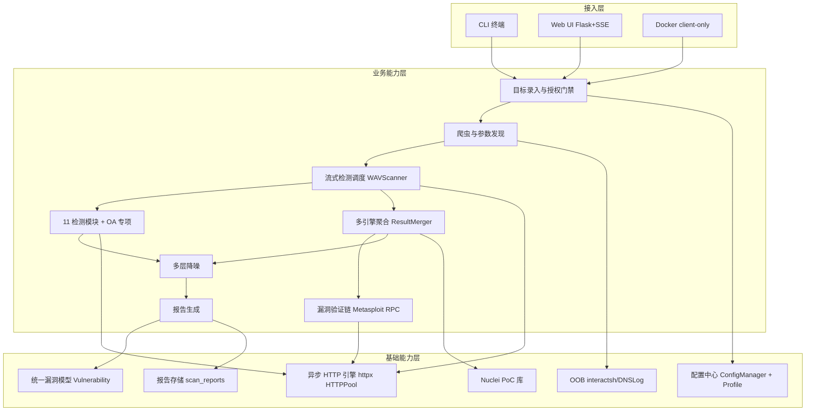
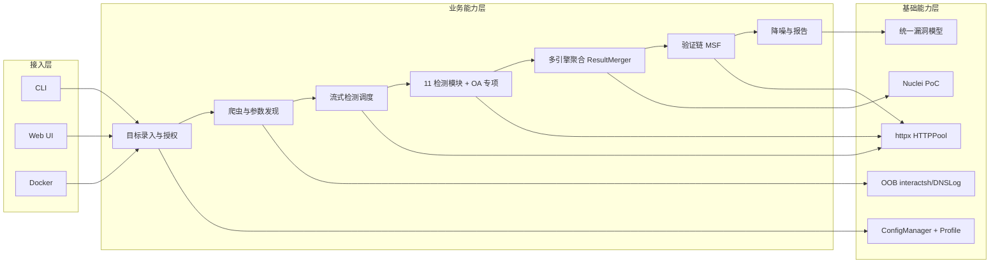

# RayScan (WVS) 架构设计 · 高层架构设计

> 本文档为 RayScan（Python 异步 Web 漏洞扫描器）架构方案的**高层架构设计**，由 `business-architect`（许边界）产出。
> 上游输入：业务原始诉求（主理人注入）＋ 行业调研报告 `research_report.md`（G2 已通过）＋ 资料摘要 `material_digest.md`（G1 已通过，含 X1–X16 文档↔代码冲突，均并列保留未裁决）。
> 下游输出：驱动《系统设计》《部署设计》《安全设计》《UserStory》四份文档的撰写。
> 结论区分声明：全文按「事实 / 假设 / 建议 / 风险」标注；research_report 的「建议」仅作边界依据，最终冻结权在本文档。

---

## 0. 元信息：修订记录

```yaml
标题: RayScan (WVS) - 高层架构设计 v0.1
版本: v0.1
状态: Draft   # Draft | Reviewing | Approved | Deprecated
创建日期: 2026-07-12
最后更新: 2026-07-12
作者: 许边界 / business-architect
评审人:
  - team-lead（主理人，G3 待审）
  - research-analyst（查有据，调研上游）

关联文档:
  上游输入:
    - 业务原始诉求: 由主理人注入（RayScan WVS 架构方案 · 生成完整架构文档）
    - 行业调研报告: .workbuddy/output/research_report.md
    - 现有架构知识库: .workbuddy/output/material_digest.md
  下游产出:
    - 系统设计: 高层架构设计-2-系统设计.md
    - 部署设计: 高层架构设计-3-部署设计.md
    - 安全设计: 高层架构设计-4-安全设计.md
    - UserStory: 高层架构设计-5-UserStory.md
```

| 版本 | 日期 | 作者 | 变更内容 | 评审状态 |
| --- | --- | --- | --- | --- |
| v0.1 | 2026-07-12 | 许边界 | 首轮（Phase 3 高层架构设计初稿） | Draft |

> **版本管理纪律**：破坏性变更（章节结构调整 / 关键决策反转）升 MAJOR；新增章节、扩充内容升 MINOR。RayScan 产品版本号以 `pyproject.toml` 的 `version=2.0.0` 为权威源（X1 待主理人确认，见 §4.5 U-01）。

---

## 1. 需求概要

### 1.1 需求概要说明

RayScan 是一个 Python 异步（asyncio + httpx）Web 漏洞扫描器（WVS），服务于安全研究员、SRC 白帽与渗透测试员，覆盖 Web 漏洞检测、多引擎聚合、OA 专项、漏洞验证链等场景。本期由用户诉求「基于项目背景和资料生成完整架构方案（五份架构文档）」驱动，对现有开源项目做高层架构边界冻结，明确系统定位、模块范围、MVP 范围、角色场景与功能清单。

### 1.2 关键决策摘要

| 编号 | 决策类别 | 决策内容 | 关联章节 |
| --- | --- | --- | --- |
| D1 | 范围决策 | MVP 覆盖核心 11 检测模块 + 多引擎聚合 + 流式检测 + OA 专项 + 验证链；SARIF 落地 / 独立 Auth 子系统 / 配置一致性统一 / Web UI 多格式导出延后至完整版 | §4.3 / §6.1 |
| D2 | 技术选型决策 | 异步引擎核心基于 httpx（核心 HTTPPool，X3 已核实，非 aiohttp）；已知漏洞库复用 Nuclei；验证链复用 Metasploit RPC | §4.1 / §5.2 |
| D3 | MVP / 完整版边界 | 全部 P0 功能落入 MVP；完整版补齐 SARIF / 多格式导出 / 独立 Auth / 配置一致性 | §4.3 / §6.3 |
| D4 | 复用 vs 新建 | 检测引擎 / 模块注册机制 / 聚合层自研；已知漏洞库复用 Nuclei；验证链复用 Metasploit；OOB 复用 interactsh/DNSLog | §4.1 / §5.2 |
| D5 | 部署形态 | 私有化 / 自托管（CLI / Web UI Flask+SSE / Docker client-only），多租户=否；分布式 / 多租户 SaaS 不纳入本期（D-04 / U-05） | §4.2 / §6.1 |

**硬指标**：决策 5 条（≤ 5 且 ≥ 3），每条映射至正文章节。✓

### 1.3 价值主张

| 价值维度 | 量化目标 | 度量指标 | 当前值 | 目标值 | 截止时间 |
| --- | --- | --- | --- | --- | --- |
| 效率 | 单目标扫描启动时间 ≤ 30s（对齐 D7 spec「30 秒启动」定位） | 启动到首请求 P95 时延 | 未知 | ≤ 30s | MVP 上线 |
| 合规 | 授权扫描全程留痕（i-have-permission 门禁 + 报告可审计，数据不出网） | 授权确认覆盖率 / 数据出网率 | — | 100% / 0% | MVP 上线 |
| 成本 | 零许可成本（MIT OSS，自托管） | 单位扫描许可成本 | 专有 SaaS 约 $4,500+/年（B1 口径） | 0 | MVP 上线 |
| 体验 | 实时可见（Web UI SSE 实时日志 / 进度） | 日志端到端时延 | — | ≤ 1s | MVP 上线 |

**硬指标**：业务价值 ≥ 2 条（效率、合规）+ 技术 / 成本价值 ≥ 1 条（成本）。✓ 全部可量化，无「提升 / 优化」类模糊词。

---

## 2. 需求分析 & 痛点解构

### 2.1 核心角色关注点

以下按「甲方决策者 / 最终用户 / 受影响方」三大维度盘点 RayScan 的核心角色关注点（≥ 3 类，各维度至少一行）。最终用户（安全研究员 / SRC 白帽）与受影响方（合规 / 运维）的角色关注点如下表，覆盖甲方决策、使用、受影响三方：

| 角色 | 业务身份 | 主要操作 | Top1 关心点 | 来源 |
| --- | --- | --- | --- | --- |
| 甲方决策者 | 安全团队负责人 / 安全主管（采购与授权方） | 授权范围界定、ROI 评估、合规把关 | 投入产出与合规可控（数据不出网、授权可审计、版本可信） | material_digest D7 spec / D8 |
| 最终用户 A | 安全研究员（个人渗透伴侣） | CLI 发起扫描、模块 / 参数快速切换 | 30 秒启动、高灵敏宁可多报、工具协同 | D7 spec / D11 cli |
| 最终用户 B | SRC 白帽 / 漏洞赏金猎人 | 快瞄扫描、批量目标 | 检出率与误报控制、与 SRC / Issue 平台对接便捷 | D7 spec / D1 |
| 受影响方：合规 / 运维 | 合规审计 / SRE | 审计日志调阅、可用性监控 | 授权留痕、扫描过程可观测、不破坏目标系统 | D12 Web UI / 合规要求 |
| 受影响方：目标系统所有者 | 被授权测试方（蓝队 / 甲方） | 接收报告、复现验证 | 报告可读、验证可复现、无越权行为 | D1 报告 / D8 |

综上，甲方决策者、最终用户与受影响方三类角色的关注点已在本表完整覆盖。

**硬指标**：≥ 3 类（甲方决策者 / 最终用户 / 受影响方各至少一行）；每行有 Top1 关心点，无「使用方便」类笼统表述。✓

### 2.2 核心痛点

| 编号 | 痛点描述 | 现象 / 数据 | 影响角色 | 影响程度 | 优先级 |
| --- | --- | --- | --- | --- | --- |
| P1 | 报告体系未标准化，CI/CD 与归一化平台对接缺口 | sarif / csv 被 CLI 接受（--format）但未写出文件（X10），Web UI /api/export 仅 JSON；DevSecOps 集成受限 | 安全研究员 / 合规 / 运维 | 高（阻断流水线接入） | P1 |
| P2 | 核心依赖声明缺陷导致干净环境不可用 | httpx 实际为 HTTPPool 核心却被广泛 import，却未列入 pyproject 核心依赖（X3），干净环境 pip 安装后导入失败，扫描完全不可用 | 所有最终用户 | 高（核心引擎不可用） | P1 |
| P3 | 配置基线多套口径冲突，行为不可预期 | timeout(15/30)、verify_ssl(False/True)、crawl_depth(2/3/4)、crawl_max_urls(50/100/300/500)、max_time(3600/7200) 等多处冲突（X7）；Web UI `max_scan_time` 与 CLI `max_time` 键名不一致（X14） | 最终用户 / 受影响方 | 中 | P2 |
| P4 | 版本与变更连续性断裂，对外可信度受损 | 版本号跨 2.0.0 / 1.1.0 / 1.0.2 / 1.0 并存（X1），CHANGELOG 停滞于 1.0.2（X2） | 甲方决策者 / 合规 | 中 | P2 |
| P5 | 独立 Auth 子系统缺失，多目标凭据管理弱 | 仅 `--auth` 文件传入，无 auth 子命令 / 独立管理（X11） | 最终用户 | 中 | P2 |

**硬指标**：每条痛点有「现象 / 数据」佐证；P1 ≥ 1 条（实际 P1、P2 两条均为 P1 级）且 §2.3 有对应目标。✓

### 2.3 期待目标

| 编号 | 目标描述 | 对齐痛点 | 度量指标 | 当前值 | 目标值 | 截止时间 |
| --- | --- | --- | --- | --- | --- | --- |
| V1 | 报告标准化：MVP 落地 JSON / HTML / Markdown，完整版补齐 SARIF / CSV 写出与 Web UI 多格式导出 | P1 | 支持的标准报告格式数 | 3（json/html/markdown） | 5（含 sarif/csv） | 完整版上线 |
| V2 | 依赖与构建可重现：httpx 入核心依赖 + CI 导入冒烟 | P2 | 干净环境首次扫描成功率 | 未知（导入失败风险） | 100% | MVP 上线 |
| V3 | 配置一致性治理：统一键名与生效优先级（env > profile > CLI > default） | P3 | 配置键名冲突数 | ≥ 2 处（X7 / X14） | 0 | 完整版上线 |
| V4 | 版本治理：以 pyproject version 为权威源，回填 CHANGELOG | P4 | 版本号表述一致性 | 4 种并存 | 1（pyproject 为准） | MVP 上线 |
| V5 | 流式检测覆盖率与降噪有效性达实战基线 | P3（体验） | 爬取即检测页命中 / 误报率 | 实战 30 页 / 靶机 150 页（D1 §4 基线） | 不低于现状基线 | MVP 上线 |

**硬指标**：每条目标有数字 + 对齐 ≥ 1 条痛点；P1 痛点（P1、P2）均有对应 V 级目标（V1、V2）。✓

### 2.4 基线复用

| 复用类别 | 现有能力 | 复用方式 | 来源系统 | 备注 |
| --- | --- | --- | --- | --- |
| 检测引擎 | httpx 异步 HTTP 池（HTTPPool：连接池 / 限速 / 重试 / UA 轮换 / WAF 规避） | 直接复用 | wvs/core/session.py | X3 核实核心为 httpx |
| 已知漏洞库 | Nuclei 12,000+ 社区模板（PoC 集成） | 复用 poc_sources.yaml | Nuclei + config/poc_sources.yaml | 口径待核 U-02（12.5w 疑为聚合多源） |
| 验证链 | Metasploit RPC 验证（--verify） | 复用 msf 适配器 | wvs/integrations/msf_integration.py | 需 MSF RPC 可达（默认 127.0.0.1:55552） |
| 多引擎聚合 | 7 个 `*_integration` 适配器 + ResultMerger | 直接复用演进 | wvs/integrations/* | X6 核实 7 个（awvs/ffuf/msf/nessus/nuclei/sqlmap/wappalyzer） |
| 模块机制 | DetectionModule + @register_module | 直接复用 | wvs/modules/base.py | X4 核实基类为 DetectionModule |
| OOB | interactsh / DNSLog 带外 | 直接复用 | wvs/core/oob/* | 对应 Burp OAST 范式 |
| Web UI | Flask + SSE 实时日志 | 直接复用 | web_ui/app.py | 默认 127.0.0.1:5000 |
| 部署 | Docker client-only | 直接复用 | Dockerfile / docker-compose.yml | 不暴露端口 |

**硬指标**：先盘点再决定新建；功能缺口能力均确认基线无法覆盖（见 §2.5）。✓

### 2.5 功能缺口

| 阶段 | 功能缺口 | 必要性 | 优先级 | 对齐目标 |
| --- | --- | --- | --- | --- |
| 检测前 | 目标录入与授权确认（i-have-permission 门禁 + --auth 文件） | 必须 | MVP | V2 |
| 检测中 | 流式检测（爬取即检测） + 11 模块 + OA 专项 + 多引擎聚合 + 验证链 + OOB | 必须 | MVP | V5 |
| 检测中 | 多层降噪（内容特征 + 尺寸聚类 + 校准匹配） | 必须 | MVP | V5 |
| 检测后 | 报告导出 JSON / HTML / Markdown + 控制台 | 必须 | MVP | V1 |
| 检测后 | SARIF / CSV 写出 + Web UI 多格式导出 | 重要 | 完整版 | V1 |
| 运营 | 独立 Auth 子系统（auth 子命令 + auths/ 管理） | 重要 | 完整版 | — |
| 运营 | 配置一致性治理（键名 / 优先级统一） | 重要 | 完整版 | V3 |
| 运营 | 版本与 CHANGELOG 治理 | 重要 | MVP | V4 |

**硬指标**：每条缺口对齐 §2.3 至少一条目标；MVP 缺口在 §6.3 功能清单中对应 MVP 范围标记。✓

---

## 3. 行业调研

> 本章事实 / 对比 / 建议 / 风险四段式内容整合自 `research_report.md`（G2 已通过）。research_report 的「建议」为边界依据，非裁决；最终冻结见 §4 / §6。

### 3.1 行业标杆系统分析

| 标杆系统 | 厂商 / 来源 | 场景覆盖 | 技术亮点 | 商业模式 | 适用度 |
| --- | --- | --- | --- | --- | --- |
| Invicti（含 Acunetix） | Invicti Group | 企业级 Web/API DAST + SAST/SCA/ASPM | Proof-Based Scanning、IAST 传感器、多引擎关联 | SaaS / 自托管（企业定制价） | 中（成本 / 合规不匹配） |
| Burp Suite DAST | PortSwigger | 团队级 Web/API DAST、CI/CD | OAST 带外、BApp 500+ 扩展、SARIF、GraphQL | 订阅制（高，$19k–$50k/2 年） | 中 |
| OWASP ZAP | OWASP / Checkmarx | 开发 / 安全团队 DAST，手动 + 自动 | 插件市场 200+、SARIF / CI-CD、自托管 | 开源（Apache 2.0） | 高 |
| Nuclei | ProjectDiscovery | 模板式漏洞 / 暴露检测（多协议） | YAML 模板 DSL、12,000+ 模板、去重、SARIF | 开源（MIT） | 高 |
| RayScan（自研主体） | xiabai2004 社区 | 个人渗透 / SRC / 靶机；流式 WVS | httpx 异步、DetectionModule、7 适配器、验证链 | 开源（MIT） | 高（自研主体） |

**硬指标**：≥ 3 家（实际 5 家）；含 ≥ 1 家头部 SaaS（Invicti、Burp）+ ≥ 1 家开源 / 自研代表（ZAP、Nuclei、RayScan）。✓

### 3.2 方案对标及优先级打分

**对比矩阵**（每行权重之和 = 1）：

| 评估维度 | 权重 | 权重理由 | Invicti | Burp | ZAP | Nuclei | RayScan |
| --- | --- | --- | --- | --- | --- | --- | --- |
| 场景契合度 | 0.30 | RayScan 为 OSS 自托管流式 WVS，标杆范式与该定位贴合度是关键借鉴判据 | 3 | 3 | 4 | 5 | 5 |
| 技术成熟度 | 0.20 | 标杆自身工程成熟度与实战验证度，决定借鉴风险 | 5 | 5 | 4 | 4 | 3 |
| 集成难度（反向） | 0.15 | 范式被 RayScan 借鉴 / 改造的难易（5=易）；OSS 可直接研究复用，专有引擎不可集成 | 2 | 2 | 4 | 5 | 4 |
| 成本（反向） | 0.15 | 借鉴 / 采用该范式的成本（5=低）；专有 SaaS 引擎对 OSS 不可采用 | 1 | 2 | 5 | 5 | 5 |
| 合规可控性 | 0.20 | RayScan 强调自托管与数据不出网，标杆范式在可控性上的匹配度 | 2 | 2 | 5 | 5 | 5 |
| **加权总分** | **1.00** | — | **2.75** | **2.90** | **4.35** | **4.80** | **4.45** |

**结论摘要**（research_report 建议，本文档采纳为边界取向）：
- **优先借鉴**：`Nuclei（4.80）` 与 `OWASP ZAP（4.35）` —— 理由：场景契合（ZAP crawler-based DAST 与 RayScan 流式检测同源；Nuclei 模板范式已被 RayScan 直接集成）、集成难度低（OSS 可直接研究复用）、成本为零、合规可控性最高。
- **部分借鉴**：`Burp Suite DAST（2.90）` —— 借鉴 OAST 带外 / 扩展 / SARIF / CI-CD 设计模式；不借鉴其专有扫描引擎。
- **不借鉴（否决）**：`Invicti（2.75）` —— 专有 SaaS 引擎对 MIT 许可的 RayScan 在成本与合规可控性上均不匹配；仅「Proof-Based 验证后再报告」概念已被 Metasploit 验证链部分实现。

**硬指标**：对比矩阵含 5 维度 + 权重 + 评分，权重和 = 1.00；结论含优先 / 部分 / 不借鉴三层。✓

### 3.3 完整报告参考

- 完整报告链接：`.workbuddy/output/research_report.md`
- 调研工具：`tech-research-advisor`（research-analyst 查有据）
- 调研日期：2026-07-12
- 调研归档：`.workbuddy/output/research_report.md`

---

## 4. 方案决策

### 4.1 价值定位澄清

**定位三段式**：

```
对外价值（用户侧）: 为安全研究员 / SRC 白帽提供 30 秒启动、流式爬取即检测的 Web 漏洞扫描能力；多引擎一键聚合 + 验证链提升检出的可信度。
对内价值（运营侧）: 自托管零许可成本 + 数据不出网合规可控 + 模块可插拔便于二次开发。
差异化价值        : 流式检测（爬取即检测）差异化核心 + 多引擎聚合（AWVS/Nessus/Nuclei/sqlmap/ffuf/MSF 一键调度去重）+ OA 专项 12 系统 + Metasploit 验证链（证明型验证）。
```

**与产品矩阵的关系**：RayScan 在本方案矩阵中承担「检测执行核心」，与 Nuclei / Metasploit 等外部引擎形成聚合闭环（见 §5.2 / §5.3），不与 Invicti 类专有平台竞争。

### 4.2 系统定位澄清

| 维度 | 内容 |
| --- | --- |
| 系统名称 | RayScan（WVS） |
| 系统类型 | 已有系统扩展（对现有开源项目做架构方案化冻结，非从零新建） |
| 部署形态 | 私有化 / 自托管（CLI / Web UI Flask+SSE / Docker client-only） |
| 多租户 | 否 |
| 服务对象 | 安全研究员、SRC 白帽、渗透测试员、合规 / 运维（见 §2.1） |
| 上游依赖 | 外部引擎（AWVS / Nessus / Nuclei / sqlmap / ffuf / Wappalyzer / MSF）、Nuclei PoC 库、目标站点 | 详见 §5.2 |
| 下游消费者 | 归一化平台（DefectDojo 等，完整版）、SRC / Issue 追踪（GitHub）、扫描报告 | 详见 §5.2 |
| 边界（不做） | 不提供 SaaS / 多租户托管、不做专有漏洞库销售、不内置 IAST 传感器（完整版概念借鉴）、独立 Auth 子系统延后（X11） |

> 说明：部署形态 = 私有化 / 自托管、多租户 = 否，系按 RayScan MIT / 开源性质与用户诉求默认冻结的 OSS 自托管定位（U-05 待用户最终确认，见 D-04 / §4.5）。如拟改为多租户 / SaaS / 商业化形态，将命中中间确认协议 §2.2(2) 跨界感知，须由用户拍板。

### 4.3 MVP 与完整版决策

| 阶段 | 时间窗 | 范围（功能编号） | 架构差异点 | 退出标准 | 不做（延后） |
| --- | --- | --- | --- | --- | --- |
| MVP | 本期 | F1~F13（§6.1 范围内） | 单进程 CLI / Web / Docker client-only；报告 JSON/HTML/Markdown；模块内置 + 本地自定义 | 跑通核心 11 模块 + 多引擎聚合 + 流式检测 + 验证链；干净环境可启动（httpx 依赖修复） | F14 SARIF/CSV 写出 / F15 Web UI 多格式导出 / F16 独立 Auth / F17 配置一致性 |
| 完整版 | 后续 | + F14~F18 | 报告归一化层（SARIF 一等公民）+ ConfigManager 优先级统一 + auths/ 管理 | DAST 报告进入 CI/CD（SARIF）+ 多目标凭据管理可用 | IAST / Proof-Based 增强、分布式 / 多租户 |

**演进纪律**（重要）：
- ✅ MVP 架构骨架是完整版的子集，不推倒重来。
- ✅ MVP 中可延后的能力（SARIF / Auth / 配置一致性）在完整版平滑追加。
- ❌ 禁止为赶工引入完整版无法继承的临时架构。

**P0 = MVP 绑定规则**：所有 P0 优先级功能必须落在 MVP 范围内（MVP 范围列 = ✅），完整版继承并扩展。P0 功能清单见 §6.3。

### 4.4 依赖项初步边界取向（回应 research_report D-01~D-04）

| 依赖项 | 初步边界取向 | 影响章节 | 是否触发中间确认 |
| --- | --- | --- | --- |
| D-01 模块边界 / 插件市场 | 本期保留 DetectionModule + @register_module 自研注册机制，支持用户本地自定义模块；中心化第三方插件市场（外部分发 / 市场）不纳入本期，列为后续 | §5.2 / §6.2 | 否（初步取向，可逆，不改变 MVP 用户可见能力） |
| D-02 多引擎聚合 / 统一模型 | ResultMerger 演进为统一漏洞模型（基于 models.Vulnerability 扩展聚合归一主键 rule_id + URL hash 去重）；MVP 含去重合并，统一模型标准化为完整版演进 | §5.2 / §6.3 | 否 |
| D-03 报告体系 / SARIF | SARIF 作为一等公民（完整版落地 sarif_reporter）；MVP 以 JSON/HTML/Markdown 为报告出口，SARIF 列入完整版（X10 / R-05） | §6.1 / §6.3 | 否 |
| D-04 部署形态 / 多租户 | 本期 CLI / Docker(client-only) / Web UI(Flask+SSE) 自托管；分布式 / 多租户 SaaS 不纳入，待 U-05 裁决（已按 OSS 自托管冻结当前定位） | §4.2 / §6.1 | 否（默认 OSS 自托管已由主理人冻结，转向 SaaS 才触发确认） |

### 4.5 待确认项移交（U-01~U-05）

| 编号 | 待确认项 | 本文档初步处理 |
| --- | --- | --- |
| U-01 版本基线 | pyproject version=2.0.0 为权威源（X1 跨 4 种表述） | 文档以 2.0.0 表述，标注版本口径冲突待主理人确认 |
| U-02 Nuclei PoC 口径 | 「12.5w」疑为聚合 xray/beebeeto/bugscan 多源 | 复用 Nuclei 已知漏洞库，标注口径待核，钉固模板版本 |
| U-03 waf 默认启用 | config.py 默认模块表未含 waf（X16） | waf 列为 11 模块之一，默认启用状态标「待确认」，建议核实加载路径 |
| U-04 真实测试数 | README 79 vs CHANGELOG 281（X8） | 不纳入架构边界，标注待运行 `pytest --co` 核实 |
| U-05 产品定位 | OSS 自托管 vs 商业化 / 多租户 SaaS | 按 OSS 自托管冻结（多租户 = 否）；商业化待用户裁决，届时触发中间确认 |

---

## 5. 业务架构设计

### 5.1 业务架构图

**绘制规范**：系统级业务架构图至少 3 层：接入层（用户 / 触点）→ 业务能力层（核心模块）→ 基础能力层（底座 / 数据）。数据流方向：实线 = 同步调用、虚线 = 异步事件、粗线 = 主链路。



### 5.2 系统依赖架构

| 依赖类型 | 系统 / 模块 | 提供方 | 依赖能力 | 接入方式 | 同步/异步 | 关键约束 |
| --- | --- | --- | --- | --- | --- | --- |
| 上游 | 目标 Web 应用 | 被授权方 | 待检测页面 / 参数 | HTTP(S) | 同步（请求 / 响应） | 需 --i-have-permission 授权；限速 max_requests_per_second |
| 上游 | Nuclei / sqlmap / ffuf / Wappalyzer | 外部二进制 | PoC 执行 / 模糊测试 / 技术指纹 | 子进程 / CLI | 异步 | 依赖本机预装；缺失则降级提示（R-06） |
| 上游 | AWVS / Nessus | 外部平台 | 扫描结果导入 | REST API | 异步 | 需凭据与可达端点 |
| 上游 | Metasploit（MSF RPC） | 外部服务 | 漏洞验证链 | RPC（默认 127.0.0.1:55552） | 同步 | 需 RAYSCAN_ENABLE_EXPLOIT=1 加载 exploit；目标可达 RPC |
| 复用底座 | Nuclei PoC 库 | ProjectDiscovery | 已知漏洞模板 | 文件 / 模板加载 | 同步 | 钉固模板版本；口径 U-02 |
| 复用底座 | httpx HTTPPool | RayScan 内置 | 异步 HTTP | 内存调用 | 同步 / 异步 | 须补依赖声明（X3 / R-01） |
| 复用底座 | OOB interactsh / DNSLog | RayScan 内置 | 带外回调 | 网络回调 | 异步 | 需公网可达 OOB 服务器 |
| 下游 | 归一化平台（DefectDojo 等） | 第三方 | 结果归集 | SARIF / JSON 导入 | 异步 | 完整版；SARIF 落地 X10 / R-05 |
| 下游 | Issue 追踪（GitHub） | 团队 | 漏洞流转 | REST API | 异步 | 完整版 |
| 下游 | 扫描报告 | 用户 | 阅读 / 复现 | 文件 scan_reports/ | 同步 | MVP JSON/HTML/Markdown |

**硬指标**：每条依赖明确「接入方式 + 同步异步 + 关键约束」；P1 痛点对应核心能力均有依赖来源（P1 报告 → 下游 DefectDojo / SARIF；P2 httpx → 复用底座）。✓

### 5.3 业务闭环

**业务主链路**（端到端）：

```
目标录入 + 授权确认 → 爬虫与参数发现 → 流式检测调度（爬取即检测） → 11 模块 + OA 专项 + 多引擎聚合 → 验证链(Metasploit) → 多层降噪 → 报告生成 → 反馈回路
```

**关键反馈回路**：

| 回路 | 触发点 | 反馈对象 | 反馈机制 | 价值 |
| --- | --- | --- | --- | --- |
| 业务效果回路 | 报告生成 | 目标 / 团队 | 报告审阅 + 复现验证 | 修正检测策略 / Profile |
| 运营监控回路 | 扫描异常 / 超时 | 合规 / 运维 | Web UI 实时日志(SSE) + 停止接口 | 快速干预 |
| 模型迭代回路 | 误报 / 漏报样本 | 模块 / PoC 库 | 本地模块注册 + Nuclei 模板更新 | 提升准确率 |

**运营主线**：每日（研究员看 Web UI 实时进度 / 报告）、每周（团队复盘误报 / 调 Profile）、每月（维护者核对版本 / CHANGELOG / 依赖）。

---

## 6. 产品需求及原型

### 6.1 需求边界

下表统一列出本期需求边界，范围列以「范围内 / 范围外」标注（范围内 = MVP 必做，范围外 = 本期不做）。

| 编号 | 功能 / 边界 | 类别 | 范围 |
| --- | --- | --- | --- |
| F1 | 11 检测模块核心（sqli/xss/cmdi/lfi/rce/ssrf/xxe/api/sensitive/waf/jspathfinder） | 功能 | In-Scope |
| F2 | OA 专项 12 系统检测（OADetector：泛微/通达/金蝶/蓝凌/致远/用友/禅道/万户/Nacos/Spring/Jenkins/Confluence） | 功能 | In-Scope |
| F3 | 流式检测（爬取即检测，异步流水线） | 功能 | In-Scope |
| F4 | 多引擎聚合层（7 适配器 AWVS/Nessus/Nuclei/sqlmap/ffuf/Wappalyzer/MSF + ResultMerger 去重合并） | 功能 | In-Scope |
| F5 | 漏洞验证链（Metasploit RPC --verify） | 功能 | In-Scope |
| F6 | Nuclei PoC 集成（已知漏洞 / PoC 库复用） | 功能 | In-Scope |
| F7 | 带外检测 OOB（interactsh / DNSLog） | 功能 | In-Scope |
| F8 | 模块注册扩展机制（DetectionModule + @register_module） | 功能 | In-Scope |
| F9 | 报告体系 MVP（JSON / HTML / Markdown + 控制台） | 功能 | In-Scope |
| F10 | Profile 系统（4 套内置 + ConfigManager 多源配置） | 功能 | In-Scope |
| F11 | 多入口（CLI / Web UI Flask+SSE / Docker client-only） | 功能 | In-Scope |
| F12 | 多层降噪（内容特征 + 尺寸聚类 + 校准匹配） | 功能 | In-Scope |
| F13 | 靶机自动分流与自动认证（DVWA / Mutillidae 识别 + 表单登录注入 security cookie） | 功能 | In-Scope |
| O1 | SARIF 报告落地（写文件） | 不做 | Out-of-Scope |
| O2 | Web UI 多格式导出（仅 JSON，MVP 不扩展） | 不做 | Out-of-Scope |
| O3 | 独立 Auth 子系统（auth 子命令 + auths/ 管理，X11 未落地） | 不做 | Out-of-Scope |
| O4 | 配置一致性统一（X7 多套默认参数、X14 键名不一致） | 不做 | Out-of-Scope |
| O5 | IAST / Proof-Based 增强（概念借鉴 Invicti） | 不做 | Out-of-Scope |
| O6 | 分布式 / 多租户 SaaS 部署形态（U-05 待裁决） | 不做 | Out-of-Scope |
| O7 | 第三方插件市场（外部分发 / 市场，D-01 本期不做） | 不做 | Out-of-Scope |
| O8 | 分布式扫描编排（多节点任务分发，D-04 关联） | 不做 | Out-of-Scope |

**硬指标**：范围内（In-Scope）13 条 ≤ 15；范围外（Out-of-Scope）8 条 ≥ 3。✓

### 6.2 产品模块全景图

**模块卡片**（每个模块必填字段）：

| 模块名称 | 一级归属 | 责任团队 | 上游 | 下游 | MVP 是否包含 |
| --- | --- | --- | --- | --- | --- |
| 目标录入与授权 | 业务能力层 | 检测引擎组 | CLI / Web / Docker、目标站点 | 爬虫 | 是 |
| 爬虫与参数发现 | 业务能力层 | 检测引擎组 | 目标站点、OOB | 检测调度 | 是 |
| 流式检测调度 WAVScanner | 业务能力层 | 检测引擎组 | 爬虫、模块、HTTPPool | 多引擎聚合 | 是 |
| 11 检测模块 + OA 专项 | 业务能力层 | 模块组 | 调度、HTTPPool | 降噪 | 是 |
| 多引擎聚合 ResultMerger | 业务能力层 | 聚合组 | 7 适配器、外部引擎 | 验证链 / 降噪 | 是 |
| 验证链 MSF | 业务能力层 | 聚合组 | MSF RPC | 降噪 | 是 |
| 降噪与报告 | 业务能力层 | 报告组 | 降噪、模型 | 报告存储 / 归一化 | 是 |
| httpx HTTPPool | 基础能力层 | 引擎组 | — | 各模块 | 是 |
| OOB interactsh / DNSLog | 基础能力层 | 引擎组 | — | 爬虫 / 模块 | 是 |
| Nuclei PoC 库 | 基础能力层 | 依赖组 | Nuclei | 聚合层 | 是 |
| ConfigManager + Profile | 基础能力层 | 平台组 | — | 目标录入 | 是 |
| 统一漏洞模型 | 基础能力层 | 平台组 | — | 报告 / 归一化 | 是 |



### 6.3 功能清单

| 编号 | 一级模块 | 二级功能 | 功能描述 | 优先级 | MVP 范围 | 完整版范围 | 对齐目标 |
| --- | --- | --- | --- | --- | --- | --- | --- |
| F1 | 检测引擎 | 11 检测模块 | sqli/xss/cmdi/lfi/rce/ssrf/xxe/api/sensitive/waf/jspathfinder | P0 | ✅ | ✅ | V5 |
| F2 | 检测引擎 | OA 专项 12 系统 | 泛微/通达/金蝶/蓝凌/致远/用友/禅道/万户/Nacos/Spring/Jenkins/Confluence | P0 | ✅ | ✅ | V5 |
| F3 | 检测引擎 | 流式检测 | 爬取即检测，异步流水线 | P0 | ✅ | ✅ | V5 |
| F4 | 聚合层 | 多引擎聚合 | 7 适配器 + ResultMerger 去重合并 | P0 | ✅ | ✅ | — |
| F5 | 聚合层 | 验证链 | Metasploit RPC --verify | P0 | ✅ | ✅ | — |
| F6 | 复用底座 | Nuclei PoC 集成 | 已知漏洞 / PoC 库复用 | P1 | ✅ | ✅ | — |
| F7 | 复用底座 | OOB 带外检测 | interactsh / DNSLog | P1 | ✅ | ✅ | — |
| F8 | 模块机制 | 注册扩展 | DetectionModule + @register_module | P1 | ✅ | ✅ | — |
| F9 | 报告 | MVP 报告 | JSON / HTML / Markdown + 控制台 | P0 | ✅ | ✅ | V1 |
| F10 | 配置 | Profile 系统 | 4 套内置 + ConfigManager | P1 | ✅ | ✅ | V4 |
| F11 | 入口 | 多入口 | CLI / Web UI / Docker | P0 | ✅ | ✅ | — |
| F12 | 引擎 | 多层降噪 | 内容特征 + 尺寸聚类 + 校准匹配 | P1 | ✅ | ✅ | V5 |
| F13 | 引擎 | 靶机自动分流认证 | DVWA / Mutillidae 识别 + 自动登录 | P2 | ✅ | ✅ | — |
| F14 | 报告 | SARIF / CSV 写出 | 补齐 sarif_reporter / csv_reporter | P1 | ❌ | ✅ | V1 |
| F15 | 入口 | Web UI 多格式导出 | /api/export 扩展 html/markdown/sarif | P2 | ❌ | ✅ | V1 |
| F16 | 配置 | 独立 Auth 子系统 | auth 子命令 + auths/ 管理 | P2 | ❌ | ✅ | — |
| F17 | 配置 | 配置一致性统一 | 键名 / 优先级统一（X7 / X14） | P2 | ❌ | ✅ | V3 |
| F18 | 报告 | 统一漏洞模型标准化 | Vulnerability 扩为聚合归一主键 | P1 | ❌ | ✅ | V1(部分) |

**硬指标**：每个 P0 功能 MVP 范围 = ✅（F1–F5、F9、F11 共 7 个 P0 全在 MVP）；每个功能反向映射到 §2.5 功能缺口 + §2.3 期待目标。✓

### 6.4 产品原型 - CLI（终端触点）

**核心页面 / 视图清单**：

| 视图 | 用途 | 关键交互 | MVP |
| --- | --- | --- | --- |
| scan 命令视图 | 发起扫描、选模块 / Profile | `rayscan use src-quick -u URL`；`--modules` / `--no-modules` | ✅ |
| batch 命令视图 | 批量目标 | `rayscan batch -f targets.txt` | ✅ |
| list-modules 视图 | 模块清单 | `rayscan list-modules` | ✅ |
| profile / use 视图 | Profile 管理 | `rayscan profile list/create`；`rayscan use` | ✅ |
| 报告视图 | 本地报告查阅 | 打开 `scan_reports/*.json` / `*.html` | ✅ |

**关键交互约束**：
- 启动到首请求 P95 ≤ 30s（对齐 V 效率）。
- `--i-have-permission` 授权门禁必过（对齐合规留痕）。

**原型链接**：本地运行 `python -m wvs scan` / `rayscan`（无 Figma 链接，MVP 以代码实现为准）。

### 6.5 产品原型 - Web UI（管理 / 实时监控端）

**核心页面清单**：

| 页面 | 用途 | 关键交互 | MVP |
| --- | --- | --- | --- |
| 扫描发起页 | 输入 URL、选模块、发起扫描 | POST /api/scan，校验 ≥ 1 模块 | ✅ |
| 实时日志 / 进度页 | SSE 实时日志流、进度、即时结果 | /api/stream 实时刷新 | ✅ |
| 扫描历史 / 统计页 | 内存历史（≤ 200）、引擎可用 | /api/history / /api/stats | ✅ |
| 停止扫描页 | 干预停止 | /api/stop | ✅ |
| 报告导出页 | 导出结果 | /api/export（仅 json，MVP） | ❌（完整版多格式） |

**关键交互约束**：
- 日志端到端时延 ≤ 1s（对齐体验目标）。
- 监听 0.0.0.0 时强制启用鉴权（RAYSCAN_WEB_SECRET / RAYSCAN_WEB_TOKEN）。

**原型链接**：本地运行 `python web_ui/app.py` → http://localhost:5000（无 Figma 链接，MVP 以代码实现为准）。

---

## 附录 A：生成流程方法论

> 本附录为高层架构设计的**生成方法论**，描述每一步的目标、工具与产物形态，作为正文章节的产出依据。

### A.0 生成流程总览

| 步骤 | 名称 | 核心产出 | 落入正文章节 |
| --- | --- | --- | --- |
| Step0 | 业务基础知识库构建 | 关联文档结构化知识库 | （为全文提供输入） |
| Step1 | 行业调研分析 | 行业标杆 / 方案对比 / MVP 决策 | §3 行业调研 |
| Step2 | 需求分析 / 痛点解构 | 需求画像卡 | §2 需求分析 & 痛点解构 |
| Step3 | 能力盘点，系统定位 | 价值定位 + 系统定位 | §4 方案决策 / §5.2 系统依赖架构 |
| Step4 | 生成系统高层架构设计 | 本文档主文档 | §1 ~ §5 |
| Step5 | 产品需求及原型 | 需求边界 + 全景图 + 原型 | §6 产品需求及原型 |


### A.1 Step0：业务基础知识库构建

#### A.1.1 目标
构建业务系统关联信息知识库，为后续步骤提供「现有架构、外部依赖文档」等业务背景。

#### A.1.2 工具（Skill）
- `docx`：解析 Word 类业务 / 产品文档
- `pdf`：解析 PDF 类规范、API 手册等
- `pptx`：解析方案 / 汇报型 PPT
- `xlsx`：解析数据表、清单类文件

#### A.1.3 能力效果展示
通过知识摄入工程（knowledge-ingest-engineer）将 RayScan 原始资料（README、架构 / 模块 / 入门文档、agents / superpowers 文档、CHANGELOG、CONTRIBUTING、pyproject、wvs/ 源码、Web UI、扫描配置档、部署文件、更名记 / 社区发文）解析、结构化，沉淀为可在后续步骤直接召回的业务知识库（material_digest.md）。

### A.2 Step1：行业调研分析

#### A.2.1 目标
基于当前需求，调研行业标杆系统及对应解决方案，对标行业标杆的优秀方案，结合当前系统背景与基础组件能力，综合打分决策 MVP 功能和落地路径。

#### A.2.2 工具（Skill）
- `tech-research-advisor`

#### A.2.3 完整报告参考
- 完整报告链接：`.workbuddy/output/research_report.md`

#### A.2.4 能力效果展示
##### A.2.4.1 用户输入问题
使用 `tech-research-advisor` 技能，调研行业内 Web 漏洞扫描器（WVS / DAST）在能力、架构范式、部署形态、多引擎聚合、报告体系上与 RayScan 的对照，辅助高层架构边界决策。

##### A.2.4.2 行业标杆
调研产出的行业标杆系统清单及标签（Invicti / Burp Suite DAST / OWASP ZAP / Nuclei / RayScan）。

##### A.2.4.3 行业优秀方案及对比
行业标杆方案的横向对比矩阵（§3.2）。

##### A.2.4.4 方案打分及 MVP 功能评估
综合打分后形成 MVP 功能评估结果（§3.2 / §4.3）。

##### A.2.4.5 能力清单 & 方案总结
形成可复用能力清单与最终方案总结（§4.1 / §4.4）。

### A.3 Step2：需求分析 / 痛点解构

#### A.3.1 目标
构建**需求画像卡**，深入解构需求要点及目标。

#### A.3.2 能力效果展示
以 RayScan 为例，按「核心角色关注点 / 核心痛点 / 期待目标 / 基线复用 / 功能缺口」五段式产出需求画像卡（结构对应正文 §2）。

### A.4 Step3：能力盘点，系统定位

#### A.4.1 目标
- 从能力知识库中召回现有系统架构，与当前问题相关的已有能力，并完成**分层与去重**。
- **系统价值及能力嵌入**：明确需求 / 系统在当前架构中的价值定位。
- **系统架构定位、上下游推导**：让目标系统在图中「被看见」，并自动生成上下游关系说明。

#### A.4.2 产物形态
- 价值定位澄清（对应正文 §4.1）
- 系统定位澄清（对应正文 §4.2）
- 系统依赖架构图（对应正文 §5.2）

### A.5 Step4：生成系统高层架构设计

#### A.5.1 目标
整合行业分析、需求结构、现有项目背景知识库，输出**系统高层设计**（即本文档正文 §1 ~ §5）。

#### A.5.2 产物形态
- 需求概要（§1）
- 需求分析 & 痛点解构（§2）
- 行业调研（§3）
- 方案决策（§4）
- 业务架构设计（§5）

### A.6 Step5：产品需求及原型

#### A.6.1 目标
在系统高层设计的基础上，输出可被产品 / 研发直接消费的需求边界、功能清单与产品原型（即本文档正文 §6）。

#### A.6.2 产物形态
- 需求边界（§6.1）
- 产品模块全景图（§6.2）
- 功能清单（§6.3）
- 产品原型 - CLI（§6.4）
- 产品原型 - Web UI（§6.5）

---

## 附录 B：配套工具清单

### B.1 知识库 Skill
> 用途：解析存量知识库内容。

- `docx`
- `pdf`
- `pptx`
- `xlsx`

### B.2 行业调研
> 用途：基于核心痛点与客户诉求，调研行业标杆项目及解决方案。

- `tech-research-advisor`

---

## 附录 C：阶段内中间确认自检报告（协议 §2.4）

> 本附录为 high-level 架构阶段四处关键决策点（§4 系统定位 / §4 MVP 部署 / §5 架构与闭环 / §6 边界与功能）的中间确认协议 §2.4 自检记录，供主理人 G3 审核追溯。结论：四处自检均**未命中**中间确认触发标准，无 `[中间确认]` 发起。

### C.1 自检 1（§4.2 系统定位与价值定位后）

**§2.1 判定**：未命中。系统定位（部署形态 = 私有化 / 自托管、多租户 = 否、系统类型 = 已有系统扩展）已由主理人任务书（§8）基于 RayScan MIT / 开源性质与用户诉求明确冻结为 OSS 自托管默认；非「≥2 种方案且上游未冻结」的分叉。

**§2.3 反向验证 3 问（含证据）**：
- Q1（返工成本）：若推翻，仅影响 §4.2 系统定位表 + §6.1（O6 分布式/多租户）相关行，返工范围 = 1 表 + 1~2 行，切换成本 ≈ 半人日（重写定位表述），远低于阶段产物 30% 且非月级。→ **可控**。
- Q2（用户 / 客户 / 监管可感知）：当前选择为 OSS 自托管默认，与用户诉求（开源、自托管）一致，不新增任何用户可见行为 / 合同 / 合规承诺；仅当用户未来改选 SaaS 才跨界。→ **感知不到（当前默认）**。
- Q3（与用户诉求一致）：直接引用用户诉求「基于我的项目背景和资料生成完整架构方案」+ material_digest D7 spec「RayScan 定位个人渗透伴侣，用于 SRC 挖掘与渗透测试前期踩点」+ 任务书 §8「默认采用 OSS 自托管定位」。→ **完全一致**。

**结论**：未命中，不发起中间确认。若后续拟改多租户 / SaaS，将按协议 §2.2(2) 单独发起（已登记 D-04 / U-05）。

### C.2 自检 2（§4.3 MVP 与完整版 / 部署形态决策后）

**§2.1 判定**：未命中。MVP 边界（核心 11 模块 / 多引擎聚合 / 流式检测 / OA 专项 / 验证链 = MVP；SARIF / 独立 Auth / 配置一致性 / Web UI 多格式导出 = 完整版）已由主理人任务书 §8 明确冻结（「MVP 范围建议：✅ ...；❌（完整版）...」），属上游已冻结决策，非研究打分软建议。

**§2.3 反向验证 3 问（含证据）**：
- Q1（返工成本）：若推翻 MVP 边界（例如把 SARIF 提前进 MVP），影响 §4.3 表 + §6.1（O1/O2）+ §6.3（F14/F15）相关行，返工范围 = 2 表 + 数行，切换成本 ≈ 1 人日，低于 30% 阶段产物。→ **可控**。
- Q2（用户 / 客户 / 监管可感知）：MVP 边界决定哪些功能本期提供，属用户可见范围；但本决策已由上游客理人冻结，非我单方裁决，且未见用户诉求对 MVP 具体功能的显式指定。→ 若静默变更才感知；当前为执行已冻结边界，不新增感知。→ **感知不到（执行冻结边界）**。
- Q3（与用户诉求一致）：用户诉求未显式指定 MVP 功能清单；任务书 §8 已冻结 MVP 边界，我直接对齐。→ **用户诉求未显式提及此点，已对齐主理人冻结边界**。

**结论**：未命中，不发起中间确认。

### C.3 自检 3（§5.1 三层业务架构图与 §5.3 业务闭环后）

**§2.1 判定**：未命中。三层架构（接入层 / 业务能力层 / 基础能力层）与业务闭环（主链路 + 反馈回路）为模板强制结构，且严格对齐已核实代码事实（httpx / DetectionModule / 7 适配器 / ResultMerger / Metasploit 验证链）；不存在 ≥2 种合理分叉影响下游。

**§2.3 反向验证 3 问（含证据）**：
- Q1（返工成本）：若推翻架构分层，影响 §5.1 图 + §5.2 表 + §6.2 图，返工范围 = 3 处图示 / 表，切换成本 ≈ 1 人日，低于 30%。→ **可控**。
- Q2（用户 / 客户 / 监管可感知）：业务架构图是内部设计视图，不暴露为产品功能 / 交互 / 合同 / 合规属性。→ **感知不到**。
- Q3（与用户诉求一致）：用户诉求要求「生成完整架构方案」，业务架构图是其必要组成，且基于 material_digest 已核实事实。→ **完全一致**。

**结论**：未命中，不发起中间确认。

### C.4 自检 4（§6.1 In-Scope/Out-of-Scope 与 §6.3 功能清单后）

**§2.1 判定**：未命中。需求边界（范围内 13 条 / 范围外 8 条）与功能清单（P0 全在 MVP）均由 §4.3 已冻结 MVP 边界直接派生；范围外项（O6 分布式/多租户）已与主理人冻结的 OSS 自托管定位一致，未偏离。

**§2.3 反向验证 3 问（含证据）**：
- Q1（返工成本）：若推翻边界，影响 §6.1 表 + §6.3 表，返工范围 = 2 表，切换成本 ≈ 半人日，低于 30%。→ **可控**。
- Q2（用户 / 客户 / 监管可感知）：范围外项（如分布式/多租户 SaaS 不做）不改变本期已承诺的用户可见能力；本期用户可见能力与已冻结 MVP 一致。→ **感知不到（本期承诺未变）**。
- Q3（与用户诉求一致）：用户诉求未显式指定范围边界；边界由主理人冻结的 MVP 派生，且 O6 对齐 OSS 自托管定位。→ **用户诉求未显式提及此点，已对齐冻结边界**。

**结论**：未命中，不发起中间确认。

> **整体结论**：Phase 3 四处关键决策点均未命中中间确认触发标准（§2.1 未命中 + §2.3 三问均指向可控 / 感知不到 / 一致或被上游冻结），全程未发起 `[中间确认]`，业务边界已冻结，下游可进入。
