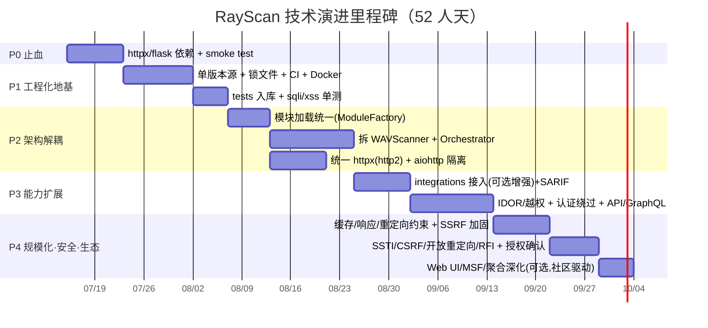

# RayScan 技术演进规划方案（统一版）

> 版本：v1.1 ｜ 日期：2026-07-12
> 编制：交付总监齐活林 汇总（产品路线图-许清楚 / 技术演进-高见远）
> 依据：代码库审计 `docs/audit/rayscan-codebase-audit-2026-07-12.md`
> 配套技术详档：`docs/rayscan_evolution_roadmap.md`（架构师原始方案 + 二次校准）
> 战略决策状态：**已定**（自研内核优先 / 先开源 / 安全研究员·渗透优先 / 版本号 2.0.0）

---

## 0. 执行摘要（TL;DR）

RayScan 当前「**内核强、工程弱、接线断**」：检测内核插件化扎实、主流漏洞覆盖全，但存在一处 **P0 阻断级缺陷**（`httpx` 未声明依赖，导致安装/Docker/CI 全失败），且测试被排除出库、集成层未接入主流程、编排层膨胀。

本方案给出 **5 个 Phase、约 52 人天** 的演进路线，**先止血（P0）→ 工程化地基（P1）→ 架构解耦（P2）→ 能力扩展与接线（P3）→ 规模化安全与生态（P4）**，并补齐 IDOR/越权、SSTI、API 安全等高价值缺失能力。

**方向已定**：以「自研内核优先」构筑检测精度 + 合规安全护城河，先走开源，目标用户聚焦安全研究员 / 渗透测试；聚合（integrations）降级为可选增强。架构师据此完成二次校准（详见 `docs/rayscan_evolution_roadmap.md` §6）。

---

## 1. 产品愿景与定位

RayScan 定位为 **「自研检测内核 + 可选多引擎聚合」的异步 Web 漏洞扫描器**，而非纯调度平台。差异化护城河：

1. **合规安全**：默认只检测不利用（exploit 默认禁用）+ 扫描前授权确认门槛（开源发布前置条件）。
2. **精度可控**：`wvs/` 插件化抽象使新增漏洞类型成本极低，自研内核覆盖 SQLi/XSS/SSRF 等主流面，比纯调度器更可控。
3. **报告友好**：多格式报告（含 SARIF）贴合研究员出报告与开源社区集成；CLI 优先，契合渗透工作流。

**取舍**：不追工具广度（如 AWVS 商业套件），以「检测精度 + 合规安全 + 可扩展」构筑壁垒；聚合仅作可选增强，nuclei 默认开、其余需 `--enable`。

---

## 2. 目标使用者与诉求（侧重：安全研究员 / 渗透优先）

| 使用者 | 核心诉求 | 当前优先级 |
|--------|---------|-----------|
| 安全研究员 / 渗透（瑞哥侧） | 新增漏洞类型快、OOB/上下文感知精准、并发/Profile 可调、报告多格式 | **核心聚焦** |
| DevSecOps / 开发 | CLI/CI 可嵌入、安装可靠、gentle 速率、SARIF | 兼顾（非首要） |
| 社区 / 开源用户 | 安装可靠、文档清晰、合规默认行为 | 兼顾（开源发布驱动） |

---

## 3. 统一分期路线图（产品 × 技术对齐）

> 时间桶：近期 0–3 月（Phase 0–2）｜中期 3–6 月（Phase 3 + P4 前半）｜长期 6–12 月+（P4 后半 + 生态）
> 工作量合计 **52 人天**（P0 5 + P1 10 + P2 18 + P3 12 + P4 7）

| Phase | 周期/工作量 | 工程目标 | 产品能力交付 | 对应需求 |
|-------|-----------|---------|-------------|---------|
| **P0 止血** | ~1 sprint / 5 人天 | httpx/flask 入依赖、proxies→proxy、sqli `__init__` 漏透 session、删 dev 依赖冲突、import smoke test | 安装/Docker/CI 跑通（R-01） | R-01 |
| **P1 工程化地基** | ~2 sprint / 10 人天 | 单版本源(2.0.0)、uv.lock、CI(ruff+mypy+覆盖率)、Docker 多阶段、tests 入库 + sqli/xss 单测、sarif/csv 接线修复 | 可重复构建 + 基础测试网（R-02/R-03） | R-02, R-03 |
| **P2 架构解耦** | ~3 sprint / 18 人天 | 模块加载统一(ModuleFactory)、WAVScanner 拆分(Orchestrator+Auth/Dedup/Checkpoint)、统一 httpx(http2)、aiohttp 隔离默认禁用、concurrent_endpoints 真正生效、删硬编码路径/lab 分支(改 `--lab`) | 可维护核心 + 并发可调（R-08 基础） | R-08 |
| **P3 能力扩展与接线** | ~2–3 sprint / 12 人天 | integrations/ 接入主流程(可选增强)、补全 SARIF 实现 | **自研漏洞模块为绝对核心**：**IDOR/越权**(R-04)、**认证绕过**(R-05)、**API 安全增强 + GraphQL**(R-06)；多引擎生效(R-09，nuclei 默认开) | R-04, R-05, R-06, R-09 |
| **P4 规模化·安全·生态** | ~1.5 sprint / 7 人天 | 缓存/响应体/重定向约束、SSRF+profile 遍历+WebUI 加固、扫描前授权确认 + gentle 预设 | **SSTI/CSRF/开放重定向/RFI**(R-07)、**授权确认+合规预设**(R-10，**开源前置，升权**)；R-11/R-12/R-13 降权为可选/社区驱动（移出核心人天） | R-07, R-10 |

---

## 4. 需求池（P0/P1/P2，归一化）

**P0（近期必做，阻断级）**
- R-01 `httpx`/`flask` 依赖声明修复 —— 阻断安装（P0）
- R-02 测试纳入版本管理 + 补 sqli/xss 核心用例（P1）
- R-03 版本号统一(2.0.0) + SARIF/CSV 静默失效修复（P0/P1）

**P1（近期/中期，自研为核心）**
- R-04 IDOR / 越权检测（P3，企业最常漏，最高价值）⭐
- R-05 认证绕过检测（P3）⭐
- R-06 API 安全增强（越权/批量/速率）+ GraphQL（P3）⭐
- R-07 SSTI / CSRF / 开放重定向 / RFI（P4）
- R-08 并发可配置化（破除硬编码 2）（P2）
- R-09 integrations/ 接入主流程（P3，可选增强：nuclei 默认开、其余 `--enable`）
- R-10 授权确认 + gentle 合规预设（P4，开源发布前置，升权）

**P2（长期，降权为可选/社区驱动，不占核心人天）**
- R-11 Web UI 与 CLI 能力对齐（P4，**降权**：社区驱动/后续可选，最低优先）
- R-12 MSF 验证链落地（P4，**降权**：自研优先+开源下推迟）
- R-13 多引擎聚合深化（P4，**降权**：仅保留 nuclei 等已接部分，awvs/nessus/wappalyzer 维持 `--enable`）

> ⭐ = 自研内核优先方向下的核心交付

---

## 5. 关键架构决策（草图）

- **模块加载统一**：各 detector 顶部 `@register_module`；`ModuleFactory.create_all()` 遍历注册表实例化；删除 `WAVScanner.load_module()` 的 `__import__` 兜底与 `_MODULE_PRIORITY` 硬编码（改配置/Profile 驱动）。
- **流水线编排**：定义 `ScanStage` 接口 `async def run(ctx) -> StageResult`；`Orchestrator` 持 `List[ScanStage]`，`Auth`/`Dedup`/`Checkpoint` 为内建 stage，靶场逻辑抽为可选 `--lab` stage。
- **集成抽象**：`class Integration(ABC): name; async def run(target, ctx)` + `IntegrationRegistry`，引擎无关注入；**默认仅启用 nuclei，其余显式 `--enable`**（ffuf/sqlmap 默认关，贴合合规）。
- **HTTP 统一**：核心统一 `AsyncClient(http2=True, verify=config.verify_ssl)`；**aiohttp 隔离至外调适配层、默认禁用**，保留聚合选项（非全删）。
- **并发模型**：全局 `Semaphore(cfg.concurrency)` + `--concurrency` + 预设 `gentle≈2-3 / default≈5-10 / aggressive`，硬上限受速率合规约束（破除硬编码 15/12）。
- **缓存策略**：`LRUCache(maxsize=2000, ttl=300)` 存 `(status, headers_hash, body_hash)` 轻量元组，替代完整 `httpx.Response` 缓存。
- **安全加固**：目标 `scheme∈{http,https}` 且 IP 非私网/链路本地/`169.254.169.254`；Profile `name` 白名单 `^[A-Za-z0-9_-]+$`；`verify=False` 仅 `--insecure` 时允许并告警。

涉及核心文件：`wvs/core/scanner.py`、`wvs/core/base.py`、`wvs/modules/__init__.py`、`wvs/core/orchestrator.py`(新)、`wvs/core/auth_manager.py`(新)、`wvs/core/dedup.py`(新)、`wvs/core/checkpoint.py`(新)、`wvs/core/session.py`、`wvs/core/integrations/`(新抽象)、`wvs/cli.py`、`wvs/profiles/loader.py`、`wvs/web_ui/app.py`、`pyproject.toml`、`Dockerfile`、`.github/workflows/ci.yml`。

---

## 6. 依赖与工程化治理

- **`pyproject.toml`**：`[project.dependencies]` 补 `httpx>=0.27,<0.29`、`flask>=3`；`[project.optional-dependencies].dev` 仅 `ruff`/`mypy`/`pytest`；删除 `requirements-dev.txt`（black/isort/flake8 统一为 ruff）。
- **锁文件**：`uv` 生成 `uv.lock`，CI 校验可复现。
- **CI 门禁**：`ruff` + `mypy`（关键模块 `--strict`）+ `pytest` 覆盖率门槛（先 30%，逐步提升至 50%+）。
- **Docker**：builder 装 dev 依赖，runtime 仅 `dependencies`+`httpx`，非 root 运行。
- **版本单一源**：`wvs/__init__.__version__ = "2.0.0"` 为唯一来源，CLI/报告/pyproject 读取，勿单列外发版本。

---

## 7. 成功指标 / KPI（可量化）

| 指标 | 现状 | 目标 |
|------|------|------|
| 覆盖漏洞类 | ~22 类 | 近期 24 类 → 中期 ≥30 类 |
| 误报率 | 未建基线 | < 8%（先建基线测试集） |
| 漏报率（基准集） | 未建基线 | < 15% |
| 测试覆盖率 | 核心 sqli/xss 0% | sqli/xss ≥70%，总体 ≥50% |
| 安装成功率（pip/Docker/CI） | 失败 | 100% |
| 扫描吞吐 | 并发=2 | 并发可配后 ≥3× |

---

## 8. 里程碑 Timeline（Mermaid 甘特）

---

## 9. 已定战略决策与校准结论（原"待确认事项"）

> 瑞哥已于 2026-07-12 拍板 4 项战略决策，架构师据此完成二次校准（详见 `docs/rayscan_evolution_roadmap.md` §6）。

**A. 已定战略决策**
1. **战略方向 = 自研内核优先** —— 聚焦检测精度 + 合规安全护城河；聚合仅作可选增强。
2. **商业模式 = 先开源** —— GitHub 开源，吸引社区与背书；MSF/Web UI 可在开源基础上迭代。
3. **目标用户 = 安全研究员 / 渗透优先** —— CLI/报告/文档贴合该群体，DevSecOps 降为兼顾。
4. **版本号 = 统一 2.0.0** —— pyproject 为单一事实源（SSOT），CLI/报告派生读取。

**B. Provisional 默认（经复核全部保留，与新决策一致）**
- 版本 SSOT = pyproject 2.0.0 ✅
- aiohttp 隔离至外调适配层、默认禁用（非全删）✅
- 集成默认策略 = nuclei 默认开、其余需 `--enable`、ffuf/sqlmap 默认关 ✅
- 并发 = Semaphore(cfg.concurrency) + `--concurrency` + 预设 gentle/default/aggressive，硬上限受合规约束 ✅
- 靶场逻辑改可选 `--lab` stage ✅

**C. 范围翻转（因决策 1/2/3）**
- **P3 升权**：IDOR/越权(R-04)、认证绕过(R-05)、API 安全+GraphQL(R-06) 列为绝对核心，经 `@register_module` 注册进 `ModuleFactory`。
- **P4 降权（移出核心人天）**：R-11 Web UI、R-12 MSF 验证链、R-13 聚合深化 → 可选/社区驱动。
- **P4 升权**：R-10 授权确认 + gentle 合规预设 → 开源发布前置条件，优先级靠前。
- **P4 人天 10 → 7**（总工期 55 → 52）。

**D. 仍开放的技术细节（非战略级，按合理默认推进，无需再拍板）**
- Python 版本下限：建议 `>=3.10`（asyncio 改进、httpx 对齐）。
- `concurrent_endpoints` 15/12：作为 `aggressive` 预设参考值，最终由 `--concurrency` 暴露。

---

## 10. 交付物索引

- 本统一规划：`docs/audit/rayscan-evolution-plan-2026-07-12.md`
- 架构师技术详档（含二次校准）：`docs/rayscan_evolution_roadmap.md`
- 审计原始报告：`docs/audit/rayscan-codebase-audit-2026-07-12.md`
