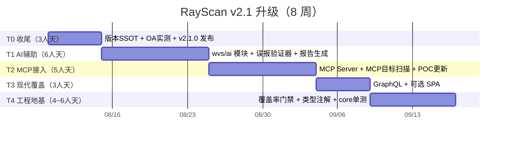

# RayScan 未来开发升级方案（v2.1 · 2026-08-08）

> 版本：v1.0 ｜ 日期：2026-08-08
> 编制：基于 2026-08-08 外部情报调研 + 2026-08-05 内部双路审查
> 关联文档：`docs/audit/rayscan-evolution-plan-2026-07-12.md`（v1.2 战略修正，S1-S4）、`docs/TECH_DEBT.md`
> 外部情报来源：PortSwigger Burp AI/AT 官方页、ZAP 官方博客（2024-09 ~ 2026-08）、projectdiscovery/nuclei README（v3）、chaitin/xray 仓库状态、GitHub 中文 OA/漏扫生态搜索

---

## 0. 执行摘要（TL;DR）

RayScan 已兑现 v1.2 战略的 S1-S3（误报治理、Nuclei 接入、OA 三级链路），S4（发布+实测）未闭环。
本次调研显示 2025-2026 行业出现三个确定性趋势，直接决定未来 6 个月方向：

1. **AI 全面进入漏扫工作流**——Burp AI 已进 Repeater 并做 Broken Access Control 检测；ZAP 发布 LLM add-on + MCP Server；Nuclei v3 支持 `-ai` 直接生成模板。**纯规则扫描器已无差异化空间，"扫描器 + AI 验证"是入场券不是加分项。**
2. **MCP 成为新的互操作层**——ZAP 可被 Claude/ChatGPT 经 MCP 驱动，也可扫描 MCP server 本身。RayScan 现在没有 MCP 能力，等于对 AI 用户群不可见。
3. **中文漏洞生态窗口在收窄但仍在**——Xray 社区版 2024-10 停更（11.7k stars），但 VscanPlus（HW POC，2026-03 仍活跃）、cscan（2026-08 活跃）等国产工具靠"资产→指纹→POC→报告"一条链持续获客。**静态 OA 规则库会快速贬值，需要"规则持续更新机制"。**

**本次方案核心建议：保持"OA 专项 + 工作流闭环"主线不变，叠加两个新支柱——AI 辅助验证（差异化复利）与 MCP/生态接入（低成本高曝光）。** 不追 SPA 深爬、不追逻辑漏洞自研（维持 v1.2 决策），工程地基按 TECH_DEBT 补齐。

---

## 1. 外部情报调研摘要（2026-08-08）

### 1.1 国际头部竞品动态

| 厂商/工具 | 关键动态 | 对 RayScan 的启示 |
|-----------|---------|------------------|
| **Burp Suite** | Burp AI 进 Repeater（2024.09 起）；**Burp AT（Agentic AI）**：代理式扩展人工渗透；AI 增强扫描**首个方向 = Broken Access Control**；Montoya API 开放 AI 扩展；Orange Cyberdefense 70 人团队案例：早期调查+验证阶段提速 2-5x | AI 验证/复核 = 行业共识；BAC/IDOR 被 AI 优先攻破——RayScan 砍掉的 R-04 可借 LLM 轻量捡回 |
| **OWASP ZAP** | **LLM Support add-on（2026-08-07 最新）**：接入任意 LLM，AI 辅助 OpenAPI/Alert Filters；**MCP Server add-on（2026-04）**：Claude/ChatGPT 经 MCP 驱动扫描；可把 MCP server 当一等扫描目标（2026-05）；Client Spider 成为推荐爬虫（2026-07）；OWASP PTK 一体化（SAST/IAST/DAST/SCA，2026-01~06）；月启动 1300 万次 | MCP 双向能力（被调 + 可扫）是 2026 标配；SPA 爬取是 RayScan 明确短板，ZAP 已推荐化；PTK 显示"多技术融合"趋势 |
| **Nuclei v3** | 30.4k stars；`-ai` 用 prompt 生成模板；DAST/fuzz 模式；headless 模板；interactsh 默认 OASt；uncover 支持 FOFA/Quake/Hunter 中文引擎；云平台免费层 | Nuclei 是引擎不是竞品——RayScan 应持续借力（模板同步/自动选择），不自建模板生态 |
| **Wapiti** | Python3 扫描器，2026-07 仍活跃（1.8k stars），同类开源直接竞品 | 无特别护城河，不构成威胁 |

### 1.2 国内生态（中文 OA 差异化窗口）

| 项目 | 状态 | 说明 |
|------|------|------|
| chaitin/xray | **社区版停更于 2024-10**（11.7k stars，pushed_at 2024-10-29） | 长亭转向商业；xray POC 生态停止增长 → **中文 OA POC 供给真空** |
| youki992/VscanPlus | 活跃（2026-03，350 stars） | vscan 二次开发，HW 热门 POC 持续更新，Go 单文件，是 RayScan OA 方向的**直接竞品** |
| tangxiaofeng7/cscan | 活跃（2026-08，406 stars） | 分布式资产扫描平台（Go-Zero+Vue3）：子域/端口/指纹/弱口令/POC 一条链 |
| komomon/Komo | 半停更（2024-01，566 stars） | 20+ 工具编排（xray/nuclei/rad/crawlergo…） |
| wr0x00/Lsploit | 活跃（2026-04，138 stars） | 红队框架，"嵌入 AI"是卖点 |

**结论**：国内竞品形态 = "资产收集 + 指纹 + POC + 报告"一条链 + 持续更新的 HW/OA POC；纯静态规则库（RayScan 当前形态）竞争力不足。

### 1.3 开源通用扫描器存活率（GitHub 调研）

star 前 15 中，**10/15 已停止维护或边缘化**（w3af/rapidscan/w9scan/BlackWidow…）。只有接入生态（Nuclei）或持续商业化输血（ZAP/Checkmarx、Burp）的活得下去。**RayScan 必须"接入生态"而非"自建一切"。**

---

## 2. 战略判断（延续 v1.2，叠加新支柱）

> **RayScan = 中文 OA/国产应用专项检测 + 一条命令的实战扫描工作流 + AI 辅助验证**
> 差异化资产：12 种中文 OA 指纹/路径/规则库（唯一自研护城河）+ 全流程闭环 + AI 复核

**范围决策（维持 v1.2 不变项）**
- ❌ 不自研 SPA 深爬（ZAP Client Spider 免费且成熟）
- ❌ 不自研逻辑漏洞检测器（IDOR/越权/认证绕过——Burp 用 AI 都只敢从 BAC 切入）
- ❌ 不自建模板生态（Nuclei 12.5w 模板直接接入）

**新增决策（2026-08-08 用户拍板）**
- ✅ **AI 辅助验证**（S 级，**最高优先级先做**）：对检测候选做 LLM 二次确认 + 报告生成 —— 与"误报治理"战略一脉相承，直接提升实战可信度
- ✅ **LLM 提供方 = 官方 API**（OpenAI 兼容 `chat/completions`，默认 `https://api.openai.com/v1`，`LLM_API_KEY` 环境变量）；不引入 SDK，复用项目现有 httpx
- ✅ **MCP 接入**（S 级）：实现 MCP Server 暴露 RayScan 能力（被 Claude/ChatGPT/其他工具调用）+ 支持扫描 MCP server 目标 —— 2026 年不可缺席
- ✅ **OA 规则持续更新机制**（A 级）：规则外置为 YAML + `update` 命令 + nuclei-templates 中 OA 模板订阅 —— 对抗规则贬值
- ✅ **资产链一键流**（A 级）：`rayscan recon` 子命令（子域→存活→指纹→自动选 POC→扫描）对齐国内竞品形态

---

## 3. 分期执行计划（约 8 周 / 24~28 人天）

### T0 收尾：S4 发布闭环（1 周 / 3 人天）— 先止血

| 任务 | 说明 | 验证指标 |
|------|------|---------|
| 版本 SSOT 统一 | `wvs/__init__.py` 2.0.0 → 2.0.1（pyproject 对齐）；CLI `version` 读取单一来源 | `rayscan version` = pyproject 版本 |
| OA 实测样本闭环 | OA_RULES.md §验证记录表：至少 泛微/致远/用友 各 1 个授权样本（本地靶场优先），补规则证据 | 3 种 OA 有实测记录，误报/漏报可复现 |
| 发 v2.1.0 | tag + release + README 更新（实测记录入 README） | 社区可复现 |

### T1 AI 辅助验证（2 周 / 6 人天）— ⭐ 最高优先级，先做

| 任务 | 说明 | 验证指标 |
|------|------|---------|
| T1.1 `wvs/ai/` 模块 | LLM 客户端抽象（OpenAI 兼容 `chat/completions`，官方 API；`LLM_API_KEY`/`LLM_BASE_URL`/`LLM_MODEL` 环境变量）；纯可选，无 key 时静默跳过 | 无 key 时零行为变化（190 测试全绿） |
| T1.2 AI 误报验证器 | 对 medium 及以上候选漏洞，把 `evidence + http_response 摘要` 交给 LLM 判定"是否真实漏洞"（评分 + 理由），置信度 ≥0.8 确认标注、≤0.3 降级标注；报告标注 `ai_reviewed` | 用 Metasploitable 2 既有 83 漏洞结果跑一轮：AI 复核准确率 ≥85%（人工抽样 20 条） |
| T1.3 AI 报告生成 | 独立子命令 `rayscan ai-report <report.json>`：读既有 JSON 报告 → 生成自然语言 markdown 摘要（发现→证据→复现→修复建议） | 1 次实战扫描报告可产出可读摘要 |
| T1.4 （探索，T1 完成后再评估）AI BAC 轻检测 | 复用 Nuclei/Burp 思路最小化：LLM 分析已登录端点 + 参数名，提示 IDOR 候选，仅输出"待人工验证"级别（severity=info） | 不产生高置信度误报；仅提示 |

> 合规注意：所有 AI 调用**默认关闭**，`--ai-verify` 显式开启并打印数据将发送给第三方的告警（对齐项目"授权确认"合规基调）。

### T2 MCP 接入（2 周 / 5 人天）— ✅ 已完成（2026-08-08）

| 任务 | 说明 | 验证指标 |
|------|------|---------|
| T2.1 MCP Server | ✅ `wvs/mcp_server.py` + CLI `wvs mcp`（官方 mcp SDK，extras `rayscan[mcp]`，默认 127.0.0.1:18000）：工具 scan/list_modules/get_report | ✅ 端到端协议握手 ALL PASS（initialize→initialized→tools/list→tools/call，serverInfo=rayscan） |
| T2.2 MCP 目标扫描 | ✅ `wvs/modules/mcp/`（lite）：端点探测 + 指纹 + tools/list 泄露（MEDIUM）/敏感工具未授权（HIGH）证据验证 | ✅ 20 个测试（含 POST-only server、纯握手不报） |
| T2.3 生态互操作 | ✅ `rayscan update-pocs [--list-oa]`：重建索引 + 13 类 OA 模板统计 | ✅ CLI 测试通过 |

### T3 现代应用覆盖（1 周 / 3 人天）— ✅ 已完成（2026-08-08）

| 任务 | 说明 | 验证指标 |
|------|------|---------|
| T3.1 GraphQL 检测 | ✅ `wvs/modules/graphql/`（lite）：端点识别 + introspection 开启（MEDIUM）+ 批量查询（LOW），证据验证 | ✅ 12 个测试 + 端到端：mock GraphQL 服务检出 introspection，收敛 71→1 真阳性 |
| T3.2 可选 SPA 爬取 | ✅ `--js-render`（实验性）：实战目标启用 SPA 检测 + Playwright 渲染（复用既有 crawl_js，未装自动回退）；文档标注实验性 | ✅ CLI 接线测试；extras `jsrender`（playwright） |

### T4 工程地基（1~2 周 / 4~6 人天）— ✅ 已完成（2026-08-08）

| 编号 | 任务 | 说明 |
|------|------|------|
| TD-006 | pytest-cov 覆盖率门禁 | ✅ pyproject `[tool.coverage]`（branch + fail_under=25，基线 ~27%）；CI test job blocking |
| TD-003/007 | 类型注解收口 | ✅ 新模块（ai/mcp_server/mcp/graphql）mypy 0 错误进 CI（advisory，`--ignore-missing-imports`）；存量 212 错标 TECH_DEBT 渐进 |
| TD-008 | core 层单测 | ✅ `tests/test_core_engine.py` +25（scanner 去重/归一化、crawler URL 逻辑、session cookie/header）；cache/rate_limiter 仍薄（待续） |
| — | CI/本地 ruff 配置统一 | ✅ pyproject select 收敛 E/F/W/I + ignore E402/E501；CI lint 命令移除命令行覆盖（TD-009 新增并关闭） |

### T5 平台化（远期，不进本期）

- 分布式扫描（对齐 cscan）：任务队列 + worker；在 RayScan 有社区后按需启动
- Web UI 与 CLI 能力对齐（维持降权）
- MSF 验证链（维持降权）

---

## 4. 风险与取舍

| 风险 | 缓解 |
|------|------|
| LLM API 成本 / 数据出境合规 | AI 全部默认关闭 + 显式开启告警；支持本地 Ollama（`LLM_BASE_URL=http://localhost:11434`） |
| AI 复核引入新误报 | 仅对"候选漏洞"复核（不新增检测面）；置信度双阈值；`ai_reviewed` 可审计 |
| MCP 增加攻击面 | `--serve-mcp` 默认关闭，仅本地绑定；文档标注安全注意 |
| 规则库贬值 | T2.3 更新机制 + 社区 PR 通道（CONTRIBUTING 增加"新增 OA 规则"指引） |
| 人天过载（solo 开发者） | 严格按 T0→T1→T2→T3→T4 顺序；每阶段独立可发版（T1 完成即可发 v2.2.0） |

---

## 5. 里程碑（Mermaid 甘特）

## 6. 建议立即行动项（本周）

1. ✅ 2026-08-08 已拍板：LLM 提供方 = 官方 API（OpenAI 兼容）；T1 AI 辅助验证 = 最高优先级，已开始实施
2. T0-1：统一版本号（1 行改动，T1 交付时顺带）
3. T0-2：把 OA 实测样本收集列入日程（本地起 泛微/致远/用友 靶场或授权样本）
4. 同步更新 `docs/TECH_DEBT.md` 与 AGENTS.md 变更日志
