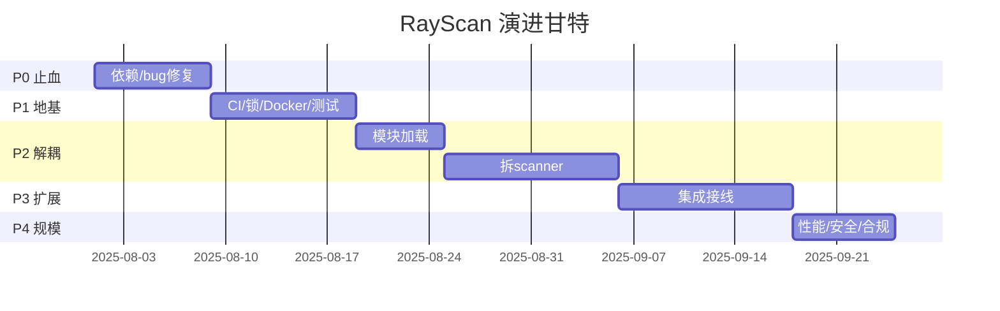

# RayScan 技术演进规划方案（架构师视角）

## 1. 总体演进策略
原则：**先止血(P0/阻断) → 工程化地基 → 架构解耦 → 能力扩展 → 规模化**；以审计证据为唯一依据（数据驱动）；向后兼容（CLI 参数、报告格式、对外 API 不变）。

## 2. 分阶段技术方案

### P0 止血（≈1 sprint / 5人天）
**目标**：让 `pip install`/`Docker`/CI 跑通，消除必崩点。
**文件**：`pyproject.toml`、`requirements-dev.txt`(删)、`wvs/core/session.py:308`、`wvs/core/scanner.py`(docstring/ `# noqa`)、`wvs/modules/sqli/detector.py:44`。
**任务(依赖序)**：T0.1 补 httpx/flask 到 dependencies → T0.2 修 `proxies=`→`proxy` → T0.3 修 sqli `__init__` 漏透 session → T0.4 import smoke test 跑通。
**风险**：隐式依赖未穷尽；缓解：全量 grep `import httpx/aiohttp` 核对。

### P1 工程化地基（≈2 sprint / 10人天）
**目标**：单版本源、锁文件、CI 门禁、Docker 多阶段、测试地基。
**文件**：`pyproject.toml`(version 单一)、`tests/`(解除 .gitignore 排除)+`tests/test_sqli.py`/`test_xss.py`、`.github/workflows/ci.yml`、`Dockerfile`、`uv.lock`。
**任务**：T1.1 单版本源(**pyproject 2.0.0 为 SSOT**，CLI/报告均派生；外发版本建议 2.0.0，待瑞哥确认) → T1.2 锁文件 → T1.3 CI(ruff+mypy+pytest 覆盖率) → T1.4 Docker 多阶段 → T1.5 核心 sqli/xss 单测。
**风险**：覆盖率门禁拖慢；缓解：先 30% 阈值。

### P2 架构解耦（≈3 sprint / 18人天）
**目标**：拆上帝类、统一模块加载、统一 HTTP 栈。
**文件**：`wvs/core/base.py`、`wvs/core/scanner.py`、`wvs/modules/__init__.py`、`wvs/core/orchestrator.py`(新)、`wvs/core/auth_manager.py`、`wvs/core/dedup.py`、`wvs/core/checkpoint.py`、`wvs/core/session.py`(核心走 httpx)、`wvs/core/lab_stage.py`(新,`--lab`)、`full_scan.py`/`quick_scan.py`(配置化 IP/路径)。
**任务**：T2.1 `ModuleFactory.create_all()`+各 detector `@register_module`，删 `__import__` 兜底(依赖 T0) → T2.2 抽 `ScanStage` 接口+`Orchestrator` 编排 Crawler/Auth/Dedup/Checkpoint，**靶场逻辑抽为可选 `--lab` stage + 配置化 IP/路径**(依赖 T2.1) → T2.3 **核心统一 httpx(http2)；aiohttp 隔离至外调适配层并默认禁用**(依赖 T0.1，保留聚合选项，待战略确认可全删)。
**风险**：拆 scanner 引回归；缓解：facade 包裹逐步迁移+单测。

### P3 能力扩展接线（≈2 sprint / 12人天）
**目标（自研内核优先）**：**自研漏洞检测模块为绝对核心**——优先补齐 IDOR/越权(R-04)、认证绕过(R-05)、API 安全+GraphQL(R-06)；`integrations/` 接入降为"可选增强"（nuclei 默认开、其余 `--enable`、ffuf/sqlmap 默认关）。
**文件**：`wvs/modules/id/`(IDOR/越权 R-04)、`wvs/modules/auth/`(认证绕过 R-05)、`wvs/modules/api/`(API安全+GraphQL R-06)、`wvs/core/integrations/`(抽象基类+注册表)、`wvs/core/scanner_integrations.py`、`wvs/cli.py`(`display_result` 补 sarif/csv)、`wvs/reporters/json_reporter.py`(`generate_sarif` 接线)。
**任务**：T3.1 **自研 detector 注册**：IDOR/越权(R-04)、认证绕过(R-05)、API安全+GraphQL(R-06) 经 `@register_module` 注入 `ModuleFactory`(依赖 T2.1) → T3.2 `Integration` 抽象+注册表(依赖 T2.2) → T3.3 注入 `scan()`，**默认策略：nuclei 默认开、其余需 `--enable`、ffuf/sqlmap 默认关**(依赖 T3.2) → T3.4 CLI/报告格式接线(sarif/csv)(依赖 T3.1/T3.3)。
**风险**：自研逻辑误报；缓解：靶场 `--lab` 基线回归 + 单测。外调(sqlmap/awvs)耗时波动；缓解：超时+异步隔离。

### P4 规模化·安全·生态（≈1.5 sprint / 7人天）
**目标（安全研究员/渗透优先 + 先开源）**：并发生效、缓存/响应体约束、SSRF+合规加固；**授权确认+gentle 合规预设(R-10)升为开源发布前置**；R-07 自研补缺(SSTI/CSRF/开放重定向/RFI)。**Web UI(R-11)、MSF 验证链(R-12)、多引擎聚合深化(R-13)降权为可选/社区驱动，不占核心人天。**
**文件**：`wvs/core/scanner.py`(Semaphore 生效)、`wvs/core/session.py`(LRU/TTL 上限2000+响应体字节上限+重定向跳数上限)、`wvs/core/models.py`、`wvs/cli.py`(scheme 白名单+内网/链路本地/元数据阻断+ **扫描前授权确认 / `--lab` 默认 gentle**)、`wvs/profiles/loader.py`(name 白名单)、`wvs/modules/`(ssti/csrf/open_redirect/rfi 补缺 R-07)。
**任务**：T4.1 全局 `Semaphore(cfg.concurrency)` 生效 + 暴露 `--concurrency` + 预设 gentle≈2-3/default≈5-10/aggressive，**硬上限由速率合规约束**(破硬编码 15/12，呼应 R-08/R-10)(依赖 T2.2) → T4.2 缓存/响应/重定向三约束(依赖 T0.1) → T4.3 SSRF(scheme 白名单+内网/链路本地/元数据阻断)+profile 遍历(name 白名单)(依赖 T1.3) → T4.4 **授权确认+gentle 合规预设(R-10，升权前置，开源发布条件之一)**(依赖 T1.3) → T4.5 **R-07 自研补缺**：SSTI/CSRF/开放重定向/RFI(依赖 T2.1)。
**降权移出核心（不占人天）**：Web UI 与 CLI 对齐(R-11，社区驱动/后续可选，最低优先级)；MSF 验证链(R-12，可选/推迟)；多引擎聚合深化(R-13，维持 nuclei 已接、`--enable` 默认态，不主动重评默认开)。
**风险**：并发上调暴露竞态；缓解：压测+灰度。

## 3. 关键架构决策（草图）
- **模块加载**：detector 顶部 `@register_module`；`ModuleFactory.create_all()` 遍历注册表；删 `scanner.load_module` 的 `__import__` 兜底与 `_MODULE_PRIORITY` 硬编码（改配置驱动）。
- **流水线**：`ScanStage` 接口 `async def run(ctx)->StageResult`；`Orchestrator` 持 `List[ScanStage]`，Auth/Dedup/Checkpoint 为内建 stage，靶场逻辑抽为可选 `--lab` stage（配置化 IP/路径，兼作漏报率基线测试集）。
- **Integration**：`class Integration(ABC): name; async def run(target, ctx)` + `IntegrationRegistry`，引擎无关注入；**默认策略 nuclei 开、其余 `--enable`、ffuf/sqlmap 关**。
- **HTTP**：核心统一 `AsyncClient(http2=True, verify=config.verify)`；aiohttp **隔离至外调适配层并默认禁用**（保留聚合选项，决策1 自研优先下保留而非全删）。
- **并发**：单 `Semaphore(cfg.concurrent_endpoints)` 注入所有阶段。
- **缓存**：`LRUCache(maxsize=2000, ttl=300)` 存 `(status, headers_hash, body_hash)` 轻量元组。
- **安全**：`scheme∈{http,https}`；IP 非私网/链路本地/`169.254.169.254`；`name` 白名单 `^[A-Za-z0-9_-]+$`。

## 4. 依赖与工程化治理
- `pyproject.toml`：`[project.dependencies]` 补 httpx>=0.27,<0.29、flask>=3；`[project.optional-dependencies].dev` 仅 ruff/mypy/pytest；删 `requirements-dev.txt`（冲突的 black/isort/flake8 统一为 ruff）。
- 锁文件：`uv` 生成 `uv.lock`，CI 校验。
- CI：ruff + mypy（关键模块 `--strict`）+ pytest 覆盖率门禁。
- Docker：builder 装 dev，runtime 仅 dependencies+httpx，非 root 运行。

## 5. 里程碑 Timeline

## 6. 已定战略决策与校准结论

### 6.1 四项战略决策（瑞哥拍板）
1. **战略方向 = 自研内核优先**：聚焦检测精度 + 合规安全护城河；聚合(`integrations/`)仅作可选增强。
2. **商业模式 = 先开源**：GitHub 开源发布。
3. **目标用户 = 安全研究员 / 渗透优先**（推翻此前隐含的 DevSecOps 侧重）。
4. **版本号 = 统一 2.0.0**：`pyproject` 为单一事实源(SSOT)。

### 6.2 Provisional 默认项复核（据新决策全部保留）
| # | 原 provisional 默认 | 复核结论 | 依据 |
|---|---|---|---|
| ① | aiohttp 隔离至外调适配层、默认禁用（非全删）| **保留** | 决策1 自研优先下保留聚合选项，合理 |
| ② | 版本号 pyproject 2.0.0 为 SSOT | **保留** | 与决策4 一致 |
| ③ | 靶场保留可选 `--lab` stage（配置化 IP/路径）| **保留为默认** | 未受新决策影响，继续作漏报率基线测试资产 |
| ④ | 集成默认策略：nuclei 默认开、其余 `--enable`、ffuf/sqlmap 默认关 | **保留** | 贴合"默认只检测不利用"合规伦理（决策1/2）|
| ⑤ | 并发可配置 + 预设(gentle/default/aggressive)，硬上限受速率合规约束 | **保留** | 与决策1/2/3 下合规要求一致 |

### 6.3 被翻转 / 调整的范围（因决策1/2/3）
- **P3 重心翻转**：自研漏洞模块（R-04 IDOR/越权、R-05 认证绕过、R-06 API安全+GraphQL）由"接入 integrations 的附属"**升为 P3 绝对核心**；`integrations/` 接入降为"可选增强"（nuclei 默认开、其余 `--enable`）。
- **P4 R-11 Web UI 对齐 → 降权**：由原"长期重点"下调为"社区驱动 / 后续可选"，最低优先级，不占核心人天。
- **P4 R-12 MSF 验证链 → 降权**：自研优先+开源下验证闭环优先级低于自研检测广度，标为 P4 可选/推迟。
- **P4 R-13 多引擎聚合深化 → 降权**：仅保留 nuclei 等已接部分；awvs/nessus/wappalyzer 默认态维持"需 `--enable`"，不主动重评默认开。
- **P4 R-10 授权确认 + gentle 合规预设 → 升权**：开源工具误扫第三方合规风险高，列为开源发布前置条件之一，归入 P4 且优先级靠前。
- **P4 R-07 SSTI/CSRF/开放重定向/RFI → 保留为自研核心补缺**。

### 6.4 原"待明确事项"5 项假设逐条判定
（下列 5 项原为我 provisional 假设，现据战略决策落定）
- ① aiohttp 处置 → **已据决策定为**「隔离至外调适配层、默认禁用（非全删）」（决策1）。
- ② 版本号 SSOT → **已据决策定为**「统一 2.0.0，pyproject 为 SSOT」（决策4）。
- ③ 靶场定位 → **仍保留为默认**「`--lab` 可选 stage（配置化 IP/路径），兼作漏报率基线」。
- ④ 集成默认策略 → **已据决策定为**「nuclei 默认开、其余 `--enable`、ffuf/sqlmap 默认关」（决策1/2 合规伦理）。
- ⑤ 并发模型 → **已据决策定为**「`Semaphore(cfg.concurrency)` + `--concurrency` + gentle/default/aggressive 预设，硬上限受速率合规约束」（R-08/R-10）。
- （原"仍待瑞哥决策"项已全部落定：自研 vs 聚合 → **自研优先**（决策1）；是否商业化 → **先开源**（决策2）；外发版本号 → **2.0.0**（决策4）。）

### 6.5 调整后工期估算
| Phase | 人天 | sprint（既有产能口径）|
|---|---|---|
| P0 止血 | 5 | 1 |
| P1 工程化地基 | 10 | 2 |
| P2 架构解耦 | 18 | 3 |
| P3 能力扩展（自研核心）| 12 | 2 |
| P4 规模化·安全·生态 | **7**（原 10，↓3）| **1.5**（原 2）|
| **合计** | **52 人天**（原 55，↓3）| **≈9.5 ≈ 10 sprint** |

- **单人串行**：≈ 9.5 sprint（约 10 个迭代；按 1 sprint≈1 人·双周产能，约 20 周 ≈ 5 个月）。
- **并行可压缩**：关键路径 P0→P1→P2→{P3,P4 并行}。P3=2、P4=1.5，取大=2。关键路径 = 1+2+3+2 = **8 sprint**。2 人并行（1 人做 P3 自研模块、1 人做 P4 性能/安全）可压至 ≈8 sprint（≈16 周 ≈4 个月）；若 P1/P2 阶段亦增员至 3 人，可进一步压至 ≈7 sprint（≈14 周）。
- 说明：P4 节省源于 Web UI(R-11)/MSF(R-12)/聚合深化(R-13) 降权移出核心；R-07/R-10 升权/补缺体量可控，净降 3 人天。
